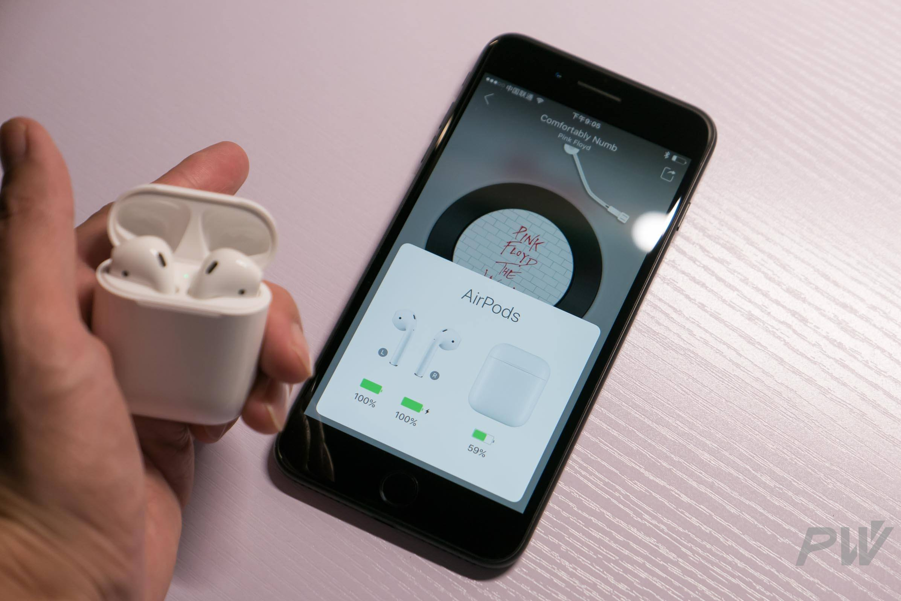

我一直有个蓝牙无线耳机，以前公司发的，觉得无线耳机真是个好东西。比如，最重要的一点，就是不用每次花20秒来解开缠在一起的耳机线并且走个路摆来摆去。但是无线耳机也有很多烦恼：首先就是充电的问题；其次就是单耳的禁不住外音吵闹，双耳的一般也有线------市面上也有双耳无线的，但是觉得不是那么好用。

AirPods 的出现，比较好的解决了无线耳机的一些问题，并且做了不少优化。

<!--more-->

##### 1.续航问题的优化

就跟手机一样，续航和便携美观成反比。所以 AirPods 采取了二级电力解决方案：case 盒子和 airpods 耳机分开，耳机的续航大概五个小时，没电了放进盒子充十五分钟就好。

##### 2.单耳和双耳均可用

正常双耳模式下，拿出一只耳朵的耳机，播放自动暂停；这时候，双击另一只耳朵的耳机，播放继续。这就很好了，丢了一只后，也不怕。而且，可以一只使用一只充电，因此续航超过24小时 so easy。

##### 3.可自定义操作

因为耳机体积的问题，因此音量调节、播放暂停、前后歌曲等都是靠双击来进行操作的，并且可以在设置里自定义操作：播放、暂停、呼叫 siri、前后歌曲。只是操作只有双击这一个选项，虽然区分左耳右耳，但是想到 siri 这样的人工智障干不了啥，建议可以增加三连击功能，这样 2 * 2就有四种操作了。

我在听英语的时候，因为考满分的 APP 没有单篇重播的功能，因而我每次听完了之后，双击左耳就好了，不用拿出手机，我觉得挺方便的。

##### 4.音质不错

别的不说，比有线的好，听低音歌曲也蛮好。不是什么发烧友，对音质要求不高。并且对于绝大多数人来说，耳朵的分辨能力远差于眼睛的。

##### 5.音频同步方案可靠

据资料显示，两个耳机同时工作的时候，两者中有一个是主控耳机，等另一只准备好了后，才同时播放，以此消除时间差。两天的使用情况而言，同步基本是很可靠的。但是，在从电脑切换到手机，手机切换到手表的时候，偶尔会有颤音，两个耳机不一致。

##### 6.戴两只的时候，巨丑😳

如图，怎么说呢？像个罗汉。

另外，出门在外，无论怎样都尽量不要戴两只耳机的，会影响听外界的声音，很不安全。但是，有线的耳机，除非剪掉一只，不然另一只就不好办了。

上次出门，坐电梯，西直门地铁站，电梯是往下走的，因此人都超前看。结果，后面很高的位置的一个哥们的大箱子滑落了，我听到一声哗啦啦的声音往后一看，本能的一躲，结果就把我前面的一位女士砸到了，人砸倒了，水果散了一地。还好我们已经到了最底部，前面没人，不然就可能造成巨大的踩踏事故了。

##### 7.未来

其实，个人认为，AirPods 为苹果以及整个电子设备生态带来了全新的一个方向，尤其是当他与具备 LTE 功能的 Apple Watch 结合之后。

我们可以用 Siri 和 Apple Watch 完成很多手机可以完成的事情，电话，短信，语音，天气，股票，导航...

毕竟拿个手机在手里，有时候很耽搁的，需要腾出手做别的。而语音控制和手表的结合，完美解决了这个问题。如果 AirPods 和 Apple Watch 结合后，不需要双击只需要 “嘿，Siri”就能激活Siri，那么我们可以在完全不需要手的情况下，随时随地，无论是在攀岩还是冲浪，或许都能够打电话、回消息了。

当然了，这种场景能实现的能力，和 Siri 的理解力成正比，当语音识别能更智能的时候，语音就能做更多的事情了。
