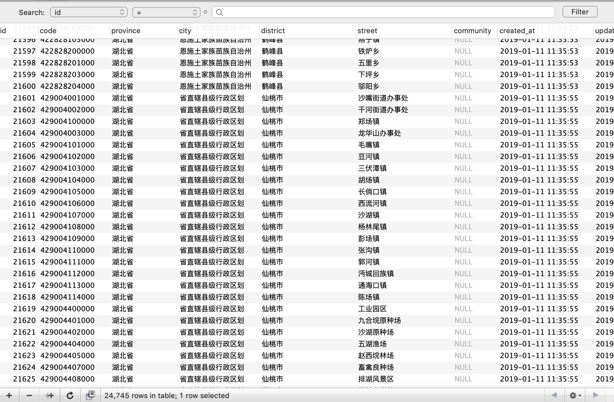

做技术的，无论写没写过，但是一定都听说过：爬虫。

爬虫主要有两类：通用爬虫------主要用于搜索引擎；聚焦爬虫------主要用于特定信息的获取。

搜索引擎的爬虫的基本原理很简单，是个链接就爬；当然了背后的其他技术就很复杂了。聚焦爬虫则要对具体的页面，接口规则做处理，以求把各个场景下的数据都能够爬取下来。

昨晚熬夜学习了下爬虫，把国家统计局的中国行政区划码爬了一波，目前有两万多条数据，还没爬完呢，很多都是超时，应该是触发率了访问限制， IP 被封了。



<!--more-->
首先我们来看下国家统计局这个行政区划的网址：[http://www.stats.gov.cn/tjsj/tjbz/tjyqhdmhcxhfdm/2016/index.html](http://www.stats.gov.cn/tjsj/tjbz/tjyqhdmhcxhfdm/2016/index.html)，我们就是从这里作为入口，开始爬取数据的。

我们看下代码：

```JavaScript

let daoAera = require('../../dao/aera');

let Crawler = require('crawler');

    let c = new Crawler({
        rateLimit: 2000,
        maxConnections: 1
    });

    let go = function (url, target, g_province, g_city = null, g_district = null, g_street = null, g_community = null) {
        c.queue([{
            uri: url,

            callback: function (error, res, done) {
                if (error) {
                    console.log(error);
                } else {

                    let $ = res.$;
                    let length = $(target).length;

                    for(let i = 0; i < length; i++){

                        // 第一级，省级
                        if(target == '.provincetr td a'){

                            let l = $(target)[i].attribs.href.length;
                            let code = $(target)[i].attribs.href.substring(0, l-5);
                            let province = $(target)[i].children[0].data

                            g_province = province;
                            
                            daoAera.add({
                                code,
                                province
                            });

                            go('http://www.stats.gov.cn/tjsj/tjbz/tjyqhdmhcxhfdm/2016/' + $(target)[i].attribs.href, 'tr.citytr', province);
                        }

                        // 第二级，市级
                        else if(target == 'tr.citytr'){

                            let t = $(target)[i];

                            // 第一个 td 拿编号，第二个 td 拿名字
                            let url = t.children[0].children[0].attribs.href;
                            let code = t.children[0].children[0].children[0].data;
                            let city = t.children[1].children[0].children[0].data;

                            daoAera.add({
                                code,
                                province: g_province,
                                city
                            });

                            go('http://www.stats.gov.cn/tjsj/tjbz/tjyqhdmhcxhfdm/2016/' + url, 'tr.countytr', g_province, city);

                        }

                        // 第三级，区级
                        else if(target == 'tr.countytr'){

                            let t = $(target)[i];

                            // 这里的数据可能第一行为市辖区，没有 a 标签，但是数据可以入库,
                            let code;
                            let district;

                            if(t.children[0].children[0].data){
                                code = t.children[0].children[0].data;
                                district = t.children[1].children[0].data;

                                daoAera.add({
                                    code,
                                    province: g_province,
                                    city: g_city,
                                    district: district
                                });

                            } else {

                                let url = t.children[0].children[0].attribs.href;
                                code = t.children[0].children[0].children[0].data;
                                
                                district = t.children[1].children[0].children[0].data;

                                daoAera.add({
                                    code,
                                    province: g_province,
                                    city: g_city,
                                    district: district
                                });

                                go('http://www.stats.gov.cn/tjsj/tjbz/tjyqhdmhcxhfdm/2016/'  + url.substring(3, 5)+ '/' + url, 'tr.towntr', g_province, g_city, district);

                            }

                        } else if(target == 'tr.towntr'){
                            
                            let t = $(target)[i];

                            // 第一个 td 拿编号，第二个 td 拿名字
                            let url = t.children[0].children[0].attribs.href;
                            code = t.children[0].children[0].children[0].data;
                            
                            street = t.children[1].children[0].children[0].data;

                            daoAera.add({
                                code,
                                province: g_province,
                                city: g_city,
                                district: g_district,
                                street
                            });

                            go('http://www.stats.gov.cn/tjsj/tjbz/tjyqhdmhcxhfdm/2016/'  + url.substring(3, 5)+ '/' + url.substring(7, 9)+ '/' + url, 'tr.towntr', g_province, g_city, g_district, street);

                        } else if(target == 'tr.villagetr'){
                            
                            let t = $(target)[i];

                            code = t.children[0].children[0].data;
                            community = t.children[2].children[0].data;
                            
                            daoAera.add({
                                code,
                                province: g_province,
                                city: g_city,
                                district: g_district,
                                street: g_street,
                                community
                            });

                        }
                    }

                }
                done();
            }
        }]);
    }

    // 省
    go('http://www.stats.gov.cn/tjsj/tjbz/tjyqhdmhcxhfdm/2016/index.html', '.provincetr td a');

    //区
    // go('http://www.stats.gov.cn/tjsj/tjbz/tjyqhdmhcxhfdm/2016/64/6401.html', 'tr.countytr');

    // 街道 
    // go('http://www.stats.gov.cn/tjsj/tjbz/tjyqhdmhcxhfdm/2016/35/07/350702.html', 'tr.towntr');

    // 委员会
    // go('http://www.stats.gov.cn/tjsj/tjbz/tjyqhdmhcxhfdm/2016/35/07/02/350702001.html', 'tr.villagetr');

```

因为省、市、区（县）、街道（镇）、社区（村）是一个层级结构，所以我们的主体是一个递归函数，这样就能够层层深入的爬取数据；因为每一层层级的数据结构还有区别，但是相同的层级数据结构是一致的，因此我们每一层数据分开处理就好了。

并且，我们希望记录每一个市是属于哪一个省的，所以我们在调用下一级的时候，把上一级的行政区也传给爬虫，这样写入数据库就能存储关联数据了。

因此把 go 函数写成参数形式，爬那个 URL，目标数据的类名是啥，这样就能够通用了。最后的几个 go 测试是拿来调试数据结构的，把入口改到某一个级别，直接爬取该层级的数据，格式调试完成后，再从最顶级爬取数据，这样就能一层层的爬下去了。