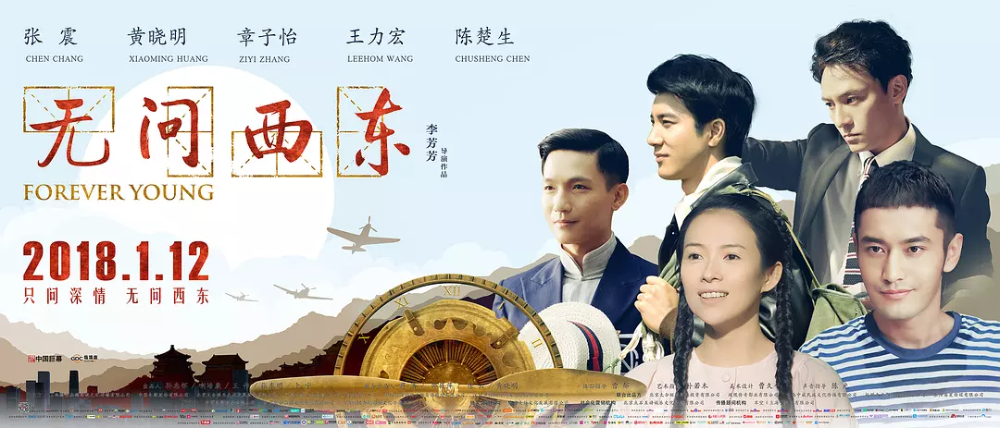

这是一部关于：青春、民族、选择、人性的电影。

当然，也可以做更多的解读。

<!--more-->

我记性特别差，看过不少电影，从来都是看完了就忘记。准备以后慢慢以写影评或者观后感的形式帮助保持记忆。2017年去影院看的电影应该有十部二十部？不知道，记不清了。

我是昨天在石家庄看的这一部电影，故事已经快忘记了。上个周末我跟室友还看了一部航天体裁的电影，《太空救援》，还记得飞船里的冰，和他们挥舞锤子的动作，以及人类的渺小，其他我已经记不得了。

昨天怕忘了，我就在备忘录上记了几笔。今天在家休息下，不想加班也不想搞别的了，累，就花两小时时间写一下观后感吧。网上关于这一部电影，有诸多的评论，我只想记录一下自己的一些小小的理解吧。一部电影而已，没必要捧上天或者踩入地，太狭隘了，导演和演员在用心的拍，观众用心的看，有些小收获，就可以了。

#### 一、青春

这是一部青春片，几代人的青春。四个故事，类似《云图》的叙事风格，交织在一起，但是其中的联系则更是紧密，因果明确。

##### 第一代人的青春：民国时期实业救国与文学梦想的纠结。

这一代人的青春，是整个电影几个故事的起源。

陈楚生饰演的吴岭澜，深夜里看贴榜人贴榜，自己英文第一，物理无列。于是梅老师劝他转专业。吴迷茫不觉，说出了自己读实科的原因：“因为最好的学生都念实科。”

“最好的学生都念实科”，多么的熟悉，历史总是相似的。曾经，文艺青年火了，大家都念中文系；曾经，金融经济挣钱多，大家都读经济金融；这些年，计算机互联网火热，全世界都学计算机...

一个人，如果因为大家都去做一件事而去做这件事，那么大概是从众；一个人，如果对这件事有热爱并且在其中寄托了理想，那么，从众又何妨呢？

梅老师给吴讲了一番话：“人把自己置身于忙碌当中，有一种麻木的踏实，但丧失了真实，你的青春也不过只有这些日子。什么是真实：你看到什么，听到什么，做什么，和谁在一起，有一种，从心灵深处满溢出来的不懊悔、也不羞耻的平和、与喜悦”。

当然，吴对于物理是喜悦不起来的，在老师的鼓励下，面对时代浪潮，叩问自己的内心，不必选择迎合潮流，要遵从内心，因此转了专业。后来成为了一名教师，这才有了第二代人的青春。

##### 第二代人的青春：抗战时期，舍身为国与明哲保身之间的矛盾。

一个在那个年代懂汽车的年轻人，一个在日军轰炸中还要喝汤养生的富家子弟；在大雨中的西南联大静坐听铁皮屋顶的雨声的时候，推开窗子，看到了一队雨中跑步的学生。国破山河碎的时代，心中萌发了斗志，想要当兵。在飞虎队招聘飞行员的时候，毅然决定投军报国。

“这个时代缺的不是完美的人，缺的是从心里给出的真心、正义、无畏和同情”，这是飞虎队教官的一席话，这句话或许不契合当时的年代，但是是多么的契合我们今年的时代。真心、正义、无谓和同情，简单的几个词汇，在今天这样和平的年代，又有多少人扪心自问能够做到？

就这样，他在空飞招聘的时候试了试，因为出身武术世家，小时候习武过，很轻松的通过了。我还记得电影中，那招飞现场的一副对联：“升官发财，请走别路；贪生怕死，勿入斯门”，这是黄埔军校的对联。

而参军，遭到了母亲的严厉反对，父亲也气得吐血。

“负甲为兵，咋笔为吏，身死名灭者如牛毛，角立杰出者如芝草，故不得以，有学之贫贱，比于，无学之富贵也。”沈光耀母亲的这一段家训，出自《颜氏家训》，在沈母心里，儿子是在追求功名利禄，而这些，祖上都已经追求到了。电影结局的时候，“三代五将”的牌匾，很是醒目。在沈母来看他的时候，沈光耀给沈叔蛇胆的时候，沈叔跟沈光耀过招起来了，很明显的武门之家。

而武门之家不让孩子参军，有两点原因：第一点，对孩子的爱护，国破家亡的时代，参军是把脑袋别在裤腰带上的事情；第二点，对孩子追求功名的不屑，表示功名利禄，如过眼云烟，祖上都曾经得到过。

第一点无可厚非，天底下所有的母亲都会这么想；第二点，显然是对自己孩子的理解不够，小义遮盖了大义，小利蒙蔽了大利。

人人都想过上太平的日子，每位母亲都不希望自己的孩子在战场上尸骨无存，然而，在天底下容不下一张书桌的年代，民族利益不保，个人利益焉存？正是在这样的背景下，哪怕当着母亲的面发过誓，永不参军，沈光耀也要投笔从戎。

沈光耀当上空军后，因为深知云南的穷困，便每一次开着飞机为蘑菇房空投食物，而这样的善举，成就了第三代人的青春。

##### 第三代人的青春：文革时期，前方舍身报国与后院起火出事的悲哀

经历过文革的那一代人是悲哀的。在那个人吃人的时代，在那个政治高于一切的时代，一句不小心的话，一件不起眼的事，就可能惹来杀身之祸。

本来拥有美好的爱情，但是年少的陈鹏心头醋意大发，一头扎进了大西北，捣鼓着“两弹一星”，后方爱人却因为涉嫌间谍罪被人批斗致死。就当他悲痛欲绝连坟墓都挖好了的时候，王敏佳复活了。这是一种浪漫主义的叙事方法，虽然不科学，但是艺术作品就是这样子。在寒冷的雨夜，爱情的力量总是会创造奇迹。

那就当她死了吧，立好了坟墓，回到了家乡，哪怕面目全非，依然不离不弃，这就是爱情。

“我就是那个给你托底的人，我什么都不怕，就怕你掉的时候把我推开”。

然而，一个云南与世无争的小山村，一个个茅草屋顶的蘑菇房，战火打不倒，却被文革打到了。于是一位女性，拿起水壶，一个人去大西北了。

时候得知王敏佳死去的李想，忏悔不已，背负着一生的自责，或许就是在这种自责里，救下了张果果的父母，于是有了第四代人的青春。

##### 第四代人的青春：和平的年代，既然没有战争，那就勾心斗角吧

这一代人就是电影开始的张果果了，清华毕业，广告公司的骨干，却在勾心斗角中沦为上级的牺牲品。连最尊敬他的女助手，在他跳到了竞争对手的公司后，也对他有所怀疑，要跑去问个清楚，才敢放心，这时候，张果果没有回答，只是说：“你猜？”。

人为自己的个人利益努力奋斗，是没有错的，并且是值得弘扬的；错就错在踩在别人的身上去获取利益，这会遭到反抗的。所以，最后，Robert 想要拉拢张果果，对抗David，张果果也动了年头，但是最后，他并没有这么做，因为他和“David”不一样。

“看到和听到的，经常会令你们沮丧，世俗是这样强大，强大到生不出改变它们的念头来。可是如果有机会提前了解了你们的人生，知道青春也不过只有这些日子，不知你们是否还会在意那些世俗希望你们在意的事情，比如占有多少，才更荣耀，拥有什么，才能被爱。等你们长大，你们会因绿芽冒出土地而喜悦，会对初升的朝阳欢呼跳跃，也会给别人善意和温暖。但是却会在赞美别的生命的同时，常常、甚至永远地忘了自己的珍贵。”

这段话，对我们的现实有诸多讽刺。这段结尾的独白，被很多影评夸的厉害，我只能说他说的很好，但是，可以更猛烈一些。世俗再强大，我们再渺小，也是有机会改变的；占有多少，有时候并不是为了荣耀；拥有的多，便能把自己的爱人呵护得更好。

#### 二、民族

这部电影，横跨了近百年，而中国近百年的近代史，则是一部波澜壮阔的史诗级画卷。

“我们从古以来，就有埋头苦干的人，有拼命硬干的人，有为民请命的人，有舍生求法的人，……虽是等于为帝王将相作家谱的所谓“正史”，也往往掩不住他们的光耀，这就是中国的脊梁。”

鲁迅的这段话，我觉得说的很好。为什么？我认为其中一个原因在于包容性。

中华民族几千年，历史上群星翡翠，然而近现代被侵略的不成样子。

“祖宗虽远，祭祀不可不诚；子孙虽愚，经书不可不读”这一段沈母的家训，出自《朱子家训》，然而最后沈光耀还是没有选择读经书的路，原因很简单：再多的经书，挡不住日本侵略者的铁蹄。

民族危亡的时刻，参军杀敌才是救民族于危难的唯一药方。

电影结束的时候，结尾播放了很多西南联大师生的照片，这些人后来大多成为了学术大师，我对这一点很矛盾：一方面，这些大师值得颂扬；另一方面，我认为不公平。是谁的壮烈牺牲，才给了这些大师搞学问的和平年代，是那些军人，那些死去无名的青年，是那些血肉之躯，是那些不善于著书立说的人。

是飞虎队中牺牲的飞行员，是淞沪会战中死去的三十万雄师，是无数个沈光耀。

在这样的一部电影中，在抗战的背景下，他们的照片有理由，和最后那些学术泰斗一起露脸的。

我之所以不太喜欢一部分文艺片或者文艺青年，就是因为他们把自己看的太重要，而把别人看的太不重要，永远不要忘记，那些曾经为我们牺牲的人，不管他们有没有名字。是他们，让我们的民族，才有机会薪火相传。

一场战争，比一部小说有意义的多。然而，后人却太容易忘却。

我们的民族利益，是有无数的民族脊梁共同捍卫的。在特殊的时代里，大家都有特殊的选择。于是我们有吴岭澜这样的教书育人，有沈光耀这样的投笔从戎，有陈鹏这样的两弹一星，有张果果这样的职场精英...

西南联大、抗日、文革、改革开放，没有哪一件事是没有写入历史的。很多人都会疑问，为什么仅存八年的西南联大，人文理工巨星璀璨，而改革开放后的中国教育，这么多的资源投入了，我们的大学却在培养的精致的利己主义者？有人说，清华曾经是培养时代之光的地方，现在却有些世俗了，我非常的不赞同。

时代。

当民族需要救亡图存的时候，天下兴亡、匹夫有责。从抗战的战士，到图强的学生，没有一个不拼尽全力的。你不努力，就要亡国灭种了；当时代和平了，年轻人连房子都买不起的时候，怎么能奢求他们像抗战年代那样的英雄主义呢？

人总是利己的。如果人们发现民族的安危在自己的肩膀上，他们就会为了民族而努力；如果人们发现现实问题逼迫的他们难以很好的生存，他们就会为了生存奔波。时代在变，条件在变，利益不变。不能用当年的条件，和现在的比；人们只会在利益的选择中，选择更值得的。

谁能保证，今天再职场拼命的那些人，那些创新创业的人，未来不会被载入民族的史册？

#### 三、选择

这部电影涉及到的选择很多。

吴岭澜选择追求自我，从而成为了知名教师；沈光耀选择放弃富家生活，投笔从戎，才有了抗战的胜利和陈鹏的幸存；李想选择了求助张果果的父母，才有了张果果后来救助四胞胎的故事。

我看到一些影评谈到了“最佳选择”的问题，整体思路是放弃最优解，选择更大义凛然的那个。

我是不同意的。任何理智的选择，都是最优解。如过在合适的维度来看。

吴是因为把文学看得比物理重要，所以最后选择了文学；

沈是因为把民族看得比生活重要，所以最后选择了参军；

李是因为心存自责，想要弥补，把别人的生命看得更重要，所以最后选择了救人；

张是因为把自我看得比报复更重要，所以最后并没有选择报复别人。

---

#### 参考资料：

1.[无问西东 (2018)------豆瓣电影](https://movie.douban.com/subject/6874741/)

2.[如何评价电影《无问西东》?](https://www.zhihu.com/question/31870607)

3.[淞沪会战](https://baike.baidu.com/item/%E6%B7%9E%E6%B2%AA%E4%BC%9A%E6%88%98/13407?fr=aladdin)

