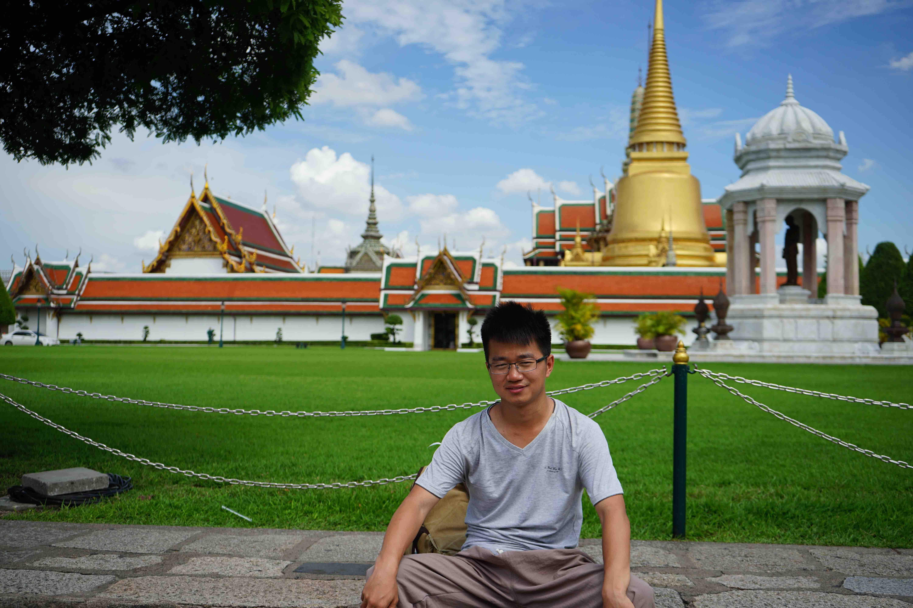

我们是一行九个人在曼谷集合的，都是同事和朋友。

<!--more-->

因为人很多，所以很早我就把住的地方定好了，是一个3层楼的民宿，我觉得很有感觉和特色，特别的好，什么都提供，房间里有新鲜的花，有佛像，只是价格有点儿贵。

下图是我在屋子门口拍的照片，算是留影了。

然后我们就一起去逛了大皇宫，百度的广告竟然做到了泰国大皇宫里。果然资本的力量，无处不在。

泰国不愧是万佛之国，整个大皇宫可以说是由佛塔组成的，各种各样的佛塔林立。

我觉得这个位置很好，照片有没有看上去是假的一样？小时候那种照相馆里面的风景幕布还记得吗？我觉得很有这个感觉。

我们出了大皇宫，路上遇到了很有感觉得公交车，于是我偷拍了一张。

后面我们还去哪里了来着？我怎么感觉记不得了都。

#### 注：此游记根据回忆和照片整理而成。
