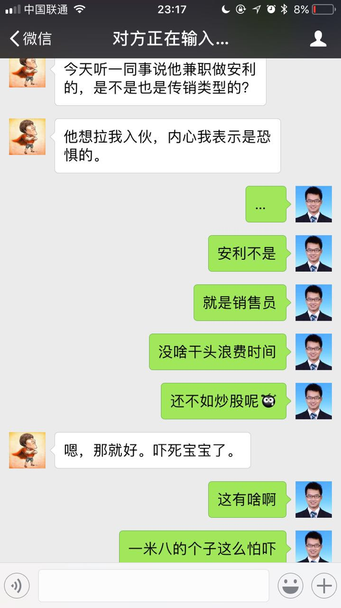

今天，一个朋友发我消息，内容如图：

我觉得他1米8的个子，怎么胆子就这么小呢，还是高我几级的学长呢，哈哈，看来男子汉也有恐惧的时候啊；另外，我说买股票，因为他是操盘手。我觉得挺逗，就想写篇短文章，顺便简单分析下传销。

其实，安利算什么传销啊，人家是正儿八经的直销公司，年销售额高着呢，大家可以自行百度之。之所以大家都把他当传销，是因为有的销售员实在太烦人了，销售团队的领导为了刷业绩对直销员进行洗脑式的培训，所以才会有这样的印象；并且直销的体制决定了出业绩的两种模式：自己出业绩和让下级出业绩，因而有的销售员自己业绩不行便寄托在拼命拉下级想着靠别人出业绩自己不劳而获；再加上之前新闻里面的各种真正的传销坑蒙拐骗甚至谋财害命，因而众人谈虎色变也不是什么怪事。

<!--more-->

我们每个人都害怕传销，这确实跟媒体的宣传是分不开的，因为传销害人的案例实在太多；并且，更重要的是，大家都觉得为什么就有人这么笨去搞传销呢？到底是什么样的洗脑能让人失去理智去干传销呢？

我有说过，我的基本世界观和价值观，就是：平衡，利益。

之所以有人迷失在传销里不能自拔，便是内心面对利益的诱惑无法守衡，总想着不劳而获。所以我非常强调一个人的基本点，无论是做朋友啊，还是以后谈恋爱啊，一个人的内心的基点很重要。一个人的外在，和精神的上层建筑是千差万别的，这种差别我觉得还好，比较表层；但是一个人内心深处的基石如果有问题了，那就麻烦了。这样的人，哪怕不跟他产生什么深入的联系，他也能把人拖下水。则其不善而远之，是对付他们的最好的办法。

据我所知，搞传销的，两类人居多：一类是没什么一技之长的人，他们寄托于一夜暴富的虚幻梦想；一类是刚出大学校门的学生，本科生和研究生都有，他们觉得自己比普通人聪明，看到了别人看不到的机会。

大家不要觉得大学生很聪明，大家搜搜新闻，传销加上大学生做关键词，就明白了。

而传销的模式，也在飞快的演变，大家如果关注新闻的话，比如我前些年看新闻很多的，就看到了传销的一路演变。

最开始的新闻，大概是这样子，谁谁的哥哥干传销去了，把弟弟带进去了，弟弟要跑，被捉回来了；谁谁的女朋友被传销骗了，男朋友走进传销的窝点，靠着非凡的手段，什么写纸条啊，巴拉巴拉，成功营救了女朋友。

以上我觉得算是第一期的传销，他们有几个特点，就是：无实际产品，拉人头，限制自由。

我来跟大家解释一下传销的运作模型。

因为找不到合适的图，就这张图凑合一下吧。

这张图中所显示的传销是69800的，我来结合图简单解释一下.

我们先来看下倍数：

243/27=9

27/9=3

9/3=3

3/3=1

其实传销的模型，理论上来说，只要不终止，游戏是你可以玩下去的；然而问题就是，这个游戏没法不终止，因为天底下没那么多傻子。

第一个层级，意味着，一个业务组长手下需要有9个业务员。这个业务组长是先交69800元来入组织的，因而当他达到业务组长的时候，整个组织的资金池为（9+1）* 69800= 698000元。既然当了业务组长了，那就要发工资了，每个组织的比例是不一样的。

我们看下这个组长的头上有多少人。如图，243个业务员，27个组长，9个业务主任，3个业务经理，1个高级业务经理，才能构成一个完整的组织。那么其实，如果以底下的业务员只有9人来看的话，就是9个业务员，1个组长，1/3个业务主任，1/9个业务经理，1/27个高级业务经理。那我们按照这个比例来发下工资哈。

业务员是缴费的，他们没有工资，上面的组长，主任，经理，业务经理，高级业务经理他们都会有工资。怎么发呢？随便发发看，比如每个人发一样多的吧。也就是5个人，分着9个人交上来的总钱数，也就是每个人13万9千6百。但是别忘了，这是9个人的团队，一只完整的团队是243人；9人的团队的话，就是上面的不完整团队的比例了。我们把9个人的不完整的团队，转化成完整团队，就是除以上面的分数了。

也就是只要手下有9个人，那么就是组长了，他就能得139600元；

如果手下有3个组长了，那么他就是业务主任了，他就能得139600*3元，合计418800元；

如果手下有3个业务主任了，那么他就是业务经理了，他就能得到139600*3*3元，合计1256400元；

如果手下有3个业务经理了，那么他就是高级业务经理，他就能得到139600*3*3*3元，合计3769200元；

我们看到了，这就是传销。其实简而言之，就是金字塔，或者像一棵树。底下的人养着上面的人，上面的人到头了就会撤掉离开，一层层往上升。里面所有的人都希望自己能升到顶层然后拍拍屁股走人，可是总有人还没升上去就断了，因为实在找不到那么多傻子了。没有了傻子，这游戏就玩不下去了。当然了，这个图提供的数据比较大，也没几个人承受得起吧，这个数据等比缩放，便可以做小金额的传销了。

其实我说他们傻子，有些不符合实际，据我所知，有些人是正儿八经的经管专业出身，没错，我说的就是给我提供这些信息的被害人；他女朋友是中国 top2 大学的研究生。你说他蠢么？

他不蠢，人还非常的优秀，后来也是悔不当初。他只是想赚快钱吧了。当然，这是非法的，也是异想天开的，因为这样的一棵传销的树涨起来，是很慢的，看起来倒是很简单人很少。当然，不排除也有的人，大多是最开始设局的人，到了顶端拿了钱拍拍屁股走人的，后面再也不能找到他了，后面的人，就自己玩去吧。

以上就是传销的传统模式。

现在呢，互联网时代了，想骗钱的人那么多，有坏心思的人可不少，他们也跟着热点，玩玩什么一带一路啊，玩玩什么新国学啊，玩玩什么创新创业讲堂啊，巴拉巴拉~~~但是万变不离其宗，基本模式就是这样。

据我所知，目前还有校友在搞类似的所谓项目（哼哼，敲黑板了啊，如果某人搞新国学的看到了，要留心哈~）。

另外，最近知乎上的一个比较火，算是新时代传销的典型了。

我贴上链接，有兴趣的可以感受一下。

[「所罗门矩阵」调查：这可能是中国互联网史上最大的骗局](https://zhuanlan.zhihu.com/p/27502592?from=timeline&isappinstalled=0)

暂且把这称之为：第二期传销吧。

我们可以看到，目前这花样，真的是，666啊。

回过头来，讲讲为什么传销屡禁不止：

因为有的人，贪恋太重，想轻松地非法聚财；而又有的人，内心不守衡，不明白一份耕耘，一分收获的基本道理。两者一拍即合，一个传销组织就诞生了。

我经常提醒自己，要尊重平衡的客观规律；君子爱财，取之有道。何为有道，便是平衡。

我为社会，或者为某个人、某个公司，提供了多少生产力和创造力（比如编程，设计）？提供了多少产品和服务（农业和服务业）？或者帮助间接提高了多少效率（管理与咨询）？或者如何优化了资源配置（投资与金融）？等等等等....我付出了多少，我就可以或者应该得到多少回报。所以如果要赚钱，就应该问问上面的几个问题。付出的和得到的，应该是平衡的才合理。

比如我给别人写代码，就是在帮人生产啊，因而我赚钱心安理得。当然了，这种模式有很多问题，所以注定赚不了大钱，比如：写的代码没法复用成本高，我一个项目能挣几万块，但是累死累活啊，如果这个项目能够同样的代码卖出多份，那我不就可以坐地收钱了么？

所以我们看到，赚钱的模式，确实直接影响着赚钱的数量，因而商业模式确实很重要。但是也不能寄希望于商业模式上而异想天开甚至非法聚财，那是会蹲大牢的。前些年的各种 p2p 非法集资的多了去了。

另外，再替安利正名一下，人家不是什么传销，就是个卖洗洁精的而已，当然了，人家也卖高端的雅姿化妆品，也卖纽崔莱的营养品，还卖高端的皇后锅具。

话说，皇后锅具确实很不错的说，爱老婆，就买一套，当然了，自己做饭那就更爱老婆了，哈哈哈。

这是官网链接，人民币7600元，说实话，对于有钱人来说，真不贵，我觉得质量特别棒：

[安利皇后®锅具二十一件套](http://www.amway.com.cn/product/athome/queen/list/1127.html)

哎，我觉得我真的懂得太多了，也真是为有些人操碎了心。

#### 参考资料
----
1.[直销---百度百科](http://baike.baidu.com/link?url=zN64fcXdFyFH_PTdyBLIh-55vBc-Ct36TwPMf6KP1hFPezPnhx8mgxYp8dFQj2V52v03E-eV7YAN_IVjpj0g4zG2BfKQWLvvWIB3f9PV977)

2.[安利皇后锅具](http://baike.baidu.com/link?url=mh3BCP5yPn6pTtnJeWBaOpVE2BRRhkWexeHTVUhDP_K7mkOaGAIy-QztAz9qoaCxY80XLt_2cylVKdShxKh58AcVBefqaq6h-slci6kdDCDIbiTvusNEiA8bjZlKYPUkicOn-guDtDwND5WgmGagW_)

3.[安利中国](http://www.amway.com.cn/default.html)
