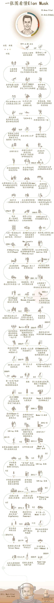

我觉得这个问题的答案，因人而异。大多数人人，并不需要这么做，分析什么呢？想做什么去做什么就是了。但是对于我个人来说，分析行业的原因之一便是为了规划职业方向。高中的时候，我简单的分析了下各方面的行情，最后选择了经管和计算机两个方向。最后虽然在文学院混日子，但我还是坚定的选择了计算机，这给我带来了一些好处------这就是行业分析带给我的好处；而对一些案例进行分析，就像读史为鉴一样，总是有用的，虽然不一定在什么时候会用到。

这里有一份资料，是[国内外60家机构2000份分析报告](https://pan.baidu.com/s/1kVojtUf)，但是只有上半部分，下半部分我找到了之后再发出来，可以大概了解多个行业或领域的概况，以及分析报告一般的套路。

<!--more-->
##### 现实意义
我目前觉得，自己可能对人工智能和机器人比较感兴趣------比较符合我的兴趣爱好------我小时候的梦想是科学家----虽然现在已经没啥希望了也并不想------就是折腾这些东西；并且在市场上也是比较有优势的，众所周知，现在人工智能比较火，未来火不火，那就真不能确定了，所以更要从长远来分析和预测。

我也觉得，一个人做一件事，成败与否，是多方面的原因决定的，从自己来说：兴趣，满足自己的精需要，从外在来说：价值，满足自己的物质需要；当然还有其他的各种原因，或许有的也会很重要，但是有的可以不用太考虑，因为很多东西于个人而言根本无力掌控。

而价值的实现，一个重要的决定因素，就是市场。没有市场，又如何体现价值呢？不一定非得是交易的市场，甚至是存在的市场------有的东西或许只能自娱自乐，因为这个社会不一定需要------那就当做自己的兴趣就好了。

一个人的工作年限差不多是三十多年------假设一般为25-55岁。一个人的职业历程，其实在历史的潮流中，就是水中行舟：顺流而下，则轻轻松松；逆流而上，则倍加艰难。我想，如果要实现职业的优化发展，暂且先假设一个人即使拥有的只是一般水平的能力------也就是我们每一个普通人，但是如果把他的三十年，很好的结合他的兴趣爱好，以及个人的客观条件，并且努力将之放在一个比较好的市场中，或许也是能求得更优解的------有多优不知道，但是一定是更优的。

当然了，去分析一个行业或者领域的前途与市场，首先，不能抱着一定准确的态度，因为未来的事情，谁也说不准，某种程度上就是一种冒险，因而要有保底意识；其次，分析行业或许只是广泛的寻求最优，并不一定是要达到什么程度：做不了领跑者，可以做参与者；做不了参与者，可以做跟随者。

所以我想，何不在思考未来何去何从的这一年，把自己感兴趣的行业、一些典型的案例、一些知名的公司、一些知名的人物、一些典型的社会甚至历史现象的产生、发展与影响都集中起来，从自己的角度，借助互联网上的公开资料和数据，好好学习和分析一下呢？虽然这种分析比专业的学者要简单甚至不可靠多，但是我绝不否认这对于我的作用，比如提到的自我的职业发展问题。即使我内心喜欢机器人，即使先假设我能做好，但是要是在可预测的未来中完全没有市场，那也是没法选择的不是吗？当然，不作为职业，自己私下作为兴趣来玩，那是无可厚非的。

##### 行业分析的一些常规方法
必须得承认，我是非专业的------相比较那些专业的行业分析报告；我所了解的方法比较简单，也是比较常规的，主要依靠互联网：

* 阅读行业分析的学术论文
* 查阅行业内代表性上市公司或机构的一些公开数据
* 专业的行业分析网站或者咨询公司的报告和数据

以上的资料非常好得到：学术论文只需要在百度学术或者谷歌学术里面搜索某个行业加上“行业分析”之类的关键词即可；上市公司因为要披露数据，因而也很好得到公开资料；专业的行业分析网站和咨询公司则更多了：中国行业研究网等网站，埃森哲等咨询公司，非常的多。

通过以上的三种手段，我们就基本能够利用互联网，来搞清楚一个行业的非常多的数据了。不说有多专业，但是最起码可以得到一个超越普通人的认知。

当然了，如果有某个业内的朋友，直接去咨询，或许也很有用，这个就没什么说的了------常识。

##### 从自身出发分析行业

通过以上，我们即使能收获一些知识，得出一些结论，但是，这些都是建立在别人的成果之上的----这并不是否认它们的价值。只是，自己肯定要在从别人的成果中得到属于自己的价值之余，要加入自己的原生思考，我觉得这很重要。自己虽然不是最了解某个行业的人，但是，自己肯定是最了解自己的人，那么更能知道自己该如何与行业结合了。

先举个例子。埃隆·马斯克，很多科技圈内的朋友都知道他。我并不是他的脑残粉，我不粉任何人-----但是不代表任何人都没有值得自己学习的地方------甚至恰恰相反，任何人或许都有。同时，我也很反感马斯克的一些论调：今天担心被人工智能干掉，明天担心我们没有活在真实的世界里。但这并不妨碍他是我欣赏的两个人之一------另一个是苏轼。

以他为例，不是要说什么鸡汤励志的东西，而是，他非常擅长行业分析，并且用之来指导自己的行业选择。我们先简单的看一下他的履历，是一个长图。

我们主要关注的问题只有一个：马斯克是如何从写代码的程序员，发展成今天与写代码没有任何关系的多个未来行业的领袖的。

我认为，答案就是：行业分析。

2002年十月，他卖掉了 PayPal 得到了1.8亿美元。这对于当今社会的绝大多数人来说，已经是巨富了，一辈子都可以过得相当自由并且有价值了。但是他并不满足于此，而是根据自己的行业分析结果，去投资一个个与自己的过去完全不沾边的行业-----因为他认为这些行业不仅值得做，而且非常有机会和价值。

类似的例子还有很多，从马斯克到比尔·盖茨，从马云到李彦宏，他们去做一个当时很多人没有看到的行业，就是因为相信这个行业的前途。因而，行业分析是相当重要的，也是非常需要眼光的。

大多数人都是普通人，成为商业巨子除了资本、能力、眼界等各方面之外，确实还需要机遇。因而成为牛人的概率是微乎其微的，即使一个人拼尽全力------所以有的东西，想想就好。

话说回来，我所能想到的一些从自身出发的方法，大概有这些：

* 从一些基本经验和规律出发，分析一些趋势
* 从现实的问题出发，去寻找解决问题的办法
* 充分认知时代的局限性
* 充分认知自身的局限性

其实这些并不高端，谁说普通人就不能发现和预测历史规律了？谁说普通人就不能预测社会发展方向了？举几个例子：

* 中国经济发展这一路走过来的一些历程，发达国家曾经很多走过------我们因而能推断，印度、泰国这些国家未来也许很快就要经历同样的过程------所以那么多投资者正在投资印度的互联网项目；
* 我们都知道中国目前的一些环境问题、食品安全问题比较严重，那么那些领域迟早需要被解决。对于普通人，如果顺势而为，或许就能获得额外的收益。比如网易老板丁磊的未央猪肉，那么贵还抢着买。
* 时代局限性，这个更好理解了。比如每个人都想活的更长久，如果可以不用死亡最好了。但是很明显长生不老我们目前的时代是达不到的------谁都知道如果发明了能延长生命的方法必将成为首富。领先时代太多，基本会失败。历史上有很多例子：政治的，经济的，科技的...
* 自我的局限性，这更不用说了。有些行业自己做不了。比如于我而言，我能从文学院转行到计算机，但是若是让我从文学院转行到生物，可能就做不到了------实验设备都没有，实验怎么做呢？

##### 一些非常规方法
其实，我并不知道有什么非常规方法，但是，有些事能够体现一些。

我们知道，在一些作品中，甚至现实中，有种职业叫做侦探，他们有很多非常手段来获取一些常人无法知道的信息；还有一些靠出卖演艺人员隐私的职业星探。并不是我要去做侦探，但是有些思路是可以借鉴的。比如现在的类似于浑水这样的做空机构，国内的钟馗研究，他们的一些资料是公开的，一些资料就是自己用特殊手段搞到的；甚至维基解密，有很多人爆料了自己所掌握的一些信息和数据。我们作为普通人，自然没那么多成本来搞这些，甚至都不需要搞这些，毕竟又不要去做什么涉密行业的研究。但是知道有这么些方式，或许哪一天能派上用场呢？

##### 着重注意

我经常提醒自己，想要一棵树现在就结果的话，那么必须得在几年前就要种下它------分析和预测一定要面向未来。

比如我们阅读一些别人已经做好了的分析报告，那都是完成时和过去式；而一些时候，我们需要的是将来时。所以融入自己的思考就非常重要了。当然，也是有过拿别人的成果来为自己谋福利的案例的，比如 Oracle，差不多就是这样子。

##### 案例分析

案例分析我觉得就简单多了，并且涉及到的领域会很多，我也没法一次就搞明白到底如何去分析案例。但是，也能意识到一些：一个人的话，读读他的自传，找找他的相关著作，参考下别人对它的评价，分析下他所处的时代背景；一个商业案例的话，从时代背景，商业模式，核心竞争力，价值创造等多个方面可以尝试。

##### 迷茫期的选择很重要

现在是我的迷茫期，在这一年的时间里，确实很多问题需要重新好好思考，不然就该不知道下一步该怎么走了。而在这一年的思考以及由此带来的选择，就很大程度影响甚至决定了往后几年能走的怎么样。年纪越大，回头或者改方向的成本就越高，希望好自为之，少为未来留下负资产。

#### 参考资料
----
1.[钟馗研究](http://zhongkuiresearch.com/)

2.[Muddy Waters Research](http://www.muddywatersresearch.com/)

3.[浑水（Muddy Waters Research）是怎样一家公司？](https://www.zhihu.com/question/19645329)

4.[在哪里能找到各行业的分析研究报告？](https://www.zhihu.com/question/19766160)

5.[你是通过什么渠道获取一般人不知道的知识和信息的？](https://www.zhihu.com/question/24326030/answer/98064879)
