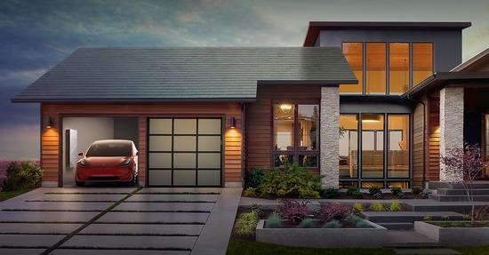

前几天，特斯拉发布了新的产品：“太阳能瓦片”，在美国，这种瓦片的价格比传统的瓦片价格要低，结合特斯拉公司的Powerwall来存储电能，便可以实现免费、节能环保的用电了。

<!--more-->

这个问题，首先让我想到了一个问题：房子。

我记得几年前，应该是好些年前，中国的大城市的房价刚开始高歌猛进的时候，有专家学者跳出来说：以后在城市里住高层公寓的人，都是穷人！后来，随着房价继续高歌猛进，中国的绝大多数人已经在北上广深无法买房的时候，他们便不说话了。因为在有没有房子住和住了是穷人还是有钱人的选择面前，后者没有考虑的价值。

当大家都快遗忘了那些个专家的这种说法的时候，当特斯拉发布太阳能瓦片的时候，我觉得曾经的那些专家是对的。

我曾经也一直在想那个问题：大城市里面，三四十层的高楼里，一间100平米的房子，如何能安置梦想？

然而，在现实的面前，只能呵呵了，能这样就不错了，毕竟连武汉这种地方的房子抢都抢不到。

我记得大学期间，我去谈一个小的项目，对方是一个济南当地的装修设计公司，我看到他们用3D Max做出来非常漂亮的设计图的时候，我就想学3D设计了，这样我未来就能设计自己的房子了。哪怕大城市里只能蜗居，我还有老家嘛，老家的房子不小，两层楼还能有个大院子，屋后就是一片竹园，门前也可以很好的开发一下。有钱就把屋顶搞成太阳能的，窗户和门都是语音控制的，院子里挖个小水池，种几朵荷花，现在屋后有桃树，侧边有杏树，门前有李子树，未来再种几棵不一样的果树，就能成为百果园了，以后小孩暑假就可以回去玩了。

我以为对大多数人来说，这都是奢侈的，直到特斯拉的瓦片的出现。最起码在美国-----因为美国人少地大-----原来真有不少人希望在自己家屋顶装太阳能电池板的，然后特斯拉帮忙实现了。

我很欣赏马斯克，不是因为他有钱，也不是因为他有多励志-------而是因为他的爱好跟我很像，或者说我的爱好跟他很像。人，就怕这样，一样的想法，人家却比自己活得成功千百倍-----当然，我认为成功不重要，人家比我还幸福满意千万倍。

他的钱比我多亿万倍，这就算了；他的创造性还比我强千百倍；这也就算了，他把我感兴趣的东西全都做出来了，还亮瞎我的眼。

我对这个世界的未来，很是向往。我不向往人类历史上的任何一个黄金时代，但我向往未来。

如果说，我不一定那么热爱写代码或者计算机本身，可能是的。但是我对科技，那一定是真爱。我很喜欢科学和技术，喜欢科学是因为它是一条疯狗，谁都咬，也咬自己-----直到自己越来越完美；我热爱技术，是因为我能从中看到自己的，社会的未来。

我们为什么要去公司工作？为什么不能在家呢？我觉得未来远程工作会逐渐扩大比例，也不用浪费时间在通勤上；我觉得未来自由职业者的数量会大幅度上升。

我们为什么要做饭吃菜？我觉得全方位的营养汁就很不错，饿了就喝一口。节约时间，不用把时间浪费在做饭、吃饭这种事情上，当然，这种东西目前并没有-----但是对于普通家庭，满足日常的膳食金字塔太难了。

我们为什么要自己打扫卫生？机器人来做为什么不可以？现在也有所谓扫地机器人，但是貌似并不好使。

我们为什么要住在城市里拥挤的高楼上的狭小空间里？住在大房子里为什么不好？哪怕是老家的大房子也好。

我们为什么没有属于自己的飞机，就像我们拥有汽车一样，我相信未来每个人拥有飞机，真的不是什么遥不可及的幻想。

我们为什么要穿所谓名牌的衣服？为什么不应该穿更高科技含量的衣服？我觉得未来很多靠贩卖情怀和品牌的商家都会消亡，从高端时尚品牌，到各种奢侈品。

我们为什么要花那么多时间在学校里学习？实在是太浪费时间了。为什么人类公有的知识，不能全方位的搬到互联网上呢？靠名校来刷自己的牌子，也真是无奈。

我们为什么要自己开车？一不小心车就飞了，打个盹人就废了。自动驾驶不是很好么？

我们为什么要各种老专家？因为他们经验宝贵？为什么这种经验不交由计算机来存储？人存储实在太低效，这些专家一旦去世，徒子徒孙们能学到多少也不知道。

我们为什么每个家庭不利用太阳能发电家用呢？宝贵的太阳能只用来洗澡，那真是太浪费了，用来发电还免费。

为什么我们每个人不能上太空看一看？只能一辈子苟活在地面？

.....

我对未来有很多幻想，有些貌似很疯狂，然而真的疯狂么？我们看一下。

自由职业者，是随着互联网的出现，以及一些文艺行业的发展而兴起，但是现在数量并没有很多。比如跟互联网联系紧密的编程人员，设计人员；以及文艺工作者，比如摄影师，是自由职业者的一个重要组成部分。

关于营养汁，这是个比较复杂的问题，因为食物的构成是非常复杂的，但是这几年一直有公司在尝试这件事情，但是我觉得这个短期内还是有挑战，难以实现的。

打扫卫生的机器人，扫地的机器人并不好使，但是现在一些极客科学家，自己已经实现了一部分，叠衣服什么的不在话下，比如大名鼎鼎的吴恩达。

房子问题，在中国对于很多人来说，是个痛，而且随着二胎的放开，未来将很可能还会有个抢房的高峰。等这个高峰过去了，差不多就该朝这个方向发展了吧，当然，这是我瞎猜的。

飞机，其实并不贵。北航自己产的小型直升机，价格已经只要几十万了。当然了，几个亿的湾流公务机和猎鹰公务机，一般人就不要想了。随着类似于波音等公司电动飞机的发展，我相信我的有生之年，飞机的普及很可能会实现。

名牌？奢侈品？我觉得他们就是个怪胎，他们是典型的人造市场，贩卖一些虚无的等级制度或者情怀而已。以手表为例，一个正常工艺和品质的手表，几十块钱是差不多的，然而，卖这么便宜怎么赚钱呢？逆其道而行之，不买便宜反而卖贵，贵出阶级来；再搞些各种高端的设计：机械的，太阳能的，自动上弦的。然而，毕竟只是个手表，直到智能手表的出现，这些奢侈品牌的市场份额便急剧下降，比如Apple Watch就抢占了很大一部分高端手表市场。我相信服装时尚品牌，迟早会受到冲击，几块布，好意思卖那么贵？设计感？时尚？在科技面前都是渣渣。

学习，我觉得现在的大学教育虽然比较先进，但是还是很落后。首先，那些不需要实验仪器和操作才能学习到的课程和知识，我觉得被完全搬到网上，那是迟早的事情，这样的领域其实很多的。即使需要实验仪器和设备，未来难道没有公司会盯上这块儿的蛋糕么？需要设备去租就好了，就像现在的小型代工厂或者超级计算机一样。

关于自动驾驶，已经很有概念了，我觉得技术问题已经差不多了，再差也差不到哪里去。关键这是个社会问题，如果每一条道路两旁都有定位纽扣，如果每一个红绿灯都支持无线通信，如果每一条机动车道都有护栏，那还要什么人来开车？全部自动驾驶，实在到了一个荒野地带，再换手动不就好了么。

关于老专家的问题，现在的机器学习，一大研究领域就是针对这方面。人脑是有限的，人脑是速度很慢的。机器只要能实现这样的目标，慢一点，傻一点没关系，用时间，用性能，用海量数据来堆砌，超过人是很正常的。

关于太空旅行，现在的亚马逊老板贝索斯的Blue Origin的公司，已经快要实现了，能够在太空感受失重。其实之前也有人实现过太空旅行，比如南非富豪也是Ubuntu操作系统背后的支持者，就去了，还有俄罗斯的富豪，只是那个成本实在太高了，一般人绝对承受不起。

太阳能发电，我以前也想过的，直到现在特斯拉给出了解决方案。

我认为如果说特斯拉的汽车，只让少部分人走向了未来，我觉得特斯拉的瓦片，有可能会让很大一部分人，逐渐与未来，与科技接轨。

对，与科技接轨。甚至我认为，未来一个人拥有的科技的产品的多少，将会成为分化人群阶层的标志之一。

在以前旧社会，分化阶层的资本主要是政治权力----任凭你有财富有知识，当政治权力能左右你生死的时候，财富和知识的力量就显得太渺小。

在现在社会，政治被革命，普通人和政治领袖都被放在法律体系内，分化阶层的是金钱，所以我们将社会分为无产阶级、中产阶级、资产阶级；这个时代有知识，有权力还是很重要，但是最终都还是得转化成金钱，才好用，所以政治领域那么多的贪官也就好理解了；同时，政治领袖虽然有一些特权，但是最起码这种特权是受约束和有时效的，并且对普通人是一般不构成威胁的；这个时代，有知识文化----或者艺术演绎音乐等各色技能----当然也很重要，但其中必然有一部分还是要转化为金钱的。

我们知道，政治、经济、文化，一般都这么将一些社会事务分类，并且他们是延着这个道路演进的。封建时代的政治革命，让社会进入资本主义时代；当资本和物质极大程度的丰富，就进入了马克思所想象的共产主义----某种程度上是可以说是文化为主导的时代，毕竟大家不追钱了，总得追点诗和远方，虽然这是非常遥远，甚至是不可能实现的，但是大方向上还是基本认同的。

其实，我们现在的时代，就有人已经达到了共产主义这样的水平，比如那些有钱人，比如马斯克，比如那些福布斯排行榜上的前几名。他们的钱早就够用了。我们以马斯克为例，他是卖了eBay后拿着大把的现金重新创业的-----钱够用了还挣什么钱，干事业去，追寻理想去-----很多人都很难理解，共产主义下人为什么会自觉地劳动，他们傻不？为什么不天天吃喝玩乐？我想这些有钱人能够很好的展示其原因。然而就算这样我也并不认可马克思的一些想法，我觉得方向很好，但是基本难以实现，现在去追寻，就像在原始时代考虑选举一样，就像刚出生的婴儿考虑上清华北大好，还是哈佛剑桥好一样；并且中国共产党的宣传，我实在反感的很：什么没有共产党就没有新中国，全世界那么多地方没有共产党，很多也不差；什么为共产主义事业奋斗终身，我觉得简直是狗屁不如的假大空口号；光喊喊口号也就得了，什么都是政治，美国大使馆说你中国的PM2.5超标了，就觉得是干涉你内政，后来那些专家都闭嘴了，毕竟人家又没乱说；什么紧紧围绕在某领袖周围，也就朝鲜那么宣传吧，并且中国的领导人也没金三胖那么胖，围绕得了几个人？我也没看见谁要围绕在奥巴马周围啊.....我从小到大，那种思维真的是，让我难以忍受。

话说回来，如果到了那样的时代，经济已经不能区分阶层了，但是人这种东西，总是喜欢分层的-----这其实也是自然规律了。那么到时候，区分人的，或许便是文化，广义上的文化。科教文卫，歌星影星文曲星....所有不依赖原有政治和经济的，很多东西或许都归入文化了。

我想那样的时代一定是很美好的，但是此生无望了。然而，我在茫茫的黑夜中，看到了一点希望。

我们在评价一个人的时候，会赞扬他有文化知识；称赞一个人博学，天文地理都精通；我们也会称赞一个人，胸怀天下有理想；在现在的一些习语中，我们也会夸奖一个人文艺.....这都是极好的，这一类，我把他们统称文化。

我也见过不少人，喜欢折腾技术。有自己倒腾个小火箭的，有自己没事儿在家制取氢气玩的，有没事儿自己在家倒腾各种传感器的，还有各种写代码的.....他们大部分却被称为技术宅，我把这一类都称之为科技。

我们看到，一直以来社会评价对于科技爱好者，是不太喜欢的，我觉得这是不公平的。我自己属于两类均有涉猎，并且偏重于科技方面。我觉得我看一些问题，还是比较客观的。

我们知道，古时候文学艺术的种类没有那么多，不像今天各种新的领域层出不穷。他们很多都被统称为“文人”，而在中国的传统里，文人是“清高”的，他们是社会的中流砥柱；也有一部分“艺人”，但是社会地位就低很多了，因为他们没有话语权，不擅长著书立说，再会设计房屋，也不过是个工匠；再会做瓶瓶罐罐，也只是个玩泥巴的，哪怕后来他们的作品在博物馆成了宝贝。

但是，现在的社会，我们明显看到了变化。搞技术的比尔盖茨、扎克伯格、李彦宏.....都成了非常有影响力的人；搞技术的谷歌、微软、亚马逊，淘宝....也都成了全球前几的公司；而一个人，指望画画、写书、做雕塑、拍照片、弹琴、写字到达这种层次，是绝无可能的，而这些人则代表了画家、文学家、雕塑家、摄影师、音乐家、书法家....

这到底是为什么？因为科学技术是第一生产力，而文学艺术不具备生产力。我们以这些例子来说：谷歌扩展了人类获取知识的边界；比尔盖茨让我们每个人用上了电脑；扎克伯格让我们的朋友圈扩展到了互联网；亚马逊和淘宝让我们全世界的人足不出户能买到书和各种东西。我们反观文学艺术：我在山东省博物馆，看过那毕加索的画作展览，如果说代表了一种主义倒是认同，但是真的不觉得有多好看；我在网上也看过梵高的《星空》，感觉挺有特色的，但是然后呢？我去故宫博物院排了九个小时的队看了一眼《清明上河图》，画的很精细，但是然后呢？我看过获得了诺贝尔奖的莫言的作品《红高粱》等，有些深度，但是然后呢？....

一切都没有然后，当然，对自己的思想、品味、精神层次或许是有些帮助，然而我确实觉得不明显，尤其在与科技带来的显著社会进步的对比下，确实比较无力。

这就是文艺和科技的冲突和矛盾：在科技眼里，文艺没价值；在文艺眼里，科技没品味。当然另一种观点，便是觉得两者没法相提并论，领域不同而已；就像宗教和科学。不过与我个人而言，我都能看到对方的好处，又不是鱼和熊掌的关系，为什么不两手抓呢？但是我对科技明显的更偏向一些，但是我知道我在文学艺术的领域，还需要加强------我希望自己能成为一个全面的人。

我有这么一个观点：过往社会对文艺的重视，是因为科技水平不够；随着最近几百年科技的剧烈发展，科技的权重，在大多数国家政府的眼里，都是排第一的-----毕竟“科教兴国”。

并且我认为，科技和文艺，是两条并列的铁轨，不是左右排列，而是上下排列，科技在下，文艺在上。就像没有造纸术，便没有这么多的文学家；没有照相机，也不会有摄影师；没有电影摄像机，也不会有电影艺术家；没有钢琴，也不会有钢琴家--------一个产生了客观基础，一个在客观基础上提高了主观意识。

并且我认为，过往的时代，科技对很多人来说，没有形成很大的分化----低科技的时代，每个人享有的科技差不了太多的，无论你是帝王还是贫民，因而人的差距，出了经济和政治，就通过文艺精神层面来体现了。

而如今，科技迅猛发展，每个人能享受到的科技，可不是一样的。这种状况，又随着大学教育的普及，互联网的普及，进一步压缩了文艺教育层面的差距。还有一点，文艺的学习和体验成本，相对来说比较低的----从古至今，只要有学费就能上学，而现在无论是买书还是网上看资料又是那么的方便，去体验演出或者一个展览也是便宜的；而科技的成本，则是极其高昂的-----无论是无人机、特斯拉汽车、DNA检测，还是正在发展的机器人、太空旅行，走在科技前沿，那是非常需要成本的，普通人绝对无力承受，毕竟每个上的起大学的人也不是买得起特斯拉的。

当然，科技成本的高昂，在于复制性-----那些不需要实物的科技，早已普及到每个人-----就跟其他的文艺知识一样的普及；但是那些需要体验的，比如太空旅行，因为高昂的成本，目前绝大多数人是体验不到的。

所以我认为，在未来，科技会参与分化人群；因为尖端科技产品的体验，绝对是走在时代的前沿，需要最昂贵的成本。

不仅仅是科技产品的体验，也是作为一种文化的科技。

无论是画画，还是写作，几千年来没有脱离基本的本质或者表现形式；而科学知识，日新月异这种词是真的能描述其发展的--------这体现了一个进步的速度。

高中毕业的时候，我就有这样类似的看法，现在，这种看法越明显了。

所以我非常鼓励家人，尤其是我妹妹，多接触高科技的东西，新东西。

我自己也在逐步改造我全家人的生活方式，向高科技靠拢，虽然现在我资本有限，但是生活中的一些小方面是可以做到的，未来，努力用高科技全方位武装家人，当然，作为一种增项，而不是替代项。
