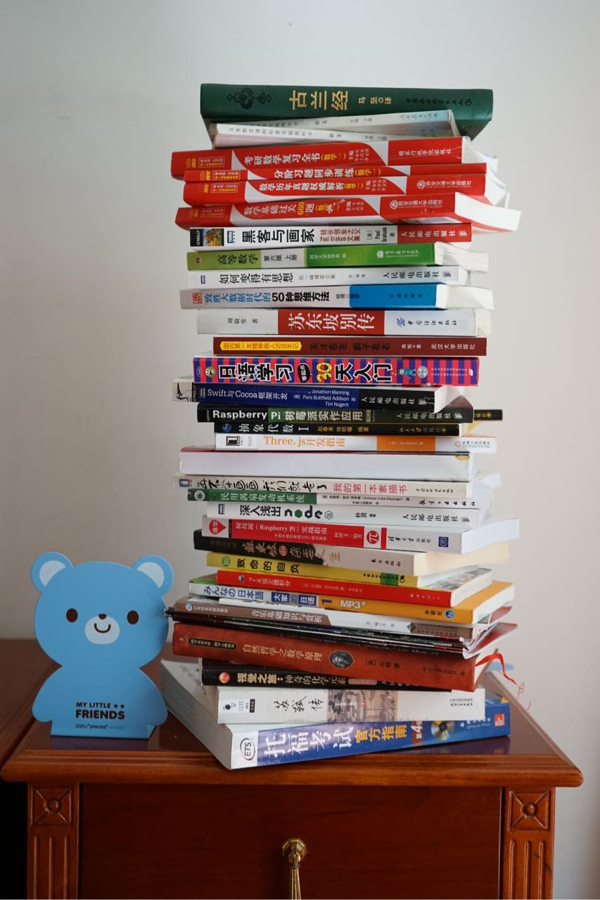

写在开篇：

1.如果穆斯林坚持他们的信仰，我就坚持对他们的成见；
2.上帝、安拉，我都要将他们踩在脚下；
3.不信党，不信教，群众生活味道好。

我有个人生梦想，好些年了，就是写一篇专门批判宗教的一本书，尤其是伊斯兰教。我之前甚至买了厚厚的一本《古兰经》，拿来阅读和参考的。但是呢，年轻的时候，把宝贵的时间用来干这个实在太不划算。毕竟，写这种东西，需要旁征博引，需要花大力气来考察资料和论证的，哪怕是一篇学术文章，那可是需要花巨大的功夫的。有大把时间搞这个，还得不到什么好处，不如趁年轻学英语、学技术、多挣钱才是正道。先作为一个梦想吧，希望以后可以实现，到时候有没有人看无所谓，自己开心就好。

我买的那本书在北京我没带回来，这以前的一张照片最顶上就是了。

<!--more-->

我一直告诉自己，虽然书读的少，但是一定要包容、要客观、要有世界性眼光、要尽可能多的发现和超越自己的局限性。学习和思考是终身的，书读得少问题想得少不要紧，可以慢慢来。但是即便我努力包容一切，我对两个东西还是极其没有好感：宗教与政治。

关于我个人的这两点的思考，系统的去写太费时间了。今天主要就是表个态，因为这几天发生了一件事儿：美团为穆斯林提供专门的外卖配送箱，引来众多网友的强烈抨击和大规模的用户卸载。

对于卸载这种行为，问我支持不支持，我当然是支持的------民怨对穆斯林的特权和厌恶由来已久，美团你自己往枪口上撞，怪谁呢------同治回乱后，左宗棠在给同治皇帝的奏折中称：“陕回之祸，由于汉回构怨已久”

我们的国家，宗教信仰自由，有信教和不信教的自由------他们有他们的自由，我有我的自由；他们坚定的信仰，我就坚定的抨击。

如果伊斯兰教的一些饮食习俗仅作为宗教习惯，不试图扩张到社会的各个方面，那也还好，也不会有这么多人反感和抵制了------然而作为伊斯兰教法《古兰经》，充斥着满满的暴力、恶意、战争、屠杀、歧视女性......我觉得最直接的话，用“恶心”或者“中世纪愚昧残渣”来形容就好了。

然而穆斯林们偏不，先举两个常见例子，清真食品和清真餐厅。

不捋不知道，一捋吓一跳。我们现在在超市的货架上能看到的很多商品，现在都申请了清真认证，比如：

1.伊利牛奶

2.康师傅方便面

3.统一方便面

4.今麦郎方便面

5.加多宝凉茶

6.鲁花花生油

7.双汇香肠

8.金龙鱼调和油

9.老干妈辣椒酱

......

细思极恐，触目惊心。

我们都知道，商人重利，为了得到穆斯林的市场，他们便申请清真认证。可是，清真认证是要付钱的，付给谁呢？自然有地方收。无论收多少，我作为非穆斯林，肯定是要分摊的，这让我很不爽。

认证收费也就算了，毕竟办个什么证都是要收费的不是么？但是还有更过分的：

1.监制、认证产品的材料来源
2.生产、加工过程、存储设备及方式
3.屠宰人员配备及教职资格证书、单位领导和管理层配备穆斯林人员、穆斯林职工所占比例，专用礼拜活动场所的设置情况
4.考察人员的交通、食宿等费用由申请监制、认证单位承担

针对第1点，如果了解了清真的饮食要求，就能明白要想达到要求，绝对需要额外不低的成本。毕竟宰杀时没有诵经，没有以真主之名宰杀的动物，都不能算作清真，有人诵经，得养人吧？

针对第2点，美团这次可以说就是在其存储和运输上做文章了。特别的生产设备和车间不要钱么？

针对第3点，则更是过分，想要取得清真认证，食品原料达标还不行，食品生产达标还不行，作为企业还要雇佣穆斯林职工，还要保证管理层的比例，还要专用礼拜场？？？

针对第4点，我倒是不说什么了，来现场考察认证报销下费用我倒是很能理解。然而对我非穆斯林来说，依旧是成本。

所以，作为企业，这些成本是要转嫁给消费者的。我不信伊斯兰，凭什么买单呢？

所以，哪怕从经济角度而言，抵制清真，也要从我做起。凡是我能在并不显著提高成本和降低质量的情况下，我会尽力选择非清真食品。毕竟现在被清真认证过的商品那么多，有时候挑选的成本还是蛮高的。作为不信教的我，清真事小，钱包和饿死事儿大。

这世界上大小的宗教数量可不少；这世界上有独特饮食习惯的民族可不少；但是只有伊斯兰教，只有穆斯林，以千年前腐朽而严苛的所谓经典为章法，处处试图以宗教传统之民义，让世俗让步。

清真认证就是这种让步的巨大体现，携伊斯兰教信徒众多为资本，间接逼迫企业和商家进行伊斯兰认证------很庆幸，国家已经开始干涉清真认证了。

而这种让步，不仅体现在产业里，也体现在我们身边的伊斯兰教的朋友和同学身上，这就是清真餐厅。

很多人，大学同学，或者其他朋友，可能有的是穆斯林。每次聚会，他们以餐厅不清真为理由，变相挟持我们去非清真餐厅就餐和消费。某种程度上，我们可以理解，但是，绝对不是站在宗教的角度，而是站在友情的角度，但是他们心安理得，所谓尊重宗教信仰。

我尊重你的宗教信仰，你怎么不尊重我没有宗教信仰呢？

我能为了你去清真食堂就餐不吃猪肉，你为什么就不能为了我吃猪肉呢？

为什么我尊重你是理所当然的，你尊重我就是不可接受呢？对我来说不吃猪肉还可能是不能接受的事情呢？我基本每天吃肉------虽然我在努力降低肉类视频摄入量。

同学、朋友聚会还好，甚至有新人结婚，为了极少量的伊斯兰朋友，去清真餐厅吃喜宴的，可知道为了这少量的人的所谓信仰，侵犯了多少人本应该有的自由？

公司和单位很多都有清真餐厅，我活这么大，上了大学去公司，我也没见过有佛教餐厅啊，我也没见过有满族餐厅啊。

如果我有一天成为公司老板，我绝对不允许公司有这种特殊化的行为，绝不开设所谓清真餐厅------在此立志。

以后，我也不会轻易为了朋友、同学的感情，专门去清真餐厅聚会了。我去也可以，我为了友情陪你去一次清真餐厅，尊重你的信仰；下次约会你为了友情陪我去一次非清真餐厅吧，可以不吃猪肉啊，可以自己带饭啊。如果你都不在乎我的感情，那我为什么要在乎你的感情呢？

我个人对宗教，尤其是伊斯兰教是深恶痛绝的。但是我把人和教分的很清楚，也明白很多人信教是因为生长环境导致的------每一个我的穆斯林同学，都知道我反对宗教，但是在某些方面并不妨碍我们正常的交往。

我去过一个伊斯兰国家------马来西亚。我第一次发现，这个世界的卫生间旁边除了有可能存在的母亲育儿间，还有祷告室。

在马来西亚，我也参观了他们的国家清真寺，我反对宗教的内核，但是作为文化的建筑我是很包容的，他们也值得欣赏。

然后，我在他们国家大清真寺里，遇到了一个来自巴基斯坦的穆斯林旅客，我们聊得还很开心，交流摄影技巧。

但是，这并不妨碍我，在他们大清真寺的地板上坐着，在手机上将我的一首诗加上了末尾句：我们和他们之间竖起的高墙。

很多时候，在我们和世界中间竖起高墙的，就是有所谓信仰的人；在信仰中，宗教是愚昧的；在目前的宗教中，或许伊斯兰教是最专制而极端的。

这首诗在我的个人网站上，也在底下的参考资料里，抨击了伊斯兰教女性的面巾习俗背后的审美和女权问题。

当然了，我不仅批判宗教，批判伊斯兰教，批判伊斯兰的专制和落后，批判伊斯兰女性的审美和女权，我批判的还有很多：

我们习以为常的吃鸡鸭鱼肉，就那么理所当然？------这和清真食品不一样，这关乎动物食品对健康的潜在影响，以及动物的权利和对动物的关怀问题；我杀过鱼，很血腥；我在生活中，努力少吃肉、不浪费肉食、少用皮毛用品，但是我实在做不到不吃肉。

我们广大宅男喜欢的女性高跟鞋、耳环和丝袜，跟伊斯兰教的女性面巾，某种程度上难道不是对女性的压抑？------社会属性是审美中不可缺少的一部分，社会又受男权思想的影响深远。

我们的政治信仰，在某些情形难道不是非常可怕的？------历史已经证明了不少了吧，前段时间去朝鲜，则有更深刻的感受。

我们的社会，孩子都跟父亲姓，难道不是一种对女权的压制？------我计划以后第二个孩子跟母亲的姓氏，作为对我妻子权利的宣示；作为男性，我爱我的妻子，我让孩子跟她姓我乐意。

我们的名校教育或者一些其他稀缺资源，难道不是对失去机会的人的一种间接甚至明目张胆的直接剥削？------纳税人是全体的，有的资源则堂而皇之将很大一部分人拒之门外。

我们的很多文化，难道不是臣服于政治、经济、宗教的产物？------政治、宗教我们司空见惯了；我们的婚礼文化、钻戒婚纱，难道不是被商业左右的吗？

我思考、质疑和批判很多问题，有的可能需要更多的思考和考证，我才能深刻的理解。

但是我不认为对宗教的批判，是什么不对的事情------各自的自由罢了；之所以那么反对，只是因为它太恶心，太恶心了。

另外，我们回看历史，这个世界的政治、经济体制，以及以基督教为代表的宗教，都是进行过深刻改革的，才能适应这世界快速的发展。伊斯兰教可以选择不改革，继续把千年前的所谓经典，奉为圭臬，那就等着自取灭亡吧------这世界，不允许，充满恶意的嚣张。

中国的执政党是共产党，我想共产党对伊斯兰教，将会很有兴趣，以下仅供参考：

党章------古兰经；

支部------清真寺；

政委------阿訇；

共同理想------为主道而奋斗，向全世界传播信仰；死后进乐园；

平等主义------主要信教，不问来历，不问出身，不问肤色，人人平等。天下穆斯林皆兄弟；

政治生活------阿訇宣讲，信徒礼拜，一生中必须回总部受训一次，受训后在本组织中的地位和荣耀得到提升；

整风运动------无论贫富和地位，每年禁食一个月，期间停止娱乐和战争；

税收体系------天课；

民政系统------清真寺会接济穷困穆斯林，介绍婚姻等；

共同敌人------所有不信主道的/卡费勒。

#### 参考资料

1. [申请办理清真监制、认证的程序](https://wenku.baidu.com/view/ff26768226fff705cc170a52.html)

2. [清真认证网站](http://www.inkosher.com/)

3. [美与信仰](https://leiquan.website/2017/01/14/%E7%BE%8E%E4%B8%8E%E4%BF%A1%E4%BB%B0/)

4.[治理清真泛化，国家在努力](https://mp.weixin.qq.com/s?__biz=MzI5NjU5MjMxMA==&mid=2247483909&idx=1&sn=3af47c346e1255759751ada14638bbd1&chksm=ec40b4dcdb373dca23501826b70b100c6e0b2ac8b13b883c9862f7ff9c65d985c4a077fb6e0c&mpshare=1&scene=1&srcid=07204oZQ9wyKn6HaBuR1vhgA&key=9965dca0b72a0a74a595b262fbfc602933f26fb5f8cc567b3ff6b4b8db6b51d483a75b7ac3b000f86c778229ab2533fdfda250219198105bb16889f17c7eae5d4ee5369672173ebbe30d15bb38d502bc&ascene=0&uin=MTc2ODY0NQ%3D%3D)

5.[美团外卖清真分箱配送，一个失败的营销案例](https://zhuanlan.zhihu.com/p/27975117)

6.[伊斯兰：现在，过去与未来](http://www.360doc.com/content/16/0807/06/35120882_581361481.shtml)

7.[如何理解《古兰经》中关于异教徒的这些经文？](https://www.zhihu.com/question/29906940/answer/52715241)

8.[如何对待部分对《古兰经》不结合上下文、历史背景就断章取义的穆黑？](https://www.zhihu.com/question/29891349#answer-13775099)

9.[清真泛化产品和现象合集](https://zhuanlan.zhihu.com/p/24548089?utm_source=zhihu&utm_medium=social)

10.[国家宗教事务局------警惕“清真”概念泛化倾向](http://www.sara.gov.cn/nsjg/ywss/gzdt5/377844.htm)

11.[同治年间陕西回民起义历史调查记录------马长寿](http://vdisk.weibo.com/s/sQdM4HTCevgOs)

12.[同治陕西回民战争之梳理](https://wenku.baidu.com/view/68e6fb1b52d380eb62946d93.html)
