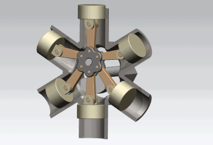
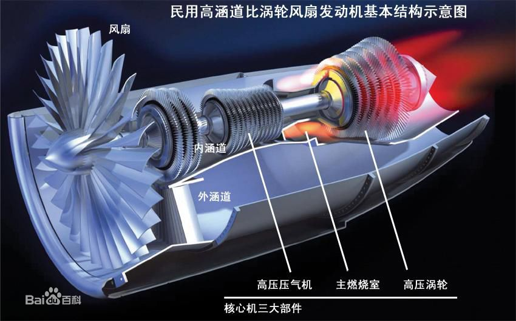
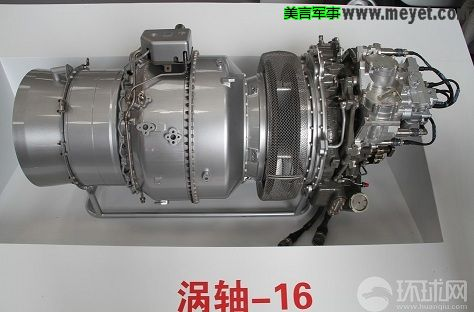
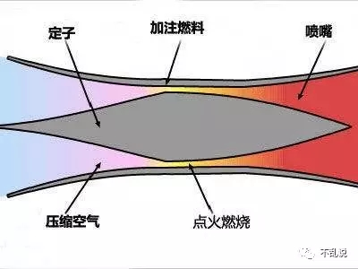
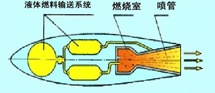
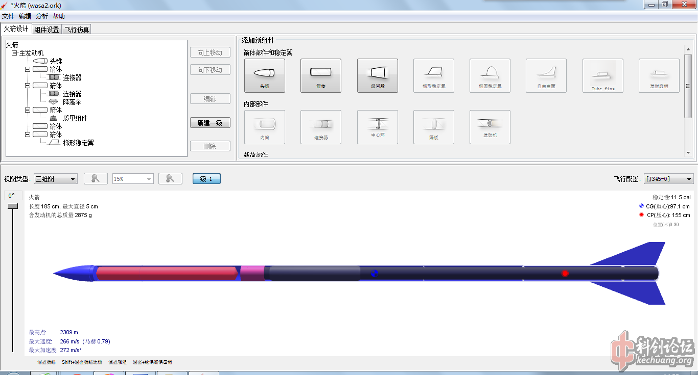

我曾经对自己说过：当对一个事物不明白的时候，很可能是因为花的时间不够多。

确实是这样子的。

<!--more-->

我对很多东西都有兴趣----想了解或者学习。然而，通常进展缓慢：音乐理论，小提琴，素描，平面设计，电路设计，工业设计，机器学习，Java的Spring MVC框架，PHP的Laravel框架，C++, iOS开发，Go 语言，苏轼的文集，现代文学的经典著作，日语，航空领域的知识（发动机，气动原理，方程），人体构造和基本医学，化学和物理常识，金融和会计，历史.....太多太多，我都快数不过来了，这世界太让人觉得奇妙了，自己懂得确实也太少了。

上面列的这些方面，绝大多数我都有所涉猎，然而只是涉猎而已，这跟我的个人性格和选择的发展方向有关：一转多长，广泛涉猎。

对于那些跟我强相关的、并且短期内急需的，比如我现在的英语考试，比如我的编程技能，这些我是要各个击破的，一段时间只能主要做一件事；对于那些不是强相关的，比如上面提到的，我的策略是先保持关注，等熟悉的差不多了（了解或者积累的差不多了），再看有无进一步了解的可能。因为这能让我同时，或者说在年轻的时候，去了解诸多领域。

假设10年时间，我能对10个领域的涉猎达到中等水平，那么有两种方案：第一种，每年一个领域；第二种，每年10个领域各十分之一。对于那些我认为短期内急需的我会用第一种方案，不着急的采用第二种。

对航空发动机的了解，就是这么的情况：有兴趣多年了，但是甚至到今天才真正弄清楚几种发动机的区别，以及为什么会有这样的区别。

#### 1.活塞式发动机

我们知道这种四冲程发动机广泛用在汽车上。之所以这里讲到它，是因为他也被用到飞机上，并且算是最早的航空发动机了。

多汽缸的活塞式航空发动机，又有两种类型：直列液冷式（常见的包括汽车的发动机）和星形气冷式（如日本零式战斗机），我们看图：

真是不得不佩服设计师，这么完美的造型都能被设计出来，还能利用飞行高速空气来进行冷却，简直太完美了。更有甚者，后来的星形气冷式设计成了汽缸旋转而轴不转，让其即使在地面也能由于汽缸高速旋转而散热。

#### 2.涡轮喷气发动机（Turbojet）

先来个原理图：

这个结构是其他的几个衍生类型发动机（涡轮**发动机）的源头。其实基本原理概括起来很简单：

1.进气口进气

2.压气机（多级压气机，低压和高压压气机）压缩空气

3.燃烧室燃烧

4.高温气体带动涡轮，涡轮连接压气机，同时高速气体喷出

5.尾喷管喷气

然而，其实有几个问题我也是现在才明白的：

1.高温气体喷出带动涡轮不会降低气体速度然后降低发动机效率呢？答案是会。然而，这是最高效的解决方式。如果用其他方式驱动压气机，比如电动的，那么效率肯定会更低。假设以图为例子：如果我们要用这里的涡轮发电，再以电力驱动压气机，那么中间能量转化是有损耗的；直接同轴驱动则完全没有损耗是不是呢？

2.设计利用涡轮来带动压气机的原因是什么？其实很简单的就是为了提高利用率。发动机的喷出气体温度很高，其实温度越高就是能量损失越严重。我一开始是迷惑的，后来我明白了：发动机需要的只是高速喷出气体利用反作用力便能做功，高温是副产物（低温高速更好了）。涡轮就是来专门利用这里的热能的。

3.为什么需要压气机？火箭发动机不就没有么？因为没有压气机的话，就会供氧不足（发动机前面的进气速度跟不上后面尾喷的速度），火箭是自带氧化剂的。（这里有个特例，也就是后面的冲压发动机，没有压气机）。小时候玩的那种飞上天的小烟花不也没有么？因为烟花只要瞬时做功，不用连续（也有一个类似的发动机，也就是后面的脉冲发动机）

#### 3.涡轮风扇发动机（Turbofan）

前面说到，涡轮喷气发动机是起源，涡轮风扇发动机算是其改进型。我们看原理图:

我们看到，它其实是讲前面讲到的涡喷发动机作为内核，在前面加了风扇，在外部加了外涵道。

为什么？为什么要如此改进呢？

因为涡轮喷气发动机当然不是完美的，它最大的问题就是燃料效率太低，非常非常费油：喷出的气体仍然是炙热的，也就是说燃料燃烧产生的热能中有很大一部分仍然残留在喷出的气体里而没有转化成飞机的动能。也可以理解为，耗油率不变的前提下，仍然有潜力大幅提高涡轮喷气发动机的推力。

有需求就会有解决方案，我们看下这个原理图：

我们看到图中的黑色、白色实心、白色锯齿装的三组涡轮，是和前面的高压压气机，低压压气机，风扇分别对应连接的。

这样复杂的结构其实就是在使用多出来的一组涡轮从燃烧室产生的燃气中多提取一份热能转化为机械能，这样也就降低了尾气的温度；多提取出来的这一份机械能被用于驱动风扇运转，吸入大量冷空气从外涵道向后排出；这些冷空气提高了单位时间内发动机向后喷出的气体的总质量，由动量原理：推力×单位时间=喷出气体总质量×喷出气体速度，提高喷出气体总质量也就加大了发动机的推力。由于这个简单的数学道理，涡轮风扇发动机可以用相比于涡轮喷气发动机更小的耗油率实现更大的推力。

这里普及一个常识：外涵道与内涵道空气流量的比值称为“涵道比”，直观的表现就是涵道比越大，风扇的直径相对压气机的直径就显得越大。大涵道比的发动机推力大、燃料效率高，但风扇直径太大导致高速飞行时阻力迅速上升，无法高速飞行。因此大涵道比涡轮风扇发动机广泛应用于民航飞机；而涵道比较小的涡轮风扇发动机则是速度较快的军用飞机的标配。

#### 4.涡轮螺旋桨发动机
先上图我们看一下：

简单来说，扩大风扇的半径，就是把涡扇发动机的外涵道直接去掉，让整个发动机外都有气体流动，这和最原始的螺旋桨飞机原理一样的，只是效率高得多。

涡轮螺旋桨发动机的尾气中几乎全部热能都被用来驱动螺旋桨，因而自己已无法产生推力（只占总推力的5%左右）。涡轮螺旋桨发动机适用的速度区间与古老的活塞式发动机类似（都是螺旋桨飞机嘛），但燃料效率要高得多，广泛用于今天的低速飞机。

为什么说效率要比传统的活塞式高呢？我们对比两种发动机的原理就知道：一般的4冲程活塞式发动机真正做工的时间只有四分之一（做工冲程），而涡轮机是持续不间断的，高压气体直接驱动涡轮持续不断的旋转，中间是没有停歇的。

#### 5.涡轮轴发动机

前面讲到，涡轮螺旋桨发动机的尾气基本没有动力了，占比比较小。我们按照这种改进的思路，可以把发动机改进为全部动力到轴输出，就是涡轴发动机了。跟传统的活塞式发动机动力输出方式完全一致了。

这是国产的发动机的实物图，我们看到，他没有尾喷口，或者说尾喷口很小，只有进气口。

我们看到上述的几种发动机基本都是涡轮喷气发动机的基础上，逐步改进而来的：加个风扇叫涡扇，加个桨叫涡桨，扇子不要了改成轴输出动力就叫涡轴；并且他们的效率比活塞发动机更高的原因就是因为做功连续----这就是我今天的收获。

我们下面看看两个比较奇葩的发动机吧。

#### 6.脉冲喷气发动机

也就是前面说到的，跟我们小时候玩的烟花，一样一样的。

脉冲喷气发动机是由纳粹德国在1944年发明的，被用于推进世界上第一种巡航导弹V-1。之所以被称为“脉冲”，是因为它产生的推力不是连续的。发动机主体就是一个圆筒，前部有一个“节气活门”，相当于空气单向阀，它使得空气只能从进气口向发动机内流动而不能流出发动机。首先给脉冲发动机一个速度，空气由于自己的惯性流入发动机；之后发动机圆筒内的油嘴喷射煤油，煤油被点燃，产生的燃气由于发动机前部“单向阀”的阻拦只能向后方逃逸，从喷口喷出产生推力；由于燃气的惯性，燃气在圆筒内气压已经与外界平衡之后仍会继续向后流动使得圆筒内暂时产生负压，“单向阀”被外界大气压顶开，新鲜空气再次流入发动机，开始下一工作循环。

脉冲发动机没有“压缩”这个步骤，燃料效率很低；而且推力不连续也造成其工作时噪音、震动巨大。然而它极其简单的结构仍然有用武之地，至今仍是某些导弹的动力，并且是动态航模动力的一个重要选择。

#### 7.冲压发动机
先看图：

这就是前面说到的没有压气机的发动机。

冲压喷气发动机还是1939年由纳粹德国发明的（确实是这样咱没脾气）。它可以被理解为一种“简化的、更适用于超音速飞行的涡轮喷气发动机”。其“压气机”由收缩形状的进气道来代替，只有圆锥形状的定子称为“压气锥”。空气以超音速进入发动机后，由于自身的动能而继续向发动机内部流动;根据拉瓦尔原理，超音速空气被收缩形状的流道所压缩并减速;同时空气也会撞击由压气锥产生的激波面而显著减速增压。换言之，压缩空气的能量来自于进入的空气本身的动能。空气在燃烧室内与燃料混合并点燃后，直接从喷口喷出；由于不需要压气机，冲压发动机也就不需要设置涡轮来驱动它。

由此，其大体上讲不需要任何旋转部件，结构大大简化、重量减轻、阻力减小。然而由于依赖进入空气的自身动能进行压气，冲压发动机一般需要载机具有一定的速度才能启动并工作（历史上就发生了两机相撞）；不过在超音速状态下，它的表现全面优于其它类型的发动机。这样的特性使得它成为今天很多导弹的推力，导弹会先使用助推火箭加速到超音速，然后再启动冲压发动机奔向目标。未来的超高速飞机同样很可能会选择冲压发动机作为动力。

#### 8.火箭发动机

其实火箭发动机属于专门的门类，不属于传统的航空发动机。但是这里也简单介绍下吧，先看图：

要说原理，其实火箭发动机是最简单的，没有什么特别的结构：燃料和氧化剂混合燃烧直接喷出高温高压气体做工即可。所以效率也很高，因为没有什么中间部件来造成能量转换过程中的损失。

一个简单的固体火箭或者液体火箭，凭个人爱好加上：开源软件（设计）、小型工厂（阿里巴巴）或者车床（土豪）、原料和材料（淘宝），就能做出来。其中以固体为主，液体的控制比较复杂。

首先看下如何设计：

再看下燃料大概长什么样子（RNX：以KNO3为氧化剂主要成分，环氧树脂为燃烧粘合剂主要成分的推进剂 ）：

最后再看下成品：

在美国，有个业余火箭的竞赛项目，称作：卡马克十万英尺奖（卡马克挑战赛、卡马克奖），每年一次。其中有大神参赛飞到了36千米高左右。在这个高度，火箭携带的摄像机拍到的画面中，地球已经是弧形的了。若有兴趣，请查看这本电子书[《震啸长空》](/resource/震啸长空.pdf)，里面有详细的照片，参数，外形，记录，分析。

如我们所看到的，火箭发动机原理简单，个人加把劲是能做出可以飞行的东西的，然而还是只有大国才能掌握成熟的火箭发射技术，我想主要有以下几个原因：

1.大推力，小玩意飞上天容易，携带大件多少吨的重量飞上去可不容易。

2.精确控制，这也是业余爱好者缺失的，爱好者们的业余固体火箭是没有控制功能的，算是放大版的高级金属烟花了，点火就能飞。

3.成熟的配套工业，这是很多国家没有的，火箭工业是需要全国范围内各个科研机构，材料加工厂，化工企业，国家通信系统等等全面配套的才行。

我们知道，在美国，SpaceX 和 Blue Origin 两家公司的火箭都很不错，我觉得除了跟NASA的支持（据说）有关以外，还跟国家体制有关：美国是属于资本主义，很多火箭的外围配套设施以及其他军工产业之前本来就是面向市场招标的，因而市场上的工业体系完备；而且美苏争霸后大量科学家失业提供了足够的人才。中国是举国体制，相关配套生产企业全在体制内，科研人员也都在体制内，市场上的技术和人才的储备几乎为0。所以国内的壹零空间（OneSpace）要发射火箭被人吐槽也就不奇怪了。

感觉这方面中国亟待改革，不然在商业航空这样的新一轮技术竞赛中又要落后了。

update：

2017年4月20日，中国的货运飞船“天舟一号”顺利升空，好样的。

我有一个梦想：去现场看一次咱们祖国的长征火箭发射。希望能早日实现。
