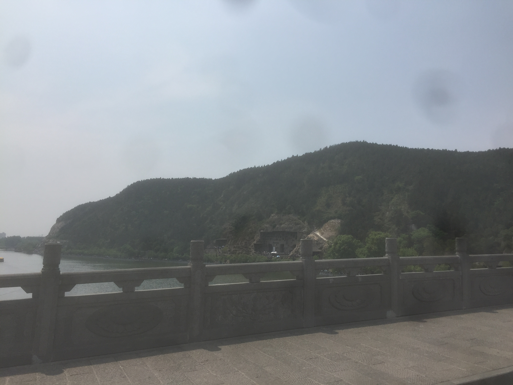
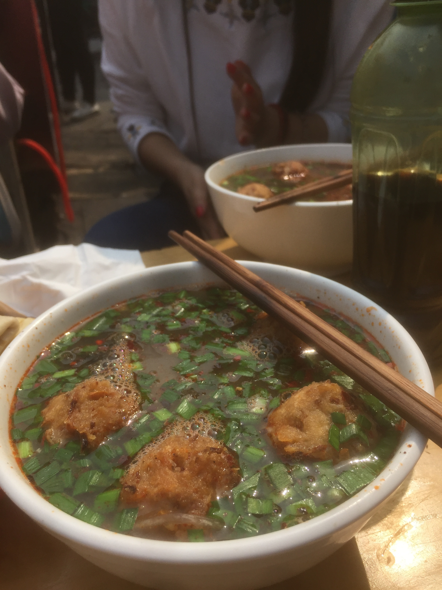
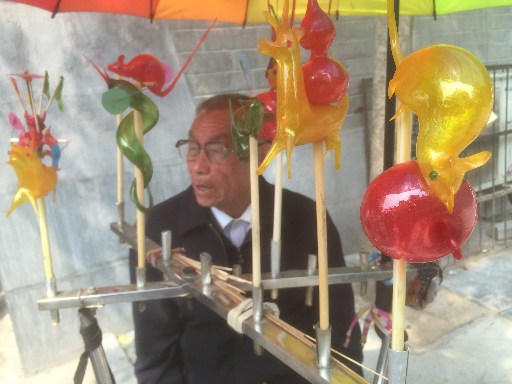

去洛阳看牡丹啦，不过一出车站，就被洛阳的火车站给惊呆了。。。

<!--more-->

洛阳的牡丹，闻名天下，但是也就这样了。而且我的手机摄像头当时进灰了，照片就看起来很不好。

龙门石窟倒是很不错，从河对面看一眼龙门石窟。

龙门石窟的标志性佛像，据说像武则天。

拍照的时候，正好由于太阳光照射，闪了一下。

一尊大佛像，踩这一个小的。

龙门石窟河对面的白居易墓。

回来后，我们第二天参观了酒店附近的武则天相关的几栋建筑。

武则天建造的一个殿的复制版，叫什么来着，我忘了，貌似叫明堂？

这大概就是《神探狄仁杰》里面的通天塔。

洛阳标志性的好吃的，挺好吃的，但是我觉得略微有些不太习惯啊。

然后我们在街头逛了逛，碰到一个卖糖人的老人。好想身边有个挽着自己的女孩子对我说：“好可爱的糖人，想要”。然后我说：“买买买”。

### 注：此游记根据照片和回忆整理
