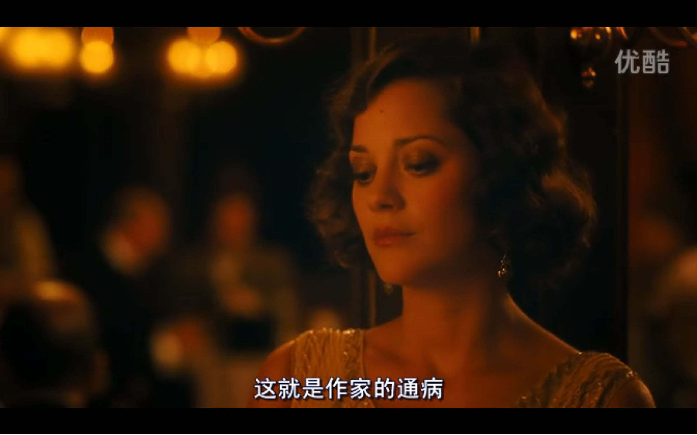

今天下午，我把《午夜巴黎》这部电影看完了，因为电影的海报的原因。

我也想过去一个完全陌生的城市，居住一段日子------不过不是为了写小说，而是写写代码（挣钱）、摄影拍照（玩）、写写小诗或者游记（闲的）。

我觉得大理或许蛮合适，内心有过想法；丽江我虽然没去过，但是我觉得或许不是那么合适------我跟一些热衷去所谓文艺的地方（西藏？丽江？尼泊尔？）去净化灵魂的人不同--------我甚至在故意逃避那些地方，免得别人说我装文艺，也担心一些地方的安全问题；况且我认为我干净的灵魂是不需要净化的--------不干净的灵魂又如何净化得了呢？

<!--more-->

说实话，我以前并不太喜欢这种文艺片，但是我说了，因为电影海报的原因，这个电影我必须要看。我觉得这个电影还是很合我口味的，影片中的一些思索我是很赞同的。

#### 基本情节

吉尔是位在好莱坞小有名气的电影编剧，他希望在巴黎这座仿若“流动的盛宴”的城市中完成自己的第一部小说。而只是抱着观光心态来巴黎购买结婚家具的未婚妻伊内兹及其父母非常反对，不欢而散中，吉尔独自漫步巴黎。

此时适时到来的一辆马车，将他带入一场他自己都不敢想象的名流派对，在派对中，不仅与海明威、菲茨杰拉德夫妇、达利、布努埃尔等人畅聊，更与毕加索情人阿德里亚娜共生情愫，在一次次的穿越中，他越来越沉醉在巴黎这座城市中。

然而，最后吉尔终于明白，直接上图吧：

吉尔最终还是选择留在了巴黎，以在巴黎夜晚的大雨中两人的漫步结束了故事。

#### 一些感悟

关于这个电影体现出来的哲学主义，我觉得我是不大能在简短的时间内捋清楚并且全面兼顾的，然而一些基本的思考，我想简要记录一下。

##### 1.有人在虚无的过去中寻找黄金的时代，有人在惨淡的现实中追求美好的未来

影片中的男主角，吉尔，他的小说，要写的小说就是关于一个怀旧商店的故事，故事中的人们，认为要是他们生活在早先的时光，他们会活的更加幸福。而吉尔最想生活的时光，便是“二十年代的巴黎，雨中的巴黎”。当保罗说：“怀旧就是拒绝，对痛苦现实的拒绝”时候，吉尔的未婚妻告诉保罗，保尔大概会愿意一直生活在那种拒绝的状态中。保罗一针见血：“黄金时代情节，这是一种错误的观念”。

我是认可保罗的观点的，那么，吉尔为什么会有这样的情节呢？大概是对现实的不满或者说对过去的向往。

在影片的前几分钟，吉尔的未来岳父来到法国做生意，吉尔和未来岳父在法国的第一顿饭，就发生了争论，未来岳父不喜欢法国和法国的政治，而吉尔则是批评当下美国的政治。政治只是一种缩影，吉尔对其工作的价值以及生活的其他方面，也是不满的。由此我们可以看到，正是对现实的不满，催生了吉尔这样的“黄金时代情节”。

我是见过一些人怀旧的，在我身边的朋友中，在我的大学的校友中，在公司摄影协会的群里。然而在我身边也有一些从事或者爱好艺术相关职业的朋友，比如设计师，音乐爱好者，他们倒是不太怀旧，虽然他们会为自己画画，会半夜去百花深处的胡同录音乐。

我对摄影协会里面那些人对古老的相机的喜欢，是不感冒的。我不知道为什么有的人，往脖子上挂个相机，就开始自称摄影师了；我也不知道为什么有的人，在数字相机技术如此进步的今天，还对撕拉片感兴趣，那不如去玩小孔成像得了。不过后来我貌似发现了原因，根据身边的人的爆料，这些个怀旧有情怀的摄影师是很容易骗到妹子的，那我就更不屑了。

当然，我相信这只是个例。我相信绝大部分摄影师是正直的，对摄影是真正的热爱，我是有这样的朋友的。我自己也喜欢拍照，我对拍照的喜欢肯定是要胜过对相机的喜欢的，当然我也喜欢我的 Sony 微单，索尼大法黑科技，小巧好使，要什么单反，那么大，占地方-----后来我才知道，在很多人眼里，尤其是不懂行的客户面前，相机大小和专业程度成正比，那就有些呵呵了。

我也见过些人，由于对共产党不满，就特别迷信民国时代的国民党的。我也实在是难以理解，虽说中国目前的政治不完美吧，但是好歹也还国泰民安，虽说国民党确实有可取之处，但是当时的国民党肯定比不上现在国共任何一个了，就贪污腐败的问题，就非常值得黑了----当然，腐败问题中国现在可不轻，只不过已经在加紧惩治了。而且，即使那时候的国民党符合想象，整体时代也是比不过现在的。

当然了，喜欢撕拉片还是幻想着回到民国时代，那是他们的自由，我是不稀罕的。

回到自身上，虽然我也是对现实不满的，但我选择的方向是，追求美好的未来；我是不太喜欢旧的东西的，该扔旧扔了；我也不觉得哪个时代比现在好----对于那些个我知道的真心向往民国时代的人，他要真穿越回去了，我相信迟早会乖乖的回来的。

##### 2.内心的贪念，是一种死循环

所谓不可治愈的死循环，比如这样：

吉尔在后来，终于痛苦的领悟到了惨淡的现实：

作为作家，他还自黑了一把：

我想解释一下这里的循环，其实这是一种逻辑推论，我是认同这种推论的，并且把这种推论应用到我的生活当中，也能用来解释很多事情，非常准确，比如：

如果有朋友当着我的面伤害别人，那么我就会认为有一天他会当着别人的面来伤害我-------可是现实生活中的有些人，总以为自己是独特的，能跳出这种循环。

回到关于对现实不满的问题上来，其实大家的现实都是一样的，有的人是乐于接受，有的人是逃避拒绝--------这或许是基于内心，因而即使换了时代，境遇变了，内心也不会变，满意的终将继续满意，不满意的终将继续不满意。

而这个内心的确定，我认为是源自于内心的贪念，源于利益的诉求。

我经常用一些思想来指导行为，反之，我也用自己的行为（或结果）来质问自己的思想。

比如对于现实不满的问题，我今天的现实，难道不是我之前的行为确定的么？我为什么不满，难道真的不是因为贪恋？除去不可抗的因素，我今天的一切，好与不好，都是自己的行为导致的后果，满意那是幸运，不满意或是应得。如果实在不满意却又无力改变，那就调节自己的内心吧，抑制贪念，客观对待。不然，即使得到了理想中的现实，内心不变，还是会依旧不满意的。

当然，不排除另一部分人，自己的热爱不符合现在时代的主旋律，因而对某个时代特别向往的，这是存在的，这也是可以理解的。但是今天的时代的最大好处之一就是包容万象，因而任何人，大概总能找到自己非常合适的位置的。

#### 小结

我是一个向往未来的人，也是一个能意识到自己内心的人，也是一个对现实不满的人。

小时候，我就在期盼一个光明的未来，虽然现在感觉到了未来的一丝暗淡，然而我还是坚定不移的在向前。毕竟以往不谏、来者可追。我也一直告诉自己，在追求美好未来的时候，宁可平庸，不可犯错--------我不希望我的明天因为昨天的错误而受到损失。只要没犯错的过去，那么就不是包袱，是可以随时安心的、无忧无虑的放下的。因而，我对自己的过去没有太多的留恋，高中时候的一些日记，我嫌占地方就一把火烧了，虽然现在想起来略微有点儿遗憾，但是也没有什么，毕竟，我能拥有的，只有现在和未来，过去了，就烟消云散了吧。至于对现实的不满，我能做的就是好好调节自己的内心，珍惜每一天的生活之余，来用实际行动提高未来的收益。

------
#### 参考资料

1.[午夜巴黎--------百度百科](http://baike.baidu.com/link?url=nu-SoSZUwq5swvdWo8BcGna792Mt8gEnvmcxQvfNm3E91R2oxuXDggvyeUToaPiJ6EpLt3OrqeR_u8vFK34LTCpMdGtTDUM_D95w9t-cu81pZAuLv16EgOC4IMWsQZTv)

2.[存在主义--------百度百科](http://baike.baidu.com/item/%E5%AD%98%E5%9C%A8%E4%B8%BB%E4%B9%89)

3.[现代主义--------维基百科](https://zh.wikipedia.org/zh/%E7%8F%BE%E4%BB%A3%E4%B8%BB%E7%BE%A9)

4.[百花深处--------维基百科](http://baike.baidu.com/link?url=z06SdbaO9bme6RCJVwoxF4ABpmDAwQDqWqwqd_ENQaivnxzqqLcokQUiyq13kvQZBShC2pUwlSEhBn5e5dcnXB8Q9oiMbsX8LPGXt7WlxvsGUgKUOsoOgl_kAwqDflJ2)
