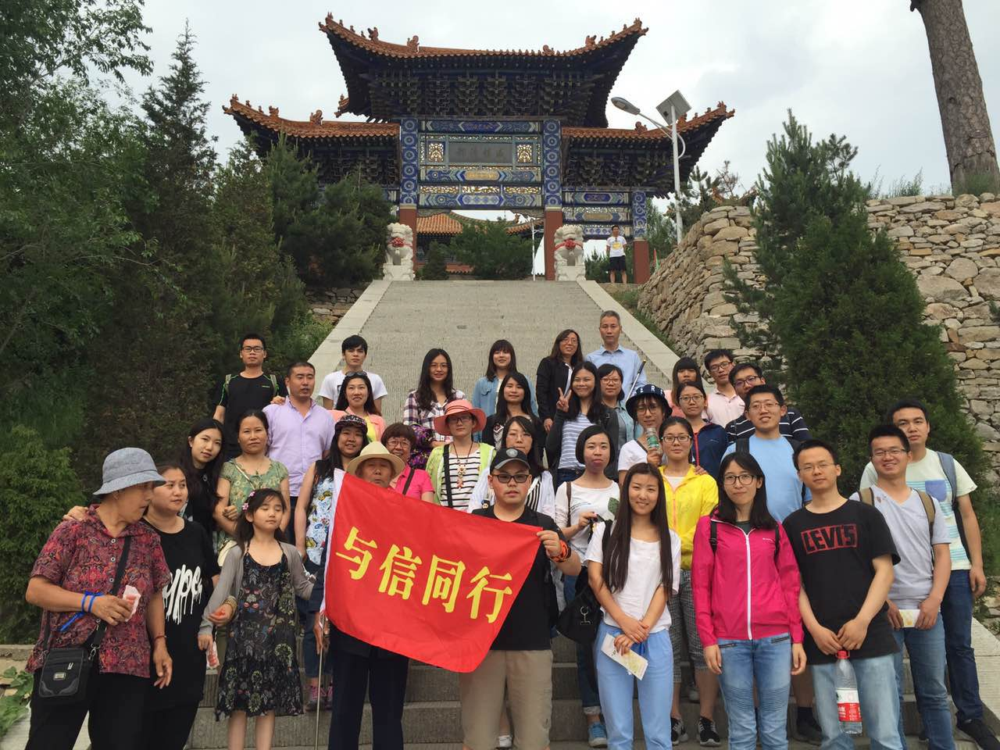
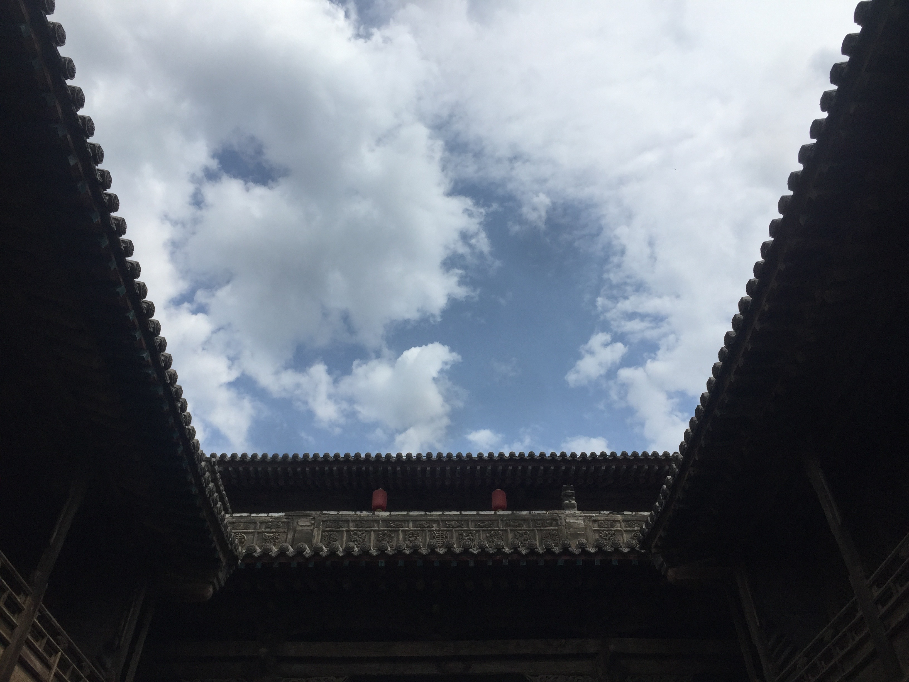
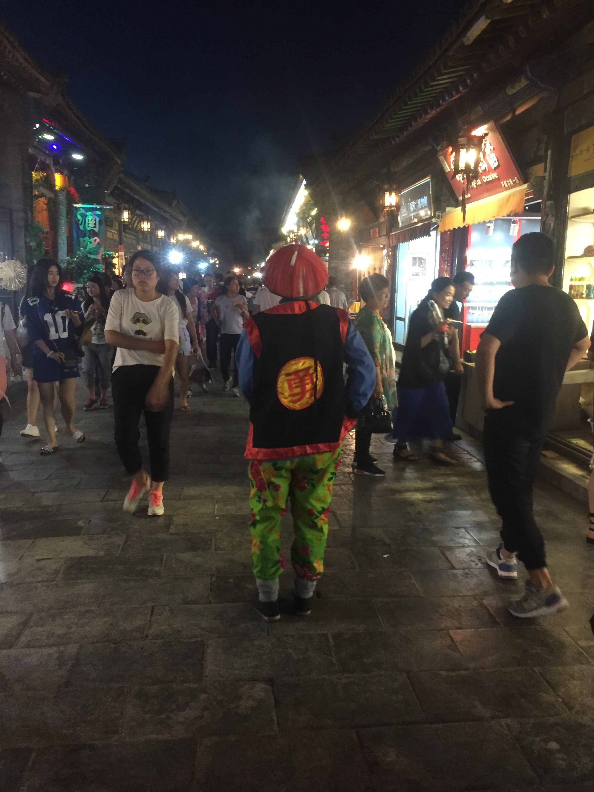

因为这次不想麻烦，于是我们跟团去的。这个团感觉还不错，不是传统的旅行团，更像是一种户外的活动性质，导游是北大的化学女博士做的兼职。

<!--more-->

我觉得悬空寺特别的棒，但是我没有上去，想着上去了也只是个庙而已，不如远观得了，有的美，远观比近看更合适。

乔家大院貌似没什么可以看的，就这样咯：

这里拍过很多电视剧，我看过几部。我还记得大院的各间房子，每一间都有主人的生平简介。

云冈石窟我觉得肯定是必看的了，很多佛像的造型很有意思很萌，比如这个石像，由于风化的原因，萌萌的，尤其是嘴巴。

这个就正经多了，很符合教科书里面叙述的云冈的石像特色。

后来，我们去了平遥古城。

我们三个和导游一起，晚上逛了逛古城。现在各地的古城，感觉都是那么回事儿，人多，店多，没了。

这位武大郎人很好，即使不买他家烧饼，他也乐意摆姿势让人拍照。或许，这也是一种免费的广告？

和我同去的辉明小伙伴。我记得这是什么大院来着？这家大院的城墙。

城墙上的露台，感觉很棒，在高墙上有这样的绿色和亭子，是很奢侈的。

我们去了恒山，依清楚记得，我们爬山的时候，播音警告说有大雨，让我们注意避雨，防雷，尽早下山。我们运气不错，到山脚下才开始下雨的。因为有人被困在山上，我们几个饿的实在不行了，就去赶紧吃了个饭。这家山脚下的饭店还不贵。

这应该是我们上恒山的时候拍的照片，因为回来的时候，天在下雨。

### 注：此游记根据照片和回忆整理
