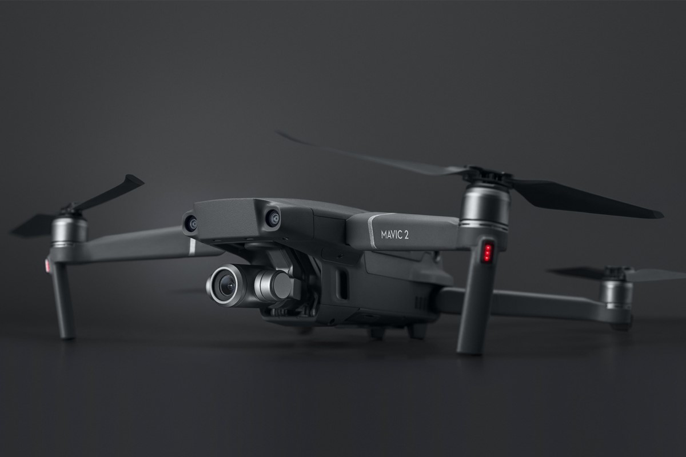

从2016年开始，我接触并入手了一台大疆无人机，精灵(Phantom)3。还记得第一次从天空自由的俯瞰大地的激动，还记得当时无人机的高度飞过了风筝时候的心情。

为什么喜欢无人机呢？大概换个角度看世界可以让人心胸辽阔吧。

大疆御（Mavic）2无人机是大疆2018年新出的机器，同事出了两个版本，我买的诗变焦版本。为什么不卖专业版本呢？我个人觉得是没用的，参考我的相机，一万多的全画幅索尼微单，画质是好了那么点，但是呢？那么的笨重-----其实我的微单算非常的小了，那些背着个头更大的相机的文艺青年，我就不说啥了。

<!--more-->

其实，我并不只是喜欢无人机吧，也喜欢飞机。

除了18年的御姐，16年的精灵，13年我还淘宝买过几十块钱包邮的儿童直升机，小时候还玩过易拉罐做机翼的火药小飞机------可能我心里一直有个飞翔的梦想吧。

-----

未完待续。。。