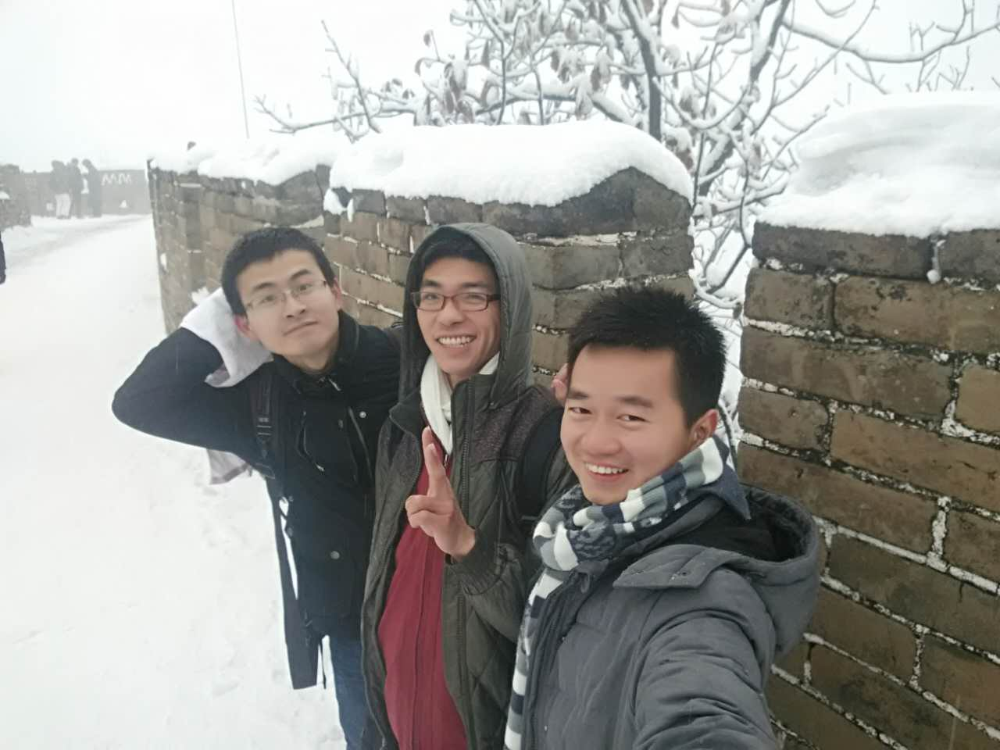

上帝说要有光，于是就有光；你说去长城看雪，我们就去长城看雪。毕竟这是一件很浪漫的事情。

<!--more-->

我们三人在下大雪的长城上的合影。

我们是清晨出发的，快到中午了才到慕田峪附近。到了就是午饭时间，于是我们先吃了个饭，体力充足，才有劲往上爬。

我觉得这张照片的效果还是蛮不错的，花色的伞，很有感觉。

慕田峪三个大字。

慕田峪不同于八达岭，店子和吃的很多。看到吉野家，就想起我们在音乐雷达工作的日子，那时候我们天天吃吉野家，都快要吐了。

觉得打雪仗的小朋友特别可爱，忍不住偷拍一张。

长城外边的树，叶子是金黄色的，在白皑皑的雪中，很有感觉。

很好奇，堆雪人的那个伙伴，是从哪里倒腾出来这么多垃圾做装饰的？头发，鼻子，眼睛，手，尾巴，耳朵竟然都齐全了！

### 注：此游记根据照片和回忆整理
