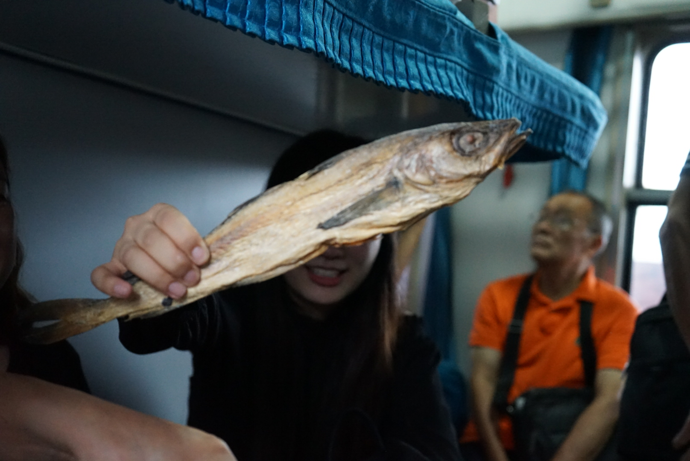
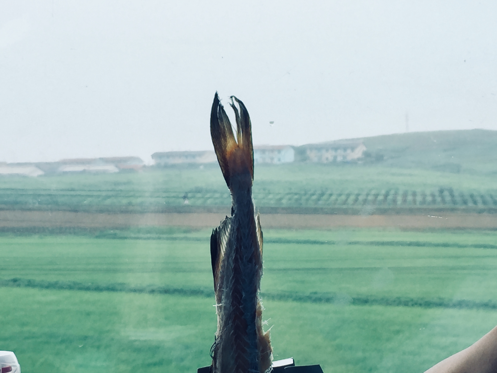
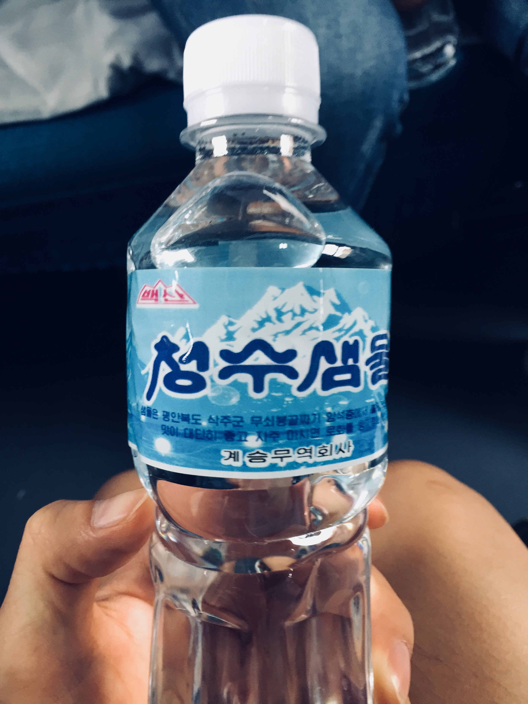
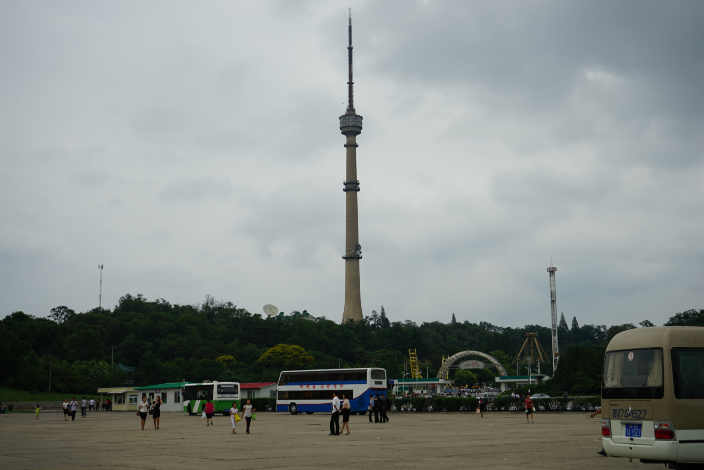
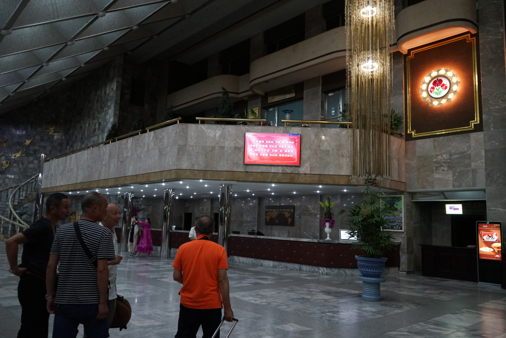
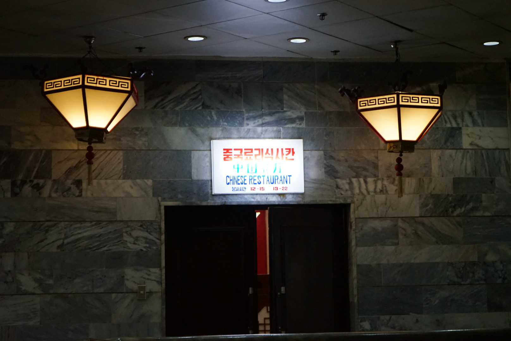

#### 第一天，平壤，2017-07-09

去朝鲜看看，可以说是我多年来的一个梦想。

我有很多梦想，比如其中一些，关于旅行的：去朝鲜感受其社会主义政治；去叙利亚看看战争与恐怖主义带给人民的创伤；去珠峰看雪山，去红海潜水；和相爱的人去北极看极光，去南极看企鹅....

<!--more-->

这一次，趁着来东北考试，就把朝鲜旅行的梦想实现了。以后，就不知道何日再会来东北了，就更不方便来朝鲜了。

我昨晚和朋友在哈尔滨分别后，就坐上了去长春的火车。到长春中转，今早8点15分到丹东，我下了火车打电话咨询，导游已经在等我了。导游说，因为不满16个人，中方不配置导游。我年轻，又是男生，看上去积极阳光帅气，就由我做领队了。导游跟我好好交代了一些事情，给了我我们的签证、名单和车票，还有仔细给我交代了给朝方导游的装在信封里的小费。

我们等待海关边检上班，上班后，我们便是第一批过关的旅客。在等待火车的时候，我们大伙就在等候区聊天。我们一行10个人，趁还没出境有网络，各自给亲朋好友交代了下导游的电话，以防万一有什么急事需要联系。我们也当面建了个微信群，各自实名就免得问大家叫什么了，更重要的是回来后好分享照片。

检票口开放后，我们就准备上车。因为是团体票，我在前面和检票员数人数，带领着大家进站。

一到火车跟前，大家第一件事就是跟火车合影，毕竟基本上都是第一次坐国际列车。我们坐的是中方的火车，据说比朝鲜的好很多，而且，坐哪方的车去，就坐哪方的车回来，因而我们就放心了。大家看我手中拿的就是签证了。如图所示，我们的签证，其实算作一次性的旅行卡，我的比较大，跟他们的都不一样，领队的特殊福利啊，看来早就让我当领队了，怪不得我当时想在哈尔滨再多待一天，导游不让呢，说损失比较惨重。

给旅行卡来个特写吧。

如图，我们每个人都有一个 Visa 号码，这个我们后面入境是需要填写的。如图，我们团队有49年出生的老爷爷，也有97年的小妹妹，我的签证压住了几个人的信息。关键信息打个码吧，免得泄露了人家的隐私。

来个反面的特写，如图所示，这个应该称作旅行卡，作用就是一次性旅行集体签证，这种模式不用在我们的护照上留下签证贴页，甚至都不会在我们的护照上盖入境章，据说这是朝鲜为了解除赴朝旅行者的顾虑：如果留有朝方入境章，可能存在让美欧等国家拒绝入境的可能。看来朝鲜还是能意识到这一点的，但是，回归现实，于他们而言为了赚一些旅行者的外汇，妥协这一下也是可以接受的。

我们在检票的时候，身边就有朝鲜人，别的或许分辨不出来，但是胸上佩戴的朝鲜才有的徽章，是朝鲜人最明显的标志。我们上车后，发现了几个朝鲜人占领了我们的车位，我和其中一位女士交涉，她中文很好，说不知道她的座位。我本来想着挤挤吧，但是又实在挤不下去，我看了下她的车票，上面没有写座位号，我不理解，问了下附近的中方乘务员，他说她们是无座的，到新义州，然后让他们站起来了。从这位乘务员的话语和动作中，看得出对朝鲜人还是不够友好的，不过也还好，卧铺车，旁边有凳子，她们就在那里坐着几个，站着几个，也不会累，新义州也近，10来分钟就差不多了。于是我们就坐下了，底下坐人，中铺放行李。接着我们就填写朝方入境卡了，还要填写一个导游汇报卡，那就我来写了。

10点出发，我们很快就到了新义州了，朝方人员就上来检查了，应该是有2-3拨，根据不同的制服和检查内容，包括海关安检和内容审查。安检没什么特别的，就是金属探测器扫一扫，不过他们是女性查女性，男性查男性。大概是因为比较传统男女有别？

内容审查这方面，就比较严格了，这也是赴朝旅行中最紧张刺激的部分之一了。

首先，拿出全部的手机和相机，主要是审查照片内容，主要就是黄赌毒和政治方面的，我们基本上有所准备，加上这位负责检查的官员并不严格，很快就通过了。

第二步，审查文字和书籍报刊。我们没带啥，但是老人家带的丹东和平壤的旅行图什么的被没收了。老人家还想去理论理论，我们说算了吧，语言又没有那么的通，也不是什么重要的东西。

第三步，查行李。我们的打开包和箱子瞅了瞅就算完了。但是后来我们才知道，他们查本国的公民还是很严格的。我们看到他们所有的笔记本都拿下了火车，就在窗外我们的位置倒腾了好久。因而我们也等了好久，前前后后在新义州有两个多小时。

最后，另一拨人上来登记了手机品牌。把自己的手机品牌写在了我们的入境卡上面就完事儿了。

在等待检查的时候，车门是开的，加上有小推车过来卖吃的，因而我们就下车去溜溜，看买点儿什么。在下车前，坐我对面的阿姨，偷偷的拍了下外面，就被外面的士兵招呼出去了，关键那个士兵打完手势后摸了摸腰上的枪，吓死我们了，还好只是摸摸。下去后，阿姨跟他说，没拍上照片，展示给士兵看了下，就回来了。

不一会儿，他们买了些东西回来：一条咸鱼，一瓶虎骨酒。这条鱼特别有意思，我们路上就以它为乐。我们看看这条鱼哈。

那我们就一起吃鱼喝酒啦，这个鱼实在太硬了，我们都撕不动。于是，没吃多少，我们就放弃了，把它插在了虎骨酒的纸盒子里，放在床边，像一束花。

检查的差不多了，时间的点也到了，我们看到了外面送饭的服务人员了，我们就下去领饭，领饭需要凭名单。女服务员看起来很时尚，金色的高跟鞋，黑丝袜子，人也挺漂亮的。饭菜到手后，我们觉得还不错，来张特写。

还带一瓶朝鲜产的矿泉水。

大家吃的很开心，我们愉快的合影了。

吃晚饭，没一会儿火车就开动了，我们向着平壤进发。因为去平壤旅途很长，不一会儿，就和那边的朝鲜人员聊起来了。其中一个略胖的年轻人，跟我大概车不多大，或许还小一点，在武汉中国地质大学，学习工程专业。他们每个星期会去一趟武汉大学，因为同学在那里，他们会约着打排球。我们一路上就聊了很多，话题很广泛，涉及到中国的双十一光棍节、春运、朝鲜的太阳节、朝鲜的兵役年限、还有朝鲜的女交警。这位年轻人说，朝鲜的女交警级别很高，一般人接触不到的，但是他可以，因为他姐姐就是交警。在网上各个游记里，朝鲜的女交警，女导游确实是一道亮丽的风景线，备受好评。他也提到了传统中的“北女南男”的看法，说现在貌似也不一定了。他也提到，曾经有中国游客追求朝鲜女导游未果的，我们大伙一起笑。另外还有一位很热心的朝鲜人，是师范大学的教师，来中国学习，两年没有回过国了，他说他这次回国很开心，是啊，从异国他乡回到自己的祖国，谁会不开心呢。我们和他也聊到了很多话题，其中包括朝鲜的房屋制度等等。他说，因为他是大学教师，政府在新建设的黎明大街上分了一套110多平米的房子给他，因而他要好好工作，报效自己的祖国。相信朝鲜人民有这样的努力的人，会越来越好的。就在这时候，前面提到那位年轻的胖学生说，要是去年他去工作了，今年他也会有房子了，可惜了。

我们一路上确实聊到了很多话题。从中国到朝鲜，各个方面应有尽有，他们也不太避讳。尤其是那位年轻的胖学生，很直接也会开玩笑；那位年长的教师，倒是稍微有些含糊和搪塞，在我们同行的小朋友的一路追问下。我们其实也理解，毕竟我们的祖国也走过这个阶段了，曾经的华夏儿女，在外国人面前，确实是自卑的；随着这些年中国经济的腾飞，这个阶段已经一去不复返了。其实这也没几年，我记得在初中高中的时候，经常新闻或者报纸甚至学校的老师在教学的时候就提到，中国人出外旅行素质不够高，这几年，类似的新闻我很少看到了，毕竟中国人多，又舍得花钱，对于很多旅游目的地来说，真的能算是金主了，有谁又会傻到为难金主呢？

在这一路上，我们因为在火车上，能看到的景色其实有限，但是对这几点印象比较深刻。相对破旧的火车、样式比较统一的房子、一望无际的翠绿的田野、田间集体劳作的人民。

我们到了平壤后，就下车了，接待我们的是一名男导游，我内心失望了一下下。但是带领我们上汽车后，介绍了我们还有一位女导游，我们回头看了下车最后一排，是个很漂亮、甜美的小姑娘，而且很眼熟，我应该在之前别人的游记上，看到过她。

汽车开动了，男导游首先欢迎了我们，然后在前排介绍：当前的大街，什么时候修建的，街道两旁的建筑物，以及朝鲜的居民楼和一些习俗。很快，我们到了凯旋门，导游有介绍，这个凯旋门高60米，比巴黎凯旋门高10米。我们在这里停车观光，并且最后上到了凯旋门顶上去，看看周边风景。

后面就是我们的旅行车，在后面的建筑物是电视塔，还是很高的。导游笑起来的时候，确实非常的甜美。我们的导游都很好，不限制我们拍照，其实我们路上能见到的，也不会有什么机密的事情，顶多是一些不美好的事情罢了。导游露脸，应该不会带来什么麻烦把？我感觉不会，凭我这几小时下来的体验。网络上的舆论确实把朝鲜宣传的过于封闭了。

我们坐电梯到了凯旋门顶上后，吹着风的感觉还是很棒的。我们看了看周边，感觉还挺不错的，他们的楼房都是五颜六色的，圆形的体育馆看着也不错，远处很有特色的尖顶建筑，外观终于装修完了，我们看了看，拍了拍照，吹了吹风就走了。没票30元，感觉还是值得的。

来一张我在凯旋门的照片压压惊吧。

再来看看他们的电视塔，我觉得还是蛮高的，不过貌似比北京电视塔要矮一些。

体育馆，导游特别的介绍说，在朝鲜，他的地位就跟我们的鸟巢体育馆差不多。导游很喜欢把中朝的一些建筑物，人物进行对比，看来中朝还是传统友谊啊。

还有这个建筑，造型独特，很多人也都知道了，也确实蛮高的。

我们可以看到，朝鲜的房子整体而言是花花绿绿的，大片大片的，看上去还蛮好看的。

差不多了，再车上转了转，就把我们转到了饭店了，这是我们第一次吃朝鲜饭，盒饭除外的话，我们当然很激动了。结果菜还没上，我们就迫不及待的拍了张照片。我们看到，喝的有啤酒和米酒，当然还有别的果汁饮料，我点的啤酒，扎啤，貌似也是大同江的，味道很不错，比较鲜冷可口。

慢慢的，菜终于上了，我们给菜拍了个照片，还挺丰盛的。如图：有睡觉鸡蛋汤，鱼丸，白菜粉丝，土豆牛肉，蛤喇，黄瓜，白菜，后面还有鸡肉照片没有拍到。我们四个人吃，当然足够了，主食的话有米饭和馒头，再加上水饺，整体而言非常的不错的。

两位导游和我们不在一起吃，在另外的桌子。我们吃完了饭，喝完了酒，就准备出去了。在饭店门口，有卖衣服的店子，也卖各种饮料、特产、蜂蜜、人参等。小女孩的朝鲜民族服装特别好看，但是他们是挂在一起一个圈太多了没法单件拍照的。于是我拍了个这个。

然后我们就坐车到酒店了，羊角岛国际酒店，是朝鲜的特级酒店。导游解释，之所以叫羊角岛，是因为岛的轮廓外形类似羊角。来张酒店牌匾的特写吧。

看一下酒店的大堂。

酒店大堂的水族馆。

酒店大堂的电视广播。

酒店一楼的中国餐厅。不过我们明天不在这里吃早餐，我们在1号餐厅吃早餐。另外，准确的说，是2楼，因为底下1楼是赌场和娱乐场。和我同房的哥们因为是公务员，他说不去了，我今天也懒得下去了，毕竟我以前也看过澳门的赌场。明天和别人一起去看看吧。

上楼后，第一件事就是想拍个夜景。但是我实在牌不好夜景，凑合着看看吧。

游记写完了，同屋的哥们早已经睡着了。没网的日子，写游记倒是能很专心，我准备洗澡睡了。期待明天的旅程。

#### 第二天，开城，2017-07-10
