去朝鲜看看，可以说是我多年来的一个梦想。

我有很多梦想，比如其中一些，关于旅行的：去朝鲜感受其社会主义政治；去叙利亚看看战争与恐怖主义带给人民的创伤；去珠峰看雪山，去红海潜水，去迪拜跳伞；和相爱的人相拥，去北极看极光，去南极看企鹅....

<!--more-->

这一次，趁着来东北考试，就把朝鲜旅行的梦想实现了。以后，就不知道何日再会来东北了，就更不方便来朝鲜了。

#### 第一天，丹东-平壤，2017-07-09

我昨晚和朋友在哈尔滨分别后，就坐上了去长春的火车。到长春中转，今早8点15分到丹东，我下了火车打电话咨询，导游已经在等我了。导游说，因为不满16个人，中方不配置导游。我年轻，又是男生，看上去积极阳光帅气，就由我做领队了。导游跟我好好交代了一些事情，给了我我们的签证、名单和车票，还有仔细给我交代了给朝方导游的装在信封里的小费。

我们等待海关边检上班，上班后，我们便是第一批过关的旅客。在等待火车的时候，我们大伙就在等候区聊天。我们一行10个人，趁还没出境有网络，各自给亲朋好友交代了下导游的电话，以防万一有什么急事需要联系。我们也当面建了个微信群，各自实名就免得问大家叫什么了，更重要的是回来后好分享照片。

检票口开放后，我们就准备上车。因为是团体票，我在前面和检票员数人数，带领着大家进站。

一到火车跟前，大家第一件事就是跟火车合影，毕竟基本上都是第一次坐国际列车。我们坐的是中方的火车，据说比朝鲜的好很多，而且，坐哪方的车去，就坐哪方的车回来，因而我们就放心了。大家看我手中拿的就是签证了。如图所示，我们的签证，其实算作一次性的旅行卡，我的比较大，跟他们的都不一样，领队的特殊福利啊，看来早就让我当领队了，怪不得我当时想在哈尔滨再多待一天，导游不让呢，说损失比较惨重。

给旅行卡来个特写吧。

如图，我们每个人都有一个 Visa 号码，这个我们后面入境是需要填写的。如图，我们团队有49年出生的老爷爷，也有97年的小妹妹，我的签证压住了几个人的信息。关键信息打个码吧，免得泄露了人家的隐私。

来个反面的特写，如图所示，这个应该称作旅行卡，作用就是一次性旅行集体签证，这种模式不用在我们的护照上留下签证贴页，甚至都不会在我们的护照上盖入境章，据说这是朝鲜为了解除赴朝旅行者的顾虑：如果留有朝方入境章，可能存在让美欧等国家拒绝入境的可能。看来朝鲜还是能意识到这一点的，但是，回归现实，于他们而言为了赚一些旅行者的外汇，妥协这一下也是可以接受的。

我们在检票的时候，身边就有朝鲜人，别的或许分辨不出来，但是胸上佩戴的朝鲜才有的徽章，是朝鲜人最明显的标志。我们上车后，发现了几个朝鲜人占领了我们的车位，我和其中一位女士交涉，她中文很好，说不知道她的座位。我本来想着挤挤吧，但是又实在挤不下去，我看了下她的车票，上面没有写座位号，我不理解，问了下附近的中方乘务员，他说她们是无座的，到新义州，然后让他们站起来了。从这位乘务员的话语和动作中，看得出对朝鲜人还是不够友好的，不过也还好，卧铺车，旁边有凳子，她们就在那里坐着几个，站着几个，也不会累，新义州也近，10来分钟就差不多了。于是我们就坐下了，底下坐人，中铺放行李。接着我们就填写朝方入境卡了，还要填写一个导游汇报卡，那就我来写了。

10点出发，我们很快就到了新义州了，朝方人员就上来检查了，应该是有2-3拨，根据不同的制服和检查内容，包括海关安检和内容审查。安检没什么特别的，就是金属探测器扫一扫，不过他们是女性查女性，男性查男性。大概是因为比较传统男女有别？

内容审查这方面，就比较严格了，这也是赴朝旅行中最紧张刺激的部分之一了。

首先，拿出全部的手机和相机，主要是审查照片内容，主要就是黄赌毒和政治方面的，我们基本上有所准备，加上这位负责检查的官员并不严格，很快就通过了。

第二步，审查文字和书籍报刊。我们没带啥，但是老人家带的丹东和平壤的旅行图什么的被没收了。老人家还想去理论理论，我们说算了吧，语言又没有那么的通，也不是什么重要的东西。

第三步，查行李。我们的打开包和箱子瞅了瞅就算完了。但是后来我们才知道，他们查本国的公民还是很严格的。我们看到他们所有的笔记本都拿下了火车，就在窗外我们的位置倒腾了好久。因而我们也等了好久，前前后后在新义州有两个多小时。

最后，另一拨人上来登记了手机品牌。把自己的手机品牌写在了我们的入境卡上面就完事儿了。

在等待检查的时候，车门是开的，加上有小推车过来卖吃的，因而我们就下车去溜溜，看买点儿什么。在下车前，坐我对面的阿姨，偷偷的拍了下外面，就被外面的士兵招呼出去了，关键那个士兵打完手势后摸了摸腰上的枪，吓死我们了，还好只是摸摸。下去后，阿姨跟他说，没拍上照片，展示给士兵看了下，就回来了。

不一会儿，他们买了些东西回来：一条咸鱼，一瓶虎骨酒。这条鱼特别有意思，我们路上就以它为乐。我们看看这条鱼哈。

那我们就一起吃鱼喝酒啦，这个鱼实在太硬了，我们都撕不动。于是，没吃多少，我们就放弃了，把它插在了虎骨酒的纸盒子里，放在床边，像一束花。

检查的差不多了，时间的点也到了，我们看到了外面送饭的服务人员了，我们就下去领饭，领饭需要凭名单。女服务员看起来很时尚，金色的高跟鞋，黑丝袜子，人也挺漂亮的。饭菜到手后，我们觉得还不错，来张特写。

还带一瓶朝鲜产的矿泉水。

大家吃的很开心，我们愉快的合影了。

吃晚饭，没一会儿火车就开动了，我们向着平壤进发。因为去平壤旅途很长，不一会儿，就和那边的朝鲜人员聊起来了。其中一个略胖的年轻人，跟我大概车不多大，或许还小一点，在武汉中国地质大学，学习工程专业。他们每个星期会去一趟武汉大学，因为同学在那里，他们会约着打排球。我们一路上就聊了很多，话题很广泛，涉及到中国的双十一光棍节、春运、朝鲜的太阳节、朝鲜的兵役年限、还有朝鲜的女交警。这位年轻人说，朝鲜的女交警级别很高，一般人接触不到的，但是他可以，因为他姐姐就是交警。在网上各个游记里，朝鲜的女交警，女导游确实是一道亮丽的风景线，备受好评。他也提到了传统中的“北女南男”的看法，说现在貌似也不一定了。他也提到，曾经有中国游客追求朝鲜女导游未果的，我们大伙一起笑。另外还有一位很热心的朝鲜人，是师范大学的教师，来中国学习，两年没有回过国了，他说他这次回国很开心，是啊，从异国他乡回到自己的祖国，谁会不开心呢。我们和他也聊到了很多话题，其中包括朝鲜的房屋制度等等。他说，因为他是大学教师，政府在新建设的黎明大街上分了一套110多平米的房子给他，因而他要好好工作，报效自己的祖国。相信朝鲜人民有这样的努力的人，会越来越好的。就在这时候，前面提到那位年轻的胖学生说，要是去年他去工作了，今年他也会有房子了，可惜了。

我们一路上确实聊到了很多话题。从中国到朝鲜，各个方面应有尽有，他们也不太避讳。尤其是那位年轻的胖学生，很直接也会开玩笑；那位年长的教师，倒是稍微有些含糊和搪塞，在我们同行的小朋友的一路追问下。我们其实也理解，毕竟我们的祖国也走过这个阶段了，曾经的华夏儿女，在外国人面前，确实是自卑的；随着这些年中国经济的腾飞，这个阶段已经一去不复返了。其实这也没几年，我记得在初中高中的时候，经常新闻或者报纸甚至学校的老师在教学的时候就提到，中国人出外旅行素质不够高，这几年，类似的新闻我很少看到了，毕竟中国人多，又舍得花钱，对于很多旅游目的地来说，真的能算是金主了，有谁又会傻到为难金主呢？

在这一路上，我们因为在火车上，能看到的景色其实有限，但是对这几点印象比较深刻。相对破旧的火车、样式比较统一的房子、一望无际的翠绿的田野、田间集体劳作的人民。

我们到了平壤后，就下车了，接待我们的是一名男导游，我内心失望了一下下。但是带领我们上汽车后，介绍了我们还有一位女导游，我们回头看了下车最后一排，是个很漂亮、甜美的小姑娘，而且很眼熟，我应该在之前别人的游记上，看到过她。

汽车开动了，男导游首先欢迎了我们，然后在前排介绍：当前的大街，什么时候修建的，街道两旁的建筑物，以及朝鲜的居民楼和一些习俗。很快，我们到了凯旋门，导游有介绍，这个凯旋门高60米，比巴黎凯旋门高10米。我们在这里停车观光，并且最后上到了凯旋门顶上去，看看周边风景。

后面就是我们的旅行车，在后面的建筑物是电视塔，还是很高的。导游笑起来的时候，确实非常的甜美。我们的导游都很好，不限制我们拍照，其实我们路上能见到的，也不会有什么机密的事情，顶多是一些不美好的事情罢了。导游露脸，应该不会带来什么麻烦把？我感觉不会，凭我这几小时下来的体验。网络上的舆论确实把朝鲜宣传的过于封闭了。

我们坐电梯到了凯旋门顶上后，吹着风的感觉还是很棒的。我们看了看周边，感觉还挺不错的，他们的楼房都是五颜六色的，圆形的体育馆看着也不错，远处很有特色的尖顶建筑，外观终于装修完了，我们看了看，拍了拍照，吹了吹风就走了。没票30元，感觉还是值得的。

来一张我在凯旋门的照片压压惊吧。

再来看看他们的电视塔，我觉得还是蛮高的，不过貌似比北京电视塔要矮一些。

体育馆，导游特别的介绍说，在朝鲜，他的地位就跟我们的鸟巢体育馆差不多。导游很喜欢把中朝的一些建筑物，人物进行对比，看来中朝还是传统友谊啊。

还有这个建筑，造型独特，很多人也都知道了，也确实蛮高的。

我们可以看到，朝鲜的房子整体而言是花花绿绿的，大片大片的，看上去还蛮好看的。

差不多了，再车上转了转，就把我们转到了饭店了，这是我们第一次吃朝鲜饭，盒饭除外的话，我们当然很激动了。结果菜还没上，我们就迫不及待的拍了张照片。我们看到，喝的有啤酒和米酒，当然还有别的果汁饮料，我点的啤酒，扎啤，貌似也是大同江的，味道很不错，比较鲜冷可口。

慢慢的，菜终于上了，我们给菜拍了个照片，还挺丰盛的。如图：有睡觉鸡蛋汤，鱼丸，白菜粉丝，土豆牛肉，蛤喇，黄瓜，白菜，后面还有鸡肉照片没有拍到。我们四个人吃，当然足够了，主食的话有米饭和馒头，再加上水饺，整体而言非常的不错的。

两位导游和我们不在一起吃，在另外的桌子。我们吃完了饭，喝完了酒，就准备出去了。在饭店门口，有卖衣服的店子，也卖各种饮料、特产、蜂蜜、人参等。小女孩的朝鲜民族服装特别好看，但是他们是挂在一起一个圈太多了没法单件拍照的。于是我拍了个这个。

然后我们就坐车到酒店了，羊角岛国际酒店，是朝鲜的特级酒店。导游解释，之所以叫羊角岛，是因为岛的轮廓外形类似羊角。来张酒店牌匾的特写吧。

看一下酒店的大堂。

酒店大堂的水族馆。

酒店大堂的电视广播。

酒店一楼的中国餐厅。不过我们明天不在这里吃早餐，我们在1号餐厅吃早餐。另外，准确的说，是2楼，因为底下1楼是赌场和娱乐场。和我同房的哥们因为是公务员，他说不去了，我今天也懒得下去了，毕竟我以前也看过澳门的赌场。明天和别人一起去看看吧。

上楼后，第一件事就是想拍个夜景。但是我实在牌不好夜景，凑合着看看吧。

游记写完了，同屋的哥们早已经睡着了。没网的日子，写游记倒是能很专心，我准备洗澡睡了。期待明天的旅程。

#### 第二天，开城-平壤，2017-07-10

早上起来第一件事，就是重新拍一下窗外的全景，把昨晚没有拍到的全景重新展示一下。

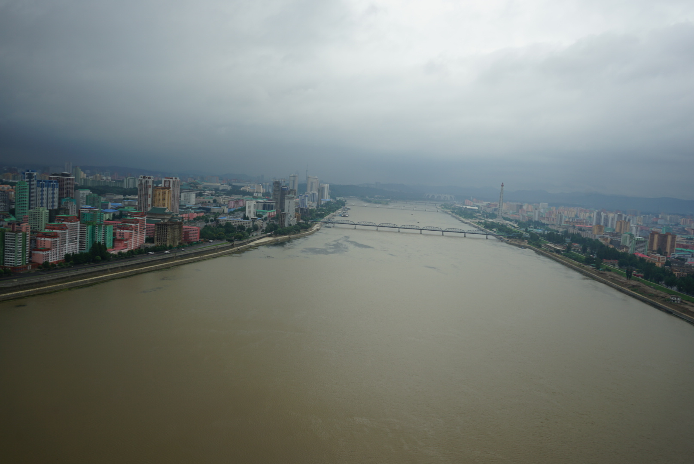

由于镜头不是广角，并且江实在太宽了，所以全景并不好看。来一张一侧的吧，这是左侧的景色，右侧的主要就是彩色的屋子了。

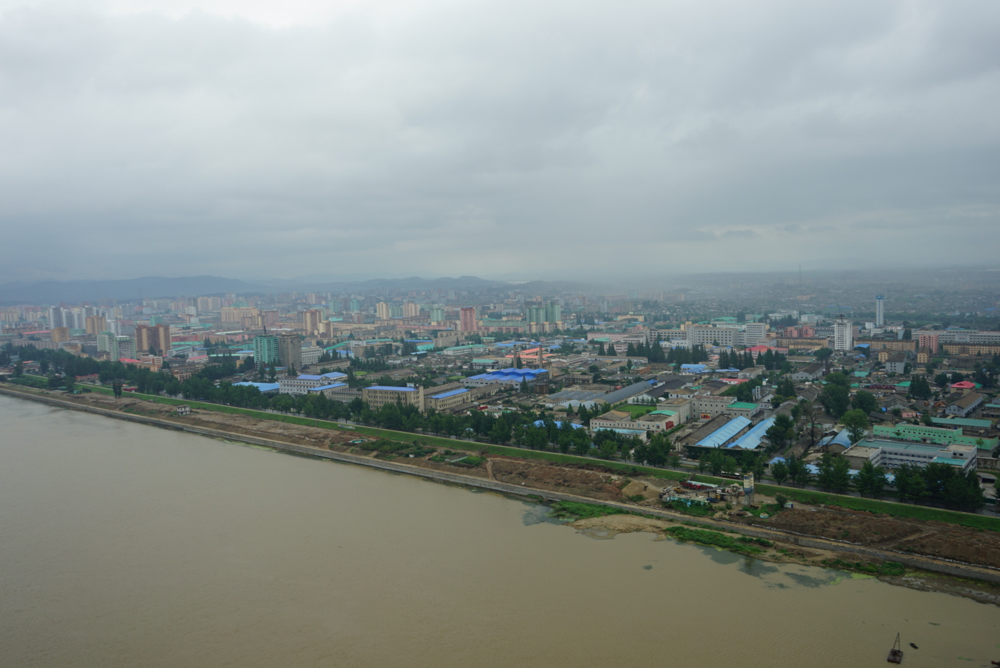

在看一张酒店的底下的照片，酒店确实就在江边的岛上。

好了，吃早饭了。酒店的早饭一般就是自助了，感觉羊角岛酒店的早餐还是不错的。

自选餐台吃的东西还是很多的，觉得他们的泡菜确实好吃，不太咸也不太酸，口感真的不错。

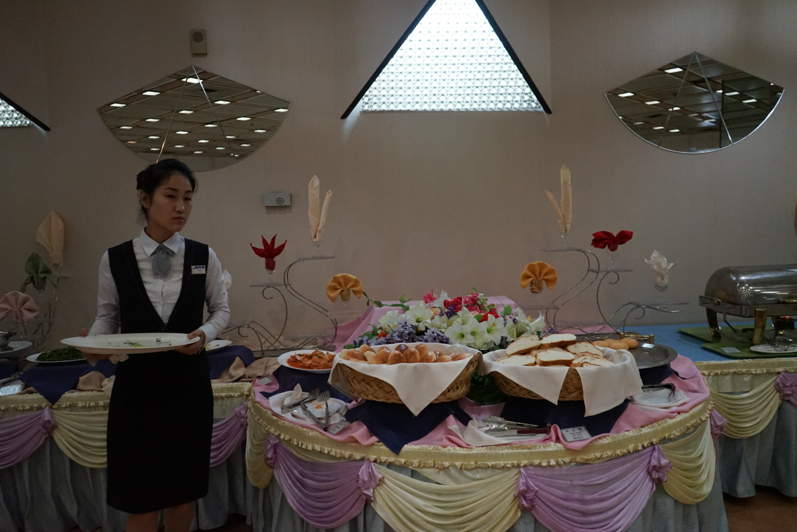

吃完早餐，我们就出去坐班车了。先去西山酒店接住在那边的一对父子。

然后我们就出发了，目的地就是38线附近的板门店，我们要前往军事分界线。在车开了一会儿后，回头看我们住的酒店，还是蛮高的，47层，最顶层是旋转餐厅。高高的大楼，却又显得有些孤独。

在开车的路上，我就随便拍拍，司机开车很猛，这时候我觉得相机的五轴防抖和运动模式终于派上用场了。

青草和穿环卫服的女工：

一个不错的体育馆：

我们路过的街，导游介绍，我记得应该是未来科学家大街，一栋很有特色的楼，但是拍的太糊了：

一路上，发现他们有的居民楼和大楼还是很不错的，与国内一线水平差不多，当然了，那些是少数。

通过一路上的观察，汽车有不少，比亚迪、北汽等占据了很大市场。客车有宇通、丰田、现代等品牌。对于大多数居民而言，出行是自行车，各种各样的都有；也有一些电动车，看牌子都是中国的产品，大多数都比较新，应该是最近才流行的；摩托车数量比较少，一路上很少看到，跟泰国的摩托车王国没法比，应该跟石油禁运有关系，导致汽油供应不足。

骑自行车载物的市民：

骑着崭新的电动车的市民：

骑摩托的男交警：

我不记得朝鲜族有头顶东西的习惯啊，我的印象里非洲的部落有这样的习惯，我觉得扶着东西还好，不扶着还能稳稳当当的，真是需要本事的，也是不容易：

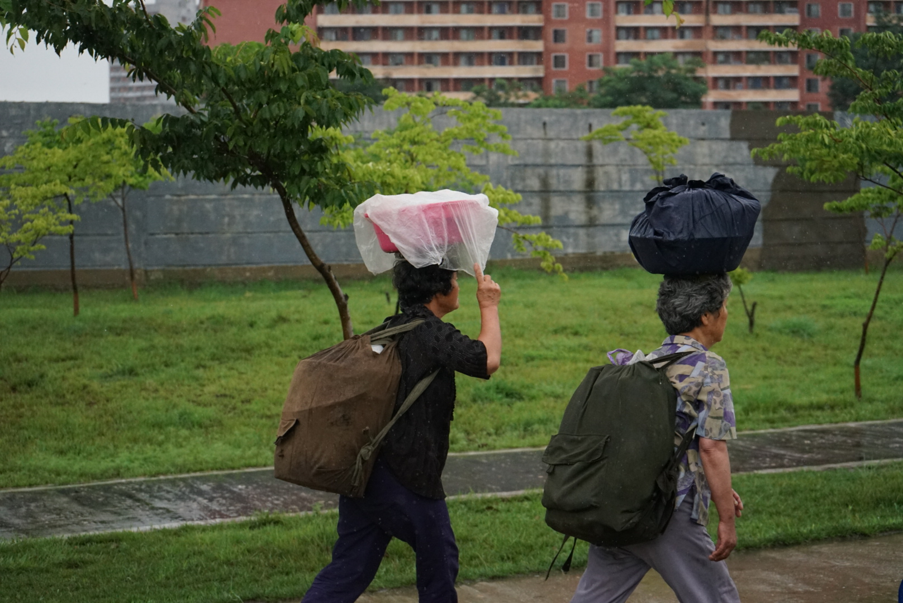

穿着时尚的女青年：

汽车继续往前走，一会儿就到了这个建筑物，这是很出名的，名字我没听清楚，回去网上查查，但我当时在备忘录上快速记下如下几点：

两个女性的姐妹花形象是一模一样的，象征着南北朝鲜是单一制民族；手捧的是祖国统一三大宪章。

在介绍这些的时候，导游是很激动的。讲了很多朝鲜的历史，从谭军朝鲜、古朝鲜、晚朝鲜、后朝鲜开始，降到了高句丽，再到高丽，再到 Korea 这个英文单词的由来，到日本帝国主义的殖民统治，到1945年的南北分裂......说实话，作为大国间的小国，朝鲜的命运确实飘零，朝鲜民族的历史，是复杂而又无奈的，有些命运也是值得同情的。导游提到了不少祖国统一的问题，比如详细的解释了三大宪章，介绍了2000年6月15日，金大中和金正日的促进祖国统一的会晤，提到了南方提出的联合制，北方提出的联邦制。提到了经济合作和均衡发展经济，促进经济文化交流的一系列问题。也提到了2000年9月63名关押在南朝鲜的非转向长期囚得到释放的问题，导游特地介绍了非转向长期囚的意思：就是忠于革命的北朝鲜革命者。

导游讲着讲着，情到深处，停不下来，又讲到了朝鲜的粮食紧缺的问题，又提到了朝鲜为了解决粮食紧缺的问题所采取的措施。我记下了一共5点：

1.进行绿色革命；2.大力推广二熟制；3.遵照主体工作法的要求；4.大力增加山羊和养鱼；5.生产复合微生物肥料，有机肥料，发酵肥料。

导游承认，朝鲜的土地不利于农作物的栽培，但是朝鲜还是努力实行自给自足为主的政策。氮肥国内生产，加肥和磷肥国外进口。到有提到，在社会主义市场瓦解的时候，受制于能源问题，朝鲜甚至都无法开动农业机械。但是导游没有提国际援助的事情，这也可以理解，当着外国人的面提这个总是不光彩的事情。而且“为主”二字并未否认对国外的依赖。但是他提到了粮食都是计划的，由农场和农村合作管理委员会来管理和生产，没人每年260斤口粮，剩余粮食游国家收购。

关于粮食，差不多就介绍到了这里。导游又介绍了朝鲜的男女平等和政府鼓励生育的措施。由于国家和民族传统重视孩子和孕妇，因而第一台大多都是回娘家生。也讲到了生孩子越多越好，生得多的会被授予模范母亲的称号。我们问导游，多少个会被授予呢？导游开玩笑的说：十个更好。不知道这是玩笑话还是真实的。不过联想到我们中国以前也是一家生六七个，感觉10个也不是那么奇怪其实。平壤的妇产医院的地板，铺着价值连城的宝石，作为国家重视生育的象征。平壤的产妇，如果生三胞胎，国家街道平壤的妇产医院，休假住院200天。在民族传统里，如果生的是男孩，会给小孩买弓箭，如果生的是女孩，会给小孩买针线。同时导游提到，现在国家提倡晚婚，希望年轻人能多为国家做事情。

与此同时，我们也隔着车窗拍照，因为下着雨。雨小或者暂停的时候，我们也打开车窗拍照。

我通过对外田野的观察，发现农业可能存在两个问题：1.大面积的土壤是红土，这是不及黑土地的养分的；2.我觉得很多田地的灌溉设施略有问题，沟渠和田地的相对高度太小，几乎平行，没有比较好的水渠，这样很容易被淹。事实也证明了，我看到不少旱地有积水。我从车上看到的是，公路两边都是大片的平原，远处便是山。朝鲜多山地，平原应该是上千年在山间的小平地或者小平原上慢慢开垦出来的，加上这几十年大力垦殖而得来的。

不知道是因为雨季，还是因为红土壤加上开垦过度，河里的水都很黄或者很红，水土流失的问题，中国也是经历过的。

导游讲完了这些，也休息了。一会儿就进入了军事区了，导游提醒我们，军事区严禁拍照。一路上，我们看到了一些士兵站岗，这个自然不敢乱拍，间谍罪可不是闹着玩的。没法拍照，我们基本就开始准备睡觉了。到了大概一半的路程，有一个休息区。

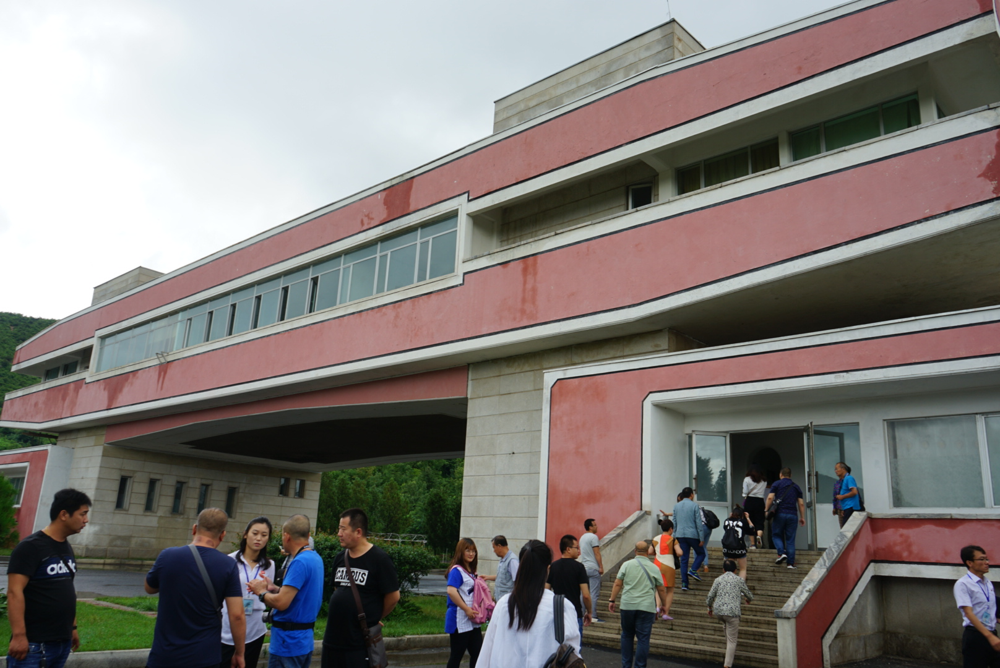

我们下车休息，看看休息区的小商店。我看到卖的梨质量确实不够好，但是个子很大，西瓜的个子却比较小，应该还是品种问题。

在休息区休息的时候，看到了一辆现代的车，这都是朝鲜接送旅行者的车，并不是韩国人的。

上车后，导游开始跟我们讲开城了，接着之前的朝鲜历史继续娓娓道来。也提到了开城工业区，说开城工业区的开发停止了，责任在韩美，但是没有做过多的解释。导游开始介绍开城的一些历史，比如成均馆和高丽参等，还有类似于中国同仁堂的药品安宫：由麝香和牛黄制成。特地提到了朝鲜的这些药品和人参等都是纯天然的，因而药效会更好。高丽参确实很出名，但是我对中药的气血和滋补那一套不太信，因而我到了开城后就买了两包人参糖。而且人参也是在太贵了，一根要2000元，我哪里买得起呢？但是我在路上和团友们还是预定了人参炖鸡，260一只，我们6个人定了2只。这个因为需要炖很久，必须要提前预定。

一会儿，我们就到了板门店了。我们在一个地方下车，导游要等手续，我们就在里面拍照。我在那副画着分界线的图面前拍了张照片。

仔细看图，虚线圆圈的部分，就是我们一会儿将要去的地方，也就是军事分界线。那中间的红色白色房子中所经过的虚线就是了。注意，这个虚线不知直的，它的延长线两遍都是弯曲的。我们可以在朝韩两国国旗中间找到其延伸线，快要跟河流重叠的位置。38线是以前的线，这条线才是现在的军事分界线。

趁着我们还没走，我们拍了拍照。

身着朝鲜传统服装的女售货员。

身着朝鲜传统服装画作中的女性形象。

之前导游有介绍过，我们也看到了，朝鲜女性服装上衣是很短的，只到腋下。而裙子是连衣裙，就很长很大了。这里有很多展示画作，有的让拍照，有的不让。

这种杂志，我们应该都很熟悉。

黎明大街，我觉得确实很好，我们乘车路过了两次，但是没机会好好拍照。

我们来看一下高丽参的模样，看着很好看的人参。

我们逛了一会儿，导游就安排我们坐车过去了，这里上车什么的都要排队，为了维护秩序。导游在车上跟我们讲，在军事分界线的朝方2公里内，还有村庄，村民为了安全，会携带手枪和单发武器。因为距离不远，我们一会儿就到了，我们看下门口的石碑。

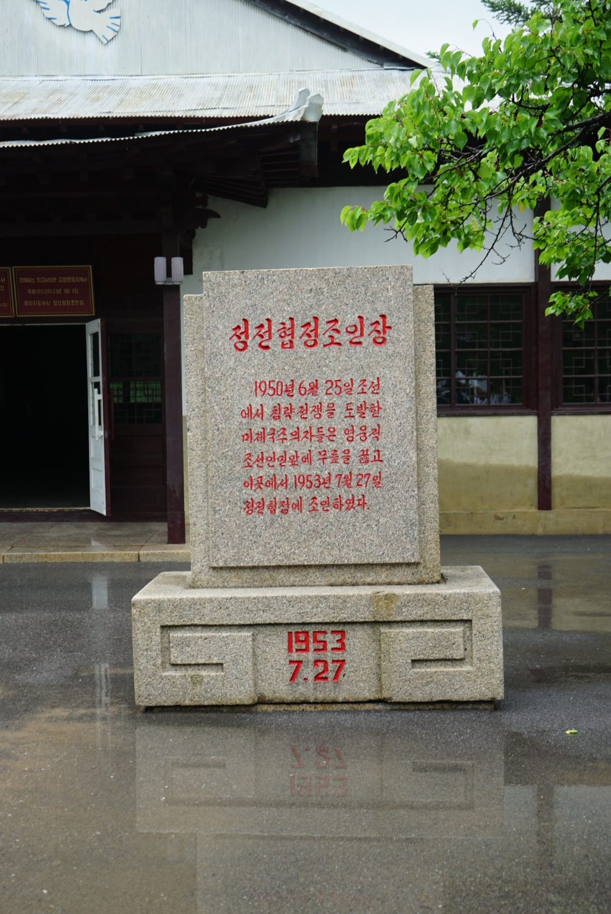

进去之后，军人便进行讲解，由我们的女导游进行翻译，只有在这里，给军人拍照，不会不被允许。我们先看下朝方的旗帜。

看下联合国军的旗帜，也就是美方的，竖着的是复制品，盒子里摆放的是原件。介绍的军人说，美方仓皇而逃，因而还没来得及带走他们的旗帜。

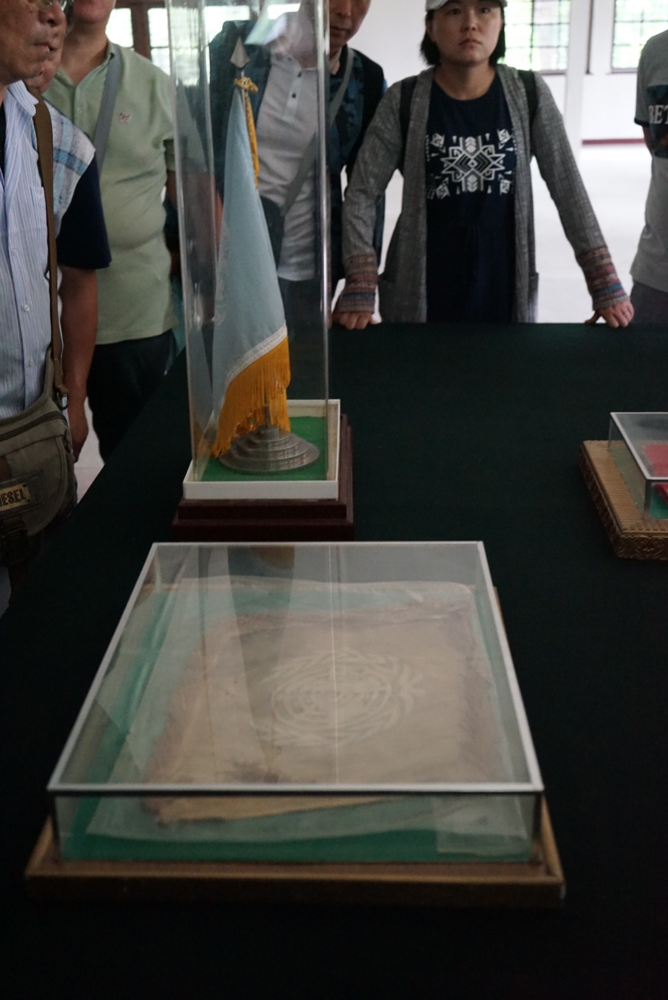

大家在听讲解的时候，都是面目严肃的。作为中国人，是很熟悉这段历史的残忍的。抗美援朝中国作出了很大的牺牲，这一点导游在之前的讲解中也是承认的。

这是签署的停战协议的副本，静静的躺在盒子里，诉说着那段历史。

导游和军人讲解的时候，我们是被允许坐在凳子上拍照的，后来，导游说我坐的那边是美方。啊，我竟然代表了美帝国主义。对了，背后的摄影师，是今天的跟拍摄影师，貌似明天后天还会继续跟拍------我觉得长得特别像我的同事。

当然了，室内房子这么大，当然会陈列很多的照片，我们来看几张。

还有其他各种照片，我就不贴图了，有领导人视察的，有火箭发射的，我们中国人都很熟悉的场景。最后离开之前，我拍了张大厅的小全景图。

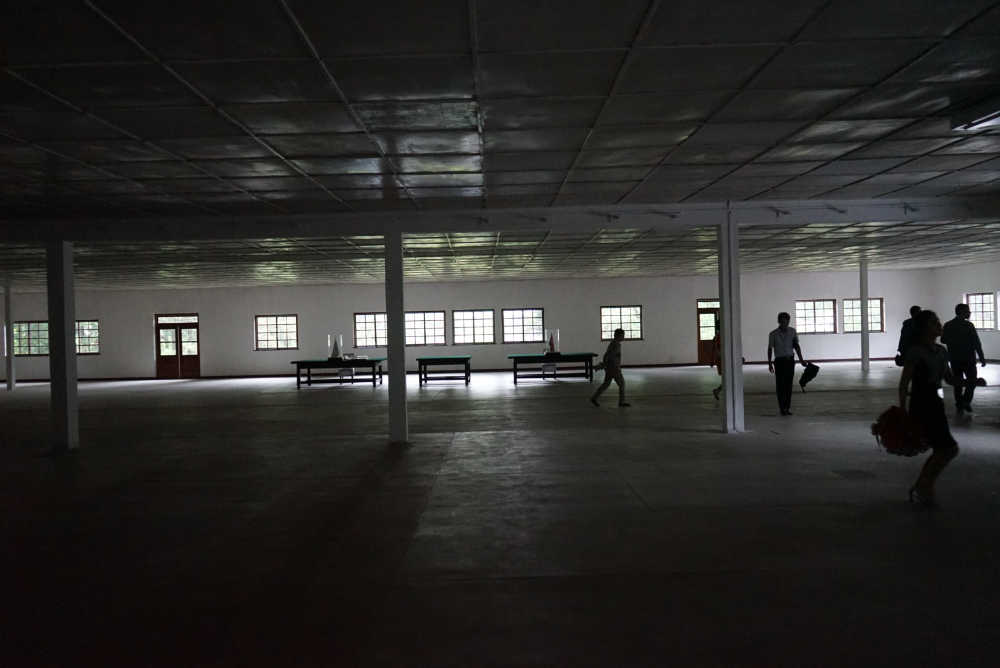

接着，我们就要去军事分界线了。远远的，我们就能望见朝方的国旗了。据说，当初，朝韩双方比拼国旗的高度，最后，朝方赢了。韩国就不继续比下去了。

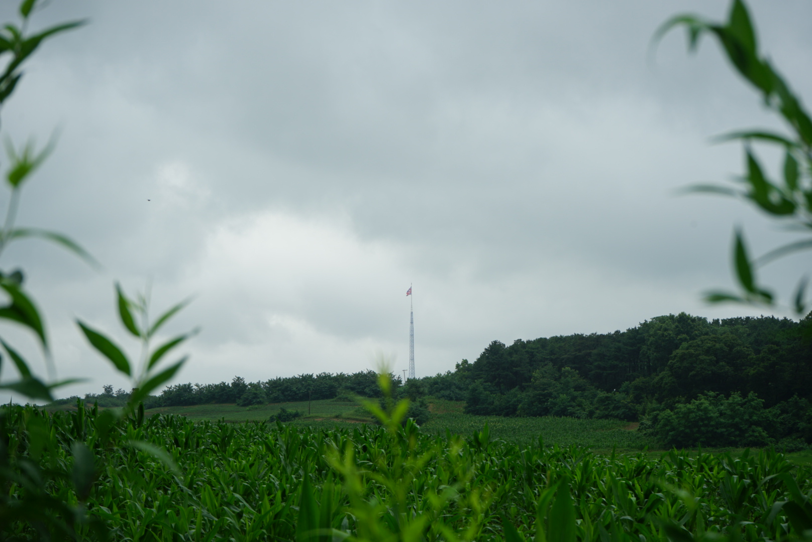

到了之后，就是前面提到的几件小屋子，我拍了好些照片。我选一张全景照吧，朝韩双方的国旗都在一个画面内------如果看不清双方的国旗，那么是显示屏的问题，仔细看的话一定能看到。对面的建筑就是韩国的前哨了，上面挂了很多摄像头。

导游在来的路上，几次说到：军事分界线，几十年来，只有鸟儿可以飞过，人却过不去；开城有很多家庭，有亲人在南朝鲜，他们几十年来面临骨肉分离之苦。这让我想到了我们的台湾海峡，以及那首著名的诗。

哨楼上，我们拍了一张朝方军人的照片。韩方那边是没有看到人的。而且据说他们约定，上午朝方在公共的房子里，下午韩方。公共的房子就是中间那栋，也就是左数第三栋。其他房子的话，蓝色的是韩方，白色的是朝方。我们看到第三栋房子这边有朝方军人站岗。

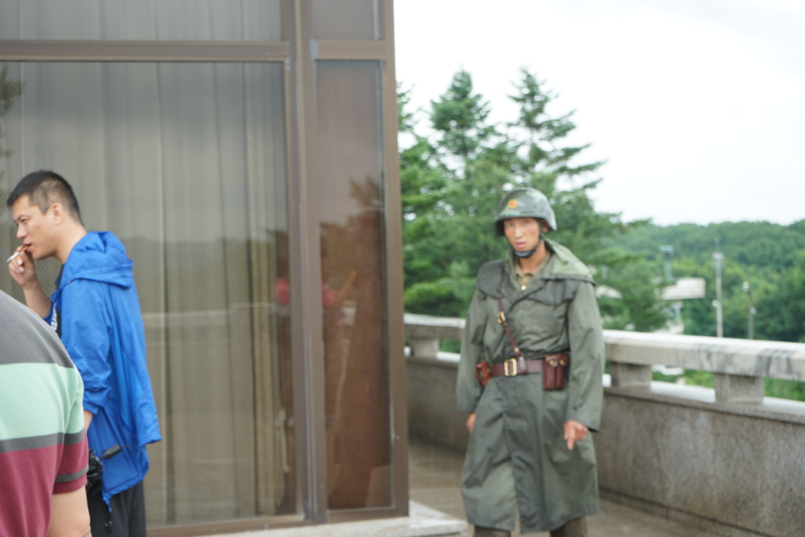

我们也进行了团队合影，这是导游主动要求的，我们用我的相机也拍了一张。

然后，我们去观看了手迹碑，也就是金日成最后的手迹，他看完资料写下这几个字后，没几个小时就去世了，导游说，真是为了祖国统一付出了一切啊。

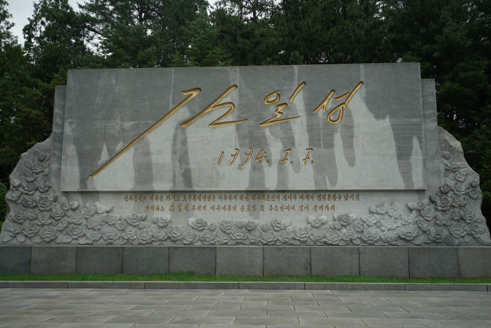

接下来，我们坐车去高丽成均馆，是列入了世界文化遗产名录的。

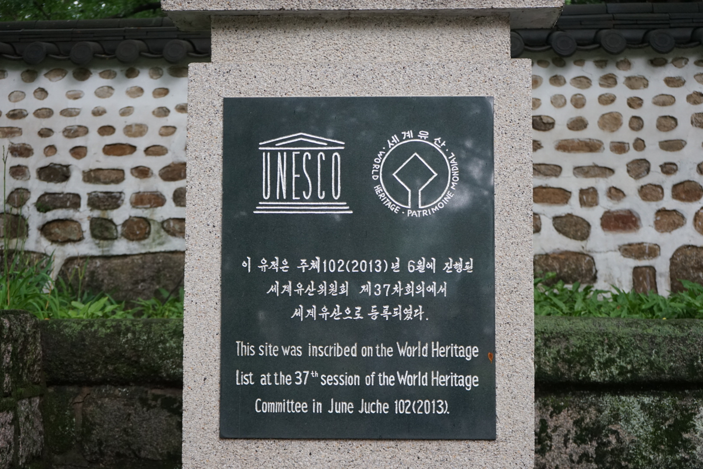

来张石碑的把照片啊。

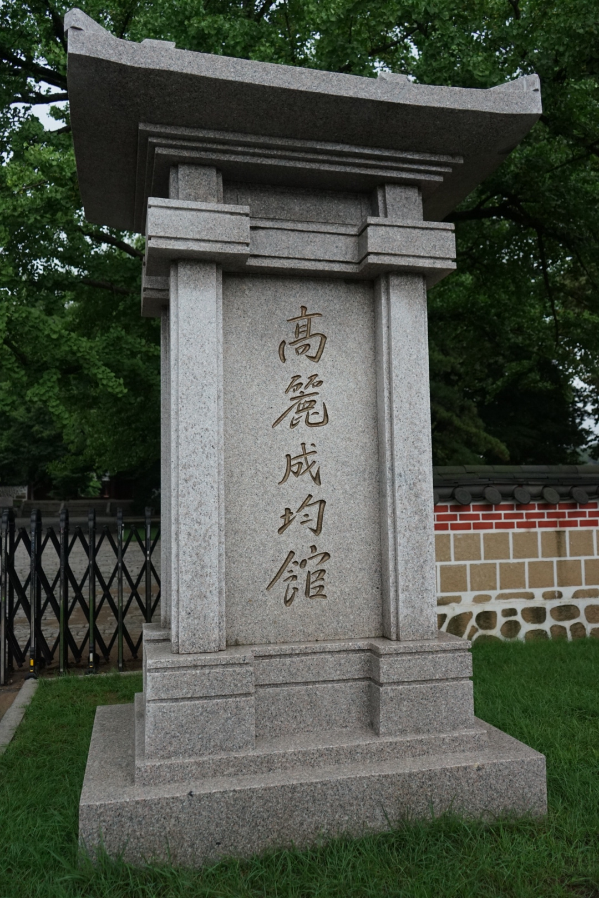

一进门，好大的树，导游介绍说，4个人可能都一定能手拉手环得下。确实很大的，介绍说1000多年了。

馆内展出了很多文物和字画。

逛完了，我寄了两张明信片，还有两张没来得及写，我们就要离开了。离开前拍一朵小花。

我们这次是直接到饭店。我们最期待的就是这一顿了。因为有开城的九铜碗宴和人参鸡。但是还没进门，就让门口的商店吸引了去了，真的很漂亮的小女孩的衣服，以后好想生女儿啊。

上菜的时候，盖子都是盖着的，打开后果断拍照留念。后来有跟我们上了个土豆汤，我没有拍进去。

人参鸡了！你看着很美味的样子！主要就是一只鸡，好几根人参，还有就是糯米！

我盛了一些，特地舀了根人参，来个特写。汤确实特别好喝！我吃了根人参，挺苦的，他们说苦了好，我咋感觉像逗小孩子吃药呢？后来，我又吃了根人参，不知道晚上会不会留鼻血！

因为特别好吃，我们同行的团友给漂亮年轻的女服务员100元小费，她没收。100元对于物价低的他们是蛮多的钱了。一个涉外导游的工资也才700块左右。顺带提一下，今天的一些商店的汇率按照15.625计算的。但是黑市上据说能1元人民币能换1000多朝鲜元，足以见其经济问题，因而商店只用人民币结算，拒绝朝元。

于是，我们好好的吃了顿饭。吃完后，就准备回平壤了，先去了万景台故居，也就是金日成出生和成长的地方------13岁走上了抗日革命的道路。

这时候的天气出奇的好，莫非伟大的领袖金日成同志...先看下全景图。

这口坛子，在朝鲜旅游攻略里能算作是网红了。

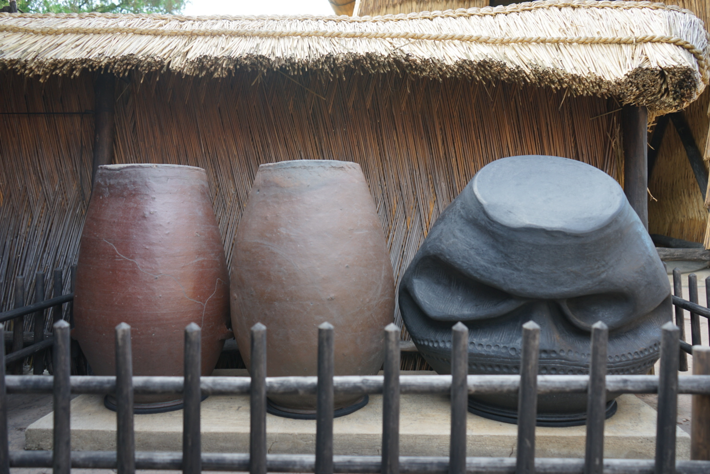

不远处，有一口水井，金日成用过的，我们打了桶水都喝了一口，挺好喝的，想起了小时候家里的井水。

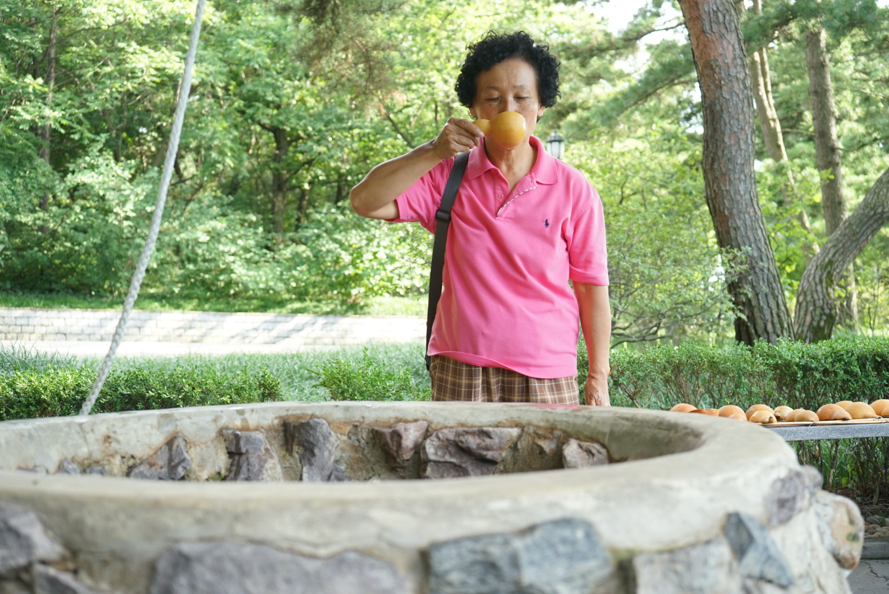

他们的瓢我觉得很好看。拍了一张照片。

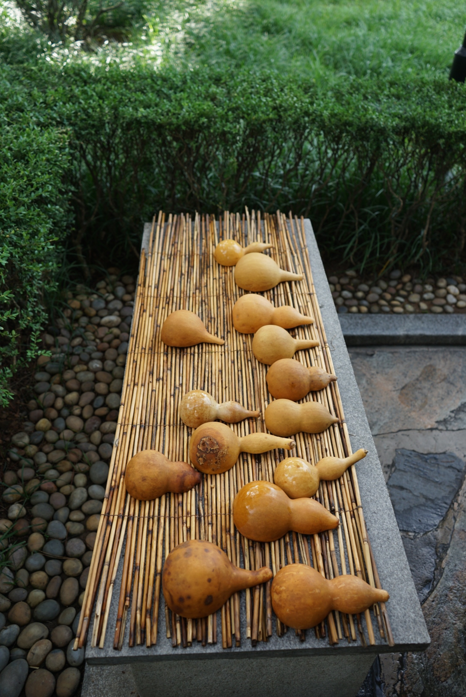

然后，我们就走了，去今天非常期待的另外的一个景点，平壤地铁，深入地下100多米的地铁。

首先，感受就是深不见底。如图：

看一眼站内全景，有些像北京地铁1号线的感觉。

看一眼萌萌哒车头，还是蛮可爱的，就是款型确实老旧一些，但是油漆刷的很新，很亮。

金主席的主壁画特写。

侧面壁画特写。

读报栏和读报的市民特写。

我们帅气的男导游，露个脸。

我和平壤地铁的合影。

我们做的地铁只有一站路，从某个始发站山车，下一站下车。然后我们坐车去了一个邮票博物馆。坐车途中，我们想好好拍一张女交警的照片，但是未能如愿，唯一的一张正面的很近的，结果，照片由于对焦没对上，模糊了，啥都看不见。来张远点的凑合一下先。

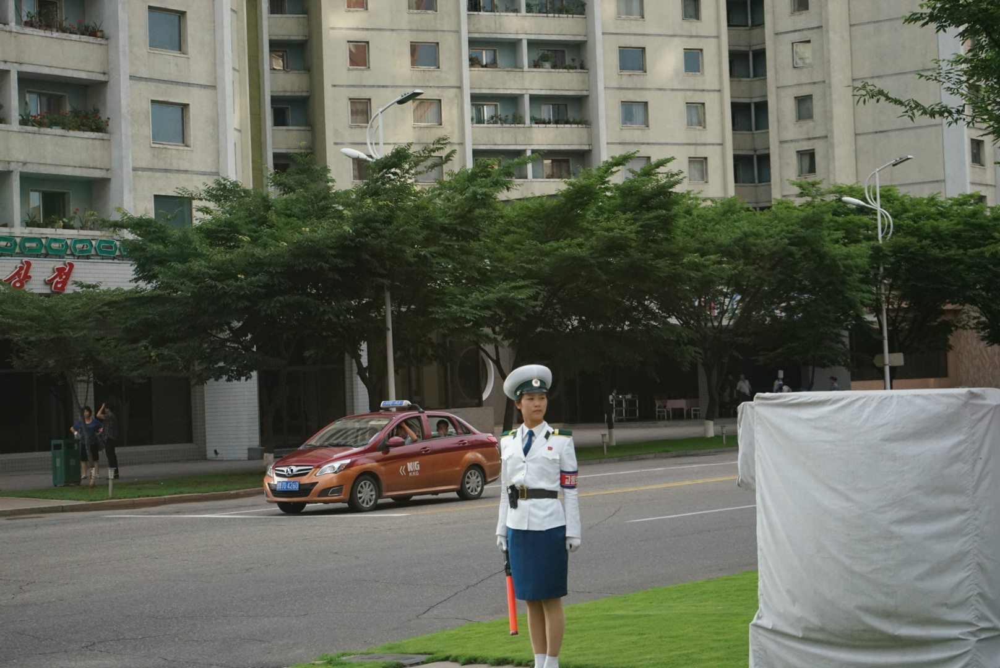

导游今天跟我们解释说，为什么平壤女交警多呢？因为开车的男的多，男的喜欢看女的，更喜欢看美女。看到美丽的女交警，就会减少车祸和事故。我觉得这个理由很合理。

邮票博物馆就是各种邮票了。有两位对邮票不感兴趣，想去大街走走不上去邮票博物馆，被导游拒绝了。展现几张邮票和明信片的照片吧，这里的邮票和明信片，又红又专的比较多，在成均馆的时候，还有那种很文艺的瓷器的明信片的。

首先，先贴出伟大的人民领袖金日成和金正日的纪念邮票。

一举粉碎美帝国主义。

来一张文艺一点的。
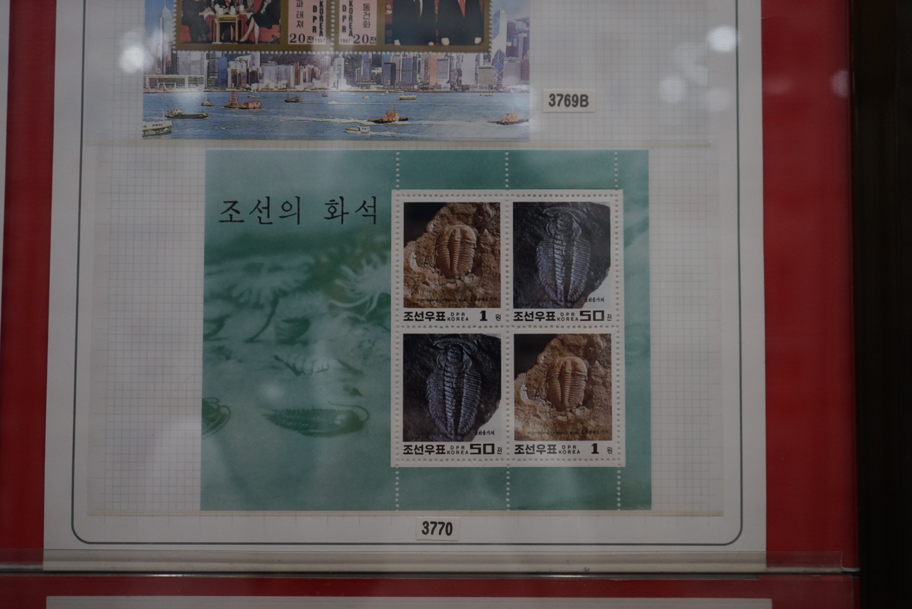

中朝友谊源远流长。
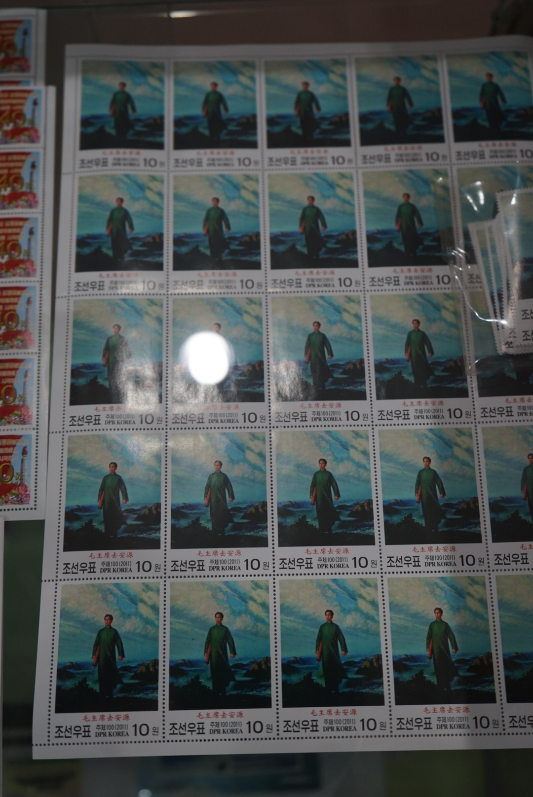

先军朝鲜。

朝鲜的足球不错，中国的足球没希望啊。

看不懂文字，也没有问导游，也没得网络来查。看着像是搂着炸药包去炸碉堡，想起了董存瑞。

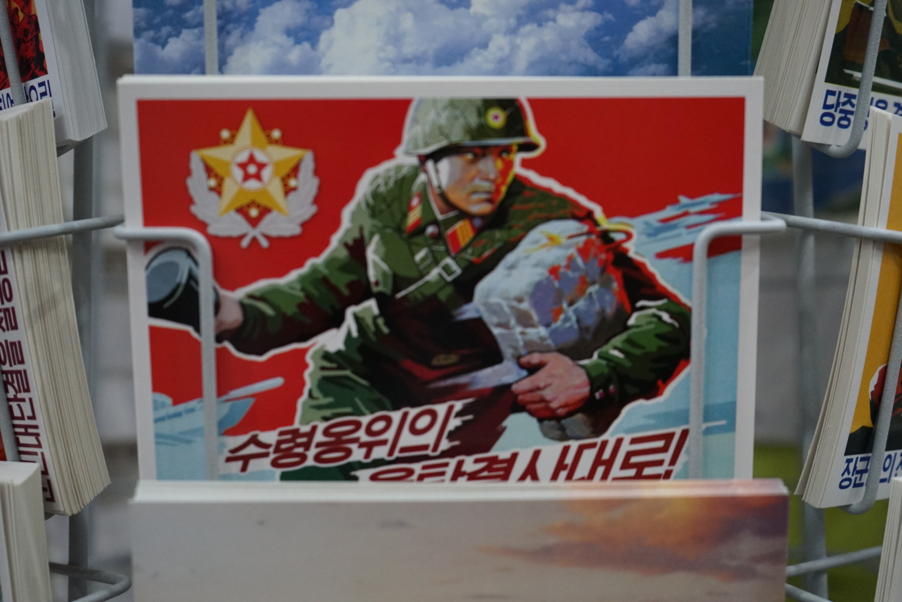

这几张差不多了，我没买邮票。但是我买了个纪念胸章，中间的小旗子的那款。

逛完了邮票博物馆，就又到了晚饭时间了。这一次是，朝鲜冷面。

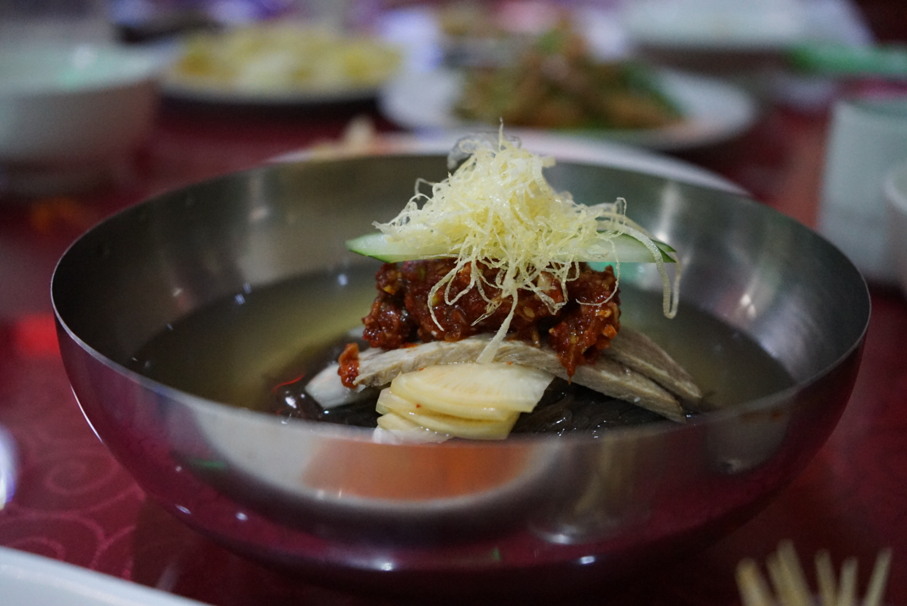

关于朝鲜冷面，今天导游在讲生孩子和结婚的时候说到：在朝鲜，吃冷面是结婚必备，因而，如果问别人什么时候结婚，就一般问，什么时候吃他的冷面？挺有文化的问法。

完善的饭菜也还挺好，牛肉，鸡肉，饺子，泡菜，白菜，米酒，啤酒，肉卷，土豆粉，还有啥来着？还有鲶鱼豆腐汤。差多了就这些？对了，还有豆沙包子。照片只显示了一部分，因为后面上菜的时候前面的已经吃的差不多了，就没再拍了。

话说泡菜实在好吃，我们又要了一盘，10元。我们吃饭喝酒喝了好久，今天我喝的米酒。朝鲜的米酒有一种把我们老家孝感米酒打碎了感觉，我们是一粒粒的大米粒，他们的是碎的白色的糊状物，比酸奶要粗很多，也稀一些，但是口味跟我们孝感米酒很像，酒精度应该是略高，我杯子里就是。后来我喝完后，他们又要我陪他们喝酒，那就再来一大杯啤酒了，第一杯无论什么饮品免费，另加了一大杯5元钱，小杯子的话是2元钱。

我们喝酒吃饭吃了好久，吃完了天已经黑了，于是我们回酒店。回去后我们一起去底层的娱乐场和顶层的旋转餐厅看了看，没啥好看的。娱乐场就是打保龄球的馆，健身的跑步机，还有台球，乒乓球，还有理发店，还有商店，还有啥来着，修鞋子的店，应该是专门为女士高跟鞋服务的，对了，还有 SPA 和 Massage，想起来在泰国为我做马杀鸡的那位年轻漂亮的小姑娘了。也没啥人，顶楼的旋转餐厅更没啥人了，啤酒一瓶30元人民币，我们觉得有点儿贵，加上也没法再喝了，就下去了。

我室友回来就睡，我洗完澡写游记写到现在，现在是3点了凌晨。我想了想，我这贴的照片太多了，我得隐藏起来。决定用 git来隐藏，建立个新分支，切换一下，删掉就好了。这两天和回去后，且分支且回去即可，他们不可能会操作 git, 也就不可能会找到我写的东西------真是个很棒的注意。

搞一下，睡了，期待明天去妙香山。
