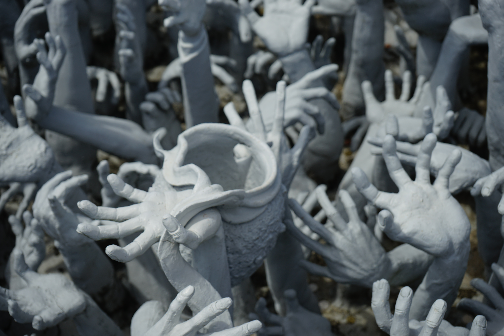
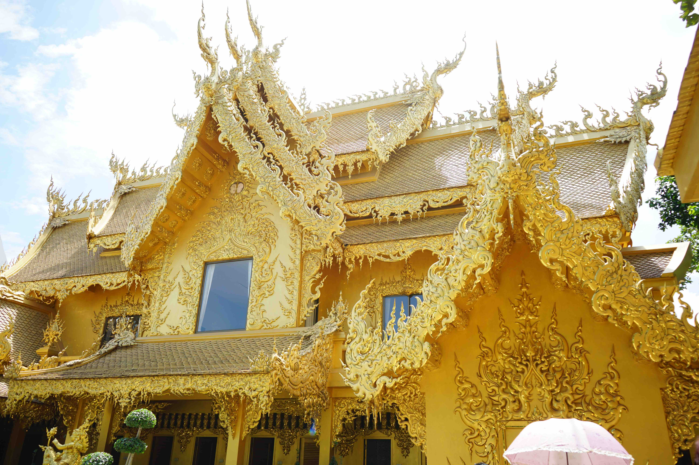
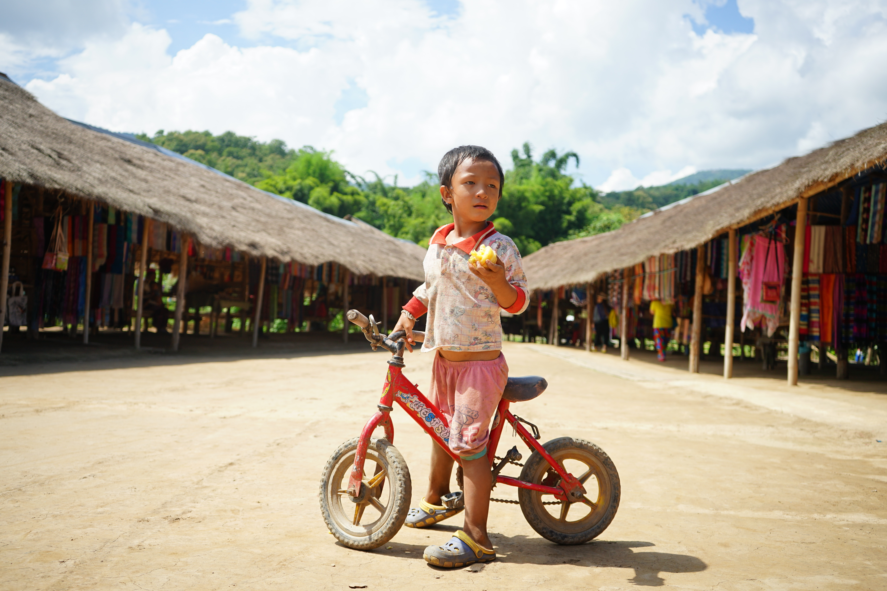
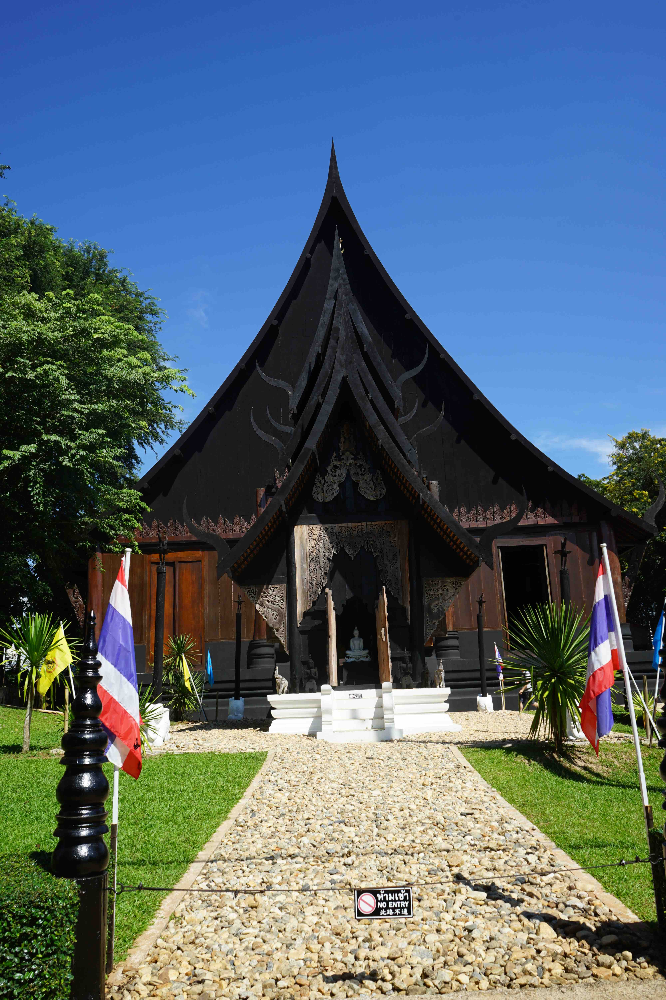
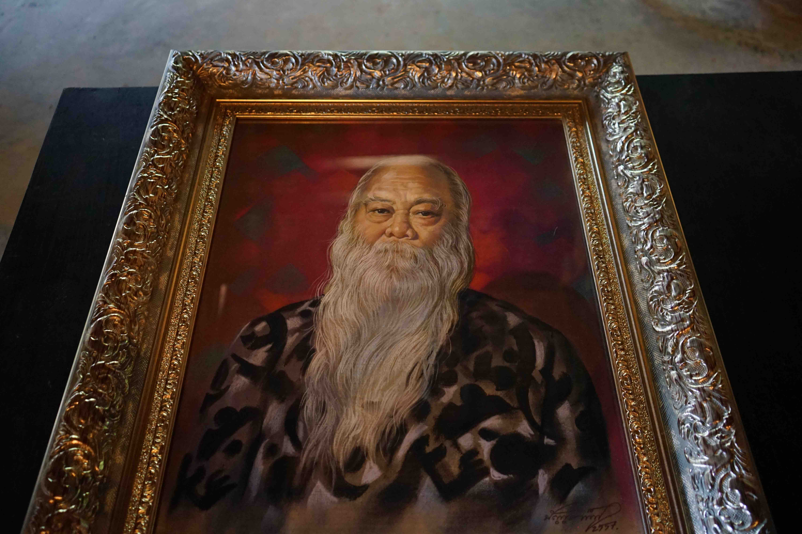

为什么说怀疑到了天堂呢？我觉得这张照片最能说明了：

<!--more-->

这些年，还是去过不少地方的。然而并没有把这些旅行记录整理好，去很多地方也没有发朋友圈什么的。不方便日后回顾，也是一个遗憾的事情。所以想着有空的话，就好好整理一下过去的旅行与户外，放在自己的个人网站上。只是不是当时所记，很多经历都已经忘记了。

清莱离清迈不远，我们是找的旅行团坐公交去的。白庙是第一站，接下来是黑庙，长颈村。中间还有温泉什么的，就没什么可说的了。

白庙真的很漂亮。在泰国，庙见多了，真的是没有感觉了------清一色的金碧辉煌，不看也罢。然而白庙，则确实让人惊叹。

上图是近照，来一张稍微全景一些的照片：

关于白庙的建筑的历史和一些故事------是一位知名建筑设计师的作品，网上可以看得到。

在上面照片的右边，是一座桥，我们经过这座桥，就可以进去白庙里面了。印象深刻的是，在桥的两旁的底下，有这样的雕塑，我觉得特别有感觉------象征着救赎和挣扎的双手。

白庙旁边有个黄金厕所，真的是让人很是吃惊。

我觉得白庙主要就是外观，进去了倒是什么都没有。既然这么好看的庙，不信教的我也来许个愿。

接下来我们去了长颈村，以前是一个长颈族的部落，现在留下了一小部分来招揽游客。关于长颈村的故事，可以网上搜得到。当地的女性以长脖子为美，在脖子上套铜环来拔长脖子。

一进村口，就有个非常漂亮的女孩坐在亭子里织作，我给她拍了张照片。

脖子上的铜环，就是为了拔高脖子用的。随着泰国的现代化，我怀疑她这个是临时的，因为很多人已经放弃了这样的习俗。这么漂亮的妹子放在门口的位置很明显就是招揽生意的------这很好理解，长得好看就可以多卖小手艺品了。

之所以这么说，是因为他的脖子并不明显，而那些老人的脖子，则是相当明显了，被一层层的铜环把脖子和肩膀撑得老远了。看上去真的很震撼，也很复杂的心情。这样的审美，在我的眼里就是压迫。统治者、既得利益者、商人，他们都善于制造文化，来压迫和剥削别人，或者寻找某种内心的满足。所以我对于审美、文化、道德、信仰一类的东西，拥有坚定的自主决定权------美不美、有没有文化、道德不道德，我说了算，别人，说了不算------自己的精神世界，需要完全掌控在自己手里。

因而我写了一首诗《美与信仰》，来讽刺这些，这首小诗见本网站。

作为一向不好色的我，当然是买老人的手艺品来支持她了------因为我相信更多的人会买那个年轻的小姑娘的。我买了一个书签，书签是这个老人自己的形象，回国后我送人了。

在这里，我拍到了几张自己很喜欢的照片，这些照片都没有修过，我觉得摄影不是设计，应该努力记录本真的瞬间------在一个熊猫都可以 PS 成美女的科技时代，难道不应该多一点真诚少一点套路么？我说的熊猫不是讽刺，有兴趣的可以去网上搜搜大神的教程，功夫熊猫的动画形象一步步变成大美女。

这个菠萝是我送给他的。我在来的路上买的，很有特色的小菠萝，很甜，所以我吃到只剩一个了。如果多买了几个的话，我还可以送给后面的小姑娘呢。我很喜欢这张照片，我从这个小男孩的眼神里看到了坚毅和勇敢，后面的背景也很好。

这就是我说的小姑娘，真的我觉得特别好看，同行的小伙伴也这么觉得。

黑庙我感觉相对来说没有什么意思，是一个相当于私人博物馆的木质庙宇。

这些动物的头骨，看着还是蛮吓人的。

这幅画像是黑庙的主人，貌似已经过世了。

真正的鳄鱼皮，一整张，有种阴森的感觉。

看来哪里的人都喜欢钱啊，竟然让蟒蛇的嘴含着钱。

更多的动物骨头，好多好多。凳子什么都是用角制成的，椅子垫用的是动物毛皮。

我觉得我们人类用动物的毛皮和吃肉其实挺残忍的。我一直有吃素的想法，但是一来营养可能出问题，二来真的很难做到不吃肉------太好吃了。因而未来我将尝试削减肉类食物在我饮食中的比重，不吃做不到，少吃点还是没问题的。我也会削减甚至慢慢杜绝使用动物皮毛用品，目前主要是鞋子，钱包，皮带等有牛皮的。

### 注：此游记根据照片和回忆整理
