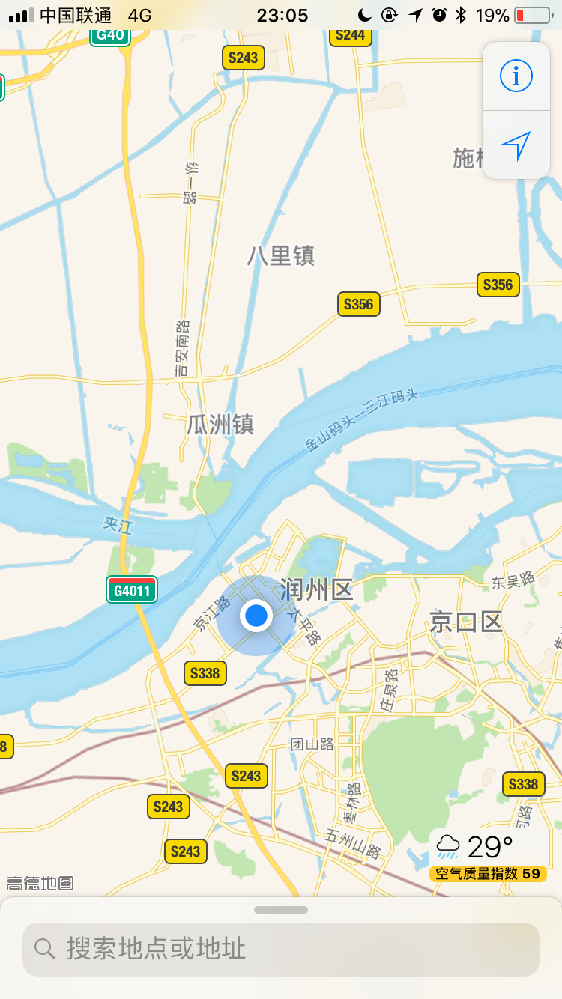

1.京口瓜洲一水间。

2.对中医的简要批判。

3.送你一轮故乡的弯月。

4.快捷酒店的一些现象。

<!--more-->

### 第一句话

这两天比较惨。我是来扬州考试的，然而，这一路却并不顺。

在镇江下了火车之后，我打了个出租来扬州，因为距离比较远，加上火车站拼车很正常，我就拼了一个。

结果，出乎我的意料。

因为要过江，司机直接把我们拉到汽渡了，我们深更半夜等汽渡排队了一两个小时。如果我们早先知道汽渡要等这么久，肯定不让司机走汽渡了：汽渡过路费15元，大桥30元。可是司机都没有和我们说，为了省钱直接默认汽渡了。我们等这么久，时间也是钱啊------平时我对一件事的时间成本估计大概是按照一分钟一元钱算的。

于是，等我到了酒店，就很晚了。等我洗刷完毕睡觉，都夜里两点了。晚到还好，但是在高铁上，我被空调吹感冒了，然后我就成病号了。第一天考试的时候，头痛、流鼻涕、精神恍惚------然后考试不出意外的挂了。

那一晚在车上，我打开手机看了下地图，然后想起了一句诗：京口瓜洲一水间。

然后，我写了这个：

也算作诗一首？

### 第二句话

源于和朋友的一场中西医的讨论。我对中医的观点很简单：我认为中医属于一种经验主义，因而某种范围、某种程度是有效的，但是其理论我是不认同的。

这个怎么解释呢？我举个小例子，假设某一例药有效果，神农尝百草之后觉得它有效了，被后人用了也有效了，那中医就认为它有效，并作为一个方子传承下来。但是为什么有效呢？古人怎么可能知道，他们没有先进的仪器、科学的实验，那就创造出一套理论，只要能解释的看起来有道理。而这套医学理论，用我们现在的科学观点来看的话，其实就是个黑盒子。

而现代医学显然不是这样的。药物的有效成分、病理毒理、实验的设计等等，都是明确的、可证的、可预期的、可复现的。举个小例子，我今天买的药，叫做“利巴韦林气雾剂”。病理毒理这一栏：本品为广谱抗病毒药，其作用机理主要是通过对次黄嘌呤核苷脱氢酶的抑制，阻断次黄嘌呤核苷---磷酸相黄嘌呤苷---磷酸的转化等作用，抑制核算合成，阻止病毒复制。

这不属于理论，这是实验证实的事实，这就是药物疗效的原理。他是正确的，经得住检验的。

为了对比，我上网随便找了个中药的方子:"补中益气汤"，详见参考资料。方解的第一句：“本方证系脾胃气虚、清阳下陷所致”，这种类似于玄学的所谓中医理论，就是一个黑箱，与我们现代的科学知识，可以说格格不入。

我最见不得有人说，中医和科学不是一套系统，不能用科学来解释。

##### 五四运动过去了马上一百年了，一百年来对科学和民主的呼唤，还没唤醒民众。

不用科学解释，用中医那一套自圆其说的理论？

我与朋友的争论点主要就是在其理论合法性上，我反对，我朋友支持。我的意见很明确：有效的理论需要科学的解释，而不是所谓与科学不是一套体系的另一套自洽的理论来解释。

这并不是对科学的盲目崇拜、也不是对中医的批判就是崇洋媚外。

对中医理论合法性的问题的意见不一致，归根到底是基本世界观的不一致：这是经验主义与实验主义，主观与客观，感性与理性。

但是，不仅我不信中医理论、所谓打假斗士方舟子也批判中医、鲁迅也批判中医，这是大家都知道的。

大家可能不知道，在民国初期，一位在日本学习现代医学的年轻人，对中医了解极其深入的医生，后来做到了中国医药研究所所长的主张废除中医的第一人------余云岫，主导了一场轰轰烈烈的“废医存药”的运动，甚至提交了一份废除中医的议案：《废止旧医以扫除医事卫生障碍案》。

但是任何时候，动别人奶酪，都是很困难的，这份议案遭到了强烈抵制，请看参考资料《废止中医派的领袖------余云岫其人其事》。而这些人的抵制，真的只是在维护医学吗？不见得，全国药商和大夫的经济利益，加上民族传统的帽子压力，可是力量很庞大的。

话说回来，在我眼里，所谓西医，就是现代医学------也就是利用现代科学技术的医学，而不是西方的医学。古老的西医，跟中国的中医其实都很相像的：比如“四体液学说”，与中医的“阴阳五行”很相似，也强调辩证治疗、个体的特殊性、甚至强调心理健康。而到了十七世纪，这种旧的医学体系遭到了猛烈的抨击，因为这被认为是没有任何物质基础的空洞理论；随后传统西医遭到了摈弃，进而由经验医学向实验医学发展，形成了现代医学，也就是我们今天说的西医。

而我们的中医理论，又是与过去的西医何其的相似，可是却有人以中华文化来坚守、以不同于科学体系来辩解；也有人抱着千年前的古医书冥顽不化；当然，更有人，只是通过中医来攫取利益罢了。当然也有个国家，就是日本，倒是比较开明。在1895年初，日本议会以105票对78票否决了汉医学界提出的《医师执照规则修改法案》，换言之，公元六世纪由中国传入日本的“中医”，在日本终结了。请参考文末参考资料。

感谢互联网，让我们获取信息的成本大幅度降低了------从即时消息、咨询八卦到专业知识。想要稍微了解下医学的某个角度，百度学术、谷歌学术搜几篇论文看看。自己的了解有限，看下别人研究多年的人怎么写的，不就能有个更好的认识了么。当然了，哪怕是专业论文，也不一定能完全相信，有的论文也是水的很的，并且看的时候可以差异化，“兼听则明”。一些其他的科普文章也是可以看看，正确与否，其评论的理性与否，也是需要自行判断。虽然一个人读文章的时候会受到影响，但是应该努力保持中立。当然了，医学的水深得很，普通人只能是门外汉了，但是门外汉也可以了解和判断不是吗？

《中医、不无危害》这是果壳上的一篇网文，体现了一个外国非专业人士对中医的一些个人看法，可部分参考一些其中的观点。

我和朋友的辩论里，他提到了西医无法治疗“类风湿”的问题，我回来找了下论文，在文末参考链接里《类风湿关节炎的诊断和治疗进展》那一篇，对目前的类风湿的研究进展有基本的论述。

《阴阳五行学说与四行体液学说宏观框架体系的比较研究》这一篇论文，我个人认为意义不大，但是可以用来了解下中西医的基本理论基础，这样批判起来也有理有据了不是吗？

《西医院校中医学教学现状与思考》这篇论文里，作者提到，连医学院的学生都不信中医了，转而让学生关注中医的人文底蕴？是在逗我吗？医学不是文学，是拿来治病的，不是拿来关怀世界的。

《世界制药工业动态》这份资料，粗略展示了制药产业的市场规模。所以，医药背后也是有经济利益的，中药更甚。

《关于中医的点点点：作为一个中医科研人员的一些感想》这篇文章的作者是中医的科研人员，讲了一些对中医的看法。

后面的几篇论文，都是关于余云岫的，文章的观点不一，可以自行把握。

《日本废除汉医对中国近代医学的影响》这篇文章主要论述了日本废除中医和发展西医的问题。

《26种中药注射剂被限用 行业洗牌将加速》，这篇新闻的故事并不新鲜。对中药注射剂的批判，或许在它诞生的那一天，就没有停止过。2005-2006年，全国多地发生了使用鱼腥草注射剂后患者死亡的事件。经调查确认，患者的严重不良反应以及死亡与含鱼腥草或新鱼腥草素纳的注射剂存在较明确的关联性，因此叫停了包括鱼腥草注射剂在内的7种注射剂。

当然，发生过医疗事故的药品有很多，甚至有些责任并不在药品本身，因而并不能因此反驳中医。但是，中药注射剂算是个怪胎，也是解放后的产物，其后利益盘根错节，它很有代表性。因为中医、中药被作为中华民族的文化载体和政治正确，被给予了太多非正常关照，甚至连中国国家食品药品监督管理局都对各种古方网开一面，不然绝大多数中成药根本不会出现在药店里------一个明显的例子，至今为止，没有一种中药通过了美国 FDA 的审核。复方丹参滴丸现在临床试验貌似就要结束了，如果通过了，可能就能在美国销售了。不过，此时已经算不上中药了。

对了，很多我们认为的中药材，在美国 FDA 的管理中，都不属于医药的，完全无疗效的，属于食品，被当做食品来监督和管理。

说到这里，想多说点，为什么呢？

如果有机会去现代化的药厂厂房参观下，就会知道每一个药片、每一粒胶囊，都是在怎样的洁净条件下生产的，甚至对每一片厂房区域的微生物数量都做了详细规定。我们的中医，也就是传统的医学，给你一把叶子一把枝丫一把片片的，用现在的理念来看，基本卫生能否过关都不好说------而那就是我们的中医最原始、最纯正的样子。而现在的很多所谓中成药，打着中药的幌子罢了，不然怎么安抚中医粉、怎么为中国的传统医学做贡献呢？

而这就是中医的另一个悖论：

##### 按照现代医学来研究、生产和验证的药物，已经不能算作中药了。比如屠呦呦发现的青蒿素，跟中医中药关系并不大。

有中医粉会说，青蒿素也是从青蒿提取出来的。是的，不光青蒿素，所有的西药，也就是现代药品，基本都是提取或者合成的。青蒿素跟中药没有关系，跟中医的医学理论更是八竿子打不着；跟传统的中医手段也是没任何联系。

如果非要说有关系，就是青蒿素的灵感是从东晋葛洪《肘后备急方》中得来的。

而这就是我所认为的：中医属于一种经验主义，因而某种范围、某种程度是有效的。

人类是聪慧的动物，千万年的自然进化，让我们作出了选择。什么能吃，什么不能吃；什么吃了会有好处，什么吃了会没有好处；吃了有的东西会死人，吃了有的东西能治疗一些疾病------这或许是中医甚至全世界的药物学最基本的源头了。因而，在这样的一种经验里，某些中药有效，是很正常的；当然了，没有效果更正常。

通过屠呦呦的研究成果，我们明白，治疗疟疾的有效成分为青蒿素，东晋时代的葛洪并不知道，也无法提取。因而记录了“青蒿一握，以水二升渍，绞取汁，尽服之”这样的医学记载------其实，中医错误的煎熬方式，导致其药用价值殆尽------高温会破坏青蒿素分子结构；甚至可以说，青蒿素的发现是中医的奇耻大辱------一千多年前，在先祖们的实践中，就认识到了青蒿可能存在的治疗疟疾的药用价值，但是无能的中医从没好好利用它------当然，历史的局限性和科技手段欠缺的原因也是避不开的。

从我们今天的角度看，青蒿对疟疾有效，完全是因为有效成分青蒿素，而不是整株青蒿------整株青蒿的成分比青蒿素复杂多了，在现代医学里，药物是不允许包含成分不明效果不明的物质的。青蒿素之所以有疗效，不是因为“清虚热，除骨蒸，解暑热，截疟，退黄”，而是屠呦呦在第191次实验中，观察到了青蒿提取物对疟疾原虫的抑制率达到了100%！

是疟疾原虫，不是什么虚热；是疟疾原虫被抑制了，不是虚热被清除了。

所以，为什么科技时代，还有人信中医那一套理论，我真的很难明白------某种程度上，那跟封建迷信没多大差别。

那么中医一无是处吗？不是的，因为中医理论不科学，所以中医未来必将没落------中医的对手不是西方哪个国家的医学，而是整个现代医学体系：化学、生物学、细胞学、解剖学等等------当然了，国家有意的扶持会延缓其进程；但是因为是经验主义，对其中的有效的药物，进行科学的研究和验证，运气好还能像屠呦呦一样在古书里捡个宝------这就是现代医学做的事情了，跟中医理论无关了吧。

不知道当时，余云岫提出“废医存药”的主张的时候，他是不是这么想的。

我朋友批评我对中医的看法偏激，很偏激吗？错了就是错了，对的就是对的，立场不模糊。要是能说的我心服口服，我用得着费那么大劲去批判中医么？

中医那一套理论，在现代的科学时代，真的是站不住脚。在以前，基于经验主义的疗效，自圆其说的理论是能解释通的，就像一个基于统计的概率事件：我们不知道为什么抛硬币他们正反面概率都是0.5，但是据我的经验，他们的概率就是0.5，要理论？这理论可不好研究证明。中药，前人经验告诉我有疗效就可以了，要理论？要的话给你编一套。而现代医学，则解决了医药的理论问题，那么中医那一套还不下台，留着唱戏吗？

科学不是一种信仰，科学也不完美，但是，请相信科学的力量。

中医就是传统而落后的医学，过去基于经验主义的疗效，确实是有巨大的医疗作用的，在现在有些药方也很有效；但是时代变了，迎接新的时代吧。中医没落了没什么大不了的，日本早就废除了。

等中医完全没落后，那些奋斗在中医的第一线的研究者们，或许只是称谓中去掉了“中医”的中字而已，他们的研究领域将是：医学。

今天我跟我一个学习了6年的中医的朋友聊了聊，因为他是中医学者，利益相关方，所以我态度很谨慎。

但是从他的言语间，反应了这么几点：

1.相信中药的作用------最起码他经手过的中药，这个我也认可；

2.对中医和科技的态度略微模糊------声称中医是科学的，可是又无法否认很大部分无法接受科学的检验；

3.对经络学说等一些我认为比较虚的东西，他认为只是西医或者现代科技没法验证而已，但有效------这点我真不认同，现代科技毕竟已经能深入到分子原子层面了。

4.对中医的发展现状和未来态度持悲观态度------中西医医院数量、药品比例等等，确实也是这样子。

最后想说一句：真正的医学，不分国界地域，医药治病、医生救死扶伤，是为人民福祉，值得尊敬。

### 第三句话

玲姐远在伦敦，家乡是扬州的。我来考试的时候，她告诉我，扬州这个美丽的城市还是很值的逛逛的。那当然，扬州历史上很有名的地方呢，我有去瘦西湖逛过，去二十四桥溜了溜。今晚，回来的时候月亮弯弯，突然想起她了，举起手机，拍了个月亮给她看------虽然手机拍月亮会看不清------毕竟是家乡的月亮，我想她看着会有些回忆吧。

### 第四句话

前两天住的桔子酒店·精选，今天考试晚了，考完就晚上七点了，还得住一天，之前的酒店满了，我就住了个便宜点的格林豪泰------我再也不住七天酒店了------然而我到酒店前台的时候，前台正在打电话：来个修脚的，质量要好点儿的啊，305房间啊。我很崩溃。

我办七天酒店的会员卡，是在大一的时候。有一次上班，有个小姐姐让我办个卡，我就办了。我比较懒，有卡就一直住他家了，这么些年多数住七天，都成了资深会员了。之前我对七天印象还好，反正穷人也老住不起好酒店，况且他家的七天优品算是比常规的七天好一些的，也挺不错。可是后来连续几次的七天酒店让我很不爽：首先是武汉大学旁边的七天，就是东湖边那个，各种小卡片，这也还好，一次次我都忍了------毕竟离我朋友宿舍近；更要命的是，我去长春那次，下大雨，前台有个人避雨喝醉了吐了，我也忍了------大雨天这是前台小哥好心嘛，我可以这么善意的揣测，但是我上五楼的时候，电梯一开，面前十几个比基尼女郎是什么鬼？虽然隔壁就是一家 KTV，但是一群女郎来酒店不好吧？我不是嫌弃人家女郎，而是谴责治安，太差了。

今天在格林豪泰，叫个质量好的修脚的是什么鬼？酒店为什么让外人随便进呢？酒店发生各种事儿的新闻还少么？不注重安全，以后谁敢住啊。我出门多，住不起五星级，不求奢侈或服务，但基本的安全得保证，保证安全的一个重要措施就是不要让闲杂人等进来。一次次对快捷酒店失望了，尤其是住过一些好的酒店和度假村之后。但是想着一个人，又是男的，怎么凑合都好啊，但是最近遇到好几次，真心觉得不放心。我甚至怀疑，这些各种小卡片啊、比基尼女郎啊、修脚啊，是不是跟酒店他们有合作呢？不然酒店为什么要允许他们进去呢？

------
#### 参考资料：

1.[中医、不无危害](http://www.guokr.com/blog/459879/)

2.[类风湿关节炎的诊断和治疗进展](http://csjfyy.com/articles/E/130/350.pdf)

3.[阴阳五行学说与四行体液学说宏观框架体系的比较研究](http://xueshu.baidu.com/s?wd=paperuri%3A%280c177d22f5bb358afcd5a386a17937b5%29&filter=sc_long_sign&tn=SE_xueshusource_2kduw22v&sc_vurl=http%3A%2F%2Fwww.doc88.com%2Fp-1176131018278.html&ie=utf-8&sc_us=1537808816179711956)

4.[西医院校中医学教学现状与思考](http://xueshu.baidu.com/s?wd=paperuri%3A%28c14728e707ccf9bc2528775780649330%29&filter=sc_long_sign&tn=SE_xueshusource_2kduw22v&sc_vurl=http%3A%2F%2Fwww.doc88.com%2Fp-0092455316370.html&ie=utf-8&sc_us=18104968418214893964)

5.[世界制药工业动态](https://wenku.baidu.com/view/fb0da9d233d4b14e85246880.html)

6.[关于中医的点点点：作为一个中医科研人员的一些感想](http://www.guokr.com/post/130753/)

7.[补中益气汤](http://www.zhongyoo.com/fangji/bzyqt_1390.html)

8.[废止中医派的领袖------余云岫其人其事](http://xueshu.baidu.com/s?wd=paperuri%3A%284c6dff1d2ad9ab2b93ad2b783761337a%29&filter=sc_long_sign&tn=SE_xueshusource_2kduw22v&sc_vurl=http%3A%2F%2Fwww.doc88.com%2Fp-9816127216678.html&ie=utf-8&sc_us=16480811047868901048)

9.[余云岫医学史研究评述](http://xueshu.baidu.com/s?wd=paperuri%3A%2814510b6c5a20b43f2ef06971be1046ce%29&filter=sc_long_sign&tn=SE_xueshusource_2kduw22v&sc_vurl=http%3A%2F%2Fwww.doc88.com%2Fp-7744498565227.html&ie=utf-8&sc_us=16234334767373860020)

10.[余云岫 民国时代的屠呦呦](http://www.ixueshu.com/document/2b421046a1b9301a318947a18e7f9386.html)

11.[日本废除汉医对中国近代医学的影响](http://www.ixueshu.com/document/389bbd0bec5ac929318947a18e7f9386.html)

12.[26种中药注射剂被限用 行业洗牌将加速](http://fashion.ifeng.com/a/20170302/40196375_0.shtml)

13.[“力挺”中药注射液？代价可能是百姓的健康和生命](https://zhuanlan.zhihu.com/p/27351200)

14.[中药有通过双盲试验的案例吗？](https://www.zhihu.com/question/20362531)

15.[一种新药上市，需经过三期临床试验。按照这种要求，目前没一种中药能通过三期临床试验而被FDA批准上市是吗？](https://www.zhihu.com/question/26730704)

16.[屠呦呦：一生倾情青蒿素](http://scitech.people.com.cn/n1/2017/0109/c1007-29008491.html)

17.[发现青蒿素，中医没帮忙](http://discover.news.163.com/special/artemisinin/)
