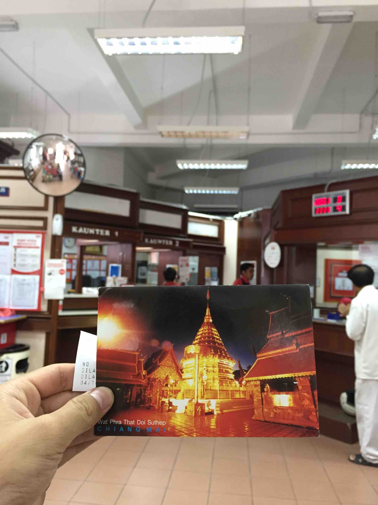
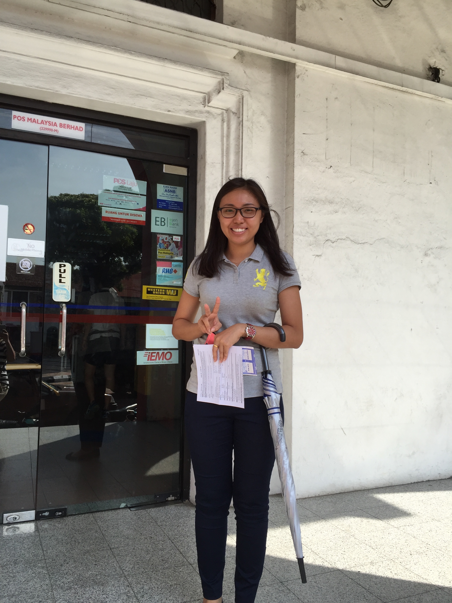

小时候，我便知道马六甲海峡；长大后，才有机会来这里看看。

我们一伙8个人在普吉岛骑完了大象，就各自组队分别：一队去清迈，一队去马来西亚，我和南瓜是去马来西亚的。在吉隆坡国际机场，我和南瓜分别，他先在吉隆坡逛逛，而我坐大巴去马六甲和我的同事桃子会和，我们此行每个人都有个绰号，我叫茄子，因为我喜欢吃茄子。

<!--more-->

在Melaka Sentral汽车站一下车，我的第一件事不是去酒店，而是去寄一张明信片，一张非常重要的明信片，不过后来据爽妹说没有收到，好可惜。

在我投递明信片的时候，我不确定投哪个箱，正要问工作人员的时候，一位热情的华裔姑娘帮助了我。然后我们聊了聊，她是我在马来西亚和我说话的第一个华人，华人的面孔，就是看起来很亲切（我至今不太喜欢老外，很好的除外）。

然后我就顺利的到达了酒店，我们住的酒店还是蛮不错的，特意选了在马六甲河边的[RC Hotel](https://www.agoda.com/zh-cn/rc-hotel/hotel/malacca-my.html)，想着晚上可以在河边吹吹风，喝点啤酒（然后晚上就真的在河边的酒店后院喝啤酒谈人生了）。

安顿好后，我和桃子就开始出去溜达了，首先就是鸡场街，马六甲很有代表性的街道。

在去鸡场街的路上，我看到了这个少女心小车，桃子说好想去坐坐，正巧我也想啊，但还是忍住了哈哈，这一刻，仿佛自己从少男变成了少女。

还路过了这个，算是一个纪念小公园吧，就在街边，就进去看来一眼，拍了张照片。

我和桃子逛着逛着就去吃了著名的小娘惹，非常好吃哈哈，然后好吃的忘记了拍照片。我们吃的慢，吃完饭其实都到了晚上了，我们就去随便走了走，马六甲不大，我们走着走着就到了红色教堂，我就拍了张照。

等我们溜了溜，就去坐船啦，然后回酒店，趁着夜色，我们两个喝着啤酒开始聊天，聊了很多，觉得远在异国他乡，能这样静谧的说话，或许才是真正的放松吧。

夜里三点多了，我们就各自回去睡了，等待第二天的，是美味的早餐，尤其是美味的水果，我吃了两盘。

吃完早餐，就去重新看教堂了，在白天的教堂很好看，因为阳光的原因，加上红色很显眼。

就在这时候，天突然开始下小雨了，我觉得雨中的古城墙，别有一番意境。

马六甲虽然很小，但是是个历史文化名城，历史悠久，被列入了世界文化遗产名录，这是这个的标志：

唉，这是谁家的船怎么跑到岸上来了，去看看！

博物馆里面主要是各种雕塑，讲述这各种历史的故事，主要是关于南洋的贸易的历史，东西文化的冲突以及融合。

我们逛完了船博物馆，雨也停了，我们又去路上一路拍拍拍。边拍边走，终于到了期待已久的马六甲海峡了，不过更期待的是这个：

当我们随着观光台升到塔顶时，还是很激动的，马六甲海峡是在太宽广了，以至于看不到对岸，跟一望无际的大海一样一样的。

来马六甲，当然要到海峡走走。不过走近了发现跟普通的大海没区别，就不上照片了。

等我们逛的差不多了，酒店的服务员已经把车安排好了，桃子就和我买了千层蛋糕后就一起回酒店了，我们都去吉隆坡，她赶飞机回国，我开始一个人的吉隆坡之旅。

快到住的地方了，已经是晚上了，很远就看到举世闻名的双子塔了。

我于是就顺便去双子塔广场，因为我的酒店就在吉隆坡双子塔旁边，但是我现在孤身一人，没人给我拍和双子塔的合照啊，看了看就走了。本来想着回酒店里的窗户应该能直接看到，结果，被另一个高楼给挡住了，那就睡觉吧，也累了。
