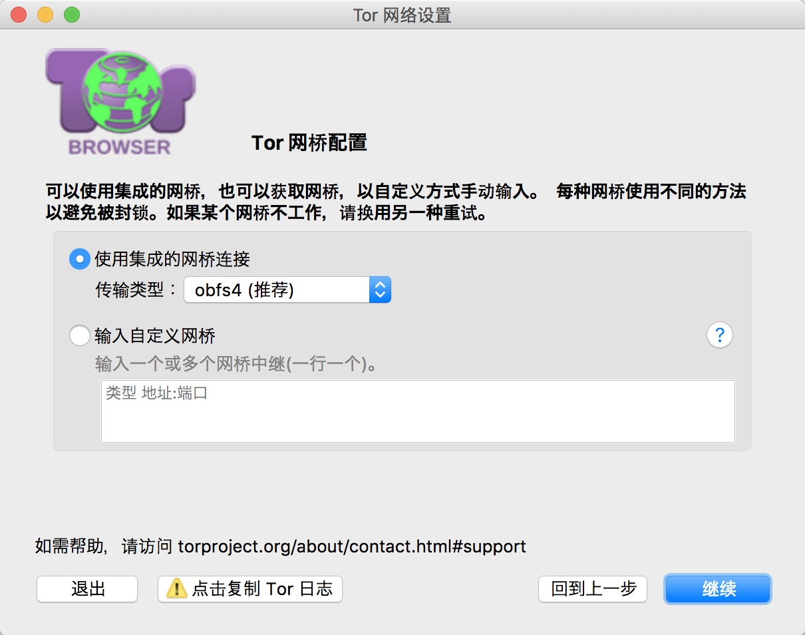
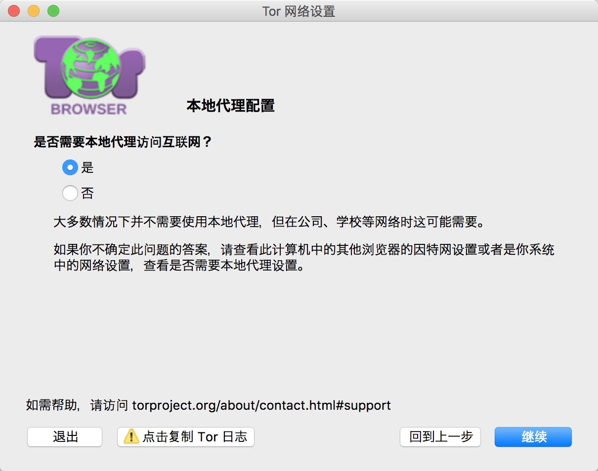
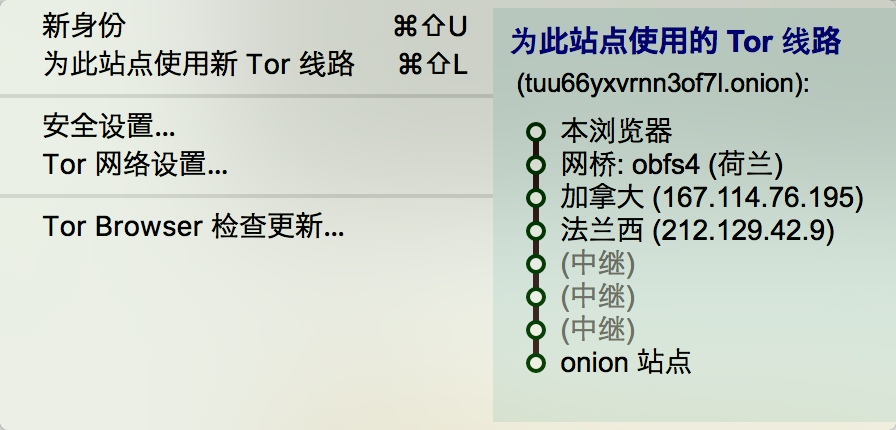
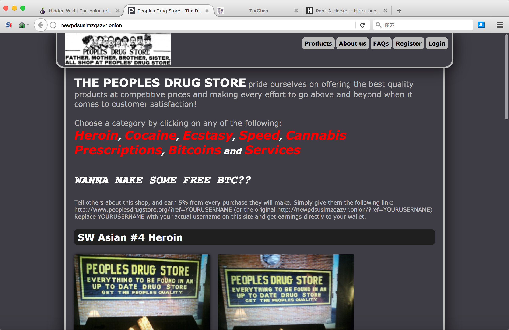

今天是周六，是个加班的好日子，但是到得有点儿晚。我到公司后，边和明哥一起使劲Coding，这时候，一声铃声打破了寂静，是明哥的电话。

明哥接完电话后说：“我收到了个快递，不知道谁给寄的，还发的顺丰呢！”  那再问一下呗？明哥给快递小哥打了个电话，确认了下，“某某车行”，于是便百度了一下，但是网上找不到任何有用的信息。不会是什么广告或者诈骗吧？

这时候，明哥说，我有个奇怪的事情，和你讲一下，是上大学时候的事情。

<!--more-->

明哥便开始讲他的故事了：某一天，我正在学校里学习，突然接到了个电话，说你是机械学院的某某吗？有个快递，需要去拿一下。我说，我是另外的学院的呀。他说，手机姓名都正确，没错的，就是你的了，你要是不确定的话来看一下吧。我问在哪里？他说在某某地方，于是我就去了。到了以后，一辆黑色的面包车，黑色的窗户，后备箱打开了，里面没有座椅，只有个大箱子，很大的箱子，像棺材一样大，稍微短点。我问这是啥？他说我也不知道，你上去看下吧。

明哥那时候作为一个积极阳光、不谙世事的翩翩少年，当然不敢上去了。别说上去，靠近都不敢。明哥说，大概两三米的距离，不敢靠近。咨询无果后，明哥便要离开。他既害怕，又好奇，走远了还偷偷的瞄了几眼，知道车辆驶向远方。

多年后的今年，明哥回忆起来了，说：如果我当时上去了，或者凑近看了看，万一被绑上去了，说不定今天肾都没了呀；那时候我虽然没有什么社会经验，但是还是很警惕的。

我说，是啊，这年头，这世道，什么样的都有；害人之心不可有，防人之心不可无啊。

比如前些日子，那个在美国失踪的北大研究生，章莹颖，案件至今未取得进展。嫌犯还在审判中，至今未定罪。已经过了这么久，应该是凶多吉少了。惋惜。见参考资料1.

与章莹颖事件，同时得到广泛关注的一个话题，便是暗网。我和明哥讨论了起来。之前我本想着去体验一次的，但是访问失败。这次我又找了几篇文章参考了一下，OK了，看到了些东西，记录一下。顺便，引用一下百度百科里秒懂百科的视频题目：“暗网才是根治网瘾的最佳手段”。

互联网，尤其是WEB，是一个开放的平台，不属于任何公司，任何个人------如果说Android属于Google的话，iOS属于Apple的话，Web则是个全方位开放的技术集合。面向世界上的任何公司和个人。

因此，开放的互联网的飞速发展，促进了世界经济的迅猛发展，提升了整个社会的运行效率，为我们每个普通人也带来了以前无法想象的遍历。

但是，互联网毕竟是个工具，他的好坏，掌握在使用他的人手里。就像菜刀，就像枪支。

因而，互联网也放大了这个世上的不美好，最起码能为一些犯罪行为提供了极大的便利。

比如暗网。

##### 暗网是什么？

请见参考资料2，百度百科的解释，基本够用，虽然我认为有很大的夸张成分。在我看来，简而言之：搜索引擎能爬到的称之为“表网”，也就是正常网站，虽然这些正常网站可能涉及非法内容；搜索引擎搜不到的网站，称之为“深网”，这里面有很大一部分也是正常网站，比如办公内网，别说索索引擎了，员工离开了公司就无法访问，还有一部分可能是非法网站；再往前一层，利用了特殊技术让搜索引擎无法访问并且通常从事非法目的的网站，称之为“暗网”。

从名字就可以看出，“深网”和“暗网”的名字，赋予了器其褒贬的含义。深不可怕，暗才可怕。

我个人认为，网上关于暗网的描述，很多都被夸大了，毕竟什么都不懂的小白比较多。什么暗网内容大于表网内容，表网只是其冰山一角的说法，都是站不住脚的。一个简单的推理：暗网的使用成本很高，最起码要用到一些技术，那么使用人群就会少，那么又如何产生数量更大的内容呢？

##### 如何访问暗网？

我们知道，暗网采取了特定的加密和隐藏访问来源的技术，以此来实现匿名访问。我们来看一下如何操作？

1.首先，去官网下载一个Tor浏览器，地址在参考资料5，并且安装到计算机，这个就比较简单了，不赘述。

2.打开Tor后，我们看到了如下界面,然后点击配置：

3.我们选择是，继续：

4.我们选择使用集成的网桥链接，继续：

5.很显然，我们需要一个本地代理：

6.设置你本地的Socks 5代理，前提是你需要一个本地启动的Shadow Socks并设置全局代理：

7.我们看到，已经连接OK了，我们点击测试Tor网络设置：

8.我们看到，我们现在的IP再一次变了：

##### 暗网初见

我们再地址栏输入一个网址：[https://thehiddenwiki.org/](https://thehiddenwiki.org/)，我们发现有一个网址列表，并且这些网址列表中的域名都是.onion结尾。

并且弹出了一个弹窗，如图，因为网络的匿名性，所以跟踪用户没有采用常规的cookies方法：

我们找到一个跟gun相关的链接，如图：

点击一下，发现网络加载很慢，终于页面加载好了，我们再看页面详情前，先点击一下地址栏左侧的洋葱按钮，如图：

我们再看一下贩卖枪支的具体页面，我们能看到枪支是以比特币交易的：

这里说一句，英国虽然允许持枪，但是对持枪有严格规定，见参考资料7，如图所示的枪支，很明显是不能正常交易的。

再看一个卖英国护照的，谁又知道真假呢？

需要干坏事了？租个黑客。就是不知道会不会骗了钱还黑自己一把。

卖毒品的网站，看他的图片，我觉得做工就不纯，招牌这么难看。

这个TorChan，聊天区，看着没那么讨厌，看侧边栏，音乐、数学、计算机、工程、操作系统都有板块，最近发言就在前些天。

##### 小结

首先，暗网没有什么神乎其神的，一般吹来吹去的都是行外人,这些都是匿名手段而已了；

其次，现实世界中都那么多黑暗，网上匿名区能少了吗？只是让这些人更容易聚拢在一起罢了。

最后，世道险恶，用最大的善意对待这个世界的美好，同时也用最大的谨慎来对待这这个世道的险恶。

因为本文从诈骗和女生失踪所起，来扣个题吧，发个图提醒一下各路年轻人，不要以为这个世界都如诗和远方那么美好，出门在外，都要注意安全呀。

---
#### 参考资料：

1.[章莹颖案嫌犯欲阻止专家作证 检察官：毫无道理](http://world.huanqiu.com/article/2018-01/11520127.html)

2.[暗网------百度百科](https://baike.baidu.com/item/%E6%9A%97%E7%BD%91/8694490?fr=aladdin)

3.[章莹颖的遭遇，真的与“暗网”有关？](http://news.youth.cn/kj/201707/t20170724_10361419.htm)

4.[洋葱浏览器和网络黑市在东亚有生存空间么？](https://www.zhihu.com/question/30668461)

5.[Tor官网](https://www.torproject.org)

6.[Tor: Overview](https://www.torproject.org/about/overview.html.en#thesolution)

7.[英国禁枪吗？为什么？](https://www.zhihu.com/question/28296890)
