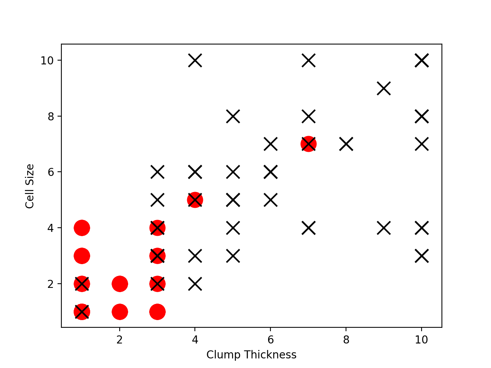
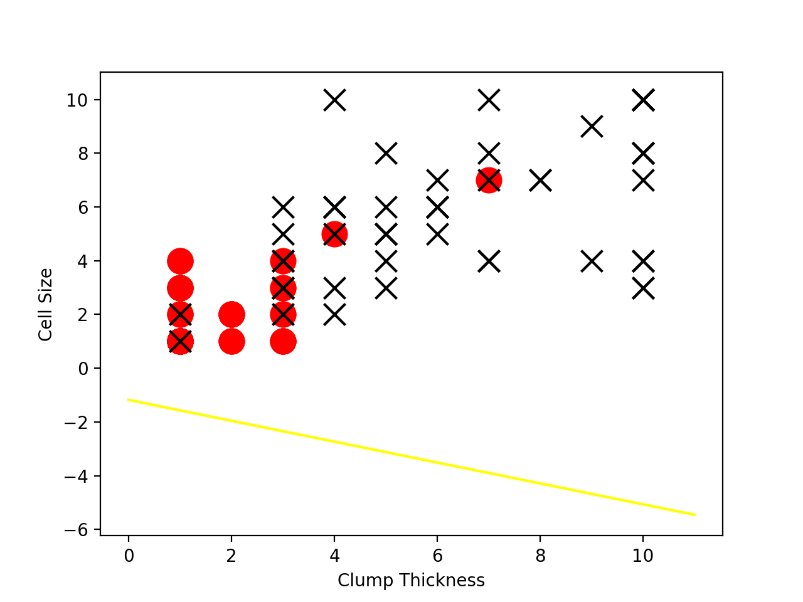

机器学习是现在最热门的方向了，我也要来学学。

环境: mac OS


<!--more-->

1.首先在终端输入如下命令安装pip：

```bash
curl https://bootstrap.pypa.io/get-pip.py>get-pip.py
sudo python get-pip.py
```

2.从官网下载安装anaconda,注意需要设置环境变量，需要设置在/etc/profile下，如果发现命令不能使用，在终端下执行：

```bash
export PATH=~/anaconda/bin:$PATH
```

3.检测安装是否成功：

```bash
conda --v
conda list
```

4.新建test.py，输入如下代码： [Github在这里](https://github.com/leiquan/Machine-Learning)

```python
import pandas as pd

df_train = pd.read_csv('../../Book/Datasets/Breast-Cancer/breast-cancer-train.csv')
df_test = pd.read_csv('../../Book/Datasets/Breast-Cancer/breast-cancer-test.csv')

df_test_negative = df_test.loc[df_test['Type'] == 0][['Clump Thickness', 'Cell Size']]
df_test_positive = df_test.loc[df_test['Type'] == 1][['Clump Thickness', 'Cell Size']]

import matplotlib.pyplot as plt

plt.scatter(df_test_negative['Clump Thickness'],df_test_negative['Cell Size'], marker = 'o', s=200, c='red')
plt.scatter(df_test_positive['Clump Thickness'],df_test_positive['Cell Size'], marker = 'x', s=150, c='black')

plt.xlabel('Clump Thickness')
plt.ylabel('Cell Size')

plt.show()


import numpy as np

intercept = np.random.random([1])
coef = np.random.random([2])

lx = np.arange(0, 12)
ly = (-intercept - lx * coef[0]) / coef[1]

plt.plot(lx, ly, c='yellow')


plt.scatter(df_test_negative['Clump Thickness'],df_test_negative['Cell Size'], marker = 'o', s=200, c='red')
plt.scatter(df_test_positive['Clump Thickness'],df_test_positive['Cell Size'], marker = 'x', s=150, c='black')
plt.xlabel('Clump Thickness')
plt.ylabel('Cell Size')
plt.show()

from sklearn.linear_model import LogisticRegression
lr = LogisticRegression()

lr.fit(df_train[['Clump Thickness', 'Cell Size']][:10], df_train['Type'][:10])
print 'Testing accuracy (10 training samples):', lr.score(df_test[['Clump Thickness', 'Cell Size']], df_test['Type'])


intercept = lr.intercept_
coef = lr.coef_[0, :]

ly = (-intercept - lx * coef[0]) / coef[1]

plt.plot(lx, ly, c='green')
plt.scatter(df_test_negative['Clump Thickness'],df_test_negative['Cell Size'], marker = 'o', s=200, c='red')
plt.scatter(df_test_positive['Clump Thickness'],df_test_positive['Cell Size'], marker = 'x', s=150, c='black')
plt.xlabel('Clump Thickness')
plt.ylabel('Cell Size')
plt.show()


lr = LogisticRegression()

lr.fit(df_train[['Clump Thickness', 'Cell Size']], df_train['Type'])
print 'Testing accuracy (all training samples):', lr.score(df_test[['Clump Thickness', 'Cell Size']], df_test['Type'])


intercept = lr.intercept_
coef = lr.coef_[0, :]
ly = (-intercept - lx * coef[0]) / coef[1]

plt.plot(lx, ly, c='blue')
plt.scatter(df_test_negative['Clump Thickness'],df_test_negative['Cell Size'], marker = 'o', s=200, c='red')
plt.scatter(df_test_positive['Clump Thickness'],df_test_positive['Cell Size'], marker = 'x', s=150, c='black')
plt.xlabel('Clump Thickness')
plt.ylabel('Cell Size')
plt.show()

```

5.执行代码，我们会看到如下效果：




