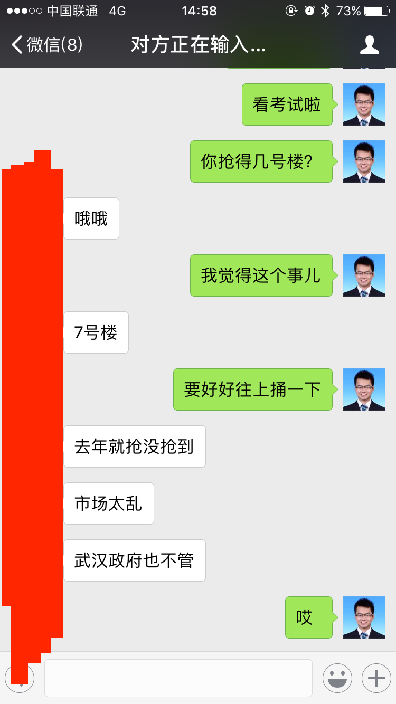
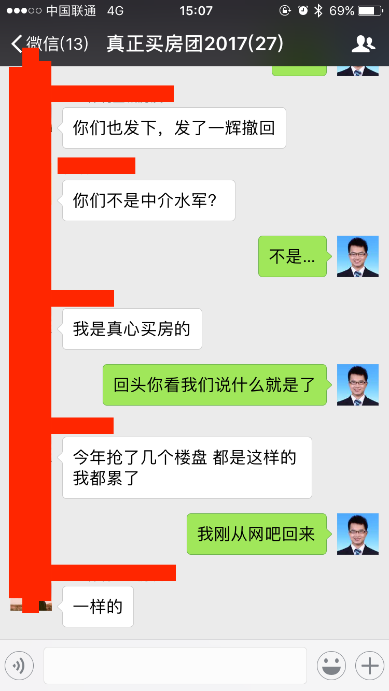

今天，是青年节，我来网吧了。从小到大，我去过网吧的次数，一只手数的过来。其中，有两次印象比较深刻。

<!--more-->

第一次，是我第一次进网吧的时候，那是我初一的时候，我的好朋友俞磊带我去网吧上网。他在浏览器地址栏，输入了 http://www.baidu.com 然后按了确认按键，老式IE浏览器的windows小彩旗转啊转，终于出来了个页面，我很兴奋。十年后，我就去www.baidu.com工作了。

第二次，是高考成绩出来后，填志愿的截至日子。那一天，我们在朋友家聚会，完了就一起去网吧把最后的志愿改了改。讨论一下，大家根据自己的情况稍微调整一下。搞完之后我们就看了看电影，最后，那晚我们几个人一起很晚才回去。

这两次是我印象深刻的去网吧的记忆，今天，我想会是我人生中第三次记忆深刻的网吧经历---毕竟网吧这个产业未来估计也也会消亡。

今天，我是来抢房的，因为网吧的网速可能比较快。然而，我到了之后，发现也没快多少，差不多就是10来兆的宽带速度吧，也不想再去找个网吧了。况且我都公测模拟两次了，套路已经熟悉了。群里的各路大侠，倒是很专业：能找到的最好的网吧，高配置机器，水冷散热，加上百兆宽带。

从一开始我在武汉到处看看房子的时候，中介们就极力渲染房子很难抢，几分钟被抢光的，18秒被抢光的。我知道他们的话是不可信的，我接触过一些中介，对他们的素质和态度我是了解的。然而，我也知道，火爆的房地产行情，也是客观存在的。

我是去年10月份开始看房子的。在前一年，我爸让我早些在武汉买一套，我想着看下北京有没有机会，就没有听从我爸的------现在真心觉得“不听老人言，吃亏在眼前”。然后北京房价一路狂飙，根本没的戏。狂飙的有多厉害呢？我有朋友首付300多万，买了一个四环外的60平米的小房子。于是我开始看武汉的，结果，刚开始看，武汉限购了：外地人需要两年社保。那没办法，我就看限购区外的，看好了正准备开盘后买，又限够了，把范围扩大化了，这里又被圈进去了买不了了。

一路坎坷，有些已是一言难尽。后来，终于看到了一个还勉强的地方，手续也办好了，也交了5万块的认筹费，等着网上抢房。之前，置业顾问建的微信群很大，400多人，交完钱新建一个群后，有200来个人。这200来个人里面，除了可能存在的水军，基本都是真心要购买的。在这一期开盘中，置业顾问的数量据说有22个，估算一下也就是差不多4000个人，房源总数是800来套。如果一切正常，那么大概5分之一的概率能抢到的。

我不怎么在这个群里说话的，就偶尔看看。置业顾问自然一直渲染火爆的气氛，力劝大家只要有的抢，无论什么户型都要抢。我自然只是不理睬，他们中介嘛，都是忽悠，毕竟很可能有人买不起大户型，或者小户型不满意了。而我毕竟也是有追求的人，抢不到拉倒，遇到不合适的会很麻烦，大额投资得谨慎。况且我现在手续齐全，只要符合我条件以及我能承受的，我去哪买都可以。

然而，事情的进展越来越有意思，尤其是当我来到网吧后。

我看到群里的一些人：有人说抢了5次接着抢的；有在网吧抢房看到别人来了也是抢房的；有哀叹再要是抢不到便是命里注定的；有害怕存在内定名额的.....各种各样，有种人生百态的既视感。

在快要开始抢的倒计时时候，则更是有意思，一位妈妈说：好紧张啊，比我儿子高考的时候还紧张。我想她大概是说的心里话。

开始了，点击系统去后，协议看都不看直接同意。然后验证码了，一看，变了：从手动拖动变成点击文字了，不怕，我反应快，赶紧点完，直奔房源图，开点，然后就一直卡死...等到能刷新的时候，再回头已经全部没了，3栋楼，所有的单元，任何楼层，800套，全部没了。

我倒是比较淡定，没了就没了呗，群里有些朋友不淡定了。有骂验证码临时换了觉得被耍猴了----我想这哥们一定把验证码拖动练到了炉火纯青的地步才如此激动；有在房源全部卖完还卡着进不去的界面都没看到的，把电信运营商骂的狗血淋头；前面说到的百兆网卡、水冷散热的哥们也没抢到，大骂“水冷何用，百兆何用”；也有没抢到合适户型，被女朋友强硬要求买小户型的，然后“抢到了也高兴不起来”----我想他们大概是买房结婚的；有抢到最顶楼和最底楼的最差的“手枪”户型的，不知道该开心还是不开心----手枪的意思是户型不好比较拐;还有6次抢房没抢到的表示心累绝望的；有一不小心抢了个大的房源的，开始担心贷款还不起的......各式各样。

还有更狠的：有人爆料有一块儿抢房的朋友交了15万占了个名额昨天就已经订好了房号的；有人的直系朋友直言名额已经分配给公安局的一部分员工了，只是没证据没法举报的；有人感叹当了太多次群众演员发誓再也不在这家开发商买的；有人感叹我送钱给你房地产公司赚你还要戏弄我让我们绝大多数人抢不到有意思么；还有在交完认筹费用之外找关系花钱买名额还没抢到的......应有尽有。

最后，群里大伙自主统计后发现，206个人，抢到的差不多五六个,比率大概是40分之1。

鲁迅说：中国的历史可以分成两种情况,一种是坐稳了奴隶的时候,一种是欲做奴隶而不得的时候。突然发现，这句话形容买房的人，真的是太合适了。抢到了的人，便是坐稳了奴隶的人，从此背负房贷，成为房奴，比如那位不小心抢大了的朋友；没抢到的人，便是想做房奴都没有机会的，比如我们。

我想，这句话，大概是很正确的。

据我的观察，正常的一般家庭：即使花掉家庭全部积蓄，北上广深已经是付不起首付了；二线城市杭州、成都、武汉、厦门、珠海等，也基本要背负很大压力的。在一二线城市里，多少人，做着房奴，每个月省钱还房贷，一还就是三十年；多少人，好不容易买的起房了付得起首付了，却连做房奴的机会都得不到。

我想，这到底怎么了？年轻人活得这么累。

我不知道。或许是城镇化的历史潮流吧------以前的中国农村为主，自然是要城镇化的；或许是政府吧，控制土地供给来影响地价，建造地铁来提升地价，房价越高政府就越有钱；或许是中国人实在太多了吧，所以资源优良的城市房产总是供不应求的，比国外竞争更加激烈。

但我知道，这是一种莫大的悲哀。我也知道，我可能逃脱不了这种悲哀，时代使然，我能有什么办法呢？不求北上广深， 武汉有个房子不过分吧?不然未来如何跟丈母娘交代呢？但是，我一定要减少这种悲哀对我的影响。

如何减少这种悲哀对我的影响呢？或许就是赚钱吧。

我一直认为赚钱很重要。在现代经济社会的体系里，我认为钱至少能解决我90%的困难，实现我60%的理想。

以买房子为例：没钱只能在这里抢商品房；有钱住别墅就不说了，还能没事儿自己造个小木屋给爱的人做生日礼物。这是多么大的差距，然而我想，这两种生活状态的差距，可不仅仅是房子的问题，更是一种人生的质量问题。

穷连独善其身，安家立命都是问题，而达则兼济天下。不说别的，有钱了自己的问题能解决不说，还有可能“大庇天下寒士俱欢颜”。

为了更高的人生质量，加油赚钱吧，虽然我知道钱并不好赚。

#### 2017年5月5日更新：
如之前所述，大家有很多怀疑的，然而今天，事情的发展出乎了些意料，我来爆一些图吧。

我觉得真的是可以以“房子去哪儿”为题，拍一部大武汉的抢房纪录片。

这种事情，政府真的管，没有管不了的。一句话，利益相关不作为。地方政府巴不得房价上涨，不然基建的窟窿怎么填？武汉规划了20多条地铁那都是钱砸出来的啊。

这姐姐去年抢到今年，一共抢了六次，这次因为公测抢房被封号了，抢不成。

关系，不值钱；关系，只不过是利益交换而已。找到的关系没行通，要么被敷衍，要么被骗吧。

我问你的不是他精装修签不签合同的问题，是没的选择啊。要么不买要么听他的强制精装修加钱的霸王条款啊，你房管局就这么敷衍我？工作日上班时间打电话都不接，果真是一丘之貉。

抢也就算了，我知道资源总是有限的。然而能抢到也行啊，抢不到有人抢到也行啊。比例太低绝对有猫腻不是么？

无论做什么，即使那些卖楼的，也不一定买的到。认的是钱，不是人。

我无法验证真假，但是看目前的抢到手的比例，估计这页很正常。武汉政府为了跟中央“房子不是用来炒的”交代，限制价格，而房地产又要赚钱，这不是顺理成章很正常的么？

#### 2017年5月8日更新

[网易新闻爆出来了，果然都钱都回到了开发商的手里](https://c.m.163.com/news/a/CJUBPH3I0001875P.html?spss=newsapp&spsw=1)
