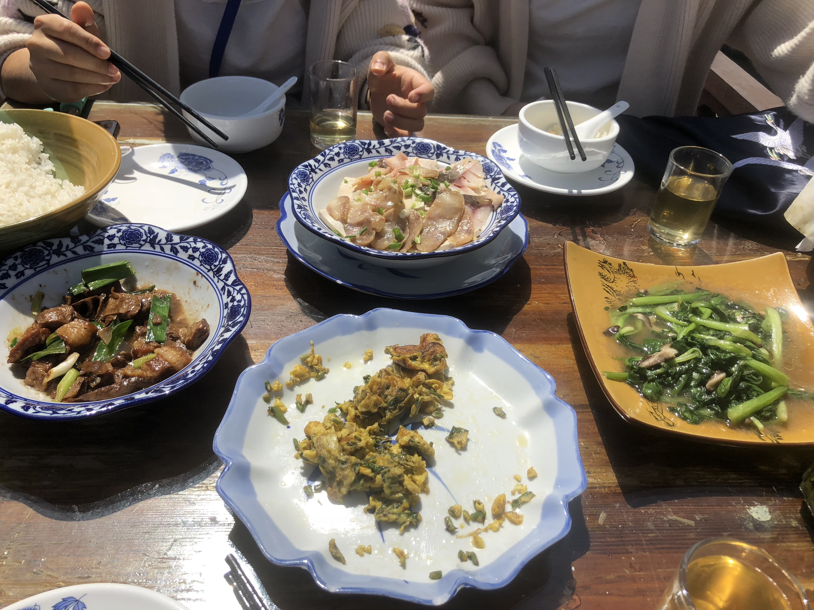
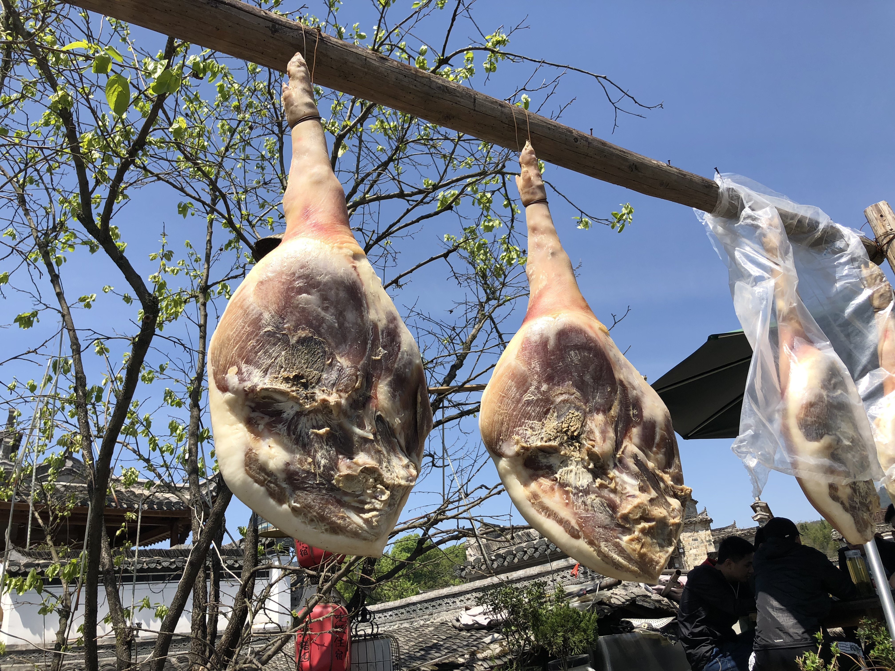
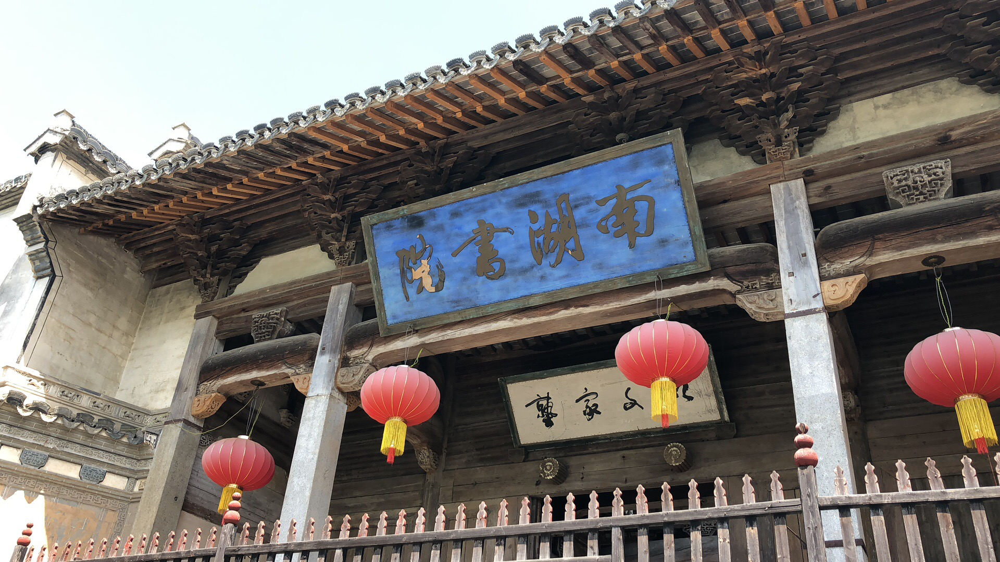
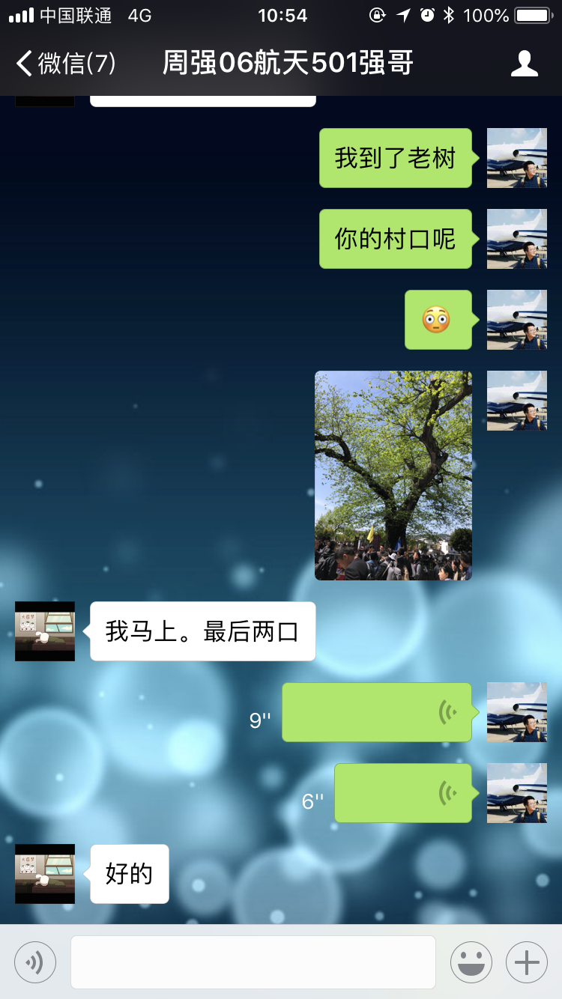
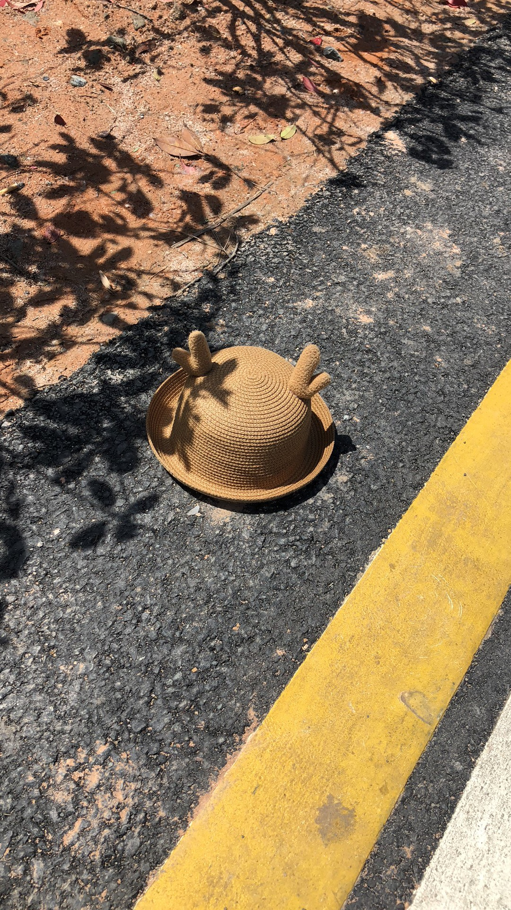

临走的时候拍了一张照片，真是水墨宏村啊。

<!--more-->

以前出去玩，还能到处溜溜，现在也就是在一个地方呆一呆了。或者干脆在酒店里面写代码。

没错，写了两天代码，我没时间洗澡洗头，然后憔悴成了这样。真是浪费了我往返的机票和车票啊。

那一天到了黄山北，已经快十二点了。但是拼到了一个顺风车，同行的是两个妹子。本想着第二天不会想见，但一不小心就见到了。是宏村太小了，还是缘分呢？

她们是闺蜜，辞职一起去旅行的。

这么好看的江南风光，自然少不了专门来p拍照的模特，层一个模特。

当然更少不了好吃的，笋干很好吃，三个人，四道菜，刚好，我们在一个湖边的露台吃饭，左看就是南湖。

旁边的大火腿很显眼，这一个得多少斤，卖多少钱呢！

南湖书院就在旁边，曾经这里是书声琅琅的地方。

我和强哥来之前并没有约，后来才发现我们都是一个目的地。于是我们相约在村口大树想见。

我到了老树，你的村口呢？

临走的时候，看到地上谁家姑娘慌忙中掉了帽子。

