<!--
男导游姓名：张哲
女导游姓名：全松伊
朝鲜国旅
-->

去朝鲜看看，可以说是我多年来的一个梦想。我比较关注政治、经济等社会方面的东西，同样作为社会主义国家的朝鲜，虽然中朝两国传统友谊良好，抗美援朝又用献血来凝聚钢铁般的情谊，然而现实中的朝鲜却又充满着诸多的神秘。无论是中国的官方报道，还是我翻墙能看到的美帝的各路新闻，我都觉得不够全面，如果有机会，是应该去体验一下。虽然网上有评论说，去了看到的也不一定是完全真实，但是，总是要亲近一些。

这一次，趁着来东北考试，就把朝鲜旅行的梦想一并实现了。以后，就不知道何日再会来东北了，之前来过一次东北也是来去匆匆，就更不知何日能去朝鲜了------况且，那时候的朝鲜，虽不知命运如何，或许也会大不相同了。

<!--more-->

我有很多旅行的梦想：去朝鲜感受社会主义政治和相对封闭的社会状态；去叙利亚看一眼战争与恐怖主义带给人民的创伤；去珠峰看看洁白的雪山，去迪拜跳伞俯视棕榈岛；和相爱的人一起去北极看极光，去南极看企鹅....然而，因为金钱与时间的关系，以及其他一些原因，有的并不容易实现。这次就是去朝鲜了，下个月，不出意外的话，我会去珠峰。

这篇游记，是我的个人网站上线后的第一篇，其他的全部是回忆写的，很多东西都忘了，写不出什么来贴几张照片占位，以后或许就会删掉了。而且，我越来越觉得，虽然不少旅行有意义；但是很多则根本没有，纯粹对金钱、体力和时间的浪费，我从来不相信那句文艺青年的口中的“要么读书，要么旅行”。我是实用主义者，哪怕出去溜，也要努力有所收益，最起码在精神上，感觉无意义的玩对我来说好奢侈和浪费；我想去的很多地方，其实也没什么美景和美食可言。况且美景对我还不少诱惑，虽然他们都能网上初步看看；美食的话，作为一个在生活中就努力减少吃肉的人，没啥诱惑------有好吃的就吃，没有就算了，不挑。

在出门前我就计划好了：每天出去的过程中，用备忘录记下当天的一些特别的事情和导游讲过的重要话；每天晚上在酒店里写一下当天的旅行。尽量多记录一些，因为朝鲜，对于绝大多数人来说，都太神秘了；因为朝鲜之旅，于我而言，实在太有意义了。

这篇游记有200来张照片，1万多文字介绍，前面的四部分，详细记录了我们四天的行程------看完就跟去溜一圈差不多了；后面的几部分，有我的一些关于朝鲜的个人感想。

#### 第一天，丹东-平壤，2017-07-09

昨晚和朋友在哈尔滨分别后，就坐上了去长春的火车。到长春中转，今早8点15分到丹东，我下了火车打电话咨询，导游已经在等我了。导游说，因为不满16个人，中方不配置导游。我年轻，又是男生，看上去积极阳光帅气，就由我做领队了。导游跟我好好交代了一些事情，给了我我们团的签证、名单和车票，还有仔细给我交代了给朝方导游的装在信封里的一些东西。

我们等待海关边检上班，上班后，我们便是第一批过关的旅客。在等待火车的时候，我们大伙就在等候区聊天。我们一行10个人，趁还没出境有网络，各自给亲朋好友交代了下导游的电话，以防万一有什么急事需要联系，毕竟到了朝鲜后网络没有，电话也很不方便。我们也当面建了个微信群，各自实名就免得问大家叫什么了，更重要的是回来后好分享照片。

检票口开放后，我们就准备上车。因为是团体票，我在前面和检票员数人数，带领着大家进站。

一到火车跟前，大家不约而同做的第一件事情，就是跟火车合影，毕竟于大家而言，朝鲜都是神秘而又特别的。我们坐的是中方的提供的火车，据说比朝鲜的好很多，而且，坐哪方的车去，就坐哪方的车回来，因而我们就放心回程了。

我手中拿的就是我们大家的签证了，我们的签证，其实是一次性的旅行卡，我的比较大，跟他们的都不一样，领队的特殊福利啊，看来早就让我当领队了，怪不得我当时想在哈尔滨再多待一天，旅行社说不让呢，说损失比较惨重。

给旅行卡来个特写吧。

我们每个人都有一个 Visa 号码，这个我们后面入境是需要填写的。我们团有49年出生的老爷爷，也有97年的小妹妹，我的签证压住了几个人的信息。关键信息打个码吧，免得泄露了人家的隐私。

来个反面的特写，如英文名称，确实应该称作旅行卡，作用就是一次性旅行团体签证，这种模式不用在我们的护照上留下签证贴页，甚至都不会在我们的护照上盖入境章，据说这是朝鲜为了解除赴朝旅行者的顾虑：如果留有朝方入境章，可能存在让美欧等国家拒绝入境的可能，因而减少赴朝旅行数量。看来朝鲜还是能意识到这一点的，回归现实，于他们而言为了赚旅行者的外汇，妥协方便这一下也是可以接受的。

我们在检票的时候，身边就有朝鲜人，这是我第一次和朝鲜人近距离的接触。别的或许分辨不出来，但是胸上佩戴的朝鲜才特有的徽章，是朝鲜人最明显的标志。我们上车后，发现了几个朝鲜人占领了我们的座位，我和其中一位女士交涉，她中文很好，说不知道她的座位在哪里。我本来想着中朝友谊，要不挤挤吧，但是又实在挤不下去，我看了下她的车票，上面没有写座位号，我不理解，因为这个车票和我们的并不一样。我问了下附近的中方乘务员，他说她们是无座的，到新义州，然后让他们站起来了。从这位乘务员的话语和动作中，看得出对朝鲜人还是不够友好的------或许是对所有占了人座位的乘客都不友好。不过其实也还好，卧铺车，因而旁边有凳子，她们就在那里坐着几个，站着几个，也不会累，新义州也近，10来分钟就差不多了。于是我们就坐下了，底下坐人，中铺放行李。接着我们就填写朝方入境卡了，还要填写一个导游汇报卡，那就我来写了。

10点出发，我们很快就到了新义州了，朝方人员就上来检查了，应该是有2-3拨，根据不同的制服和检查内容，包括海关安检和内容审查。安检没什么特别的，就是金属探测器扫一扫，不过他们是女性查女性，男性查男性。大概是因为比较传统男女有别？

内容审查这方面，就比较严格了，这也是赴朝旅行中最紧张刺激的部分之一了。

首先，让我们拿出全部的手机和相机，主要是审查照片内容，就是黄赌毒和政治敏感方面的------比如朝鲜的现任领导人金正恩的微信表情包什么的。我们基本上有所准备，该删的早就删了，加上这位负责检查的官员并不严格，很快就通过了。

第二步，审查文字和书籍报刊。我们没带啥，但是老人家带的丹东和平壤的旅行图什么的被没收了。老人家还想去理论理论，我们说算了吧，语言又没有那么的通，也不是什么重要的东西。

第三步，查行李。我们的打开包和箱子瞅了瞅就算完了。但是后来我们才知道，他们查本国的公民还是很严格的。我们看到他们所有的笔记本电脑都拿下了火车，就在窗外我们的位置倒腾了好久。因而我们也等了好久，前前后后在新义州有两个多小时。

最后，另一拨人上来登记了手机品牌。把自己的手机品牌写在了我们的入境卡上面就完事儿了。

在等待检查的时候，车门是开的，加上有小推车过来卖吃的，因而我们就下车去溜溜，看买点儿什么。在下车前，坐我对面的姐姐，偷偷的拍了下外面，就被外面的士兵招呼出去了，关键那个士兵打完手势后摸了摸腰上的枪，吓死我们了，还好只是摸摸。下去后，姐姐跟他说，没拍上照片，展示给士兵看了下，就回来了。

不一会儿，他们买了些东西回来：一条咸鱼，一瓶虎骨酒。这条鱼特别有意思，我们路上就以它为乐。

于是我们就一起吃鱼喝酒，但是这个鱼实在太硬了，我们都撕不动。于是，没吃多少，我们就放弃了，把它插在了虎骨酒的纸盒子里，放在窗边，感觉就像插在花瓶中的一束献花，映衬着窗外的风景。

检查的差不多了，中方导游交代的饭点也到了，我们看到了外面送饭的服务人员了，就下去领饭，领饭需要凭名单。女服务员看起来很时尚，金色的高跟鞋，黑丝袜子，人也挺漂亮的。饭菜到手后，我们觉得还不错，来张特写。

还带一瓶朝鲜产的矿泉水。

大家吃的很开心，我们愉快的合影了，没有我，因为我负责拍照。

吃完饭，没一会儿火车就开动了，我们向着平壤进发。因为去平壤旅途很长，不一会儿，大伙儿就和那边的朝鲜人员聊起来了。其中一个略胖的年轻人，跟我大概差不多大年纪，或许还小一点，在武汉中国地质大学，学习工程专业。他说每个星期会去一趟武汉大学，因为同学在那里，他们会约着打排球。

我们一路上就聊了很多，话题很广泛，涉及到中国的双十一光棍节、春运、朝鲜的太阳节、朝鲜的兵役年限、还有朝鲜的女交警。这位年轻人说，朝鲜的女交警级别很高，一般人接触不到的，但是他可以，因为他姐姐就是交警。在网上各个游记里，朝鲜的女交警，女导游确实是一道亮丽的风景线，备受好评。他也提到了传统中的“北女南男”的看法，说现在貌似也不一定了。他也提到，曾经有中国游客追求朝鲜女导游未果的，我们大伙一起笑。

另外还有一位很热心的朝鲜人，是师范大学的教师，来中国学习，两年没有回过国了，他说他这次回国很开心，是啊，从异国他乡回到自己的祖国，谁会不开心呢。我们和他也聊到了很多话题，其中包括朝鲜的房屋制度等等。他说，因为他是大学教师，政府在新建设的黎明大街上分了一套110多平米的房子给他，因而他更要好好工作，报效自己的祖国。相信朝鲜人民有这样的努力的人，会越来越好的。就在这时候，前面提到那位年轻的胖学生说，要是去年他去工作了，今年他也会有房子了，可惜了。

从中国到朝鲜，各个方面应有尽有，他们也不太避讳。尤其是那位年轻的胖学生，很直接也会开玩笑；那位年长的教师，倒是稍微有些含糊和搪塞，在我们同行的小朋友的一路追问下，有些问题他都会先想想。我们其实也理解，毕竟我们的祖国也走过这个阶段，曾经的华夏儿女，在外国人面前，确实是自卑的，曾经信仰虔诚的人，在政治方面也是敏感的；随着这些年中国经济的腾飞和思想的开放，这个阶段已经一去不复返了。其实这也没几年，我记得在初中高中的时候，经常新闻或者报纸甚至学校的老师在教学的时候就提到，中国人出外旅行素质不够高，这几年，类似的新闻我很少看到了，毕竟中国人多，又舍得花钱，对于很多旅游目的地来说，真的能算是金主了，有谁又会傻到为难金主呢？

在这去平壤的一路上，有大约4个小时。我们因为在火车上，能看到的景色其实有限，但是对这几点印象比较深刻。相对破旧的火车、样式比较统一的房子、一望无际的翠绿的田野、田间集体劳作的人民。

之前在网上的游记上看到有说朝鲜火车破旧的，我们看到的情况确实如此。网游评论说，这样的铁道系统，是绝对禁不住战时的考验的，我觉得或许确实是这样子。当然了，朝鲜并不全是这种火车皮，但是这一类火车皮的存在，说明了其合理性，比如：物资受限，这样的火车皮也能将就用用。

我也拍到了一个很新的火车头。

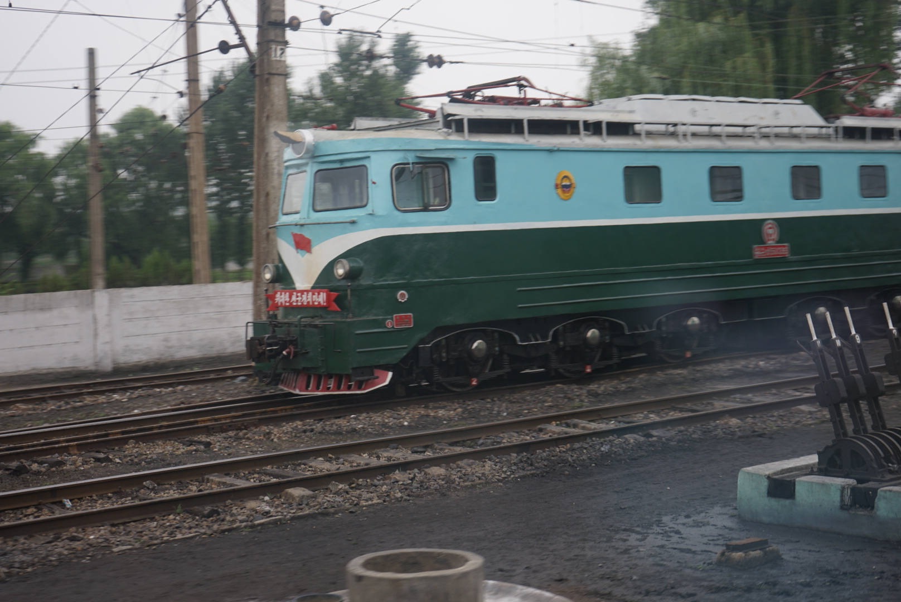

他们的房子样式确实比较统一的，因为都是国家建的，统一的样式，不仅美观，而且也能节约成本。

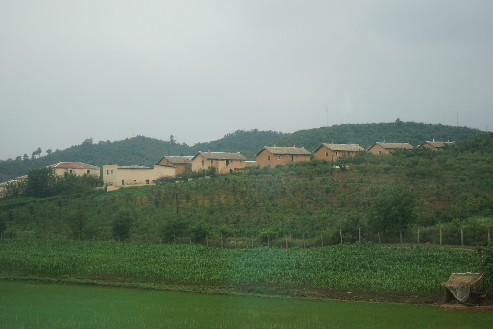

稍微离轨道近一些的可能是办公用的建筑，颜色则比较鲜艳，花花绿绿的很好看。我还发现，他们不少的房子都装有太阳能发电板，应该是电力供应不足，市民们去中国购买的太阳能发电板来辅助供电。

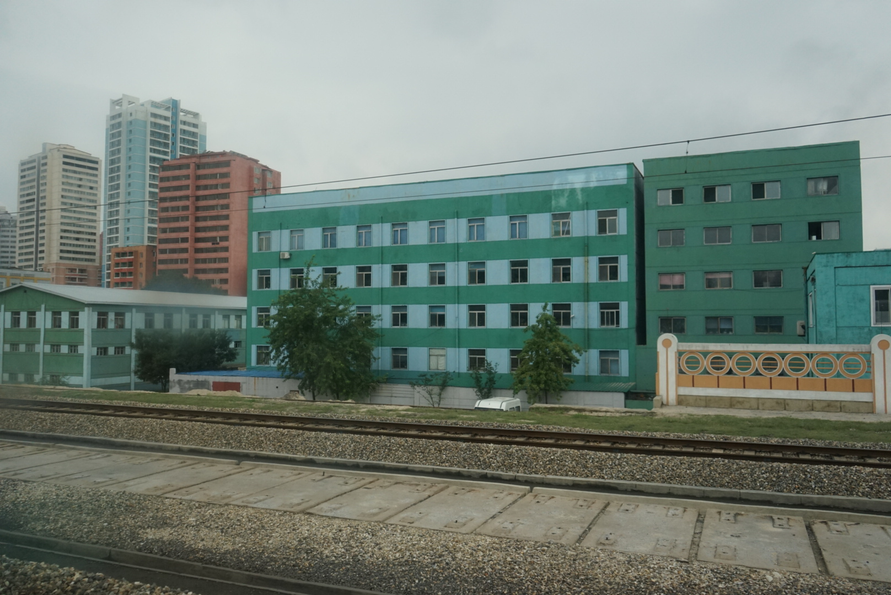

田野确实很苍翠，很好看，一大片一大片的，有种江南鱼米乡的感觉。小学一年级的时候，我读到“江南鱼米乡，小小竹排画中游”的时候，我脑海中浮现的就是一条大河的两边，一望无际的水稻田。我本身是湖北孝感人，只是我们的位置多丘陵。但是后来我在湖广、江浙都没有看到过那样的景象，可能是我去的地方不对吧。

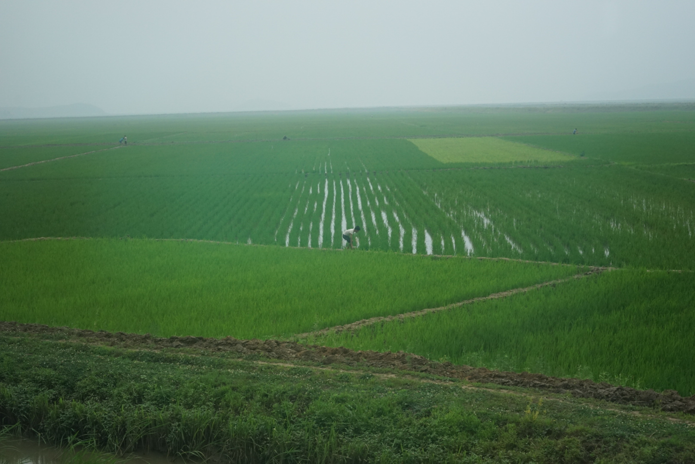

在田野里集体劳作的人们，会在火车经过的时候看向我们。

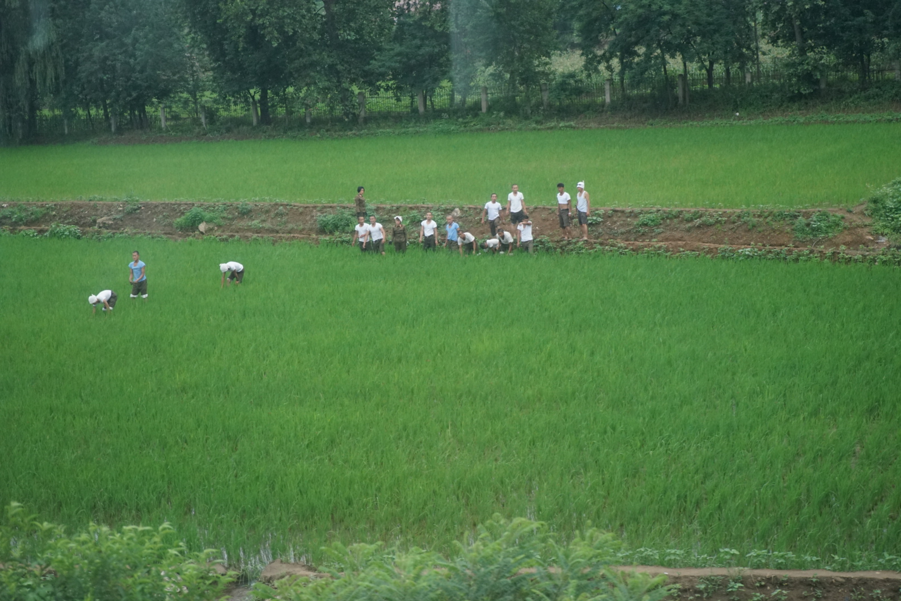

我注意到，他们貌似特别在乎他们种的树，或许是果树。一路上很多的树周围，都围起了白色的鹅卵石，应该是为了方便灌溉以及美观？我觉得挺好看也挺有意思的。

另外一不小心，看到几辆卡车拉着大炮从远处路过，我赶紧拉近镜头偷拍了一下。这么远肯定发现不了我的，要不然这赤裸裸的偷拍军事设施，不小心就会被安排个间谍罪的啊。拍完后赶紧藏起相机，假装什么事情也没有发生。

然后我就开始睡觉了。我们到了平壤后，大伙就下车了，接待我们的是一名男导游，我内心失望了一下，说好的美女导游呢。但是带领我们上汽车后，介绍了我们还有一位女导游，我们回头看了下车最后一排，是个很漂亮、甜美的小姑娘，而且很眼熟，我应该在之前别人的游记上，有看到过她。

汽车开动了，男导游首先欢迎了我们，然后在前排介绍：当前的大街的名称，什么时候修建的，为了纪念什么而修建的，街道两旁的主要建筑物，以及朝鲜的居民楼和一些习俗。很快，我们到了凯旋门，导游有介绍，这个凯旋门高60米，比巴黎凯旋门高10米。我们在这里停车观光，并且最后上到了凯旋门顶上去，看看周边风景。

后面就是我们的旅行车，在后面的建筑物是电视塔，还是很高的。导游笑起来的时候，确实非常的甜美。我们的导游都很好，不太限制我们拍照，可能是我们比较配合？其实我们路上能见到的，也不会有什么机密的事情，顶多是一些不美好的事情罢了。导游露脸，应该不会带来什么麻烦把？我感觉不会，凭我这几小时下来的体验，网络上的舆论确实把朝鲜宣传的过于封闭了；而且，既然允许我们合影拍照，应该就不会有问题。

我们坐电梯到了凯旋门顶上后，吹着风的感觉还是很棒的。我们看了看周边，感觉还挺不错的，他们城市里的楼房很多都是五颜六色的，圆形的体育馆看着也不错，远处很有特色的尖顶建筑------柳京饭店，外观终于装修完了，我们看了看，拍了拍照，吹了吹风就走了。门票30元，感觉还是值得的。

来一张我在凯旋门的照片压压惊吧。

再来看看他们的电视塔，我觉得还是蛮高的，不过貌似比北京电视塔要矮一些。

体育馆，导游特别的介绍说，在朝鲜，它的地位就跟北京的鸟巢体育馆差不多。导游很喜欢把中朝的一些建筑物，人物进行对比，看来中朝还是传统友谊啊。

还有这个前面说到的柳京饭店，造型独特，很多人也从网上知道了------这在朝鲜旅行的游记中是个梗，确实也蛮高的。记得是105层？

我们可以看到，不光地铁沿线，朝鲜的房子整体而言都是花花绿绿的，大片大片的，看上去还蛮好看的。

差不多了，再上车转了转，就把我们转到了饭店了，这是我们第一次吃朝鲜饭，盒饭除外的话，我们当然很激动了。结果菜还没上全，我们就迫不及待的开吃和拍照片。喝的有好几个花样，啤酒和米酒，当然还有别的果汁饮料，我点的啤酒，扎啤，貌似也是大同江品牌的，味道很不错，比较鲜冷可口。

慢慢的，菜终于上了，我们给菜拍了个照片，还挺丰盛的。如图：有水饺鸡蛋汤，鱼丸，白菜粉丝，土豆牛肉，蛤喇，黄瓜，白菜，后面还有鸡肉照片没有拍到。我们四个人吃一份，当然足够了，主食的话有米饭和馒头，再加上水饺，整体而言非常的不错的。

两位导游和我们不在一起吃，在另外的桌子。我们吃完了饭，喝完了酒，就准备出去了。在饭店门口，有卖衣服的店子，也卖各种饮料、特产、蜂蜜、人参等。小女孩的朝鲜民族服装特别好看，但是他们是挂在一起一个圈太多了没法单件拍照的。于是我拍了个这个。

然后我们就坐车到酒店了，羊角岛国际酒店，是朝鲜的特级酒店。导游解释，之所以叫羊角岛，是因为岛的轮廓外形类似羊角。来张酒店牌匾的特写吧。

看一下酒店的大堂。

酒店大堂的水族馆。

酒店大堂的电视广播。

酒店一楼的中国餐厅。不过我们明天不在这里吃早餐，我们在1号餐厅吃早餐。另外，准确的说，是2楼，因为底下1楼是娱乐场。和我同房的大哥，他说不去了，我今天也懒得下去了，明天再一起去看看吧。

上楼后，第一件事就是想拍个夜景。但是我实在拍不好夜景，这个得好好学学以后，先凑合着看看吧。

游记写完了，同屋的哥们早已经睡着了。没网的日子，写游记倒是能很专心，我准备洗澡睡了。期待明天的板门店之旅。

#### 第二天，开城-平壤，2017-07-10

早上起来第一件事，就是重新拍一下窗外的全景，把昨晚没有拍到的全景重新拍一下。

由于镜头不是广角，并且江实在太宽了，所以全景并不好看。来一张一侧的吧，这是右侧的景色，左侧的主要就是彩色的屋子了。

拍了一张酒店往底下看的照片，酒店确实就在江边的岛上。

好了，吃早饭了。酒店的早饭一般就是自助了，感觉羊角岛酒店的早餐还是不错的，本想吃个煎蛋的，但是鸡蛋被人吃完了。

自选餐台吃的东西还是很多的，觉得他们的泡菜确实好吃，不太咸也不太酸，口感真的很不错。

吃完早餐，我们就出去坐班车了，先去西山酒店接住在那边的一对父子。

然后我们就出发了，目的地就是38线附近的板门店，我们要前往军事分界线。在车开了一会儿后，回头看我们住的酒店，还是蛮高的，47层，最顶层是旋转餐厅。高高的大楼，却又显得有些孤独。

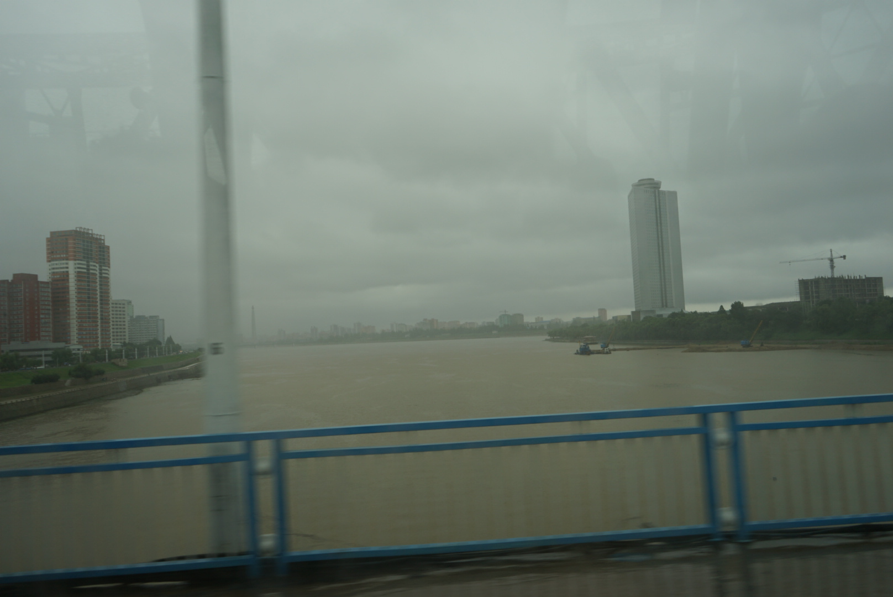

在开车的路上，我就随便拍拍，司机开车很猛，这时候我觉得相机的五轴防抖和运动模式终于派上用场了。

青草和穿环卫服的女工：

一个不错的体育馆：

我们路过的街，导游介绍，我记得应该是未来科学家大街，一栋很有特色的楼，但是拍的太糊了：

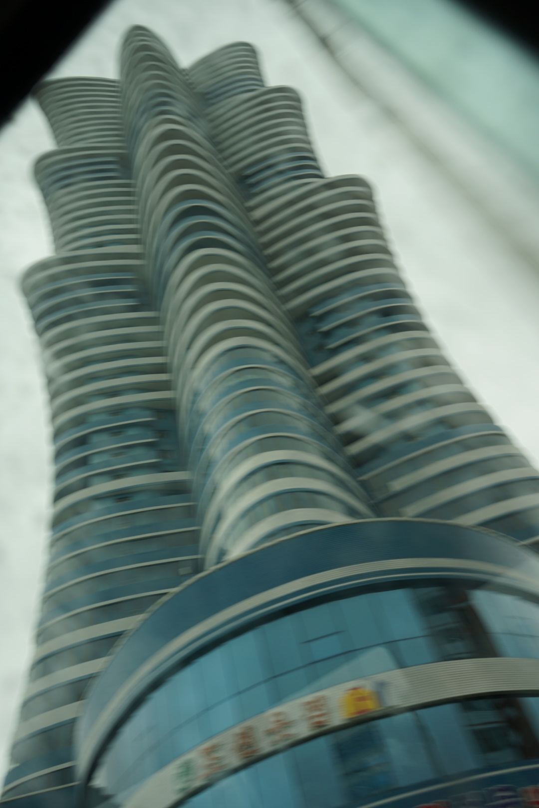

一路上，发现他们有的居民楼和大楼还是很不错的，与国内一线水平差不多，当然了，那些是少数。

通过一路上的观察，汽车有不少，比亚迪、北汽等占据了很大市场。客车有宇通、丰田、现代等品牌。对于大多数居民而言，出行是自行车，各种各样的都有；也有一些电动车，看牌子不少是中国的产品，大多数都比较新，或许是最近才流行的；摩托车数量比较少，一路上很少看到，跟泰国的摩托车王国没法比，应该跟石油禁运有关系，导致汽油供应不足。

骑自行车载物的市民：

骑着崭新的电动车的市民：

骑摩托的男交警：

我不记得朝鲜族有头顶东西的习惯啊，我的印象里非洲的部落有这样的习惯，我觉得扶着东西还好，不扶着还能稳稳当当的，真是需要本事的，也是不容易：

穿着时尚的女青年：

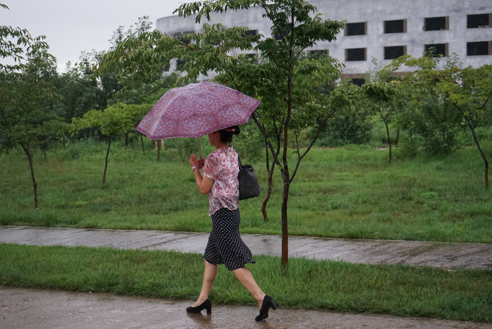

汽车继续往前走，一会儿就到了这个建筑物，这是很出名的，名字我没听清楚，回去网上查查，但我当时在备忘录上快速记下如下几点：

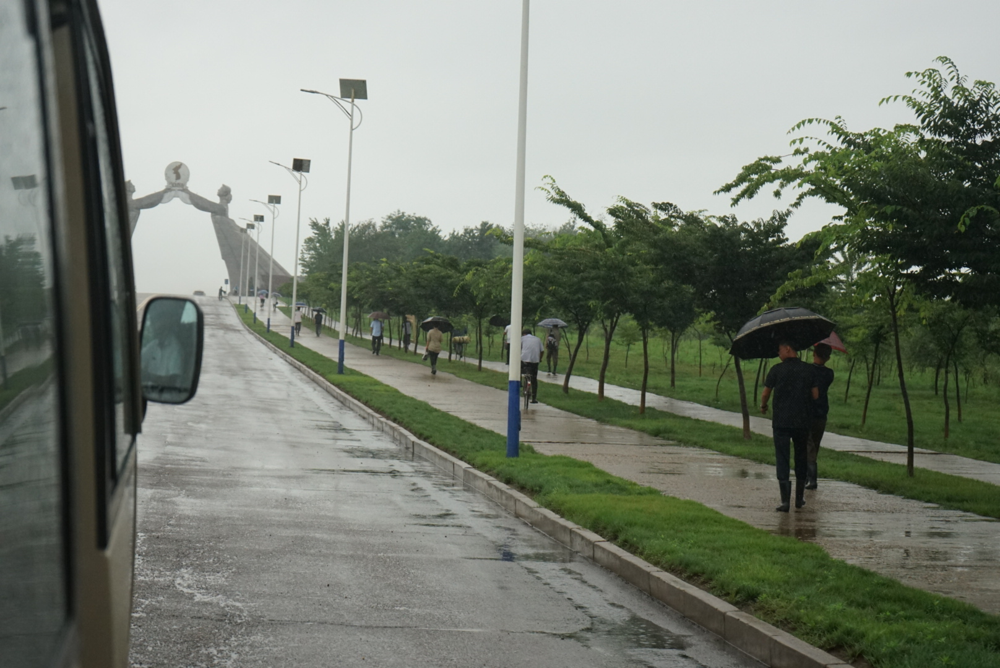

两个女性的姐妹花形象是一模一样的，象征着南北朝鲜是单一制民族；手捧的是祖国统一三大宪章。

在介绍这些的时候，导游是很激动的。讲了很多朝鲜的历史，从谭军朝鲜、古朝鲜、晚朝鲜、后朝鲜开始，讲到了高句丽，再到高丽，再到 Korea 这个英文单词的由来，到日本帝国主义的殖民统治，到1945年的南北分裂......说实话，作为大国间的小国，朝鲜的命运确实飘零，朝鲜民族的历史，是复杂而又无奈的，有些命运也是值得同情的。导游提到了不少祖国统一的问题，比如详细的解释了三大宪章，介绍了2000年6月15日，金大中和金正日的促进祖国统一的会晤，提到了南方提出的联合制，北方提出的联邦制。提到了经济合作和均衡发展经济，促进经济文化交流的一系列问题。也提到了2000年9月63名关押在南朝鲜的非转向长期囚得到释放的问题，导游特地介绍了非转向长期囚的意思：就是被南朝鲜拘捕的忠于革命的北朝鲜革命者。

导游讲着讲着，情到深处，停不下来，又讲到了朝鲜的粮食紧缺的问题，又提到了朝鲜为了解决粮食紧缺的问题所采取的措施。我记下了一共5点：

1.进行绿色革命；2.大力推广二熟制；3.遵照主体工作法的要求；4.大力增加山羊和养鱼；5.生产复合微生物肥料，有机肥料，发酵肥料。

导游说到，朝鲜的土地不利于农作物的栽培，但是朝鲜还是努力实行自给自足为主的政策。氮肥国内生产，钾肥和磷肥从国外进口。也提到，在社会主义市场瓦解的时候，受制于能源问题，朝鲜甚至都无法开动农业机械。但是导游没有提国际援助的事情，这也可以理解，当着外国人的面提这个总是不光彩的事情。而且“为主”二字并未否认对国外的依赖。但是他提到了粮食都是计划的，由农场和农村合作管理委员会来管理和生产，没人每年260斤口粮，剩余粮食由国家收购。

关于粮食，差不多就介绍到了这里。导游又介绍了朝鲜的男女平等和政府鼓励生育的措施。由于国家政策和民族传统重视孩子和孕妇，因而产妇的第一胎大多都是回娘家生。也讲到了生孩子越多越好，生得多的会被授予模范母亲的称号。我们问导游，多少个会被授予呢？导游开玩笑的说：十个更好。不知道这是玩笑话还是真实的。不过联想到我们中国以前也是一家生六七个，感觉10个也不是那么奇怪其实。导游说，平壤的妇产医院的地板，铺着价值连城的宝石，作为国家重视生育的象征。平壤的产妇，如果生三胞胎，国家会接到平壤的妇产医院，休假住院200天。在民族传统里，如果生的是男孩，会给小孩买弓箭，如果生的是女孩，会给小孩买针线。同时导游提到，现在国家提倡晚婚，希望年轻人能多为国家做事情。

与此同时，我们也隔着车窗拍照，因为下着雨；雨小或者暂停的时候，我们也打开车窗拍照。

通过对窗外田野的观察，发现农业可能存在两个问题：1.大面积的土壤是红土，这是不及黑土地的养分的；2.我觉得很多田地的灌溉设施略有问题，沟渠和田地的相对高度太小，几乎平行，没有比较好的水渠，这样很容易被淹没。事实也证明了，我看到不少旱地有积水。我从车上看到的是，公路两边都是大片的平原，远处便是山。朝鲜多山地，平原应该是上千年在山间的小平地或者小平原上慢慢开垦出来的，加上这几十年大力垦殖而得来的。

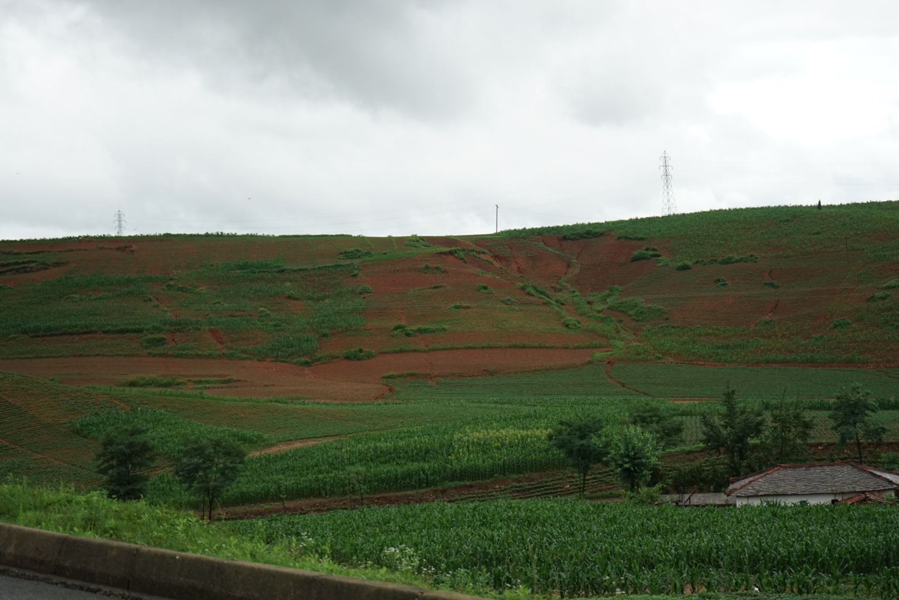

不知道是因为雨季，还是因为红土壤加上开垦过度，河里的水都很黄或者很红，水土流失的问题，中国也是经历过的。

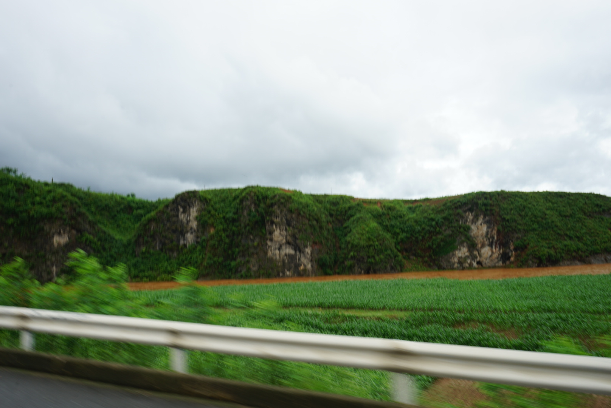

导游讲完了这些，也休息了。一会儿就进入了军事区了，导游提醒我们，军事区严禁拍照。一路上，我们看到了一些士兵站岗，这个自然不敢乱拍，间谍罪可不是闹着玩的。没法拍照，我们基本就开始准备睡觉了。到了大概一半的路程，有一个休息区。

我们下车休息，看看休息区的小商店。我看到卖的梨质量确实不够好，但是个子很大，西瓜的个子却比较小，应该还是品种问题，并不一定是说这个西瓜不够好。

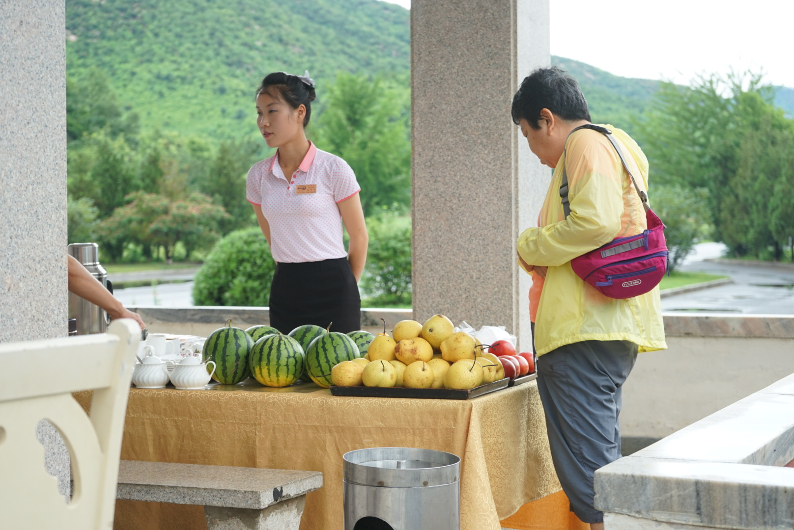

在休息区休息的时候，看到了一辆现代的车，这都是朝鲜接送旅行者的车，并不是韩国人的。

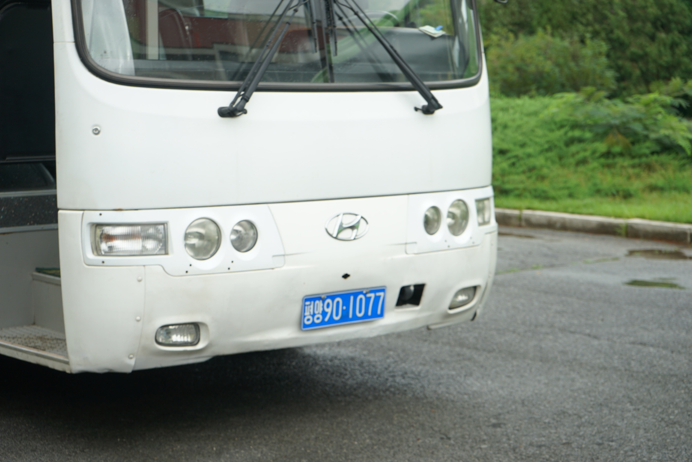

上车后，导游开始跟我们讲开城了，接着之前的朝鲜历史继续娓娓道来。也提到了开城工业区，说开城工业区的开发停止了，责任在韩美，但是没有做过多的解释。导游开始介绍开城的一些历史，比如成均馆和高丽参等，还有类似于中国同仁堂的药品安宫：由麝香和牛黄制成。特地提到了朝鲜的这些药品和人参等都是纯天然的，因而药效会更好。高丽参确实很出名，但是我对中药的气血和滋补那一套不太信，最起码其理论无法让我信服，因而我到了开城后就只买了两包人参糖意思一下。而且人参也实在太贵了，一根要2000元，我哪里买得起呢？但是我在路上和团友们还是预定了人参炖鸡，260一只，我们其中的6个人定了2只。这个因为需要炖很久，必须要提前预定。

一会儿，我们就到了板门店了。我们在一个地方下车，导游要等手续，我们就在里面拍照。我在那副画着分界线的图面前拍了张照片，算作留念了。

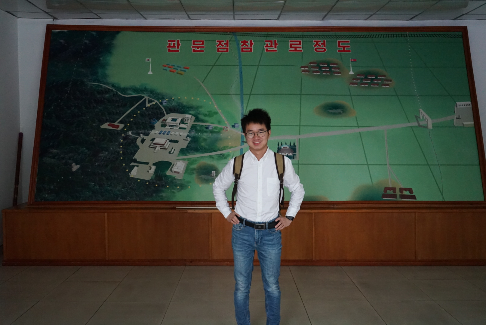

仔细看图，虚线圆圈的部分，就是我们一会儿将要去的地方，也就是军事分界线。那中间的蓝色和白色房子中所经过的虚线就是了。注意，这个虚线不是直的，它的延长线两边都是弯曲的。我们可以在朝韩两国国旗中间找到其延伸线，快要跟河流重叠的位置。38线是以前的线，这条线才是现在的军事分界线。

趁着我们还没走，我们拍了拍照。

身着朝鲜传统服装的女售货员，这裙子很好看，但是我觉得里面有撑子------那也好看。

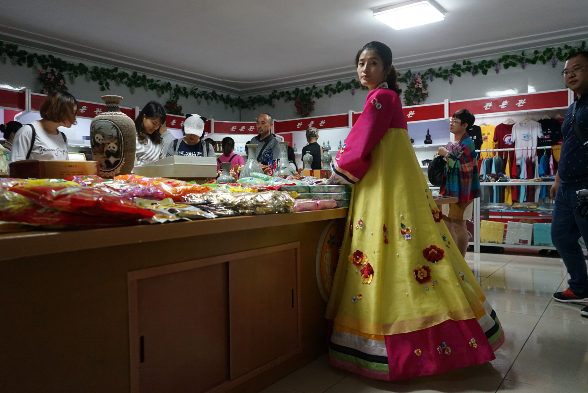

身着朝鲜传统服装画作中的女性形象，真是好看。

之前导游有介绍过，我们也看到了，朝鲜女性服装上衣是很短的，只到腋下。而裙子是连衣裙，就很长很大了。这里有很多展示画作，有的让拍照，有的不让。

这种杂志，我们应该都很熟悉，我记得小时候我很喜欢看各种书，课内课外的我都很喜欢，这种杂志画面我看到过不少。

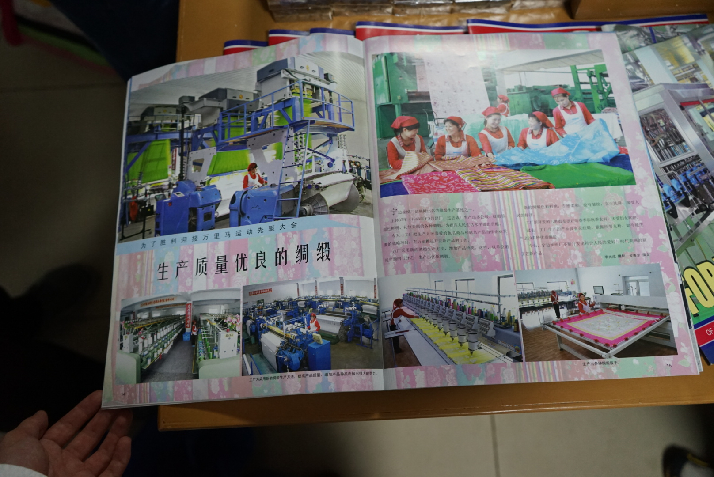

黎明大街，我觉得确实很好，我们可能是乘车路过了，但是没有拍到照片。

我们来看一下高丽参的模样，看着很好看的人参，也确实买不起。

我们逛了一会儿，导游就安排我们坐车过去了，这里上车什么的都要排队，为了维护秩序。导游在车上跟我们讲，在军事分界线的朝方2公里内，还有村庄，村民为了安全，会携带手枪和单发武器。

根据网络资料，军事分界线附近埋有大量地雷。并且，板门店在过去的几十年里，发生过多起冲突，甚至一度发展到美韩军队要进攻开城市区------这能在网络上搜到，砍一棵树引发的冲突。

因为距离不远，我们一会儿就到了，我们看下门口的石碑。

进去之后，军人便进行讲解，由我们的美丽的全导进行翻译，只有在这里，给军人拍照，不会不被允许。这是朝方的旗帜。

这是联合国军的旗帜，也就是美方的，竖着的是复制品，盒子里摆放的是原件。介绍的军人说，美方仓皇而逃，因而还没来得及带走他们的旗帜。

大家在听讲解的时候，都是面目严肃的。作为中国人，是很熟悉这段历史的残忍的。抗美援朝中国作出了很大的牺牲，这一点导游在之前的讲解中也是承认的。

这是签署的停战协议的副本，静静的躺在盒子里，诉说着那段历史。

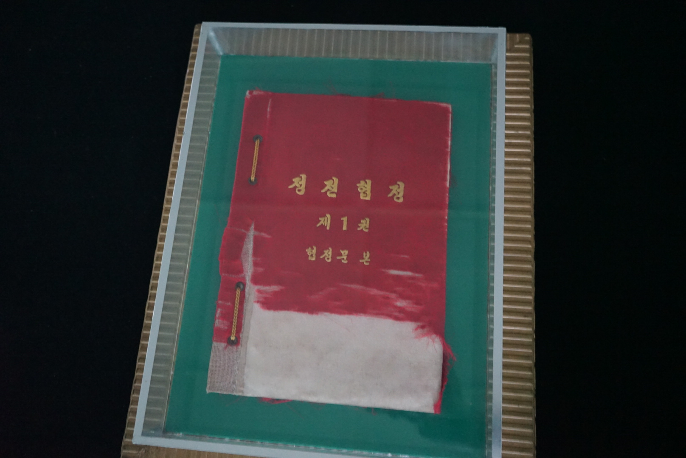

导游和军人讲解的时候，我们是被允许坐在凳子上拍照的，后来，导游说我坐的那边是美方。啊，我竟然代表了美帝国主义。背后的摄影师，是今天的跟拍摄影师，貌似明天后天还会继续跟拍------我觉得长得特别像我的同事。

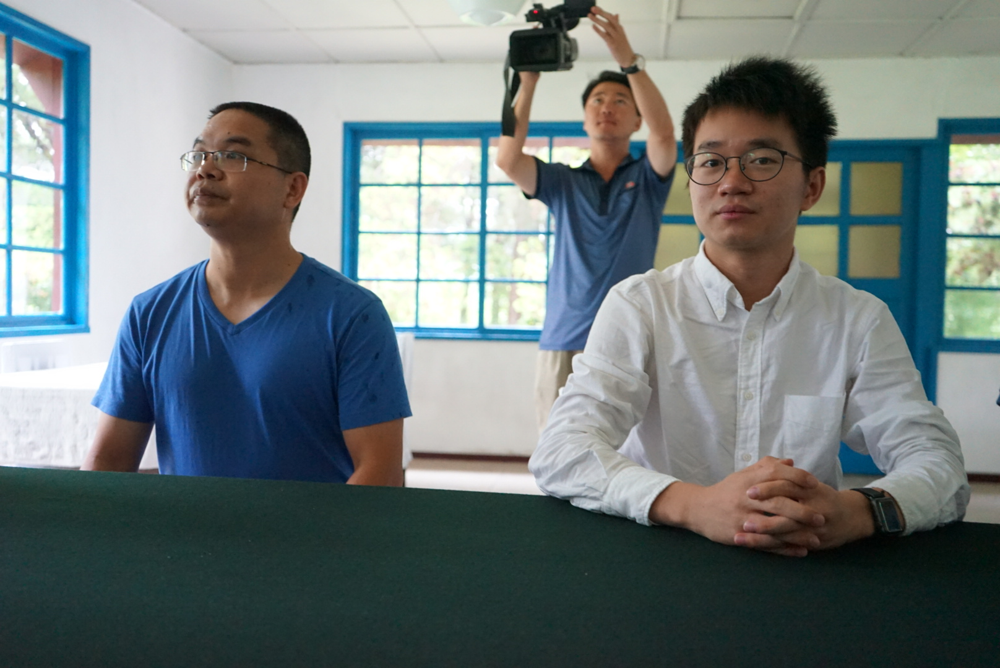

当然了，室内房子这么大，当然会陈列很多的照片。

还有其他各种照片，我就不贴图了，有领导人视察的，有火箭发射的，我们中国人都很熟悉的场景。最后离开之前，我拍了张大厅的小全景图。

接着，我们就要去军事分界线了。远远的，我们就能望见朝方的国旗了。据说，当初，朝韩双方比拼国旗的高度，最后，朝方赢了。韩国就不继续比下去了。

到了之后，就是前面提到的几件小屋子，我拍了好些照片。我选一张全景照吧，朝韩双方的国旗都在一个画面内------如果看不清双方的国旗，那么是显示屏的问题，仔细看的话一定能看到。对面的建筑就是韩国的前哨了，上面挂了很多摄像头，一大串。这些建筑，以前在网上也都看过，这次终于来现场了。

导游在来的路上，几次说到：军事分界线，几十年来，只有鸟儿可以飞过，人却过不去；开城有很多家庭，有亲人在南朝鲜，他们几十年来面临骨肉分离之苦。这让我想到了我们的台湾海峡，以及余光中的诗。

哨楼上，我们拍了一张朝方军人的照片。韩方那边是没有看到人的。而且据说他们约定，上午朝方在公共的房子里，下午韩方。上午朝方游客参观，下午韩方。公共的房子就是中间那栋，也就是左数第三栋。其他房子的话，蓝色的是韩方，白色的是朝方。我们看到第三栋房子这边有朝方军人站岗。

我们也进行了团队合影，这是导游主动要求的，我们也用自己的相机也拍了一张。10个人加上全导带的2个来自北京的大哥，一共12人。

然后，我们去观看了手迹碑，也就是金日成最后的手迹，他看完资料写下这几个字后，没几个小时就去世了，导游说，真是为了祖国统一付出了一切啊。

接下来，我们坐车去高丽博物馆------成均馆，是列入了世界文化遗产名录的。

来张石碑的照片吧。

一进门，好大的树，导游介绍说，4个人可能都一定能手拉手环得下。确实很大的，介绍说1000多年了。

馆内展出了很多文物和字画。

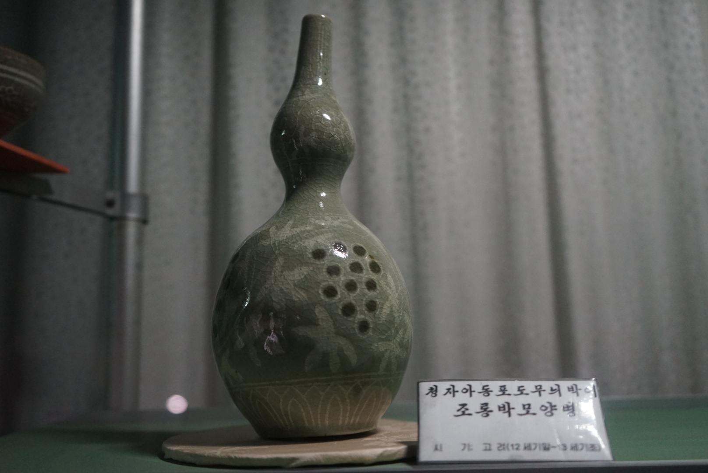

逛完了，我寄了两张明信片，还有两张没来得及写，我们就要离开了。离开前拍一朵小花。

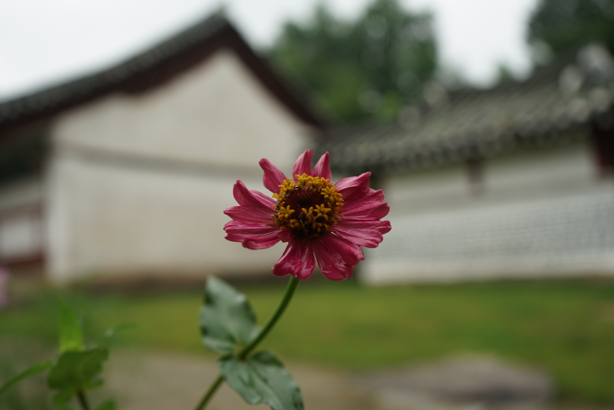

我们这次是直接到饭店。我们最期待的就是这一顿了。因为有开城的九铜碗宴和人参鸡。但是还没进门，就让门口的商店吸引了去了，真的很漂亮的小女孩的衣服，这次拍一张，以后好想生女儿啊。可是我却不知道未来愿意和我生孩子的姑娘在哪里，长什么模样。

上菜的时候，盖子都是盖着的，打开后果断拍照留念。后来又跟我们上了个土豆汤，我没有拍进去。

我们定的人参鸡做好了，你看着很美味的样子。主要就是一只鸡，好几根人参，还有就是糯米一起炖的。

我盛了一些，特地舀了根人参，来个特写。汤确实特别好喝，我吃了根人参，有些苦的，他们说苦了好，我咋感觉像逗小孩子吃药呢？后来，我又吃了根人参，不知道晚上会不会留鼻血。

因为特别好吃，我们同行的团友给漂亮年轻的女服务员100元小费，她没收。100元对于物价低和计划经济的他们应该是蛮多的钱了。一个涉外导游的工资也才700块左右。顺带提一下，今天的一些商店的汇率按照15.625计算的，但是黑市上据说能1元人民币能换1000多朝鲜元，足以见其经济问题，因而商店只用人民币甚至美元结算，而拒绝朝元。

于是，我们好好的吃了顿饭。吃完后，就准备回平壤了，先去了万景台故居，也就是金日成出生和成长的地方------13岁在这里走上了抗日革命的道路。

这时候的天气出奇的好，莫非伟大的领袖金日成同志...先看下全景图。

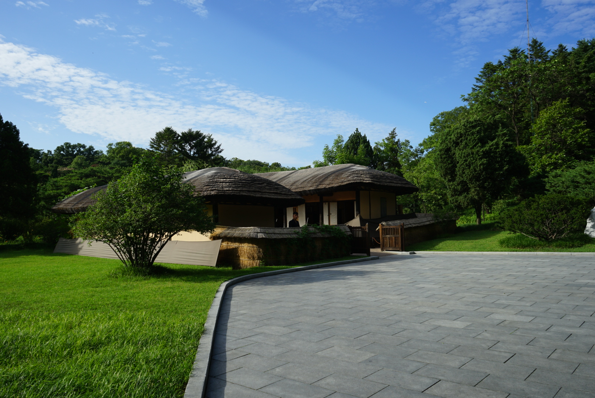

这口坛子，在朝鲜旅游攻略和游记里能算作是网红了。

不远处，有一口水井，金日成用过的，我们打了桶水都喝了一口，挺好喝的，想起了小时候家里的井水。

瓢我觉得很好看。拍了一张照片。

然后，我们就走了，去今天非常期待的另外的一个目的地，平壤地铁，深入地下100多米的地铁。

首先，感受就是深不见底。

看一眼站内全景，有些像北京地铁1号线的感觉，灯比较豪华，这是北京地铁所没有的吧我记得。

看一眼萌萌哒车头，还是蛮可爱的，就是款型确实老旧一些，但是油漆刷的很新，很亮。

金主席的大壁画特写。

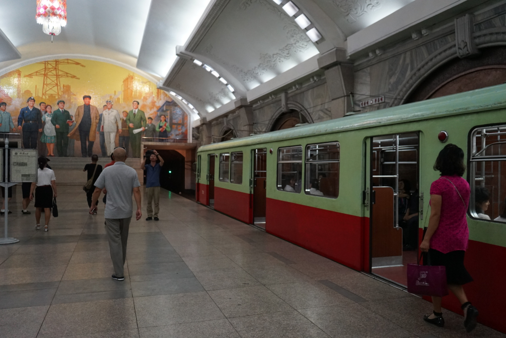

侧面壁画特写。

读报栏和读报的市民特写。

我们帅气的男导游，露个脸。

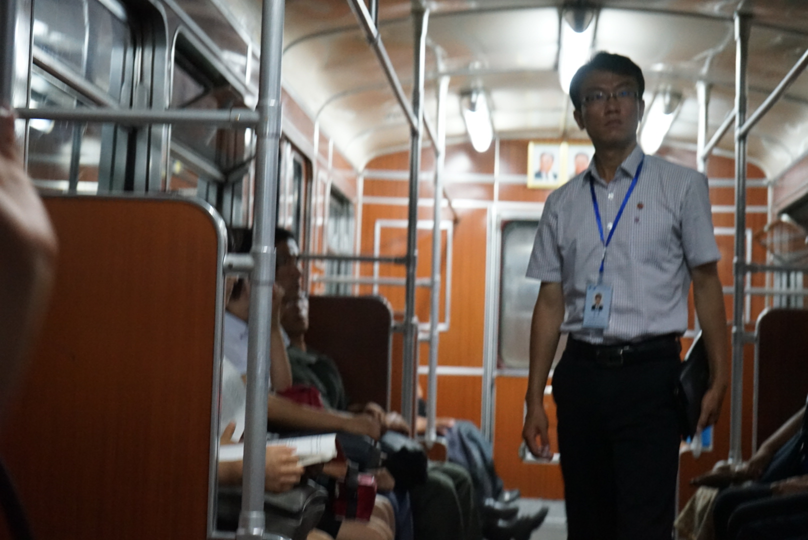

我和平壤地铁的合影。

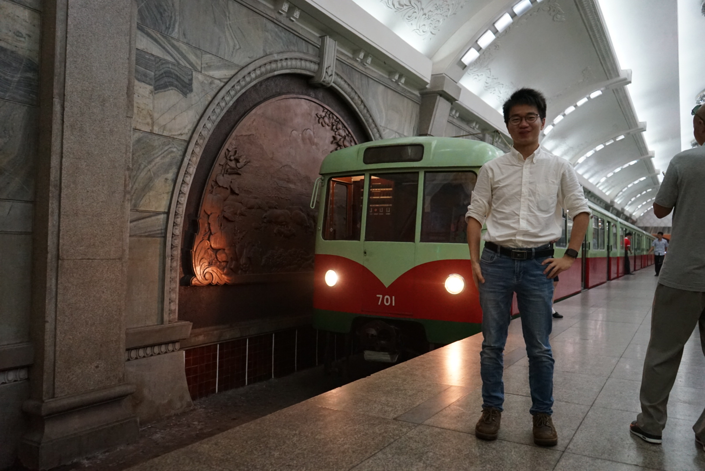

我们坐的地铁只有一站路，从某个始发站山车，下一站下车。然后我们坐车去了一个邮票博物馆。坐车途中，我们想好好拍一张女交警的照片，但是未能如愿，唯一的一张正面的很近的，结果，照片由于对焦没对上，模糊了，啥都看不见，来张远点的凑合一下先。

导游今天跟我们开玩笑的解释说，为什么平壤女交警多呢？因为开车的司机男的多，男的喜欢看女的，更喜欢看美女。看到美丽的女交警，就会减少车祸和事故。我觉得这个理由很合理，人性洞察的很透彻。

邮票博物馆就是各种邮票了。有两位对邮票不感兴趣，想去大街走走不上去邮票博物馆，被导游拒绝了。展现几张邮票和明信片的照片吧，这里的邮票和明信片，又红又专的比较多，在成均馆的时候，还有那种很文艺的瓷器的明信片的。

首先，先贴出伟大的人民领袖金日成和金正日的纪念邮票。

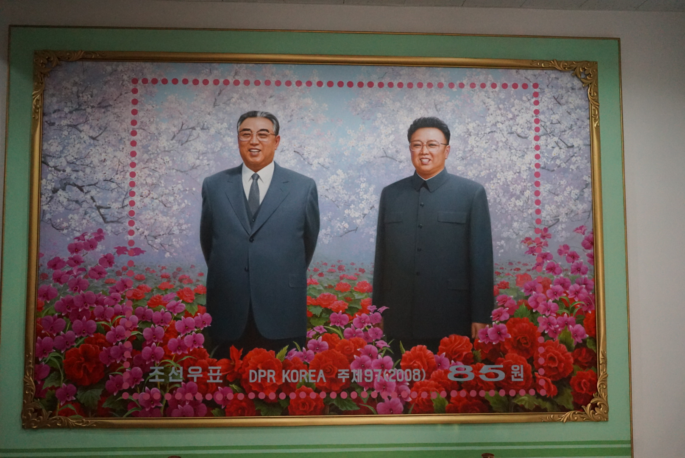

一举粉碎美帝国主义。

来一张文艺一点的。

中朝友谊源远流长。

先军朝鲜。
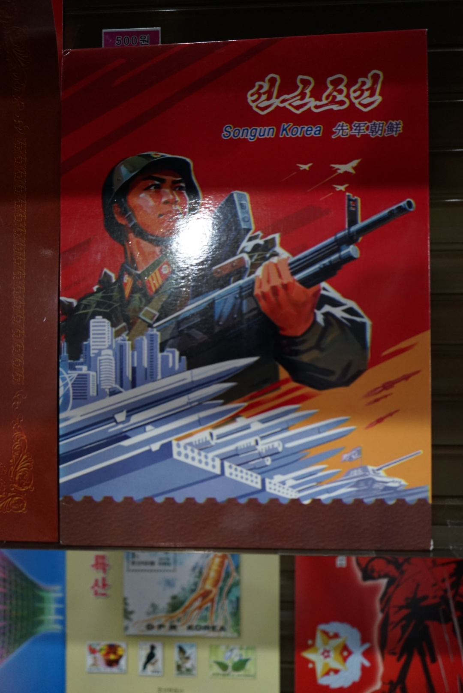

朝鲜的足球不错，中国的足球没希望啊。

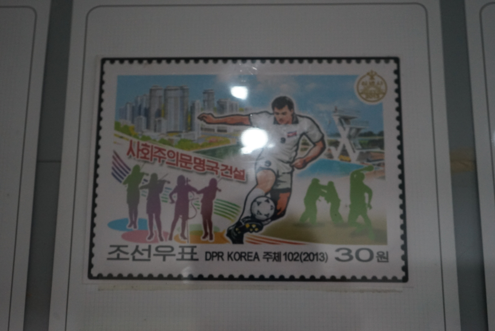

看不懂文字，也没有问导游，也没得网络来查。看着像是搂着炸药包去炸碉堡，想起了董存瑞。

这几张差不多了，我没买邮票。但是我买了个纪念胸章，中间的小旗子的那款。这跟朝鲜人自己佩戴的是不一样的，那种是买不到的，只有组织发。

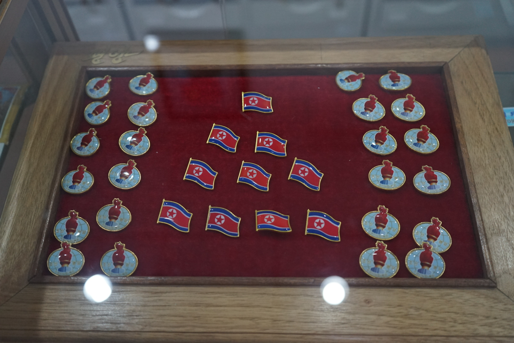

逛完了邮票博物馆，就又到了晚饭时间了。这一次主题是，朝鲜冷面。

关于朝鲜冷面，今天导游在讲生孩子和结婚的时候说到：在朝鲜，吃冷面是结婚必备，因而，如果问别人什么时候结婚，就一般问，什么时候吃他的冷面？挺有文化的问法，也觉得蛮有意思。

晚上的饭菜也还挺好，牛肉，鸡肉，饺子，泡菜，白菜，米酒，啤酒，肉卷，土豆粉，还有啥来着？还有鲻鱼豆腐汤。差不多了就这些？对了，还有豆沙包子。照片只显示了一部分，因为后面上菜的时候前面的已经吃的差不多了，就没再拍了。

话说泡菜实在好吃，我们又要了一盘，10元。我们吃饭喝酒喝了好久，今天我喝的米酒。朝鲜的米酒有一种把我们老家孝感米酒打碎了感觉，我们是一粒粒的大米粒，他们的是碎的白色的糊状物，比酸奶要粗很多，也稀一些，但是口味跟我们孝感米酒很像，酒精度应该是略高，我杯子里就是。后来我喝完后，他们又要我陪他们喝酒，那就再来一大杯啤酒了，第一杯无论什么饮品免费，另加了一大杯5元钱，小杯子的话是2元钱。

我们喝酒吃饭吃了好久，吃完了天已经黑了，于是我们回酒店。回去后我们一起去底层的娱乐场和顶层的旋转餐厅看了看，没啥好看的。娱乐场就是打保龄球的馆，健身的跑步机，还有台球，乒乓球，还有理发店，还有商店，还有啥来着，修鞋子的店，应该是专门为女士高跟鞋服务的，对了，还有 SPA 和 Massage。也没啥人，顶楼的旋转餐厅更没啥人了，啤酒一瓶30元人民币，我们觉得有点儿贵，加上晚上喝过了，也没法再喝了，就转了一圈下去了。

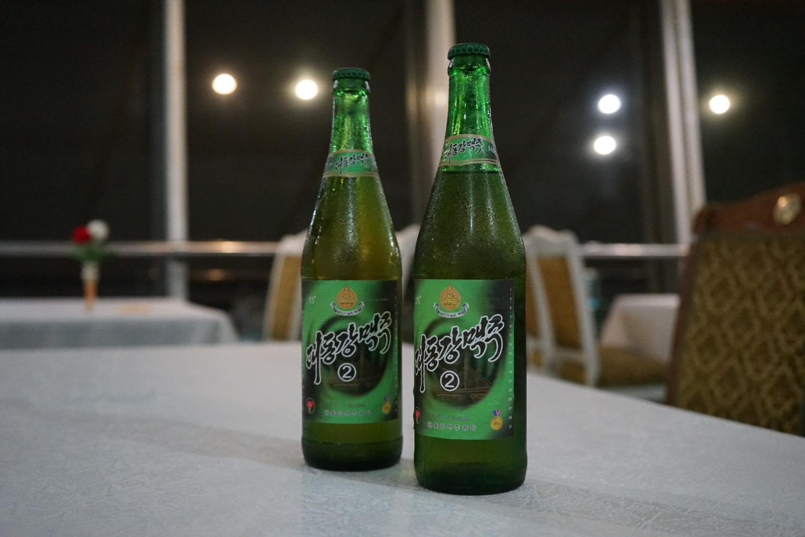

我室友回来就睡，我洗完澡写游记写到现在，现在是3点了凌晨。我想了想，我这贴的照片太多了，我得隐藏起来。决定用 git 来隐藏内容，不然万一查我电脑，就说不清楚了。建立个没敏感内容的新分支，切换一下，就能完美解决了。需要的时候把分支切回来即可，他们不可能会操作 git, 也就不可能会找到我写的东西------真是个很棒的注意。

搞一下，睡了，期待明天去妙香山。

#### 第三天，平壤-妙香山，2017-07-11

早上起来，在酒店吃完早饭，就等车过来接我们。感觉车晚了点，我们就在周边溜溜，反正也没法溜远，勉强拍了张酒店正面全景图。

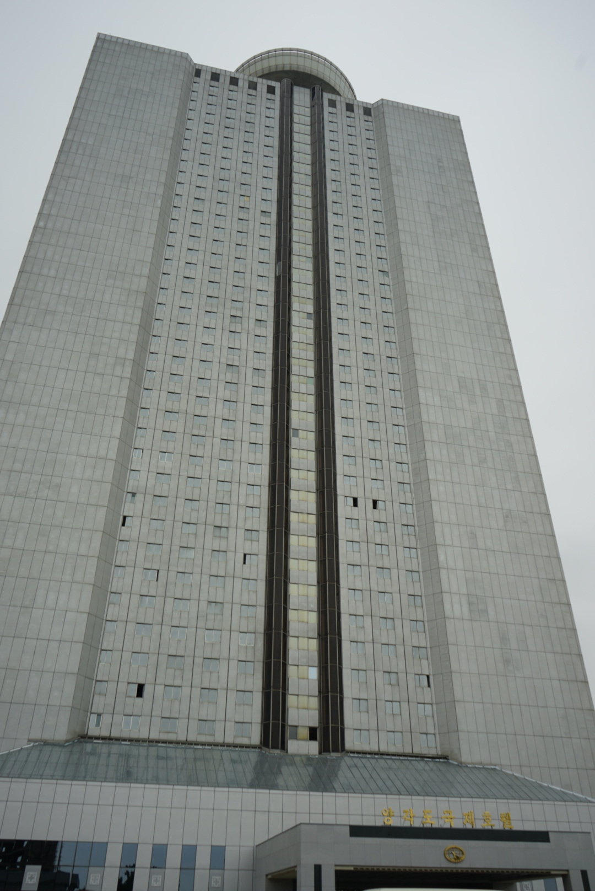

昨天晚上写游记睡太晚了，上车没一会儿就睡着了。等我醒来的时候，已经快到景区了。不过，中途我醒了好几次，因为路况的原因，并且我们坐在后面，因而车特别颠簸，瑟瑟发抖，抖醒了我好几次。

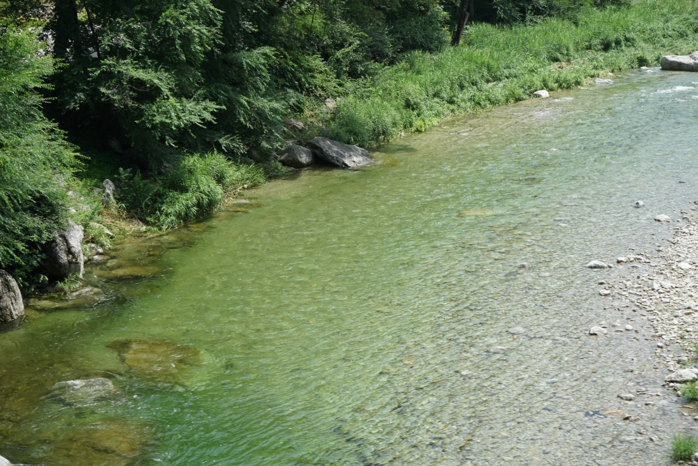

我看到了一辆运包菜的汽车，很有感觉，拍一下。主要是车很有感觉。

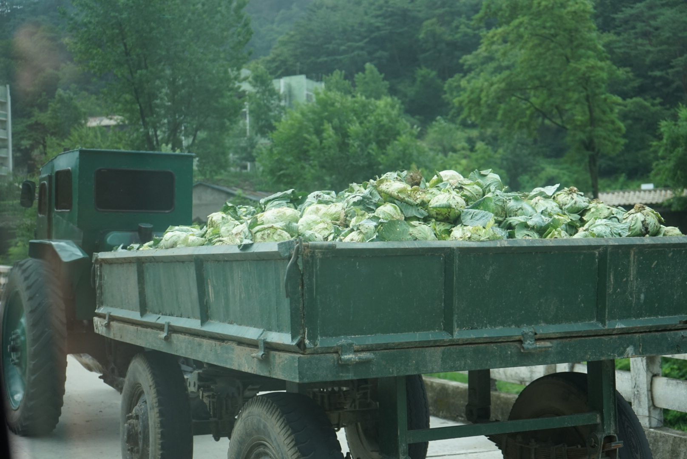

很快就到了，导游过来接我们。这位女导游年纪不小，但是挺好看的，关键是：特别害羞！会捂嘴，会脸红~

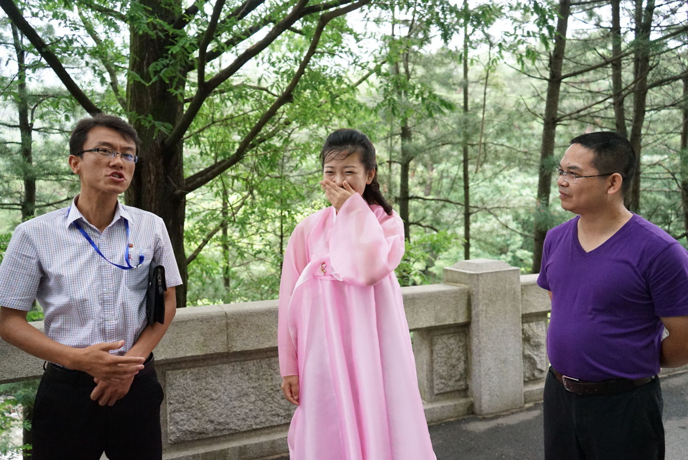

然后，我们到的第一个地方是，世界友谊博览馆------各国领导人或政党，各公司总裁或经理，民间团体甚至个人，送给金日成、金正淑、金正日、金正恩的礼物。门口的两位军人看守的冲锋枪，银光闪闪，镀了金属漆，应该是镀铬。

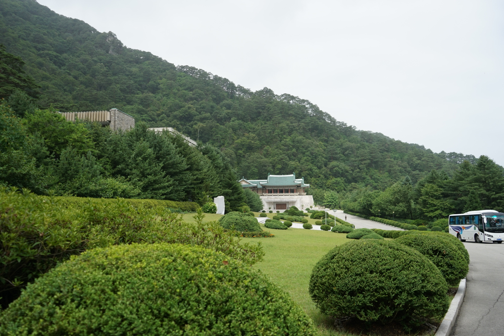

进去这里什么都不允许带，非常严格，相机甚至房卡都存了，因而无法拍照。墙壁的电子屏幕上显示着礼品的总数，一共有11万4千多件，数字当时没用心记下来，说是要想全部逛完，那可得不少时间。我们总共逛了1个多小时，逛了多间房子，有中国、俄罗斯、叙利亚、新加坡、日本等100多个国家送的各式礼品；有沈飞送的镀金坦克模型；有来自湖南的农民送的刺绣等等，各式各样。从各路礼品来源看，中俄应该是数量最多的；从礼品去向看，送给金日成的最多------毕竟金日成的历史地位还是难以动摇的，虽说是社会主义国家，但在国际上的声誉，哪怕是资本主义阵营里也是受到尊重的，到了他儿子和孙子这一辈，就逊色太多，越来越不受待见了。

逛完了礼品馆，我们就出来来到顶层的楼台，这个时候存放的相机和背包已经可以领取了，也可以自由拍照了。妙香山的名字的来由是，进山就能闻到松树的香味，确实是这样子的，我们来的时候在车上就闻到了，松香。来一张山景吧，山色确实很不错，其他也没什么。据说这里有金矿，但是金日成为了保护妙香山的美，没让开采。

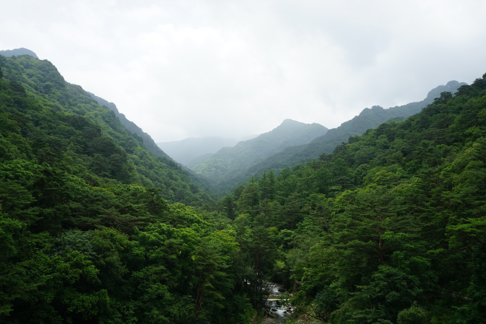

我们在楼台上吹了好一会儿风，他们喝了杯咖啡，我拍了会儿照片。接着一起去看看了纪念品商店，这里，看到了抗美援朝的纪念邮票，但是我没有买，因为下午要去抗美援朝纪念碑。再就是跟导游们聊聊天，就下去了，拍了张合影，走人。

接下来，我们去普贤寺，一个佛教寺庙。朝鲜更多人信仰的是天道教，而不是佛教。我们的车直接到的第二道门，而不是第一道。这道门名为：解脱门。

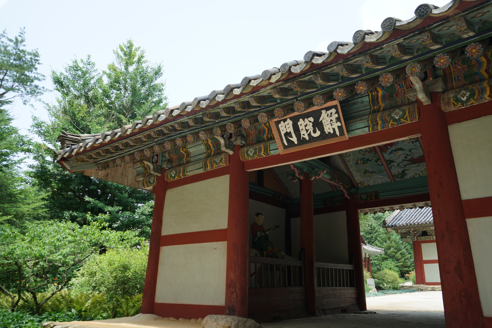

这张图是我进去了几重门后回头拍的。

我们继续前行，有一道门，匾牌写着：天王殿。我们看下他们的托塔李天王吧，浓眉大眼还挺萌的。

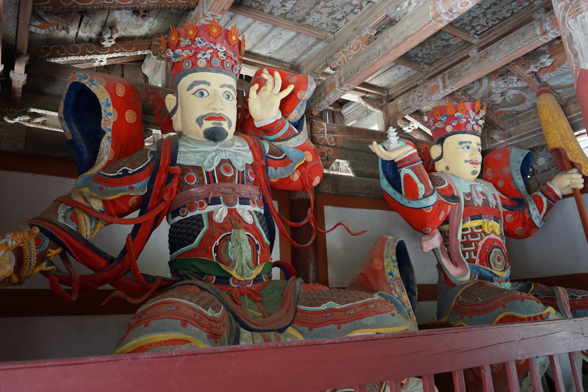

既然是佛教的寺庙，就是有大雄宝殿的，我们看下大雄宝殿的外景。

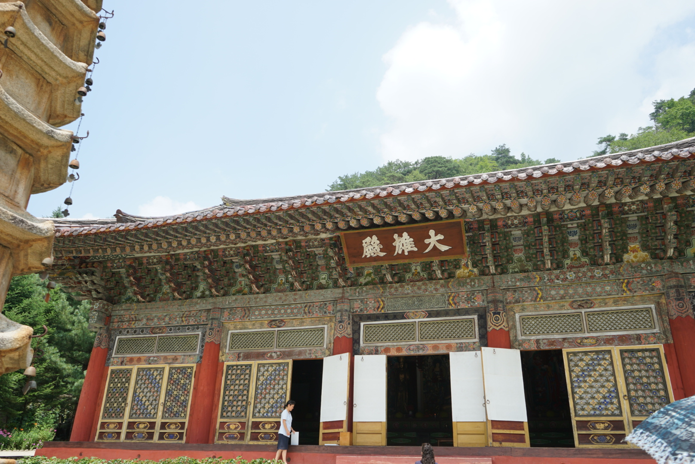

进去大雄宝殿，需要脱鞋，让我想起了泰国，毕竟中国是并不脱鞋的。我们看下内景，无非也就是菩萨和观音了。

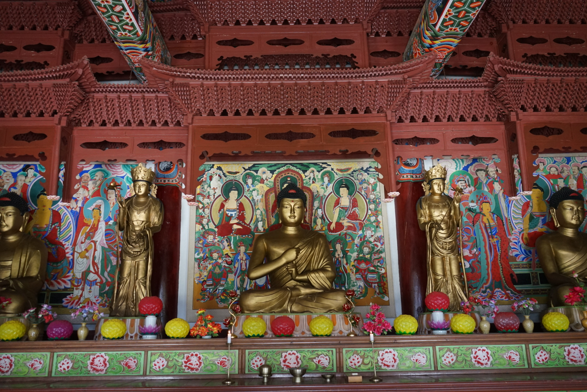

整个普贤寺，只在大雄宝殿看到了一位方丈师父。我没有给他拍照，僧人的忌讳比较多，或许拍照不方便。

我觉得房梁上的壁画很好看，有敦煌莫高窟的感觉，拍了一张。

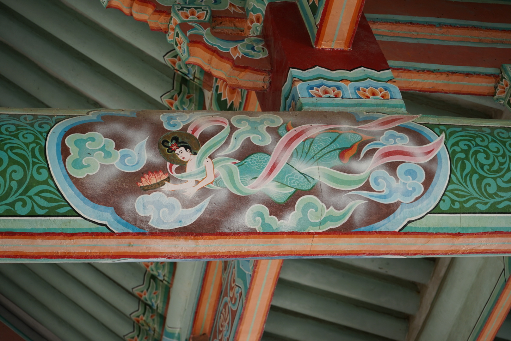

这座寺庙，不太大，但是也并不太小。好些门，大同小异没什么了就。突然，年轻的全导跟我说，你看看这个像什么？我正要说是不是你们的地图的形状？她开心的说，是我们朝鲜的地图呢！

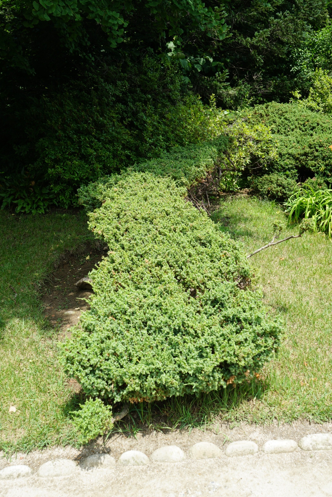

然后，我发现了这个，说：这个我知道，乌龟，是不是！她说，对的，应该就是你看到的吧！话说我不懂朝鲜语，不知道是他们本身说话的原因，还是翻译转换后的原因，他们非常喜欢说什么的吧。以后我觉得有空了可以入个门，多了解些语言是好事儿。

我们又逛了逛，到商店买了些吃的，就准备坐车前往下一个目的地：餐厅。

来的时候我睡着了没看到，妙香山上有个很不错的酒店。

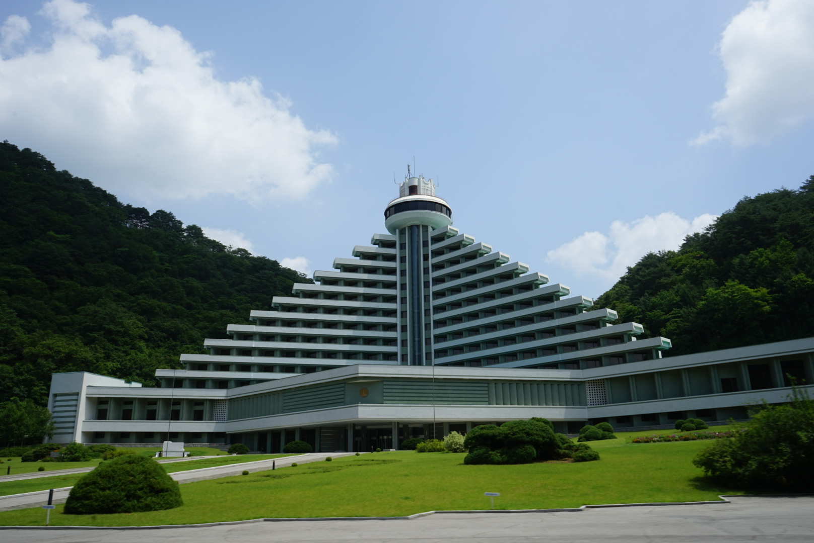

走之前，再欣赏一下非常美的自然环境吧。

就当我们高高兴兴到达餐厅后，出现了一点儿小意外，饭店的门锁了。

这个时候，还有一点儿小小的插曲。我去扔垃圾，顺便帮别人的垃圾扔了。我看到不远处，也就十来米有垃圾桶，就朝那边走去，那边附近也有朝鲜本地人。被导游喊回来了，说，餐厅里面有垃圾桶。看来，朝鲜当局控制外国人和本国人接触，确实比较敏感。另外，餐厅旁边有个金日成和金正日的铜像，导游特地嘱咐，这个不能拍，不要让他们为难。那我们就不拍咯。

我们的张导游很着急的打电话咨询和沟通，稀里哗啦说了一堆。最后的结果是，我们中午吃盒饭~~~

既然要吃盒饭那就盒饭呗。但是还是比较奇怪，盒饭没有当场给我们，也没有停在这里等盒饭。而是，车开了好远到了一个类似于小平台的地方，另外一辆车把盒饭，啤酒，饮料装箱送给我们了。我很好奇？难道是不让本地人看到？为什么要两辆车开到一个没人的地方来交接盒饭呢？这没涉及到什么政治或者意识形态问题啊。如果说怕我们和当地人接触传递了不受官方欢迎的信息，盒饭的敏感点在哪里？挺难 get 到的。后来，大伙儿推测，锁门可能是饭店没有接受到上级任务，不知道怎么处理涉外事务，干脆直接关门大吉规避风险，然后给我们提供盒饭或许是一个很好的解决方案。

收了盒饭，没有当场吃，准备在开车回城途中的一个阴凉的地方吃。我在车上，拍了几张朝鲜人民的生活照片，这里是香山郡，也就是类似于我们的县，朝鲜的道类似于我们的省。

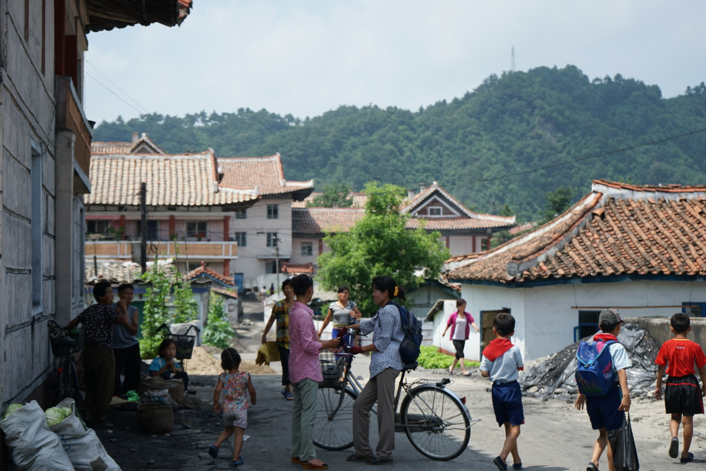

路上发现了一个摆摊的老太，在朝鲜，没有个体经济，因而摆摊的不多。但是也有，毕竟能挣钱，总有人偷偷干------我一直认为，不要去全盘抑制人性，而要想着怎么很好的引导和利用人性。我在平壤的天桥下面也发现白天有摆摊的现象，但是汽车太快，没来得及拍下来。他们夜袭平壤的人，基本都是去看人家摆摊的------说明朝鲜的公有制似乎在慢慢松动。当时的开城工业园，曾经一度被认为是朝鲜改革开放的前奏，但是后来发生的事情，大家也都知道了。朝韩合作终止，也坑了一大波中国商人在朝鲜的投资。

在高速路上，我看到了这个，很奇怪是干什么的。后来再一次看到的时候，我就好好观察了下。原来是水闸的起吊机，通过这些黄色的起吊机，吊起拦水的水闸，怪不得上面标明了“20t”的字符呢。

高速路隔离带上不知名的黄色的小花，我觉得蛮好看的。

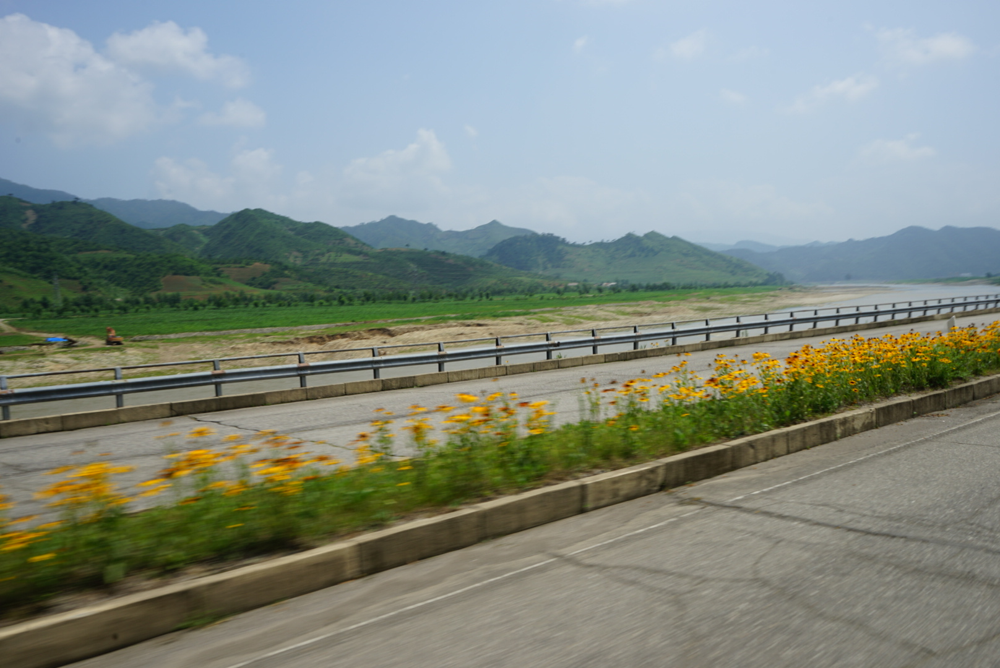

这不，没吃上好吃的，车上的时候我们美丽的全导就唱了首阿里郎的歌，我们都觉得挺好听的。我也觉得我跟她蛮有缘的，第一天在凯旋门，我们就互相介绍了，她姓全，我叫雷全。这几天，跟她也聊得很近，我们年龄差不多，她比我小一岁，刚毕业3个月，朝鲜是3月底毕业4月1日开学。

最后，在一个高架桥上，本来选这里是因为阴凉，结果，一会儿就晒起来了，大家都下来了，那就凑合在这里吧，吃饭。

我们在高架上，下面是一条一般的环山公路，有很多人骑车经过。

给我们吃饭的小伙伴和自己来个特写，说真的，第一次这么吃饭，觉得很有意义呢，估计会很难忘。

为什么不趁我姿势摆对了的时候拍呢？本来还有点的发型被风吹的毁三代了。

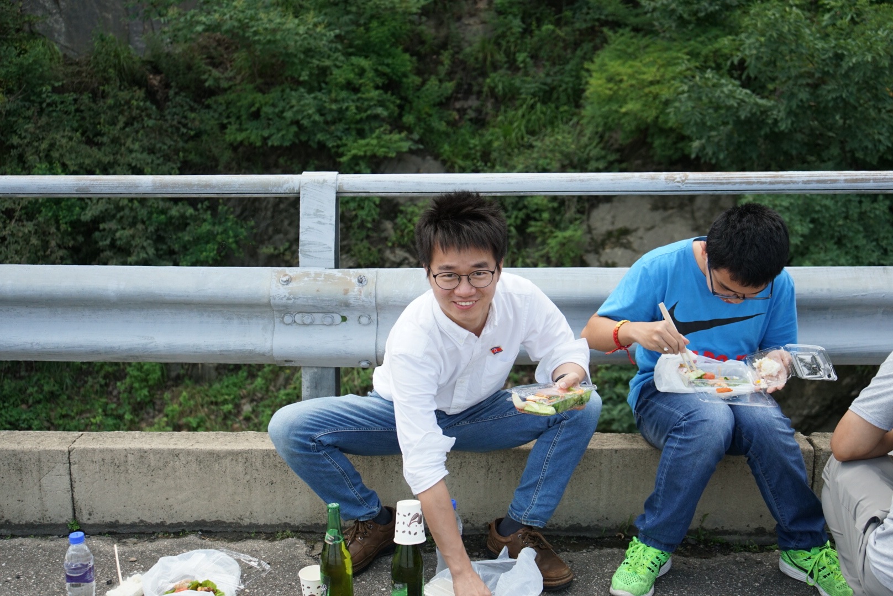

午餐内容虽然是盒饭，也还行，有牛肉、桔梗、鱼、蛋、西红柿、生菜、胡萝卜，再加上水和大同江啤酒；很明显，一次性筷子是中国产的。

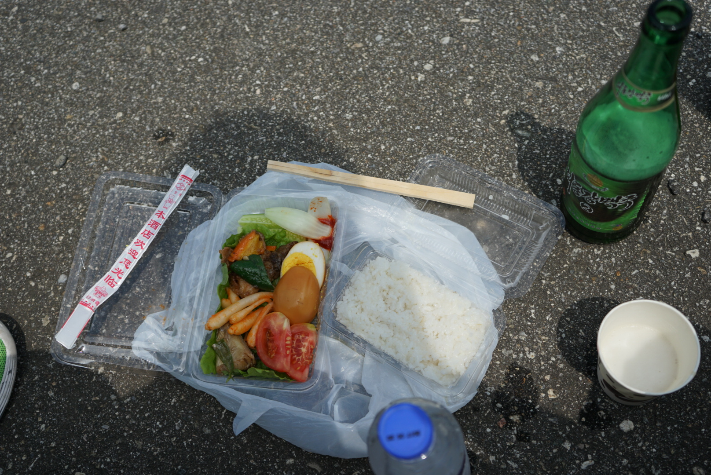

吃完了，大伙儿歇了会儿，就上车了，回平壤，去参观少年宫。我又开始睡眠模式，中间热醒了几次，因为我觉得开空调不如吹自然风凉快和舒服。最后醒的时候，已经到了少年宫门口了。

之前路过少年宫的时候，导游讲到，少年宫的造型类似于怀抱孩子的双臂。由于镜头限制，只能拍到一半。来一张之前拍的夜景图吧。

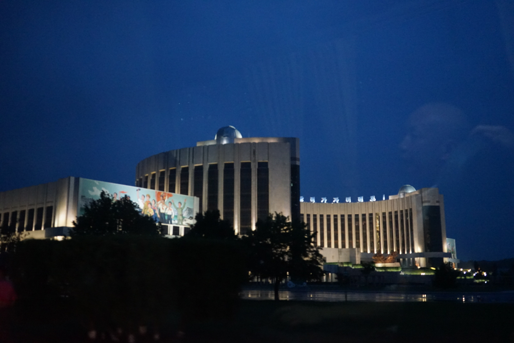

其内部多彩的灯光大概会是孩子喜欢的颜色，但是我觉得墙壁上挂的画作更值得拍照。

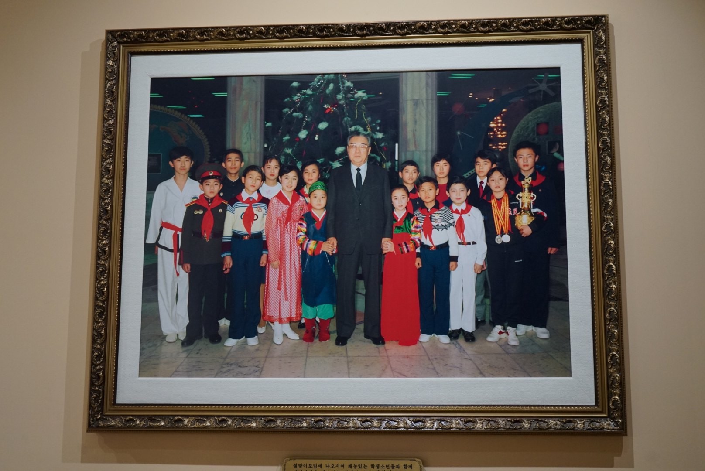

接下来，我们在导游的带领下，参观各个兴趣班。导游之前有讲到，平壤的孩子上午上课，下午可以来少年宫参加自己喜欢的兴趣班。当然了，农村的孩子，估计是没有这样的待遇了。

我们首先参观了舞蹈班，一群孩子在教师里练习跳舞，我拍摄了一个跳的不错的小女孩的照片。

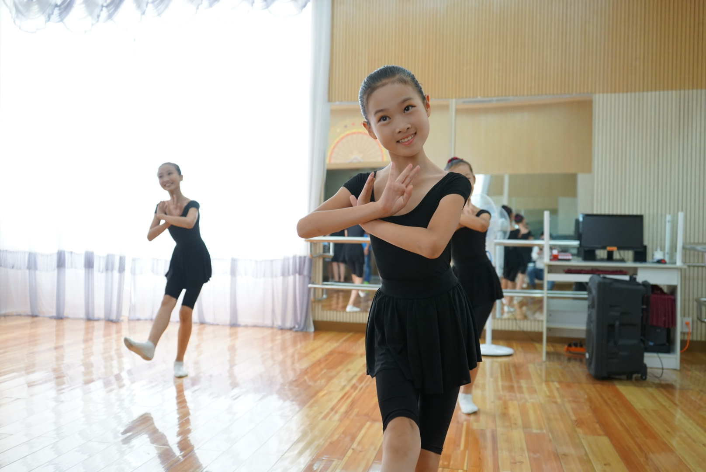

接着，书法班。我觉得大家的镇纸都很可爱啊，不是小乌龟就是小苹果、小蘑菇、小桃子什么的，果然是小朋友的文具~

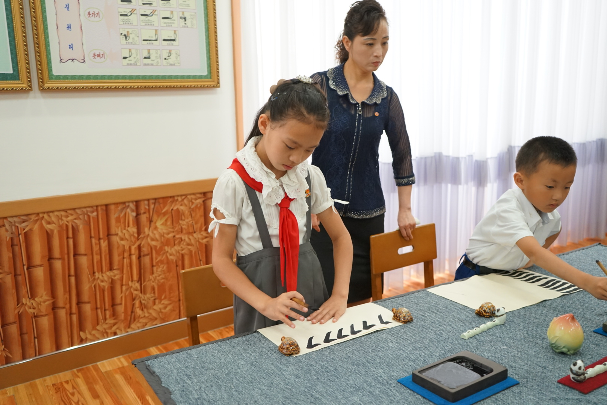

来个特写吧，可爱的蘑菇。

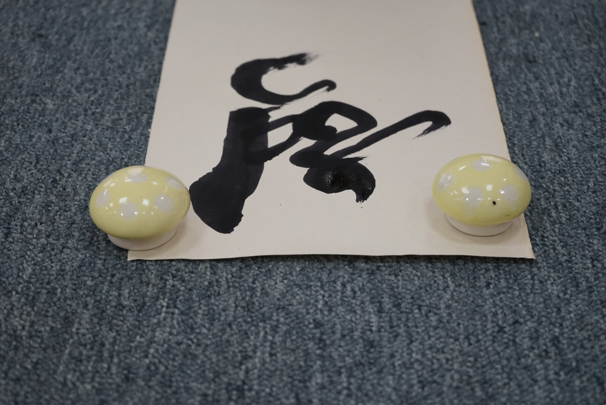

我们接下来参观了声乐班，看看这个缺了牙的小男孩。

接下来，我们参观了古筝班。

吉他班，老师正在指导一位小女孩。

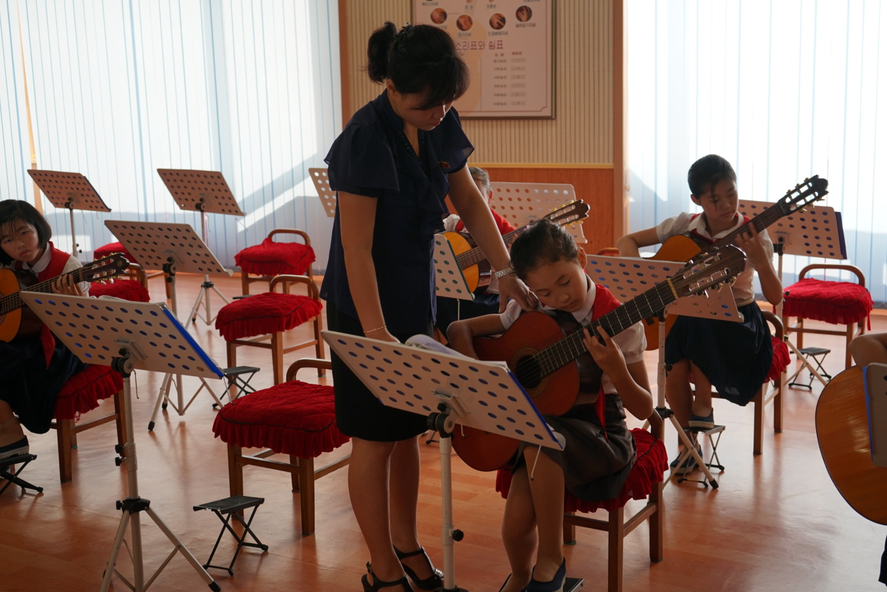

美术班，这是在画中国画吧，竹。

民族乐器班，合奏。

手风琴班，这男孩很投入。

刺绣班，老师正在指导小女孩。

在刺绣班，我们注意到一个小女孩，貌似不大会，老师正在教导她，但是我们都感觉这位小女孩快哭了...

还有跳水班和游泳班。

素描班，孩子们画的很用心。

最后，来一个非常可爱的小女孩，结束我们的少年宫参观之旅吧。

然后，我们离开少年宫，讲真的，少年宫确实展现了一副“社会主义好”的图景。

我们去看杂技表演，他们不看的在车上聊聊和周边溜溜，因为看杂技是自费项目。朝鲜旅行的好处是绝无强制消费和诱导消费，时间允许的话，导游把好的推荐一下，去不去随自己，因为没有私营经济。

杂技大剧院很快就到了。

我们进去的时候，人已经很多了，我们注意到一个朝鲜人在给自己家人拍照留念。

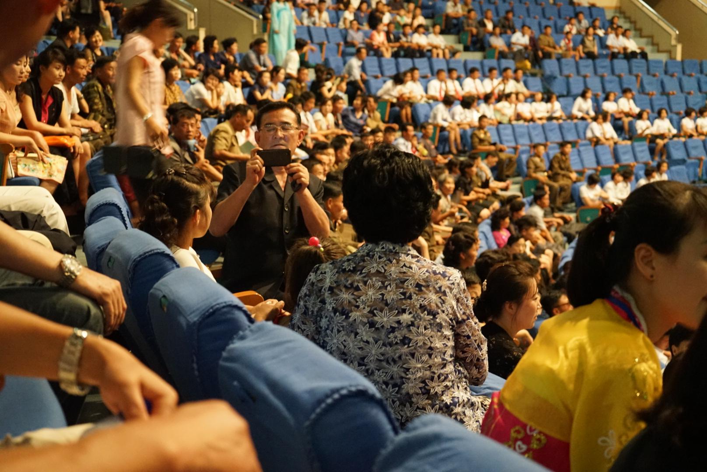

我们也来拍一个，我们也注意到我们的背后有不少欧洲人，应该是东欧的国家的。我们上次吃饭的时候，一个欧洲游客，2位导游加司机总共4个人...这凑不齐人数的待遇，要多交不少团费吧？

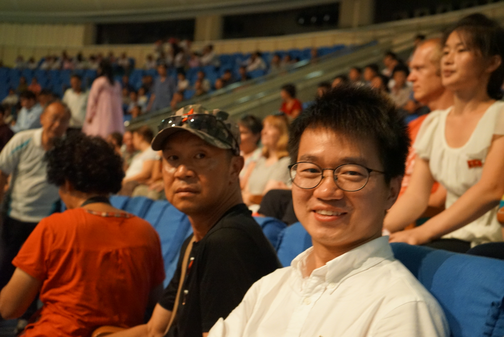

舞台开始移动，就要开始了。

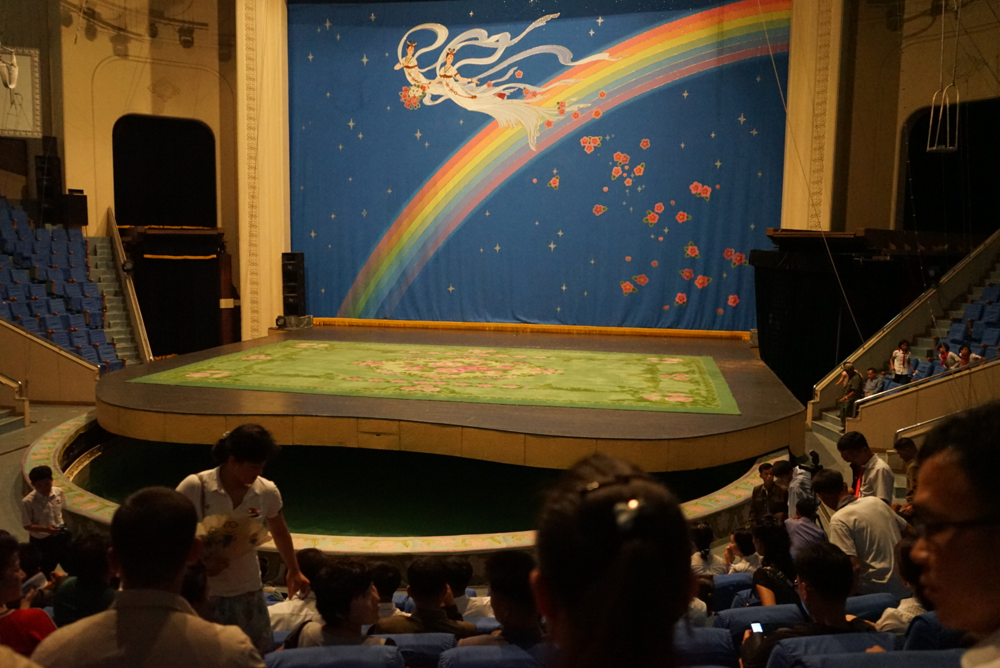

第一个出场的节目是这个：

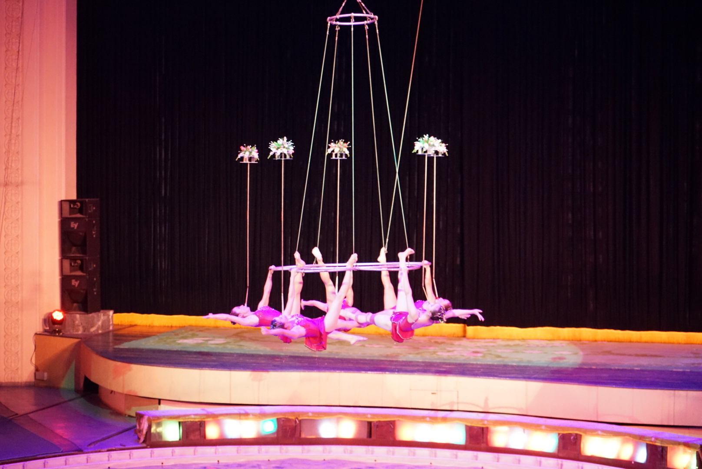

第二个节目是这个：

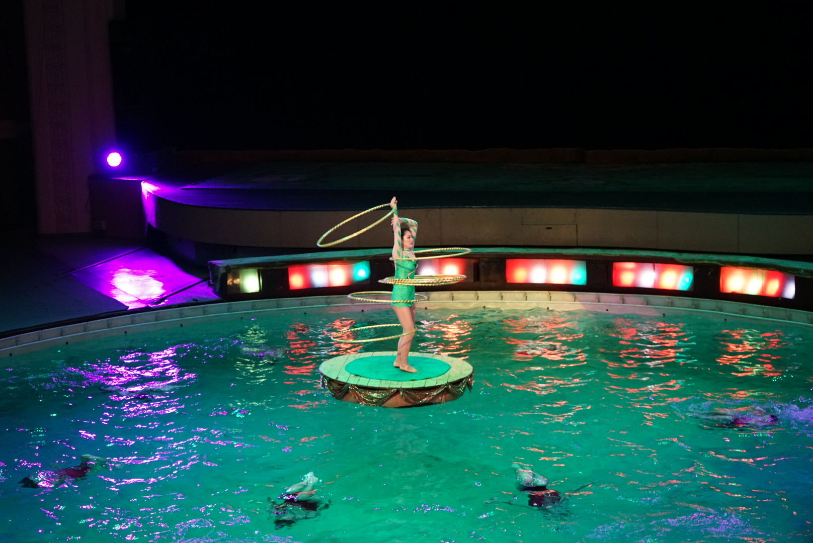

一会儿熄灯了，她越转越投入，就是这个效果了，好美：

第三个节目是这个：

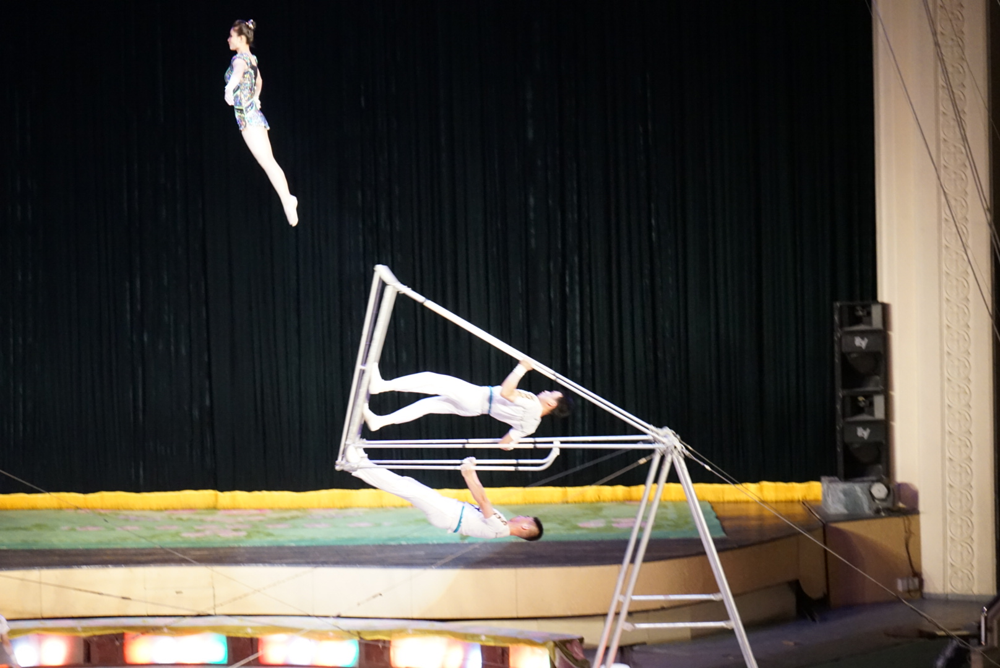

这么高，人飞来飞去的，最远的大概有十来米远，也有十来米高，我还挺为他们的安全担忧的，感觉防护装置也相对简单，安全网的宽度是不是可以加大些。他们也有失误的时候，掉在了安全网上，但是他们怀着必胜的心，最后表演成功！大家热烈鼓掌。

转盘子这个节目感觉关注点都在上台配合的观众身上去了，那家伙老出错，一会儿找不到自己的位子，一会儿直接摔倒了...大家捧腹大笑，看来不是托儿，是真的随机抽的观众了。

滚坛子，滚手鼓的节目，还把皮球弹弹弹弹进了网里。

这个节目：
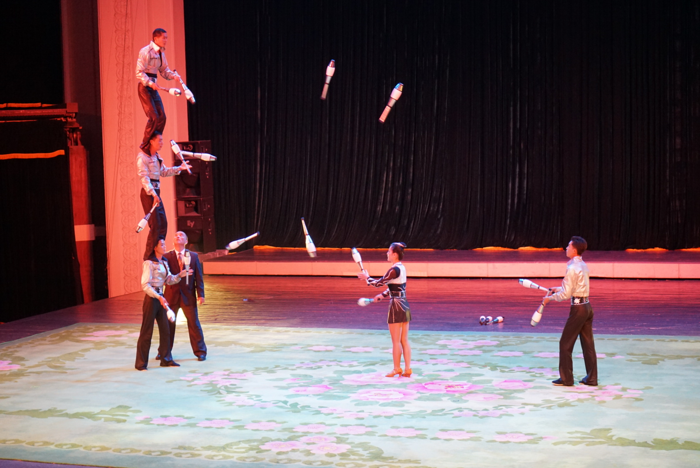

这个节目，接盘侠？速度很快，一口气接了好多盘子，手里厚厚的一摞。

跷跷板，也是跳跳跳~

这个节目感觉一般，但是演员和临时演员应该都很辛苦！

这种节目很多舞剧里面有。

这节目让我想起了很多综艺节目。

差不多就这些了吧？整体而言，这里的杂技节目非常好看，大家掌声很热烈，呼声很高，也很刺激。

我注意到了一点，在演员谢幕开始的时候，大家起立鼓掌后，外国人就开始走动准备出去了，但是朝鲜的人们丝毫不动，继续鼓掌。直到演员们准备下台的时候，才开始有人活动。看来，朝鲜的礼仪或者是纪律还是比较严格的。

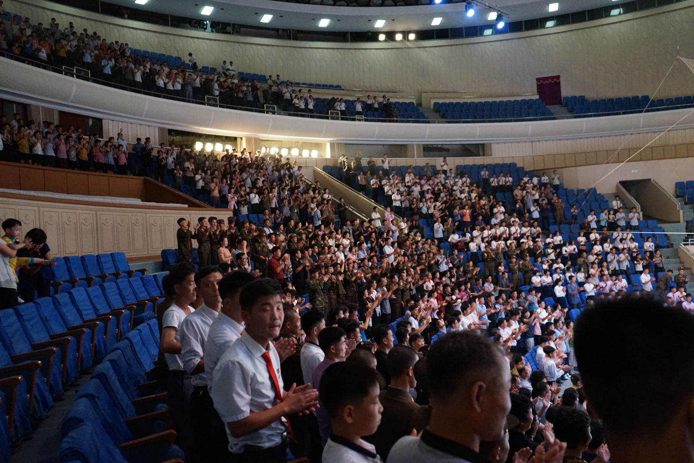

散场后，我们上了个洗手间就赶紧出来，我出来的时候，还有些人，但是也并不多。早知道我就不去洗手间了，直接趁散场出来拍人得了，平常也接触不到朝鲜民众。

这位军人很好，我走的很快，试图到前面再回过头来拍大家，等我回头的时候他也在看我，我微笑示意，他也很开心的笑了。我发现，这里的街道和居民楼也是极其的棒，超国内二线城市的很多楼。

我发现很多人都已经上车了，没有什么大面积的人群的感觉。

于是我也上车了。我坐在靠窗的位置，我发现对面的人在看我，我微笑，他们也笑，还向我挥手，我也挥手。

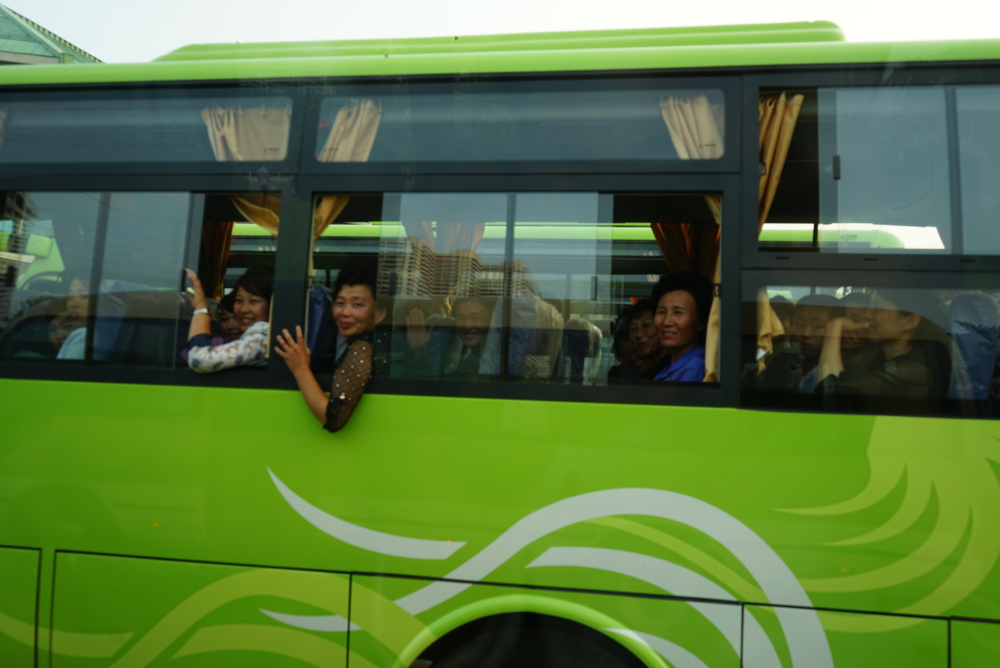

那就走吧，下一个目的地，抗美援朝纪念碑。

来这里，作为中国人，我们当然要献花，虽然只是一种仪式，算作是祭奠那些未归故土的烈士吧。

我们进去碑内，有三幅壁画，画了一些抗美援朝的事迹。

中国人民熟悉的黄继光的英勇事迹。

歌颂中朝友谊和抗美援朝的画作。
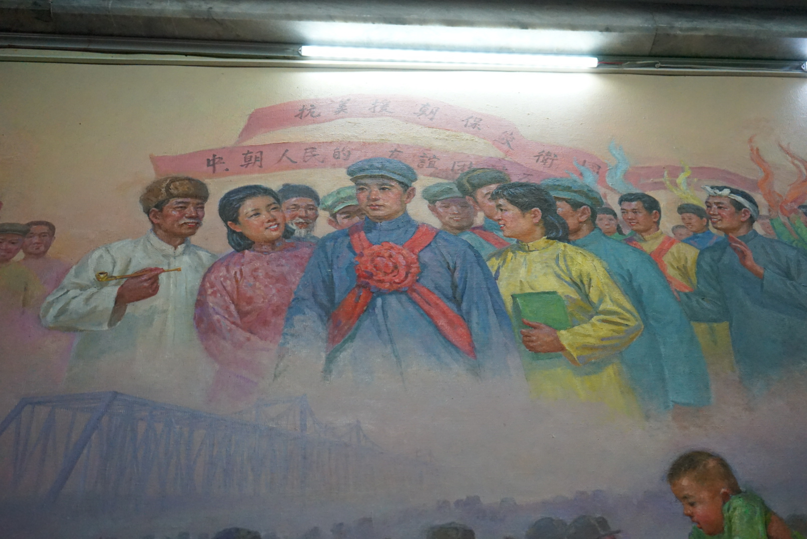

抗美援朝战争中牺牲的一些英雄人物，毛岸英和黄继光、邱少云等都在名册里面，他们的英雄事迹将被永远流传。

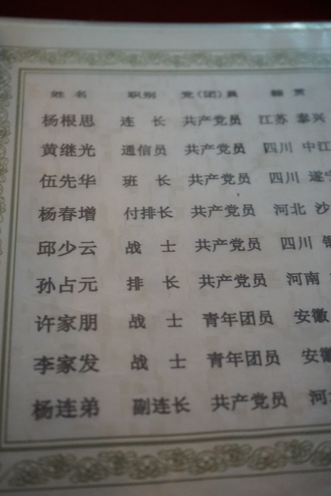

当我们出碑后，同行的团友问导游：“会不会唱‘雄赳赳，气昂昂...’”，导游说：“我是中国通”，接着就跟着唱起来了。我们下来台阶后，遇到一位河北女士，她的孩子和一位朝鲜老人玩的很开心。

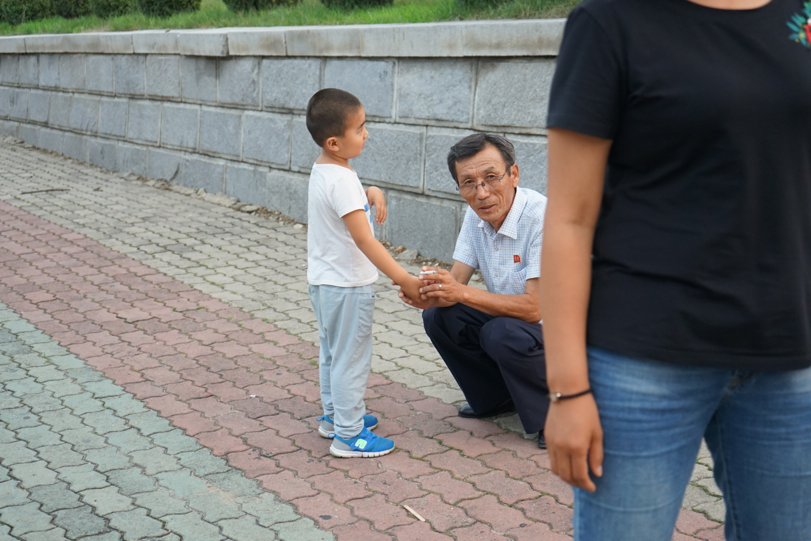

参观完了中国的抗美援朝纪念碑，我们去参观朝鲜的主体思想塔。导游特地介绍：塔上的两个字就是“主体”，意思就是自己的命运自己做主。雕像中的三个人，高举的是镰刀、锤子、毛笔，象征着农、工、学的大团结。

我们拍完了主体思想塔，又拍了拍对岸。

河对岸是金日成广场，但是明早我们要过去，就先不放图了。河对面右侧的建筑群从这个角度看很全，还是很豪华的。

我们逛了逛，天已经黑了。刚好，主体思想塔的火炬开始亮了，我拍了张照。

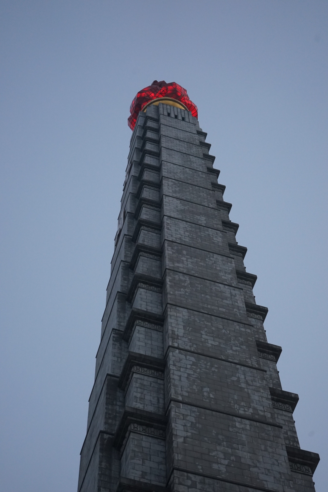

回来路上，我们经过一个波浪形建筑，很现代化的，导游说是服务中心，这里有各种服务：美发，SPA 之类的各式各样的服务。

我在车上看到一个老年人，牵着自己的孙辈，我觉得很幸福的画面。

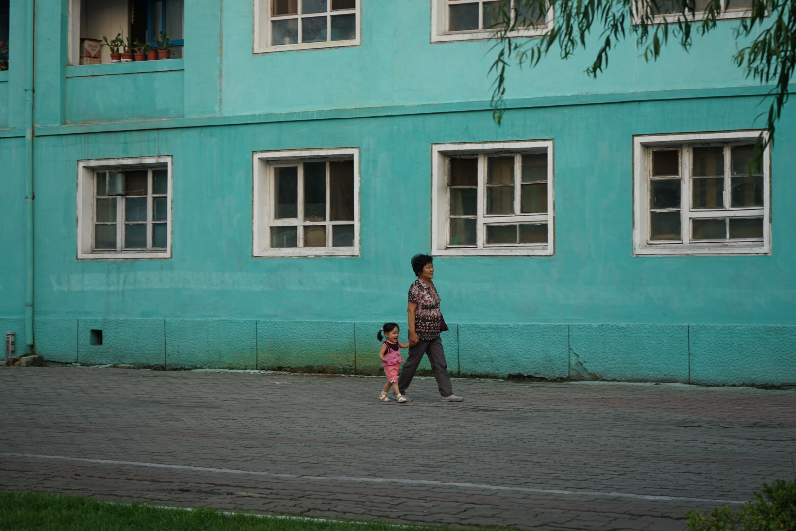

在一个十字路口，看到了这种电视屏幕，这是我第一次见到。国内的话，这种商场的电视就很多了。

很快到了吃饭的地方，今晚的主题是火锅，火锅在朝鲜叫战锅。导游还给我们讲了相关的故事：以前战争的时候，军人用头盔来煮火锅。一个小小的锅，加一盘菜。

汤很清淡，我们自己加盐，味精，胡椒，辣椒到里面，感觉还是清淡。把泡菜倒进去，鸡蛋倒进去，嗯，很美味了。之前看到只有小小一盘很不够吃有人表示担心，其实这里的火锅相当于一个菜感觉，不像我们的四川火锅那样子很大只吃一个锅，虽然也是慢慢煮着吃。因而我们还有鸡肉，黄瓜，豆腐等菜。

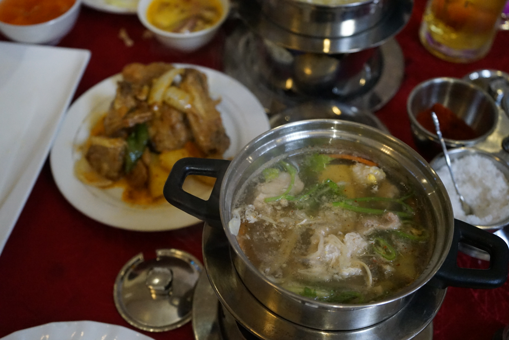

吃完了，我们就回酒店了。今天晚上回酒店就没啥事了，整理下东西然后就准备写游记了。

#### 第四天，平壤-丹东，2017-07-12

今天因为要整理东西，集合的时间会比前两天晚半个小时。因而我把闹钟往后调了调，早上闹钟还没响，和我同屋的陈大哥就喊醒我了。他已经整理好了，我赶紧起床洗刷和收拾东西，然后下去吃早饭，还房卡，然后寄了明信片。

人齐了后，我们就发车了。今天虽然10点就要坐火车了，但是还有两个目的地：金日成广场和友谊商店。

在车途中，我突然看到咱们住过的酒店的画面不错，就拍了一张，刚好画面中有个骑车的人路过。

金日成广场，我们之前从附近路过，昨天也从主题思想塔隔江从正面远望过；但是还是很值得近距离的看看。到目的地后，导游告诉我们，远处的那条马路不要跨过，近处的可以。于是我们开心的跨过马路凑近去看看，然后拍几张照片。先看一眼全景图吧，由于是全景图，因而画面有些变形了。

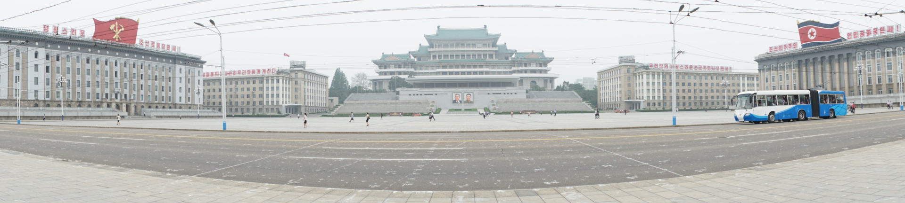

来到这样的地方，拍照留念是必须的，也不知道这辈子，还会不会再来这里了；也不知道如果下次来这里，朝鲜还是不是现在的朝鲜了。很多事儿，就是一辈子一次的。

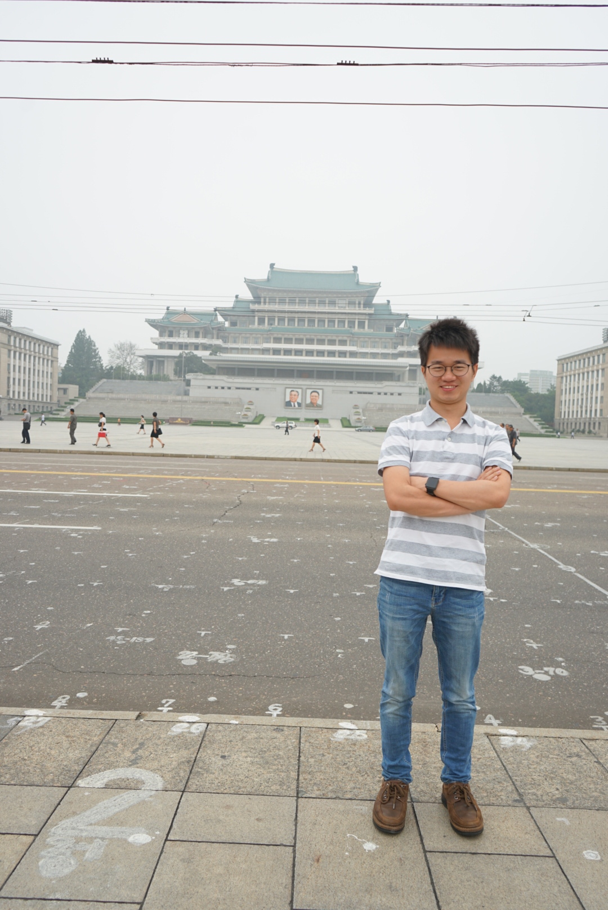

另外，广场的地上标了很多数字，应该是集会的时候，人民群众排队确定位置用的，密密麻麻的却又整齐而有规律。

我们在这里看了下，感受了下朝鲜人民群众聚会的地点，想象了下朝鲜人民群众聚会的场景，因为前面的马路不能跨过，那我们就只能去江边看看了。有些人在江里钓鱼，我们走了走，就上车走了。去友谊商店，是一个专门的纪念品商店。

友谊商店不大，我们有人说是友谊商场，导游特地强调了下，商店，商店...我们上去了二楼，团友们买了些雕刻品，买了些吃的和烟，我买了个人参香皂，真是什么都是人参的。

因为商店不大，我们逛逛就差不多了，就准备下楼了。这时候，导游给我们分配了中午在车上吃的盒饭。

正在这时候，一列车队开过，有领队的车，后面跟着一大堆车，领队的车的音乐很响亮。我们问导游，这是国家的重要领导人什么的吗？她说，是前几天发射导弹成功背后的科学家们，参加了庆功宴。后来回来的路上，团友们讲，昨晚看了朝鲜的当地新闻，里面就播放了导弹科学家的庆功宴。我突然意识到，没看一下电视里的朝鲜当地台，真是个遗憾，我竟然拿来看星空卫视？真是太没出息了。

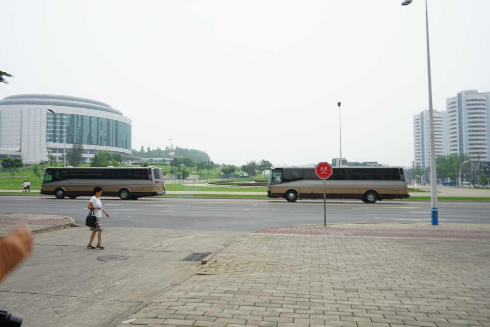

团友们都下来后，我们就直奔火车站。在车上，张导兑现了昨天的承诺，唱了一首朝鲜歌曲阿里郎，唱了一首中国歌曲朋友。大家都很高兴，同行的姐姐问张导，什么时候有机会能吃到你的冷面啊？张导笑着说，到时候请你们免费吃！我们从专门的通道进去，竟然都不用排队，也不用过安检，甚至都不用查票，看来我们真的是享受了特殊待遇。到了候车厅后，我们的候车厅也是专用的，有专门摆放成排的凳子，不是常见的那种连体凳子，也有饮水机什么的设施，我去打了杯水。

这时候，全导拿了两分问卷给我们填写，当然了，一方面导游服务很不错；一方面跟他们瞎写的话，估计可能有什么不好的后果，我们当然往好了写，各种好评。

接下来就是直接进站，准备上火车了。张导带着我们上火车，带领我们到我们的座位上，接下来把我们的车票给了我。我们把东西整理好后，开车还有一会儿，就下车溜溜，和导游们再聊聊，拍个照。我给了全导我的电子邮箱，或许因为我们年龄相差很小吧，我跟她蛮聊得来，一路上也聊了很多，彼此问了一些问题。

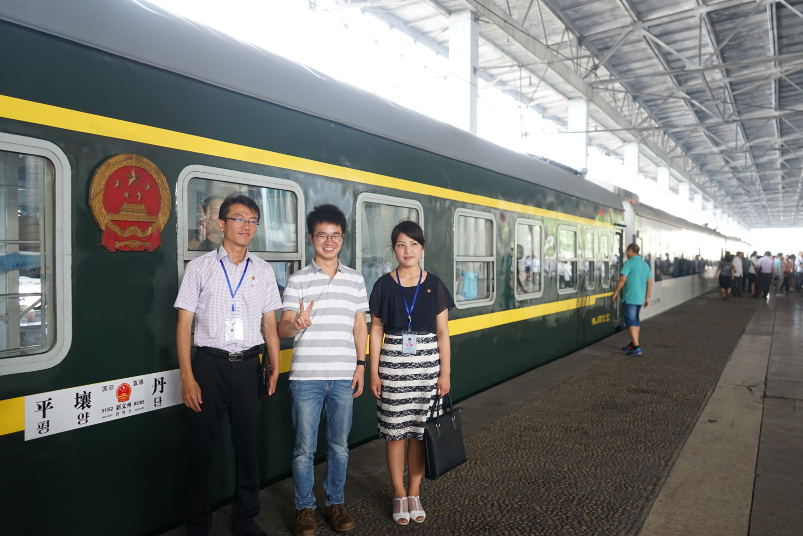

开车的时间快到了，我们便上车去了。我们都上去后，导游还没走，在那里等着，两位导游聊聊天，不时看看我们。最后车开了，我们和他们挥手告别。无论是几天的互相陪伴，无论是对于他们的工作还是对于我们的旅行，这几天都是有意义的。挥手告别也不止于礼仪，或多或少是有些感情的，最起码对于我们而言，对他们而言，我们可能是成百上千次的团队游客里，随意的一批；但是于我们而言，可能是一辈子仅知道的两位朝鲜导游了。因为政策的隔离，从此之后我们或许永远不会相见，尤其是几位年纪比较大的团友都说，这辈子是不会再来了。虽然我给了全导我的邮箱，但是她什么时候来中国都不一定。突然很后悔，没有给她我的个人网站，以后，域名再也不变了，我给一些人联系方式，就给网址吧。人在江湖，总会有很多擦肩而过的人。

火车开了，随着列车的前行，看了看窗外，拍了几张照，看到窗外的景色，这时候已经没有来的时候那么激动了。

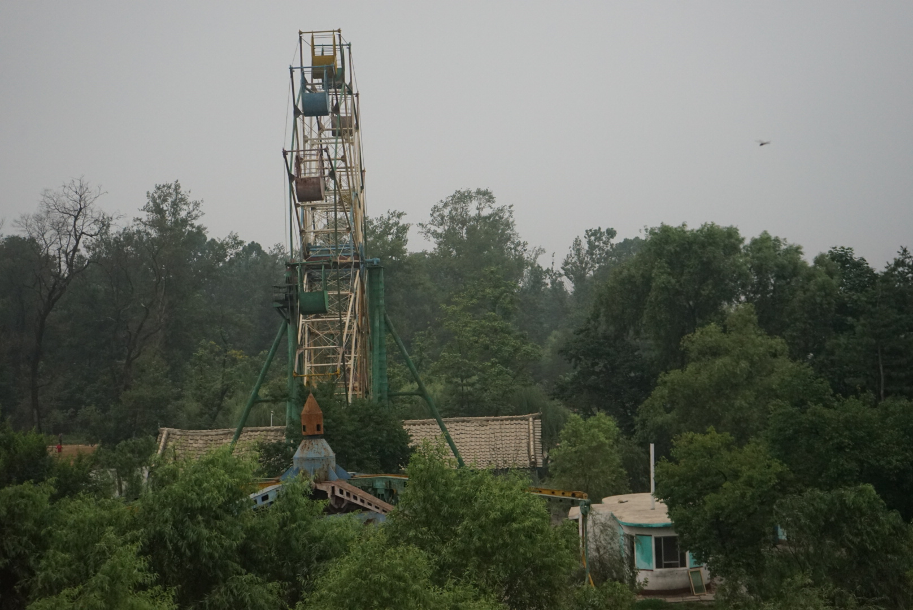

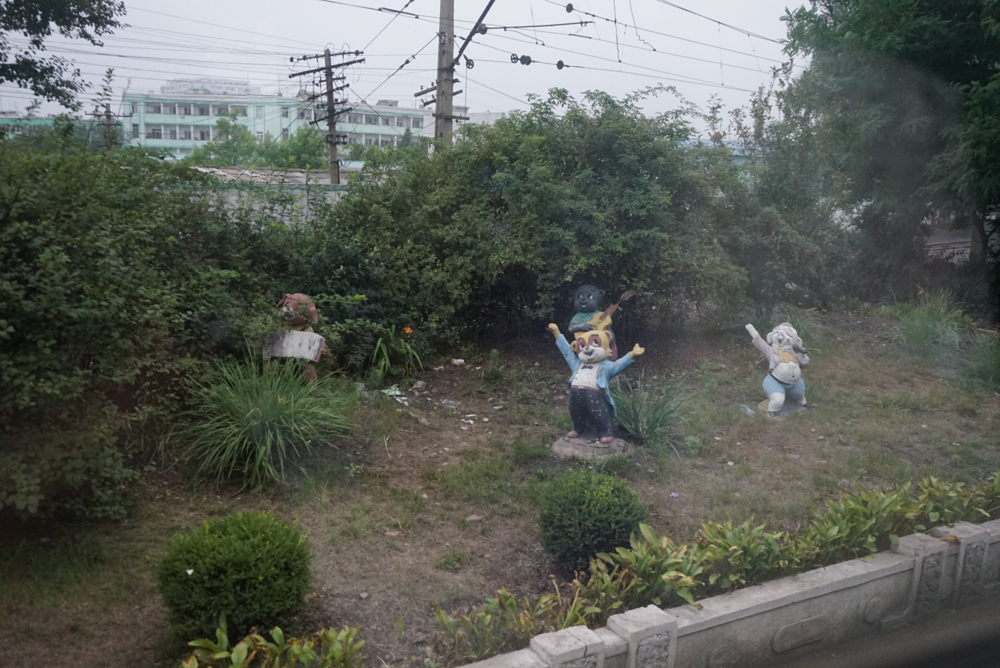

我觉得回程的路上，两张照片就够了。现在我准备换上另一张内存卡，以供他们检查了。这一张内存卡拍的东西少，我再过了一遍，一些可能敏感的我删掉了，剩下的让他查吧，没收就没收吧，别没收我相机就行。弄完了，我就准备睡觉了，昨晚没睡好，困得很。

等我睡醒了，就快到了新义州了。我吃了盒饭，就把出境登记表填了。不一会儿，就有检查人员上来查了，先收了我们的护照和每个人的出境登记表，还有我填写的团队旅行海关申报卡。我们预计中，应该会比来的时候严格一些，确实是的，但是也没严格太多。我的相机翻了好一会儿，就给我了。行李箱和背包，这次都查了，我们自己掏给他看，或者是他指示我们翻给他看。我的电脑没人查，前面提到了，我把照片和游记，写好了后切换分支就隐藏起来了，因而在我电脑里是找不到任何相关的东西的，就算查也并不怕，他们也并不是电脑专家。然而，让我们大家意外的是，我们看到了车窗外的军犬，难道是防毒品走私？

查完了后，因为要查别的车厢，我们等了好久，跟来的时候差不多，前后2个小时左右。我们下车透透气，最后，终于看到检查人员抱着我们厚厚的护照来了。我们领了护照后，一会儿就开车了。由于离丹东站很近，我们此时就开始怀念网络了，我们几个人都在比，谁的手机先有网络，谁先收到欢迎回国的短信，因而，这十来分钟的车程，我们都很开心。

这一路的车程里，我们的心情是复杂的，也是变化的。在朝鲜的几天里，我们沉迷在各个景点的美丽和食物的美味上，对朝鲜社会的很多方面充满了好奇，对可能存在的安全状况的担忧让我们的行程紧张而又刺激；踏上离开的火车到新义州之前，我们主要聚集在出境检查上，吐槽朝鲜的一些事情，又带着几丝担忧，毕竟朝鲜给人的不确定性印象太大了，万一检查过不了就麻烦了；到了新义州后，我们便开始期盼有网络的生活，开始期盼进入丹东站，回到祖国的怀抱。

不一会儿，火车就要行驶上了鸭绿江搭桥了。在上桥前，我们看到朝鲜边境的位置上的一处院子里，有不少身着朝鲜传统服装的姑娘，跟我们挥手告别，赶紧抓拍一下------中朝传统友谊深厚。

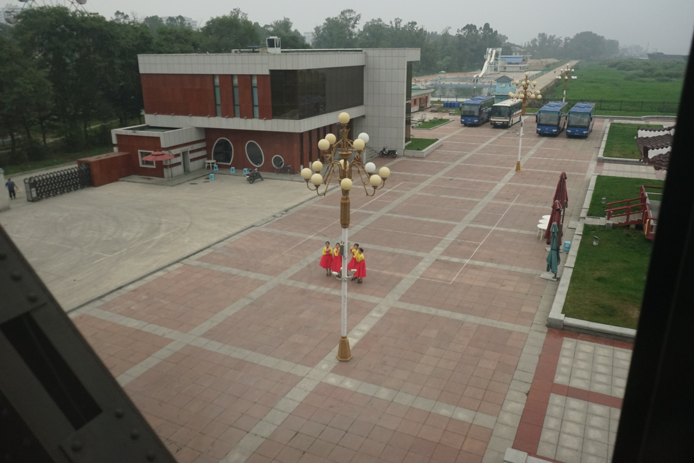

到桥上后，远远的我们就看到了断桥。来的时候没拍好照片，走的时候必须来一张。鲜艳的五星红旗，让人觉得很亲切。

过了鸭绿江大桥，很快就是丹东站的铭牌了，我们的心情很激动，第一次有这种感觉。我想，有这种感觉的原因，主要是因为朝鲜的神秘。即使我们已经去呆了几天，减少了这种神秘感，但是内心里，还是有某些隐忧的。

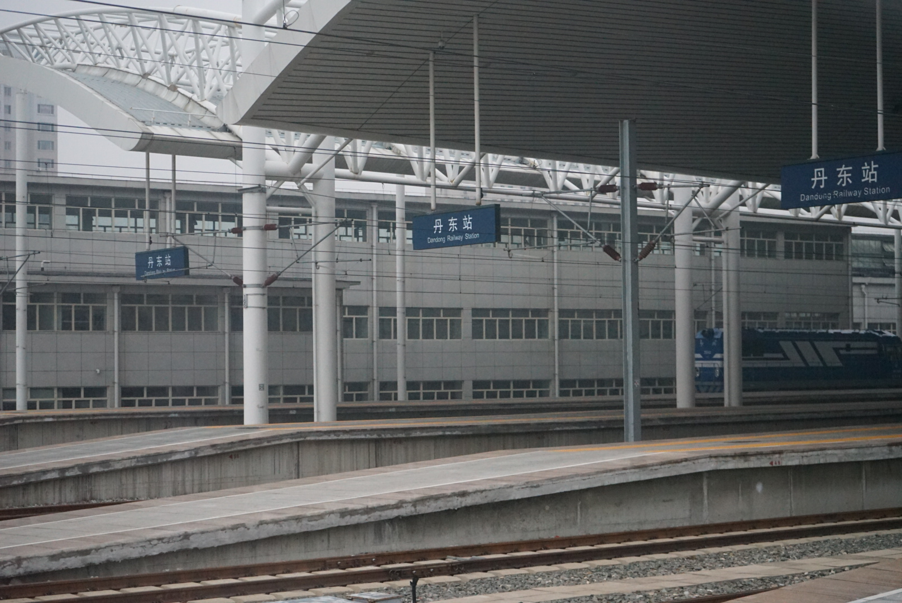

几天的朝鲜旅程，到这里就告一段落了。我看了下票，买了沈阳回武汉的飞机票，本想着去沈阳住一晚的，跟团友们一道，然后一想，还是丹东吧，沈阳已经逛过了，就在丹东没事儿瞎溜溜然后写下游记刚刚好。

我决定还是去断桥上看一眼，于是我从火车站步行过来。

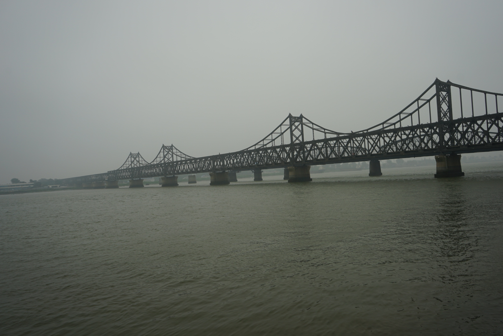

来的时候，我没钱了，没法买票，售票员说微信买吧，不接受刷卡。我买完后，她催我快上去，只剩20多分钟就要关门赶人了。

雄赳赳，气昂昂，跨过鸭绿江------为了和平。

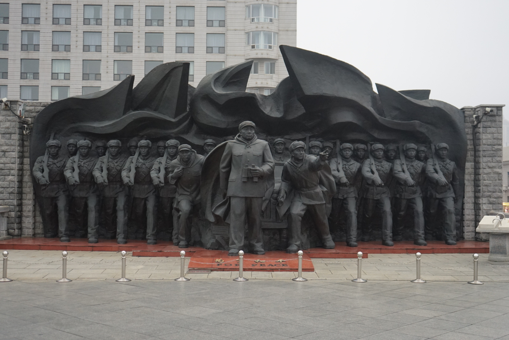

迎风飘扬的国旗，格外的鲜艳。

到了断桥的终点了，抚摸一下。

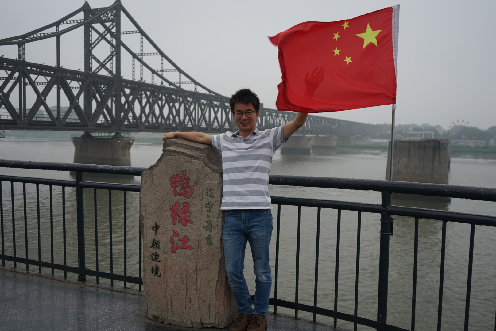

给炸毁鸭绿江大桥的美帝炸弹来一个特写，这里也是断桥的尽头。

在这里拍照的时候，碰到几位姐姐，聊了一会儿，然后其中的一位在后面独自吹风，尽享自由，拍一张吧。

离开大桥后，我随便溜达了一下，溜到一家店子，感觉不错，就点了一盘韩国泡菜，一大盘海鲜，一瓶鸭绿江啤酒，在户外的桌子，就着朋友在哈尔滨送我，我从中国带到朝鲜，又从朝鲜带回中国的面包，吹着海风吃了顿饭，来结束这段极其特殊的旅程吧。

#### 关于经济

导游在介绍中，略有提及到朝鲜的物资匮乏的问题，通过我们的观察，比如火车，相信这个问题是存在的。虽然我们去旅行，受到了非常好的接待，吃喝都很不错，但是这毕竟是针对外宾。普通市民我们是看不见他们吃饭的，其他方面更不用说了。

黑市上和官方给出的朝鲜元对人民币元的汇率差距之大，可见其经济问题是非常严重的。我在行程中，有观察到，好几个人在地上处理面积不大的地砖，在我印象中那应该是一个人便能完成的任务------或许公有制和计划经济，确实会降低效率。

我在从开城回到平壤的时候，注意到，这条干道上的汽车数量并没有那么多，但是，一路上我注意到了4辆汽车途中抛锚在维修，某种程度上表明了其装备不仅严重依赖进口，更是使用过度，故障频发。

我注意到了列车沿途的很多居民楼安装有太阳能发电板，这应该是针对能源供应不足的问题的解决方案。在羊角岛酒店，由于我写游记，因而睡得晚，导致最后上完厕所无法冲水，这应该是自来水厂或者酒店的加压装置在后半夜没有工作导致停水。

在平壤的街头，我注意到了有轨电车的接触网，就是电车上面的接触供电线的支架，是由司机手动拉绳来控制其高度从而实现接触和分离的。在平壤地铁的体验中，我注意到其地铁门是手动关闭的，不像我们一样使用自动门。

在导游的介绍中，每人每年260斤粮食应该是足够吃了，但是很少见到比较胖的朝鲜人，相对瘦削的确实会多一些。但是这是主观感受而已了。如果感受正确，那么可能是主食够吃，而副食或其他周边食品供应不足。因为我们了解这一事实，我们团的成员在就餐和其他消费方面，都在努力不浪费他们的有限资源。虽然并不能起到什么作用，但是精神还是可嘉的。

虽然朝鲜确实比中国落后，但是没有想象中那么差。平壤不用说，哪怕是农村，我们所见到的也还行。我个人觉得，朝鲜整体落后中国有几十年，类似于改革开放前的一种状态；但是，由于时代的进步，有些方面肯定是跟上了世界的脚步，因而整体状况比之前的中国要好一些。

#### 关于政治

内容审查是存在的，我们进出朝鲜的时候都遇到了审查，而这种审查绝对不是为了安全和反恐，而是出于政治的意识形态控制的目的。

外国人和本国人的隔离是存在的，我想，既然语言不通，为什么还要隔离呢？大概是通过减少接触从而减少本国民众的一些其他想法。即使语言不通，什么也不用说，朝鲜本国公民也是能感受到一些差距的。为什么别人的手机比我们好？为什么别人有 iPad 而我没有？为什么别人能来我国游玩而我不能去他的国家游玩？很多时候，不对比是发现不了问题的，对比就能发现问题，哪怕是一个目不识丁的人，或许也会有想法------这一点，作为天朝子民，感受深刻。而隔离是减少对比的重要手段，因而我们吃的饭店没有朝鲜本国人，我们住的酒店更是专门涉外的，入口处有军人巡逻。我们和朝鲜国人接触最近的应该就是在地铁和杂技场了，但是也是不可能有任何交流的。

个人崇拜的现象是比较严重的。作为中国人，这没有什么大惊小怪的，中国也走过这个阶段。每一个朝鲜人，都佩戴着他们伟大的领袖的像章，这是一种随时随地的个人崇拜。并且，针对个人崇拜的问题，上升到了国家形象的高度，之前是不允许拍摄金日成和金正恩的半身像，必须拍摄全身，到我们的时候直接不允许拍摄了。

对抗美援朝还是比较尊重的。虽然网上有一些朝鲜对抗美援朝的负面评论，但是整体而言，最起码表面看来，朝鲜是尊重抗美援朝这一史实的。当地的抗美援朝纪念碑也维护的比不错，并没有刻意敌对。

朝鲜强调的主体思想，自力更生并没有什么不对。然而，现在全球禁核的大背景下，半岛无核化是大国所追寻的目标，其中包括中国。朝鲜一心搞核武器，受到了国际严厉制裁，并不是明智之举。曾经的南非整体而言比较发达，都把核武器销毁了；核武器强大如俄罗斯，在经济制裁面前，也是处境窘迫，濒临崩溃。朝鲜目前走的这条路，或许并不是最优解。作为中国的前哨，如果朝鲜能在主要问题面前进行谈判，中国对其的支持绝对不会少，毕竟曾经都为了朝鲜参过战。菲律宾，众所周知前些年，反华情绪严重，而目前的领导人，只需向中国示好，就得到了大量的武器捐赠。有时候，解决实际问题，比死要面子活受罪更有用。中朝传统友谊源远流长，边境毗邻，如果选择和中国一起发展，相信其发展速度不会慢。现在经济全球化的背景下，朝鲜闭关锁国的政策，或许只会拖累经济发展和人民福祉。

#### 关于文化

朝鲜文化虽然历史上深受中华文化的影响，但是还是极其有自己特色的，他们也在努力传承这种特色。比如朝鲜的传统服装和美食的传承比较好，而中国已经习惯了几千年历史悠久的文化，反而很多方面传承的不够。

朝鲜在努力向外国游客传播其最好的一面，希望外宾能帮助提升其国际形象。这一点从给我们的待遇可以看到，而并不是一种夸大。尤其是我在少年宫的时候，深有体会------社会主义好。少年宫所展现的这种儿童教育水平，可以说是朝鲜的最高水平、集全国之力的对外展示，而无法作为全民教育的标准的。少年宫的每一个小孩，都对被人围观、拍照，应对自如。不仅不会紧张，反而会配合摄影师。这对于常规的孩子，甚至是一般的成年人，都是很有压力的。

朝鲜的整体风气还是在走向开放。即使国内信息控制严重，但是只要有人逐渐看过世界，接受过新的知识，那么这类人只会越来越多，逐渐撕裂原来的旧文化和体制。前些年，朝鲜是禁止使用手机的；而现在，平壤的市民有不少拥有手机，虽然很多都是翻盖手机，但这已经很进步了。包括我在火车上遇到的人，虽然秉持政治立场，但是能感受到他们的一些渴望。当然了，我能在火车上遇到的人，是有机会出国的人。回想我们几十年前，当时能出国的人是非常少的。

反美文化有很多体现。比如我们看到的明信片，一拳打碎 USA 的画面；比如导游介绍中，对美帝国主义的厌恶；比如我们火车上遇到的朝鲜人，他作为来过中国看过世界的年轻人，反美情绪没那么强烈，他这么形容美国的“美国比较霸道”。

千里马运动在各个领域体现了类似于中国的“大跃进”运动。导游有提到，千里马运动中，创造了15分钟盖一所房子的奇迹速度。在街道，我们也看到了很多高高的千里马的雕塑。在街头，我们也看到了很多类似于大跃进、向前冲的宣传画。

#### 关于生态

我注意到了水土流失的问题，开荒垦殖，这是在所难免的。中国同样走过类似的道路，朝鲜本来就人多地少，土壤贫瘠，因而或许难以避免。

我也注意到了空气污染的问题，虽说朝鲜工业欠缺，整体空气质量不错，但是其火电厂等的污染实在太严重，我有拍到照片。这也是无法避免的问题，目前朝鲜既没有资金，也没有能力或者理由去解决这样的问题；中国目前很多地方也治理不彻底。

其他就没什么可说的，自然环境确实很不错。

#### 结语

朝鲜之旅给了我独特的体验，这是在其他任何地方都难以感受到的，我们团的每一个人都有类似的想法。朝鲜民族历史上经历过苦难，民族分裂的问题至今无法解决，处在大国博弈间的朝鲜半岛，很多时候成了斗争的前哨，因而朝鲜目前的现状，某种程度上是值得同情的，尤其是中国人民的同情，毕竟抗美援朝，我们的目的是“保家卫国”。朝鲜地处中韩之间，一边的同根同源的民族韩国，在资本主义道路上和美帝国主义的支持下，富强发达；另一边的同样是社会主义国家的中国则力行改革开放，在经济上屡创奇迹------相反，朝鲜本身由于自身原因和国际原因，经济低迷，政治也出现困局，这是值得统治者好好反思的，毕竟统治者也是留过洋体验过资本主义的。很多时候，对理想的过度坚持，将是一场悲剧，很多历史都证明了这一点。

#### 提示

很推荐朋友们去朝鲜旅行一趟，这是非常特别的地方，团队所有人都觉得不虚此行。同行的团友，有的已经走遍了五大洲四大洋，都觉得此行很有价值。虽然我的流水账有备而来记录的很详细让人身临其境，但是很多东西不去估计是难以完全感受到的。

文章中的很多照片我都是偷拍的，尤其是杂技团的那一些，可以帮助未去过的朋友了解一下；如果去了朝鲜，希望能去现场感受一下，是非常的不错。

或许，朝鲜的吸引力，就在于它的封闭和荒诞带来的神秘吧。

#### 更新

昨晚在7天酒店，电脑连不上WiFi没法发。

今天在丹东火车站，WiFi 连不上也。

在沈阳机场，终于连上了，速度还很不错，为迈外迪点赞。

先更新一版，回去后加一些大家分享的照片和见闻吧。
