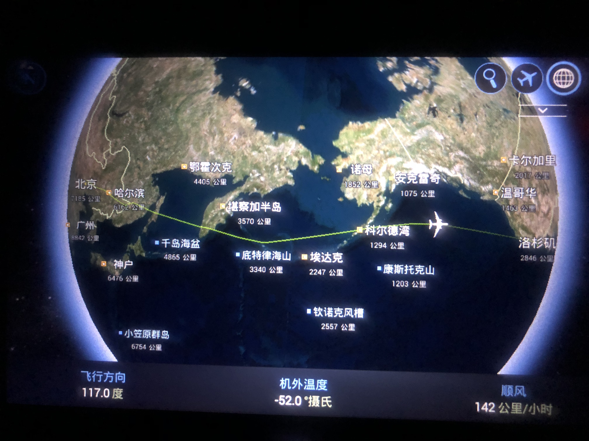

现在是美国东部时间，2018年6月3日的下午5点3分，我在波士顿的洛根机场，等待飞往加拿大温哥华的航班，开始写这篇游记。

本来，现在我是要写代码修 bug 的，奈何公司的 VPN 实在不给力，而我的代码又需要一个公司的包才能运行，因此无法干活，不如写游记。

我通常是一个目标明确的人，因而此行我的目的也很明确，参观一些我感兴趣的大学和公司，顺便随意溜达一下，并没有特意安排景点游乐。而且最近我实在太忙了，每天三四点睡觉，忙的神魂颠倒神志不清，也趁出门多休息下，到处跑景点也累得慌。

<!--more-->

因为我经常看世界新闻，也关注美帝尤其是硅谷的发展，所以来之前已经对美国的政治、经济、科技，甚至是薪资水平和房价等方面颇有了解了。但是美帝毕竟是美帝，其作为世界警察，发展了200多年的资本主义，又掌握了美元这样的利器，所以还是对美帝有种不同于世界各国的印象的，因此此行也很有意义，需要记录一下；加拿大则只是顺道路过一下。

##### 一、达到美国洛杉矶

出发前跟我朋友有联系，不巧他刚好回国了，因此我也不用去找他了。飞机上前半段和旁边座位的阿姨聊天，她是一位急诊科的医生，很恬静的老年人，聊了不少话题；后半段当然就是睡觉了。到洛杉矶不算远，已经西海岸，十一个小时左右。然而飞机刚着陆，就对美帝失望了，因为洛杉矶机场正在进行施工建设，到处都是土堆----第一印象。

下飞机，我就和阿姨分别了，因为她们是跟团，她要和他们一起。去旧金山的飞机是在晚上，因此，我有一个下午的时间去逛逛，本来就是考察和参观学校的，当然目的地就是加州大学洛杉矶分校了，大名鼎鼎的 UCLA。

由于我在国内没有换美元，所以我上公交之前先去换点美元，我咨询了 info service 后，告诉我在另一栋楼，于是我就过去了。在两栋航站楼之间的一小段路程，有两点给我印象深刻：第一，肥胖者真多，是真的肥，不健康的肥，而不是胖；第二，不穿内衣的年轻女孩很亮丽，中午天毕竟气温蛮高，估计妹子是嫌热了，虽然我是个男人，但是也知道不穿内衣肯定清爽很多。

换完了美元，我准备公交出行，毕竟要首先体验一下当地人的状态。结果很麻烦，那些个公交，没有编号，不是那么明确。最后搞了好一会儿，坐上了 Lax Line。这还不巧，一不小心我还坐反了，司机明明说到 UCLA 的呀，没办法，到了一个轨道交通站，我重新坐了个直达 UCLA 的。在这段行程中，又有两个事情让我印象深刻的：第一是对残疾人的照顾。可能是肥胖者过多，最后都心脑血管疾病中风了吧，行动不便需要坐轮椅了。司机到达一个站后停下车，我看到站台一个轮椅乘客在此等候。女司机停好车后走出前门，帮这位乘客推上来。轮椅是有专门的区域的，因为需要用安全带固定好。这个区域本来坐了一个瘦瘦的老头，刚喝完酒的样子，看到轮椅上来了，就赶紧让开了，并且将凳子收起来，司机就将乘客推过去了，固定好安全带后继续开车。轮椅是电动轮椅，很大，不是国内常见的手动轮椅，我在这几天的行程中，见到很多轮椅，都长这样，就是颜色可能不大一样。第二是公交车的车头可以放自行车，本来我是没注意到这点的，但是他下车后，去公交车头部位置鼓捣了两下，然后拎了个自行车下来，我就明白了。这辆公交车悬挂自行车的架子我没看到，但是后来我在 UCLA 拍了张公交车的照片。

##### 二、参观UCLA

UCLA 校门不大----也可能是我来到的门不对，不过我后来发现哈佛好像也没什么大门。进来之后，我就随意溜达，然后溜达到了一个广场，这里有各种学生活动，而且基本都是中国人，后来才知道，快端午节了，他们在搞 Chinese culture day。有吹笛子的、有龙舟的、还有各种社团展示。我凑近到了龙舟那里，见我拿着相机，一位女生问我是不是安排的摄影师，我简答解释了下，不是，聊了几句，拍了几张照片，就继续逛了。

UCLA 的吉祥物是熊，和全世界的雕塑一样，总有一个部分会被游客摸的锃亮。这里跟熊合影的人很多，我感觉跟一个大笨熊合影好傻啊，就咔嚓拍了一张，没有合影。我随着学生们的脚步往前走，路过的不少建筑让我觉得特别的美，像城堡。其中有一座是图书馆，我就进去转了转，也休息会儿，图书馆没有限制必须是学生才能进入，让我觉得很 Open。我竟然睡着了，然后我妹给我打了个语音，我赶紧出来，聊了一会儿，顺便给她看看美丽的校园环境，鼓励她好好学习啊，看，世界名校在你眼前，还不好好努力！

差不多天也快黑了，我准备去找点吃的，导航一下就走到了校园外了，找了一家看起来不错的店，点了个吃的，反正是 chicken，至于是什么 chinken，我是分不清楚的。感觉这家店的服务员很年轻都，并且，很以职业为荣，很欢脱，服务也很好。可能跟国内的对服务员这个行业的不欣赏有关？反正有点儿强烈的反差。点的餐上来后，是个鸡肉面，全是鸡肉，面不多。这一点后来我也发现了，说是啥就是啥，不像西红柿炒鸡蛋在西红柿里面找鸡蛋的梗。

吃完了饭，我叫了个 Uber，去机场，然后去旧金山。由于我想省钱，Uber 选的是拼车，Express Pool，因此后来上了一位年轻的乘客，可能年级和我差不多，也许比我小，后来得知，这位乘客是个橱子，chef，大家边一起聊天。我英语只能一般的交流，司机说快了点，我就反应不过来了。但是呢，这位司机以前在上海待过，因为是做 marketing 的，后来就自己创业了，在东京。我们一路上也算聊了不少，比如，他说他以前为公司工作，只有一部车，后来自己创业，有了三部车了；比如，我们聊到了中国的网络封锁问题，大力批判了一番，我虽然有点儿不好意思，但是，我也是批判这个的啊！对于这一点，那位厨子乘客，表示非常的不可思议，一副世上竟然还有这种事的反应----是啊，世上也只有少数几个国家有这种事啊！

我们两，都是到机场，只是航站楼不一样。到机场附近的时候，路边的围墙突然就冒出了一个飞机尾巴，特别的近，感觉他们的飞机好随意。到了机场才发现，入口更随意，一长排都是，找自己的航空公司进就成，我是阿拉斯加航空。我们知道，美国的航空业是比较发达的，也很便利，我这些天感觉确实是这样子。加上大家都有汽车，所以，长途飞机，短途汽车，火车确实在美国市场貌似不那么大。

##### 三、到达旧金山

到达旧金山后，就是晚上了，我打了个 taxi，直接去酒店，酒店离机场不远，我想着免得麻烦就直接 taxi，结果就被坑了，四五分钟吧，收了我25美元，关键明明计价器上显示的没有这么多，跟我说这费那费的，并且司机还说，“You are happy, but I am not happy”，因为太近了，人高马大的司机，我明显感觉到被宰了，认了吧。深更半夜，避免出事。

到酒店后，办理了入住。我住的酒店不算很好，但是也不差，评分什么的也挺好，也是个小连锁，折扣价一晚上800多，对美帝来说，挺实惠了。我洗完澡准备写代码来着，可是我的 WiFi 不行了，酒店的 WiFi 竟然也不行。刚来酒店 check in 的时候还有信号的啊！没办法写代码了，深更半夜的，只能去前台附近有信号的地方，开个语音会议睡觉了。

##### 四、Stanford ---- 真世界一流大学

起床后，本想坐公交去 Stanford 的，因为有点儿远，从 South Francisco 过去打车肯定不便宜。先吃个早餐吧，KFC，结果好像点了个假的一样，那 chicken 太油腻了，国内这么多年，也没吃过 KFC 那么油腻的----后来一次次的油腻和大鱼大肉，发现美国肥胖患者那么多，真的是有原因的。

公交站并不好找，还是打车吧。结果被 Uber 坑了，我昨天还用的信用卡无法支付了，换了多张卡都不行，怎么着都不行。最后没办法，换lyft了。

因为在湾区，整体风景不错，虽然不是雨季，山上的草，大片的黄色，但是树木还是很清脆的，一路上，我们上坡下坡，和司机聊天，看看景色，觉得还是很不错的。美帝虽然车多，但是人不多，尤其非上下班高峰期间，所以开车还是很爽的。和司机聊得很欢，他是 Uber 的第一批司机，还跟 Uber 的 CEO 合影过，一路上给我看他的照片，说这事儿说了好久。

我们也路过了 YouTube，跟我聊到了不久前，发生在 YouTube 办公楼的枪击案件，我看新闻所以我知道。我问他，你知道 YouTube 的创始人是台湾人吗？他说，really？ I don't know.

司机说，这几天，如果我需要车了，可以私下找他，我说好，然后我们加了 Facebook Messanger。结果后来我找他，他不在附近，囧。

最后，我们在一个山上，司机说，这个山，就是斯坦福的，然后我们开着聊着，就正式进入 Stanford 了。

我们达到的 Hoover 塔附近，教堂背面，我就下车了，溜到教堂正面去，教堂正面的壁画以及内部的壁画真是很精致的。

Hoover 塔，我准备登上去的，结果 close 了，我下午来的时候又 Close 了，真是无缘。

斯坦福真的很大，我一路走走休息，找个地儿喝渴了，然后接着走，我觉得我腿都走断了，终于到了 computer science college 了。

这里真的很棒，各个实验室的机器人，一不小心还发现了吴恩达的办公室，我从玻璃门瞄了一眼，里面没有人。

最后，我把 CS 的好几层楼，都好好的逛了，并且休息了一会儿才走的，直接打车去了谷歌公司，叫到了一个华人老爷爷的车。一路上我们聊了很多：湾区的房价，华人的状态，他的故乡和往事等等。说道房价，他说到他买的时候是11万$，现在大概能卖350万$，并且湾区好点儿的地方，房价基本在250万$以上。

我打车选择地点的时候选错了，选到了 Google X，然后到了目的地后发现不对，我们约定好$10，老爷爷开车把我送过去。
 
##### 五、参观谷歌公司

看到 Google 的牌匾的时候，讲真的，内心没有欣喜，一上坡，一下坡，Google突然就到了，我下车，骑了个 GBike，碰到了个 vistior 的 desk，她跟我讲了讲，并且很热心的帮我画了个 mini 地图，不过，实在是太 mini 了，我咋看也看不明白。。。

Google 的楼都不大，但是我赚了好大一圈，还要过马路，整个园区，没有细数感觉有20栋左右。

由于在 Google 没有直接的熟人，也没进去，外面溜了溜，不过也够溜好久了。虽然没进去，但是外面看看，基本就能了解里面是什么样子了。

来 Google，当然要拍一张 Google 的 logo，以及和奥利奥合影啊，来一张。

逛着逛着，天也慢慢暗了，湾区的晚上，妖风很大，我衬衣加毛衣明显的透风。我在 Google 找了个还有太阳的座椅，坐了会儿，这样暖和。碰到了一位华人妈妈和她女儿，聊了会儿，就骑着 GBike 走了，我往 Google 的左边骑，那边是一个巨大的高尔夫球场，路边的小松鼠特别不怕人，路边的大鸭子，又或者是大灰鹅，感觉很是悠闲。我骑了很远，两边都是绿色的草坪，感觉不像是高科技公司的旁边，更像是一片原始的草原。

湾区的房价和住宿都很贵，于是我朋友推荐了一个很好的，是个 Airbnb，结果她一天不出租。没办法，我重新看看，果然很贵，一个能睡觉的沙发位置一晚上人民币六七百，最后我找了一个 hotel，一晚上一千二百多，来这里是因为旁边有个中国餐馆，真的不想吃美国饭菜。

还有一个感觉，这个 hotel 算不上好，但是还是很标准的，我住的这几次酒店，感觉都特别标准，简而言之都是一样的，比如刷牙的杯子的塑封薄膜，材质都一样。比国内的7天、如家什么的要好一些，感觉。而且，关键是没有更便宜的了，意思就是，最低标准差不多就是这样，再低就不达标了就没了，所以这方面，美帝的水准应该是高一些的。一个人出来，基本就普通住宿，唯一一次高档酒店，还是在波士顿，麻省理工大学附近。

安顿好了，就去吃中国菜了，真心觉得好吃，葱爆牛肉里面的葱真好吃，一口气吃了两碗米饭，一向不喜欢吃面包和汉堡之类的，南方人不太习惯面食，面条我都不太喜欢吃。

##### 六、连排不上名的圣塔克拉拉大学校园环境都这么好

今天起得晚，因为早上要跟国内的兄弟们对事情，所以一切好了他们睡了我这就早上十点多了，赶紧洗个澡，出门，继续去苏杭小馆吃了个饭，打车去圣塔克拉拉大学。司机是一位来自菲律宾的大妈，一路上来聊了不少，非要送我个面包，我只得收下了，最后结车费的时候，在 APP 上给了1美元的 tip，给了个好评。特意想来这所大学看看，我知道这所学校学术水平不高，但也算历史很悠久，应该是西部地区最古老的大学了，因为离硅谷很近，人称硅谷神校，还有一所是 SJSU，也就是圣何塞州立大学。这两所学校出了名的去硅谷找工作方便，所以很多人宁愿来这里，也不愿意去更好点儿学校的中部地区，就跟北京的几所分校录取分数都比外地的主校区分数高一个道理。地域的区位影响，对于学校也很大。

这所学校的建筑，风格跟 Stanford 类似，但是明显没有 Stanford 豪气，建筑密度也比较大，有种小 Stanford 的感觉，但是校园面积也不小。不过校园环境，建筑风格，确实真的很好。感觉超越国内绝大多数学校，几乎所有学校。

##### 七、参观苹果公司

逛了好久，出来了，叫了个车，去 Apple 溜溜。这个司机是个长头发的小哥，长得很清秀，但是一路一言不发，我也不好说什么。到了 Apple 后，拍个照，看一看。我想进去办公区域看看，但是 visitor 不让进去，保安大爷是个华裔，很有礼貌。

然后就是 Apple Park 了，重点。我又打了个车，到了，先去展厅看了看，有个 AR 的效果，用 iPad 扫一下，就能展示未来的园区建设好了的样子。这个还蛮好玩的，就看了好一会儿，然后，去旁边的苹果店看了看，跟国内的苹果店没有什么两样。只是 Apple park 在施工，不让进去。我去二楼楼顶上看了下 Apple park 的外观，感觉没想象中的大，跟百度科技园一样的棱角的外形，估计跟百度科技园的5栋楼加起来差不多大。

然后就是准备去金门大桥了，对于搞 IT 的人，金门大桥肯定不陌生，旧金山和湾区的标志。也是 Cisco 公司的 logo。之前的菲律宾大妈，一路让我坐火车过去，说又便宜又快，但是我查了，时间不对，不然我也想体验一把火车的。于是我就叫了个车，果然很贵，快500了。关键是，司机把我拒载了，说那边太远，往返会浪费太多时间。由于 lyft 是预收费模式，所以他一路 sorry 然后帮我打了电话取消了这个订单，我只能重新叫一个。

##### 八、参观金门大桥

接单的是个华人，我叫他斌哥，比我大几岁，华中农业大学毕业，之前在石家庄工作，移民美国一年多了。因为贸易不好做，所以目前在美国做餐厅和兼职跑车，这样会有一个稳定的收入。看得出来，他压力不小。一路很远，一个来小时，所以我们聊了很多很多，各种话题。因为年纪相差不大，很聊得来，后来还互相加了微信。他把我放下之后，我就在金门大桥海岸边，拍拍照，遛一遛，准备按照斌哥说的，晚些就去渔人码头。

这时候，遇上了一个中国小伙，也是个工程师，VMWare 的，在北京，跟团来的，从旁边的大巴车下来的，也是一个人。我们互相聊了聊，互相拍照，加了微信，然后他就要走了。跟团游果然不自由，我一个人想怎么走，就怎么走，多好，没有时间限制。

金门大桥海边转了好一会儿，给海鸥和海豹拍照，看当地的华人钓鱼，然后溜达到桥顶了，那个风啊，真是太大了，狂风吹乱了我的发。

渔人码头，在地图上看不远，我准备沿着海边走过去，可是看起来不愿走起来真的太远了，实在走不动了，叫了个车。后来上来了一位美女乘客，蛮好看，看头像，毕业于伯克利。然后我们就到了，我先下车，逛逛。

这里有卖唱的人，有各种游客，我觉得没啥意思，貌似全世界都有这样的地方，找了个好评不错的店，吃饭，是个海鲜店，店名就叫做 San Francisco Grab。这个店子确实不错，人很多，而且临海，窗外就停了一艘大船。我点了一个什么鱼的饭，加上一个螃蟹粥，那个粥还挺不错的，鱼也很好吃，螃蟹很实在。感觉一个人出门其实很没意思的，最多只能吃两个菜，但是没办法啊，没有对象，而且朋友签证没办下来。

吃完了饭，这次我准备坐地铁去旧金山机场，然后就从西海岸，直飞东海岸了。不过，是凌晨6点的飞机，意味着我可能要4点就要起床，天啦，平时4点可能才睡觉呢，那就直接睡机场吧，不住宿了。

##### 九、波士顿首站：东北大学

达到了波士顿后，二话不说，直奔东北大学。一路免费的公交加上地铁，下地铁就是了。跟那边学校的人发邮件联系了一下，然后自己去找他们办公室了。去办公室跟他们老师咨询了一下，出来吃饭。吃了个墨西哥风味的，也不知道怎么做的，反正黑暗料理就是了。

##### 十、路过波士顿大学，在 Charles 河溜达

##### 十一、去酒店，路过 MIT

##### 十二、专访 MIT 和 Harvard

##### 十三、Harvard 图书馆和香港楼

##### 十四、温哥华住宿遇到的惊喜

##### 十五、匆匆的 Stanley Park

##### 未完待续...

