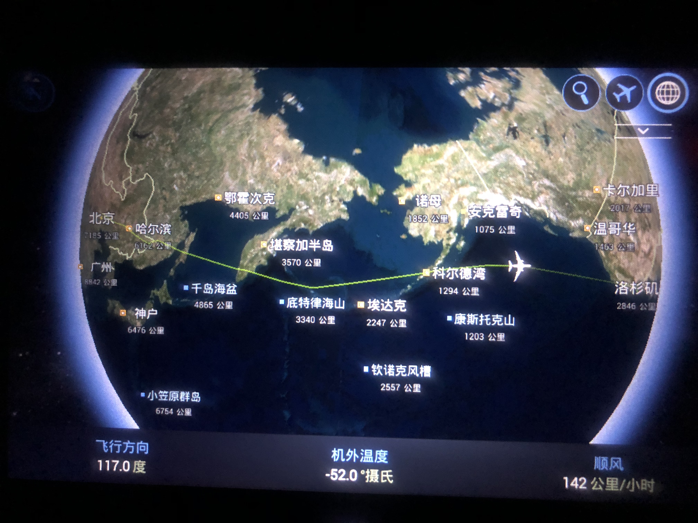

现在是美国东部时间，2018年6月3日的下午5点3分，我在波士顿的洛根机场等飞往温哥华的航班，顺便写这篇游记。

本来，我是要写代码修 bug 的，奈何公司的 VPN 实在不给力，而我又需要一个公司的包，因此无法干活，先在这里骂一句私有 npm 仓库。

因为我经常看世界新闻，也关注美帝的发展，所以来之前已经颇有了解了。但是美帝毕竟是美帝，作为世界警察，发展了200年的资本主义，又掌握了美元这样的武器，所以还是对美帝有种不同于世界各国的印象的，因此此行也需要记录一下。

<!--more-->

此行我的目的很明确，参观大学和公司，顺便随意溜达一下。

##### 一、达到洛杉矶

飞机刚着陆，就对美帝失望了，洛杉矶机场正在进行建设，到处是土堆。
 
公交的两个印象：对残疾人的照顾，以及车头可以放自行车。

##### 二、参观UCLA

##### 三、启程去旧金山

##### 四、Stanford 真心是世界一流大学

##### 五、参观谷歌公司

##### 六、连排不上名的圣塔克拉拉大学校园环境都这么好

##### 七、参观苹果公司

##### 八、参观金门大桥

##### 九、波士顿首站：东北大学

##### 十、路过波士顿大学，在 Charles 河溜达

##### 十一、去酒店，路过 MIT

##### 十二、专访 MIT 和 Harvard

##### 十三、Harvard 图书馆和香港楼

##### 未完待续...

---

#### 参考资料：

1.[无问西东 (2018)------豆瓣电影](https://movie.douban.com/subject/6874741/)

2.[如何评价电影《无问西东》?](https://www.zhihu.com/question/31870607)

3.[淞沪会战](https://baike.baidu.com/item/%E6%B7%9E%E6%B2%AA%E4%BC%9A%E6%88%98/13407?fr=aladdin)

