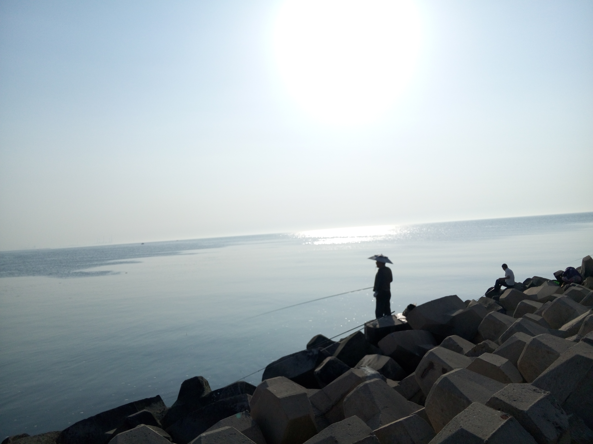
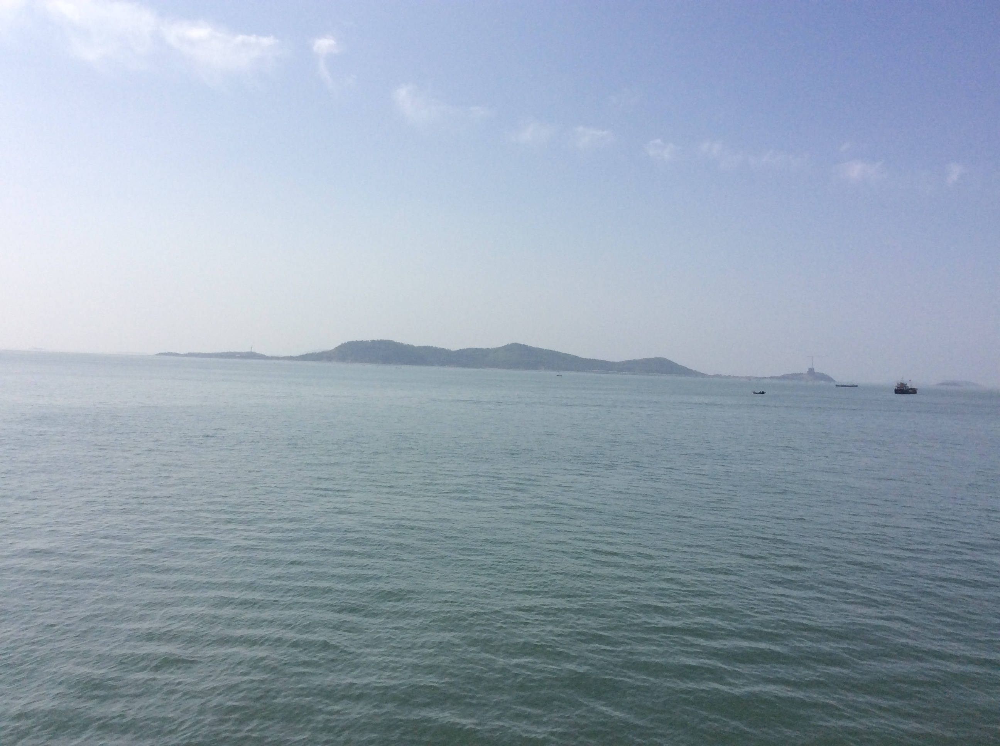
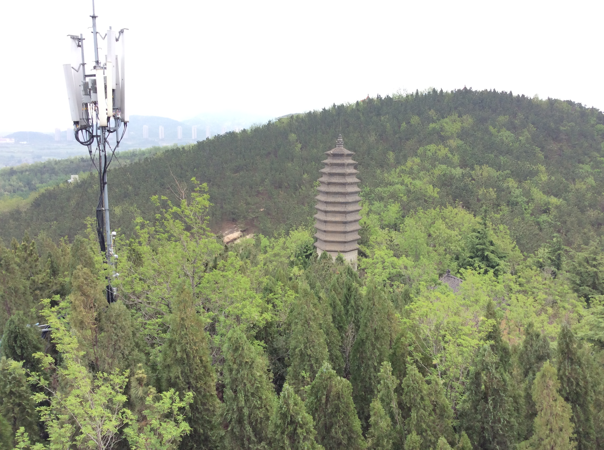

感谢朋友的爸爸妈妈的热情招待，我们吃了好几天海鲜，终身难忘。

<!--more-->

烟台海边，夕阳下的垂钓者，海边蓑笠翁。

这张照片是我们去长岛的船上拍的吧？

这张照片，是远眺长岛？还是登岛之后拍的，真记不得了。

这张照片我记得是刚登上长岛时候拍的，他们的码头。

我记得貌似在蓬莱阁附近拍的蒲公英。

我们在蓬莱阁下玩了一圈激流快艇。

这个就是八仙过海的雕塑了，觉得他们好Q。

这个塔的名字，我还记得，南风塔，很有意境的名字。

这是南山公园里面宽阔的马路，感觉整个烟台都如这条马路一般，特别干净。

南山公园的大佛像近拍。上面的名字是捐助者的姓名。

佛说，药不能停。我觉得这张照片配这个台词，很搭。

小朋友，平板的板都不会写啊，想好吃的了吧。

或许在找到真爱前，你们都以为喜欢的是同性。

南山大佛远眺，整个公园是相当的有气势。

俗话说，青年欢乐多。

欢乐的青年们。

踩死你!哈哈，怎么舍得！

感觉这蹲小佛像的皮肤好好，吹弹可破的感觉。

### 注：此游记根据照片和回忆整理
