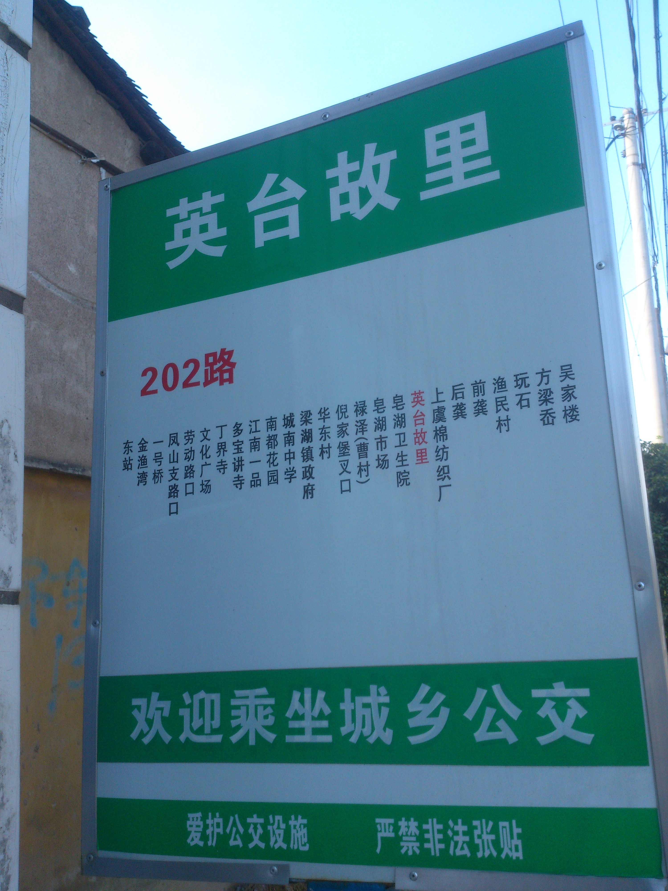
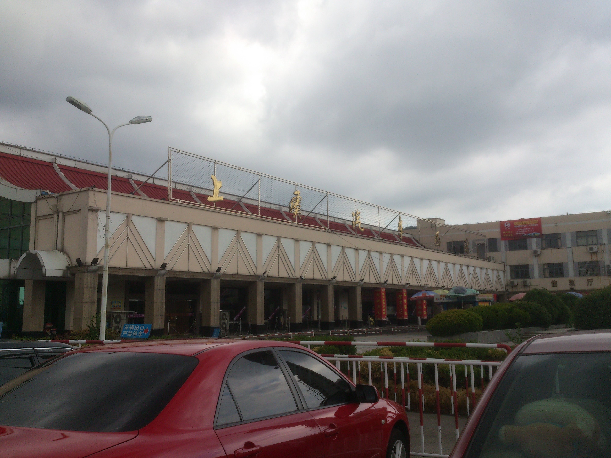
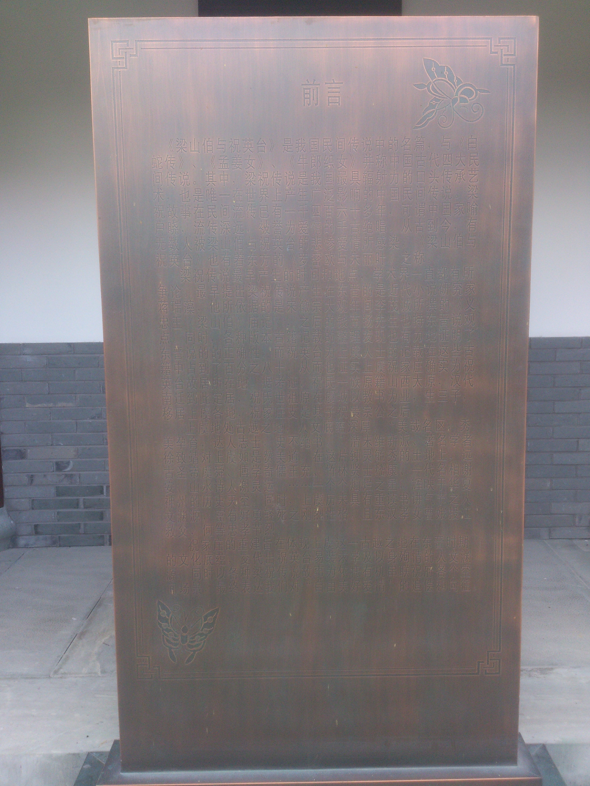

来上虞，就是为了来祝家庄的。

<!--more-->

一个人从绍兴到上虞，坐的是汽车，到站后的天，灰蒙蒙的。

路边的英台超市，这名字，估计也只有这里有吧。

坐公交过去的，中间路过了个牌坊，上面写着：英台故里。但是没停车，所以我没来得及拍照。

下公交后往前走，很快就到了，这是山下的一个庙，当时正在修建。

祝府的大门，拍照纪念。

介绍梁祝故事的木碑。

祝府地图的石碑。

室内的情景雕塑。

祝府的内景，我觉得景色还有亭台楼阁还是挺好的，当然了，都是后建的。

小小的假山。

破破的灯笼，引发了深深的思索，我在这里呆了很久。历史，岁月，爱情，现实，我想了 很多。

梁祝文化研究会的门匾。

### 注：此游记根据照片和回忆整理
