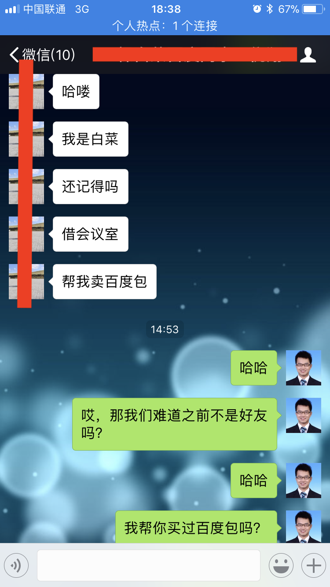

记不住东西，真是件非常痛苦的事情。

<!--more-->

以前，我总觉得，我搞技术，只是为了多赚点工钱，现在才发现，对于技术，或者科技，我谈不上热爱也算有爱了，尤其和一些东西相比，比如英语。

最近我背单词，背的死去活来的，书都翻烂了，很多还记不住。我觉得我英语考试没达到我的目标分数，有三方面原因：

（1）我是真不喜欢英语，我觉得英语就是中华民族没有抓住殖民主义和计算机互联网两次机会的结果，前人不努力，后人学英语，没毛病。

（2）我觉得我记忆力真心坏了，这个我很久前就发现了，跟我的不规律作息应该联系很大，小学时候那么长的课文都能一溜烟背下来，后来完全不行了，初中开始发现问题，高中有些好转，大学彻底崩盘。

（3）状态不好，本来计划抛开一切，专心英语的，结果发现一切根本无法抛开，专心做事儿真是一件不可能的任务了。

尤其是我记忆力坏了这事儿，可不是随便说说，我把老同学都能给忘了，那同学还是一女神，这次回家汽车上遇到了，和我打招呼，我完全想不起来她是谁了，也真是尴尬。

今天，有人加我微信，说我们是同事，我就想啊，哪有同事不说名字的呢，骗子吧？就没同意，回复你是谁呀，结果：

我记忆力不好的问题，我发现，不仅我知道了，我朋友也知道了，并且说，这问题早发现了....

我就想啊，人啊，不一定非要做自己热爱的事儿，但是啊，一定不能做自己又不热爱又不擅长的事儿，不然就很麻烦，只能靠慢慢磨了。

所以我现在就安慰自己，好好搞技术吧，是爱它的，真的！最起码技术问题，是完美的理性！最起码，是不需要大量死记硬背的！最起码很多时候搞一个技术问题我能高好久而越搞越开心！
