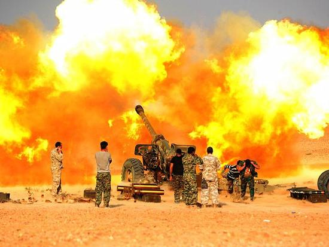
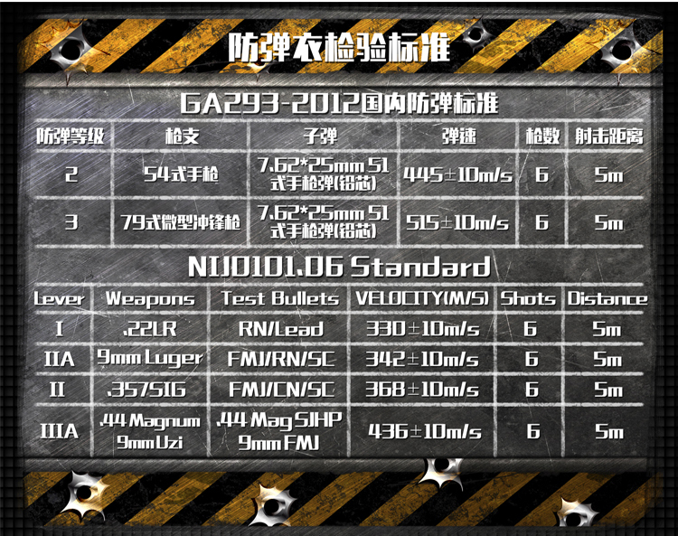

这个世界，既不安分，也不安全。

我一直关注叙利亚和朝鲜的局势，然而今天在一天，我同时看到了两个新闻：一个关于利亚，一个关于朝鲜；一个关于宗教，一个关于政治；一个关于伊斯兰教，一个关于社会主义。这两个新闻分别是：伊朗宣布“伊斯兰国”已被剿灭，韩国曝光了朝鲜士兵在板门店叛逃的视频。

<!--more-->

##### 伊朗的宣布，并不代表“伊斯兰国”势力的彻底终结

从叙利亚危机开始，我就在关注其局势。在“伊斯兰国”势力如日中天的时候，其缩写 ISIS 经常性的占据国际媒体的头条新闻，血腥的视频，让人看了之后，毛骨悚然。另一个角度，我也一直在关注叙利亚人民的生存状况，尤其是孩子。今年上半年，我一个朋友生日，我送了他一份我认为很特别的礼物------一份捐款给联合国儿童基金会叙利亚地区孩子物资的电子贺卡回执。

并且，我清楚的记得，那封联合国儿童基金会发我的邮件，以及那个视频中，小女孩接受采访时候，想起的炮弹声，请看参考资料3，有小女孩的采访视频。

如今，炮弹声貌似就要远去，但是“伊斯兰国”势力就真的要彻底终结了吗？我并不这么看。我认为，虽然叙利亚问题，甚至中东问题，是非常复杂的问题，但是伊斯兰教，在其中是有非常重要的作用的。所以只要伊斯兰教存在，并且拒绝改革和进步，那么这一问题很难绝根。从另外的角度说，暂且不论宗教的影响，从经验说来，正面战场的结束，往往意味着游击战争的开始。因此叙利亚乃至中东地区的问题要得到根本解决，还有很长的路要走，只希望这条路，能够走得更快一些。

之前在马蜂窝，看到一位女孩子，去叙利亚的旅游，在参考资料4。真的很是羡慕和钦佩，虽然去的是安全区，但是也很危险。我想以后有机会，我会去的，暂时是去不了，签证也没有旅游的签证，她走的工作签证。

但是，我想，我要是去了，像我这么怕死的人，防弹衣什么的，是少不了了。最近有意无意就在关注防弹衣，因为随着年龄的增长，看到更多的世界，发现这个世界，从来不像书本和影视作品中，那么的美好。防弹衣淘宝就有卖，因为这是特殊产品，需要有等级证书的，3级就能防冲锋枪了。并且能穿的地方很多：美国、印度、欧洲、中东，过去都可以穿上，有内穿马甲款。

##### 国家富强，民主自由，则人民爱；反之，则人民弃

从韩国公布的这段视频中，见参考资料1，以及新闻的汇总，这名士兵是高级士兵或者高官司机，因为一般人是无法开车的。并且，据后来韩国方面的透露，这名士兵中枪了5-7枪。

我一直以来都在问自己一个问题：一个人，到底应不应该爱国？一个人，爱国的感情应该是自发的还是应该是被教育的？

我的答案是：一个人应该爱国，应该是自然而然的爱国，不需要被教育的那种爱国。

祖国，是一个人成长的社会历史环境，一个人自然对其有独一无二的情愫，他对祖国的爱，就像对母亲怀抱的爱恋，一定是自发的。

那么，当一个人叛逃祖国的时候，错的可能就不是这个人了，而是这个国家了。曾经的中国，也经历过小范围的偷渡出境的；现在，又有谁愿意冒着生命危险去偷渡呢？有谁见过美国人偷渡去别国的么？我想大概很少。

一个国家，当处于困难和危机中的时候，自然需要仁人志士来热血奋斗。但是热血奋斗的前提，是值得。当他们认为自己的祖国值得自己牺牲的时候，自然有成千上万的英雄，去为民族解放或发展作斗争。而当人民被教化着去爱国的时候，如果这个国家不值得，那么，再高的围墙，再多的子弹，也挡不住一颗要逃离的心。

说到朝鲜，就得说到我对社会主义深深的不信任。历史已经表明了，目前的社会主义实践全部破产或者即将破产，除了中国。而中国，众所周知，在践行改革开放，进行市场化改革，取得了非常重要的成绩。朝鲜，某种角度来说，是真正的社会主义国家，彻底的公有制。然而，朝鲜目前的状况，大家是知道的，以至于我去朝鲜的旅途中，和同行的伙伴，为了节约朝鲜的粮食，我们吃饭都不带浪费的。最近中国对朝鲜的制裁，动了真刀子，估计朝鲜的经济状况会持续恶化。

从非官方新闻报道来看，这位叛逃的军人，身体状况十分糟糕，参考资料5.医生们在该士兵的肠道里发现了大量的寄生虫，多达几十条，有的长达10至11英寸（约25至28厘米），在士兵的腹中发现少量食物，大多为玉米粒。如果情况属实，那么说明朝鲜目前的经济问题和粮食问题已经相当严峻了。众所周知，朝鲜实行先军主义，一切优先服务军事目的，在这样的情况下，高级士兵（说是高官的司机）的身体情况如此，那么其国家状况可想而知了。回想起我在朝鲜旅行的时候，有鱼有肉的餐饮，真的是有些过意不去的。

主义很多时候，真是：祸国殃民。

少谈些主义，多解决问题。

---
#### 参考资料：

1.[飙车、追逐、射击、中弹！朝鲜士兵越界进入韩国视频曝光--环球时报](http://mp.weixin.qq.com/s?__biz=MjM5MDk1NzQzMQ==&mid=2653251329&idx=3&sn=2e3ae482be30ef49fb5c12e90807fb41&chksm=bd6d2d198a1aa40fa7b793646de9069da485b5cccb6e28628bba976c920250485614febb385a&scene=0)

2.[伊朗总统宣布“伊斯兰国”已被剿灭--新华网](http://news.xinhuanet.com/2017-11/22/c_1121992760.htm)

3.[战火中的童年--优酷--联合国儿童基金会](http://v.youku.com/v_show/id_XMTg5MDQyNTE0MA==.html?spm=a2hzp.8253869.0.0&from=y1.7-2)

4.[叙利亚🇸🇾2017年6月19](http://www.mafengwo.cn/i/7281389.html)

5.[该士兵的腹中还有少量食物，大多为玉米粒](http://news.sina.com.cn/w/zx/2017-11-22/doc-ifypapmz3765803.shtml)
