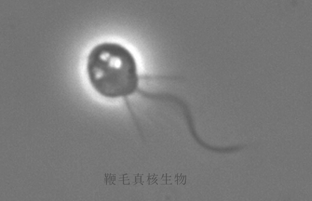

今天是520，明天考试GRE，下午模拟考试了下，然后一塌糊涂：记住了的单词感觉遇到很少，考试碰到了怎么就全不记得呢？很崩溃，那就放弃单词搞搞数学吧。结果到晚上了还是很不爽，GRE数学中，关于随机和概率的问题，让我想到了一篇很久前就想写的文章。那就写写文章放松一下吧。

这篇文章，是关于一些简单的随机和必然的思考，以及随机和必然之间的联系：数据，文章用了一个随机法求圆周率的方法来验证了随机和必然的一些关系；还从随机的角度臆想了一下生命的起源问题。

<!--more-->

首先明确一下，什么是随机？什么是必然呢？简单的说，不确定的就是随机，确定的就是必然，这貌似是废话。举两个例子吧：太阳明天从东方升起就是必然；明天我会不会发生什么意外就是随机。一般而言，随机和必然是互斥的，总不能一件事情，又是随机又是必然。

然而，我们思考一个问题：天气预报。曾经，我们认为“天有不测风云”，我们认为天气是不可以预测的，而今天，如果我们还这么想，气象工作者该不高兴了，这不是让气象工作者的价值都消解了么。那么从气象的角度看，一件事物，曾经是属于随机的，随着我们掌握的知识增多，科技手段的提高，我们可以从我们所掌握的知识中推导出来气象结果，因而就有了天气预报的出现。并且，随着技术手段的越来越强，天气预报越来越准确。小时候我们经常听到“跑报”一词，就是说天气预报不准确。现在则很少听到，现在的天气预报非常准确不说，还能预测很久之后的日子的天气。

我把我们掌握的各种知识，都统称为“数据”,即使是那些没有数据表现形式的知识类的东西，都能被称为数据。因为那些知识即使本身不是数据，但是他们提供了描述数据的规律，或者说是模式。

先不考虑知识性的东西，我们来看下，如果有大量的数据，哪怕是随机的数据，它能有什么作用。

我们知道，关于圆周率π，我们耳熟能详的故事有很多，中国的有祖冲之，国外的有欧几里得。他们作为人类历史上伟大的数学家，极具智慧并且刻苦求索，才求出了π的近似值，因而名流千古。

如果有人告诉你，你随便仍一把沙子，也能求出π的近似值呢？我想一定有人觉得是疯了，这不是当数学家们是白痴么？不然数学家不都去扔沙子了。

那我们来扔几把看看。

扔之前，先简单的规划下方案，我们在边长为1的正方形中，以半径为1画一个圆弧，如图所示，图中的红色，绿色，灰色的点都表示随便扔进去的一些沙子。


如图所示，我们看到，绿色的点是在圆内，红色的点是在圆外。

那我们到底如何求π呢？

我们先来看下正方形的面积：边长为1，因而面积S= 1 * 1 =1;

其中的四分之一圆（圆弧内）的面积：s = π * r * r / 4= π / 4;

如果我们随机扔一把沙子到正方形里，那么这把沙子要么落在圆弧内（不包含圆弧，假设它非常细)也就是绿色点所在位置，要么落在圆弧外。他们分别的概率等于他们的面积大小，面积越大落进去的概率就越大不是么？并且两者的概率相加等于1，这是不言而喻的。那我们就可以得到一个比值：

落在圆弧内的概率：落在整个正方形内的概率 =  π / 4 : 1;

我们把这个比例式子改写一下就是：

(π / 4） * 落在整个正方形内的概率 = 落在圆弧内的概率；

前面说到，落在整个正方形内的概率为1，因而：

(π / 4）= 落在圆弧内的概率;

π = 落在圆弧内的概率 * 4;

Duang, 我们的π已经出来了，也就是我们只要确定了一把沙子落在圆弧内的概率，我们的π就能求出来了。

我们如何判断沙子在圆弧内外呢？我们通过距离来判断。如下图：


我们假设把正方形以及正方形内的圆放在一个坐标系内，那么我们通过两点之间的距离公式，就能得到点【也就是图中的点（x,y）】到原点的距离d，公式不好写，用文字来表述：

d 的平方= x 的平方 + y 的平方

所以，只要d的平方小于圆弧的半径1的平方，那么这个点就在圆弧内。

也就是：

x 的平方 + y 的平方 < 1  ---> 点落在圆弧内


这里我们不禁要问一个问题，概率可靠么？如果你认为扔硬币得到正面朝上的概率是0.5，那么概率就是可靠的，扔沙子也是一样的道理。我们开始来扔沙子了。用代码来代替扔沙子，不然也太傻了，谁会傻到在地上扔沙子呢--------这就是代码的伟大之处，他能抽象的代表很多事物：从文字到图像到知识到经验到实际事物的模拟。我们用JavaScript代码来模拟，因为每个人的电脑都有浏览器，代码复制到浏览器的控制台中就可以运行。

 ```javascript

 // 我们需要扔沙子的次数
 var count = 10;

 // 落在圆弧内的次数的计数器
 var p = 0;

 // 判断是否落在圆弧内的代码
 function isInCircle(r1, r2) {

   if ((r1*r1 + r2 * r2) > 1) {
     return false;
   } else {
     return true;
   }

 }

 // 我们根据次数来不停的扔沙子
 for (var i = 0; i < count; i++) {

   // 我们要保证扔沙子的随机性，给两个随机数，随机的x和y在坐标中的位置，就是实际扔的沙子的位置，Math.random函数刚好产生0-1范围内的随机数
   var x = Math.random();
   var y = Math.random();

   // 落在圆弧内，则p加1
   if (isInCircle(x, y)) {
     p++;
   }

 }
 // 当沙子扔完了后，我们根据上面的概率来算π的大小：
 console.log('π：' + 4 * p / count);
 ```

 好了，我们现在打开浏览器，去掉注释运行一下代码看看。以下为扔10次的结果，误差有点儿大哈，3.6：


我们再来重新扔，把count改到10000次，我们看一下，3.1592：


我们发现已经接近了我们印象中的π的近似值：3.14了。兴奋！我们继续加大次数，再把count加3个0：


我们看到，3.14求出来了！得到的3.1411148已经离3.1415926很近了，但是还不够精确，我们再把扔沙子的次数加3个0！由于扔沙子的次数太多了，到现在已经扔了10,000,000,000 也就是100亿次！辛苦我的电脑的CPU了，你先跑一会儿，我等你！

等了好久还没有出来！因为我们虽然只是简单了加了3个0，CPU却要为这3个0多跑1000倍的次数，原来如果是1秒钟跑完，现在就需要1000秒了！那时间就不短了！我们还是不要等了，道理懂了就行！JavaScript代码的执行性能差，用C的话会实现的更快，就不用等那么久了。

我们可以看到，理论上来说，只要扔沙子的次数不断增大，π的值就会越来越精确！这根我们扔硬币是一样的，扔的越多，就越接近0.5！

对于大多数人来说，扔硬币正面朝上的概率为0.5，这是比较好理解的。不是正就是反嘛，但是通过随机数来求π这样的复杂数字，很多人就不理解了。

为什么，明明很随机的东西，能得出如此正确甚至更精确的数字呢？难道冥冥之中自有天意？

这就涉及到了文章开头讲到的，随机和必然的关系，以及他们之间的纽带：数据。

当我们认为一件事情是随机的时候，比如天气，是因为缺乏对它的认知（数据），当认知上来了，积累的数据多了，我们就可以根据海量的数据，捋清楚事件的结果。因而，气象问题也就从不可知成为了可知。

当然，气象的数据是有意义的、是理性的、是符合科学道理的，因而达到了这样的效果我们和能理解。但是像求π这样的随机数据，为什么能实现这样的功能呢？明明就是没有意义的数据啊，0-1的任意数据为什么能求出π的值呢？

确实，这些数据是完全随机的（意义上)，他们每一个数据，都没有任何的规律可循，你无法确定下一次的数值是多少。就像你无法确定扔一枚硬币的结果是正反面一样。

等等，扔硬币真的是无法确定的吗？以前天气的预测是不可能的，因为气象系统非常复杂，人们无法完全搞清楚这个系统内所有的数据对天气的结果的影响，但是现在可以了。我们无法确定硬币的正反，不还不是因为缺乏数据么？假设一个硬币的正反面由一万个参数决定：起始正反、扔硬币的角度、扔硬币的初始速度、扔硬币的初始加速度、硬币的质地均匀程度、硬币的图案对其在空中阻力的影响、当时情况下的空气的密度、空气的风速、风的角度......如果所有的参数能确定，那么硬币的正反真的无法确定么？答案显而易见，这跟天气预报是一样的性质。

通过这个例子，我们又想到了生活现实中一个比较贴近又有意义的例子：交通事故。我们一般情况下把交通事故称为意外，其实它并不是意外，只是千万种参数数据下的必然结果，其中的任何一个参数的改变，都有可能改变交通事故的发生概率，比如：不超速，交通事故的概率就会大大降低。

因而，我们反思一个事件的发生的概率的时候：到底什么是随机，到底什么是必然？这其中的冥冥天意到底是什么？

我认为，是数据。无论是知识的累积，还是无意义的实验数据。当我们的数据积累足够多了，原来的随机事件，很可能就会被确定下来，成为必然事件。如本文中的例子，当实验次数和实验数据足够多的时候，我们能求出π的大小；当我们对气象的研究数据足以支撑对气象的预测的时候，我们就有了天气预报；当一个社会能达到理想多的交通数据和一切行为的数据的时候，我们就能通过预测交通事故来避免交通事故。这就是海量甚至无限数据的意义！或许就是现在的机器学习和所谓人工智能革命的意义！

或许这世界本来就是随机的，随机积累的数据多了，便有了确定性--------或许这就是世界的本质。

我们再来找几个简单的例子来说明这个观点。

我们每个人小时候学习走路的时候，保持平衡是非常困难的。于是，我们在爸妈的鼓励下，随机的尝试：迈开腿，张开手，抬起脚....我们摔倒了无数次，突然有一天，我们平衡了，也就站稳了；我们记住了这种平衡状态下的各个身体参数：手脚的方向和角度，肌肉的收缩程度，神经的控制方式，我们最后便学会了走路。

或许我们就是在随机的尝试下，开启了我们智慧的起源。

我认为这是一个很重要的思想，我觉得随着计算机的发展，这个方面的突破会越来越多，比如机器人的自动学习。我们目前的机器学习是也是基于统计的，但是缺少一种交互性：父母定了一个行走的目标，孩子去随机尝试，达到目标便记下状态，也就学会了行走。把父母换成人类，把孩子换成机器人，或许机器人就能真正拥有所谓的“智慧”。

在数学上，类似的思想被称为“蒙特卡罗模拟”。

我们也知道，科学家到现在都无法确切的解释，人类的最终起源，最终的最终，原点的原点。

我们每个人都对“进化论”很了解，并且很认可这种假说，因为很多证据证明了进化论的合理性。但是他只能解释后期的进化，也就是我们到达了动植物阶段的演化过程。那么在这之前呢？

有假说认为，动物大约产生于7亿年前，演化自一个鞭毛真核生物，现在发现的动物化石多是在5亿4千万年前的寒武纪大爆发时的海洋物种。



我们先认可这种说法，那么请问在这之前呢？这个神奇的像小蝌蚪一样的东西，差不多快到源头了，但是它本身是如何产生的？现在的科学研究表明，生命只能来源于有生命的生命，这个东西不可能凭空产生。

我们最后发现，第一个有生命的物体，我们无法给出解释，全世界的科学家也只能给出“随机突变”的解释了。

是的，随机。或许就是因为随机，我们的最初的生命形态才在偶然中从无生命物质一不小心就有了生命。我们知道，在基本的认知中，一种物质由基本的粒子构成，无论它有没有生命：桌子和人都是粒子。我们在一些科幻小说中，也有幻想将人体的粒子排列完全复制从而创造一个一模一样的人。当然这是复杂的，也是不可能的，因为人是一个非常庞大和复杂的粒子集合，包含的数据量太大了，无法复制。

但是，最初的生命形态一定是简单的。大自然或许就在亿万年的随机排列组合中，凑巧排列出来了一个这样的物质，于是便开始了生命的起源。

这是个很疯狂的想法，但是我们知道，π这样的特别的数字，都能通过完全的随机来实现，大自然亿万年随机出来一个有生命的粒子集合的特定排列，或许是有可能的，只要时间足够长，在无限的样本中，有一例满足即可-----就像随手扔一把沙子，他们在地上恰巧排成心形图案一样,当扔了无数次后，是很可能有一次刚好就是心形的。

我们看下时间表：


我们也在前面讲到，只要随机的数据足够多，那么一种不可能，就变得可能了；一种随机，便会变成了确定；一种一无所知，变成了可以预期。

也就是从45.5亿年前开始，到40亿年前的大约5.5亿年的时间里，地球上的所有的物质，只要粒子的随机组合能够有一次机会排列成有生命的形式，生命便产生了，然后刚好运气好得到繁衍，然后有了我们。

感谢我们对随机的认识----随机，或许是一种无知，因为我们缺乏充足的数据来解释它便叫它随机------我们人类今天可以说对很多东西都是无知的，甚至一些常见的东西都搞不清楚，比如时间，比如光；不过，感谢这种无知，这种无知的随机，或许就是一切的源头。

----
1.[人类起源的大致过程是什么？](https://www.zhihu.com/question/23533476)

2.[随机是世界的本质吗？有序是不是人类对这个世界一厢情愿的认知？](https://www.zhihu.com/question/33695102)

3.[蒙特·卡罗方法](http://baike.baidu.com/link?url=F9-JSCkzfv4Hi3VNGtwX9_2VtEekygcLKP2Kpya8L9jHg6YC9B0X8fNt4jD3jt_k7fpmy5WX4oiPKpXFTM0__Du_wnvbWSTNmg0wtuz91BjhLFbtkWmVcP98e6gKcm5EcFs2brXyJmGPqPkZSD56djEQEjL6gdqxNHLDGC-8asa)

4.[进化论](https://zh.wikipedia.org/zh/%E6%BC%94%E5%8C%96%E8%AB%96)

5.[波粒二象性](https://zh.wikipedia.org/wiki/%E6%B3%A2%E7%B2%92%E4%BA%8C%E8%B1%A1%E6%80%A7)

6.[人类简史](https://zh.wikipedia.org/zh-hans/%E4%BA%BA%E7%B1%BB%E7%AE%80%E5%8F%B2)

7.[时间](https://zh.wikipedia.org/zh/%E6%97%B6%E9%97%B4)

8.[地球历史](https://zh.wikipedia.org/wiki/%E5%9C%B0%E7%90%83%E6%AD%B7%E5%8F%B2)
