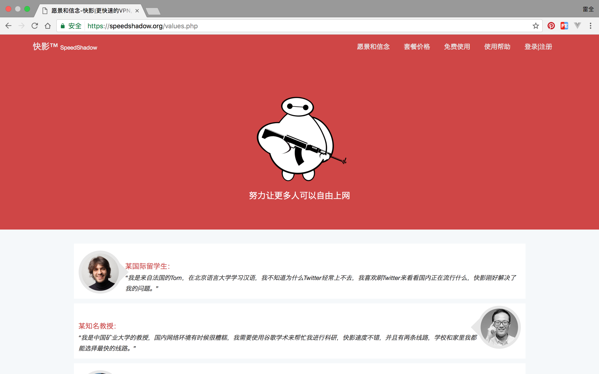
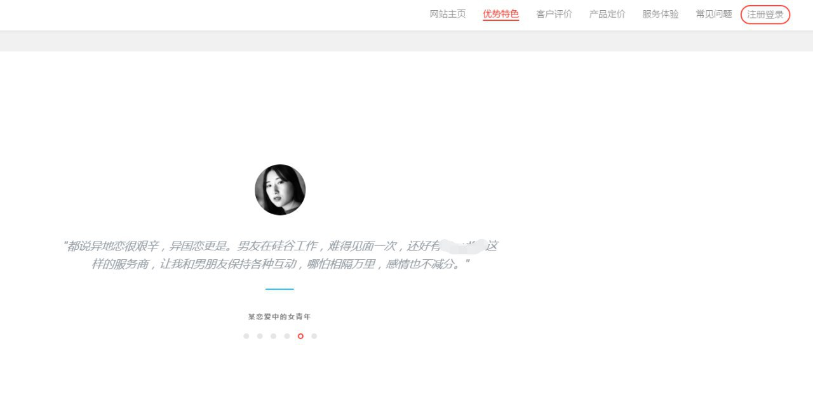
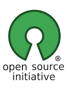

据说，以上标题是UC头条，今日头条标题的标配，不看那些媒体的我，也来模仿一下玩一下。

事情是这样的，让我慢慢道来。

很久前，我做了个网站，文案是长这样的：

<!--more-->

然后，很久以后的今天，我在一个群里宣传的时候，他们注意到了这个文案，一个个表示，要把文案抄走。

他们还不光说说，还真抄了，当着我的面抄了。

按理说，我应该不高兴：你们侵权了！

然而我不仅没有不高兴，还挺开心的。自己写的东西能被人使用不是很美好的一件事情么？难道不是对自己价值的认可？让他们的网站也有点更文艺高端的文字，让这个世界更美好一些也不是什么坏事儿。

大家注意到了这个群聊，既不是QQ，也不是微信，也不是WhatAPP，而是Telegram，被称作最安全的聊天工具，该IM软件平台支持非常全面，从iOS、Android、WindowsPhone、Windows、Mac、Linux、Web端都一应俱全。

Telegram的创始者是来自俄罗斯的富豪及社交网络领导者Pavel 和 Nikolai Durov[杜罗夫兄弟]，特立独行的两人觉得：“如果没有谁能为我做出一款能保证信息安全的App，那么我就自己做一个出来”。Telegram是一个即时通讯平台，我们所期望的：免费、简单、界面友好还有安装方便，它都做到了，而在安全方面，甚至做得比其他的同类App更好，而且绝无任何广告和推广。

在为了证明Telegram的安全性，杜罗夫兄弟还是采用了老套的悬赏方式：凡是能突破TG安全协议，并获得指定信息的黑客，即可获得20万美元奖励。挑战如下：在杜罗夫兄弟两人的日常通信中截取一个神秘电子邮件地址，并把当天两人的通信发送至该信箱。去年12月，一名程序员发现了TG安全加密协议中的一个潜在安全漏洞，杜罗夫兄弟十分爽快地支付了10万美元给这名程序员。

或许这就是传说中的有钱任性，达则兼济天下吧。

然而，除了有钱人，还有个领域的人，也热衷于助人为乐不求回报。那就在技术领域，更精确的说开发者领域，开源好用又免费还没有广告的好东西实在太多了。

随便来两个我每天都要用的例子：

操作系统收钱是吧，林纳斯·托瓦兹自己写了一个，于是有了Linux，我们今天每一个人的每一天，都在和Linux打交道：Android手机基于Linux，访问的每一个网页背后的服务器绝大多数是Linux，绝大多数需要系统的硬件设备背后都是Linux或其变体。

天朝屏蔽网络是吧，Shadowsocks便由大神创造出来了，于是，我们大家能够愉快的翻墙了，在翻墙的时候，心里一定要铭记被请去喝茶的Shadowsocks作者啊，这样才能表达我们的感谢之情。

Mac平台下没有好用的视频播放器是吧，IINA出现了，这是最近出现的项目，我试用了下，确实不错，基于MPV，样式简洁，功能齐全，是一个学生暑假在MPV的基础上改进的。

......

在开发者群体中，开源精神，是一种倍受推崇的、难能可贵的精神，我们也称之为Copyleft意识，它也挑战着我们的传统的Copyright意识。

什么是Copyleft意识？形象的说：可口可乐宣称锁在保险柜里的神秘配方就是Copyright意识；如果把这个配方公布出来大家自己在家里按照配方做可乐也行，来买我的可乐也行，这就是Copyleft意识。我网站最底部申明的就是Copyleft，算是一种荒诞不经的随意吧。

在这样的意识下，今天我们常见的几乎所有软件，大概都有一个对应的开源免费版本。

开源免费的Linux对应闭源收费的Windows；开源的Android对应iOS；开源的Blender对应Auto CAD；开源的Webkit浏览器内核抗衡IE浏览器；开源的Apache和Nginx抗衡微软的IIS....甚至诸多领域的软件只有开源的版本，商业版本并不受到开发者欢迎。

为什么近年来，开源精神越来越被认可呢？

因为，人人都想要自由。不仅仅是不用付Copyright费用的自由，也是一种知情的自由，更是一种在此基础上整个领域往前进步的自由。

如果没有开源思想，对应着这三条自由，会有三个问题：

许可费用惊人----我们知道微软靠着卖操作系统一度成为了世界首富，我们花钱购买了windows后，我们又要购买一个个的软件（我们目前正在做的），不仅如此，如果没有Linux等的免费服务器的支持，没有PHP+MySQL的免费服务器软件的支持，我们甚至每点击一次鼠标都需要直接或者间接付费。

我们对于软件的安全性不放心----普通人对于安全并不担心，因为其价值实在有限，但是对于公司和国家机构，尤其是军方，这就很重要了。不开源的东西，怎么敢用呢？被窃听被监控不是分分钟的事情么？就像食品如果不详细的写明配料表和加工工艺我们怎么敢吃呢？（好吧，现在的食品确实只有简略的配料表，并没有可验证的工艺流程，所以食品安全问题频频发生）。

软件行业的发展会受到其局限性----我想，近些年来的IT行业的迅速发展，绝对跟开源思想是分不开的。因为开源的理念，我们可以拿到前人的成果，免费，透明的进行再造和升级。如果没有开源，费用贵不说，绝对是没有对其改造和发展的自由的，那么整个行业的发展速度是势必受到影响的。

基于对自由的向往，开源软件早期由各路不慕名利的大神推动着，比如Linux的创立者林纳斯·托瓦兹，他是有很多次发财机会的，乔布斯邀请他，他也拒绝了，如果非要说有利益可图，那就是我眼中的精神收益吧，对自己内心的满足感的追求。

后来，各路商业公司也参与进来了，比如谷歌，是最典型的。它通过开源的Android系统，从门外汉迅速占领了移动操作系统的市场。商业公司的行为，直接利益是没有的，但是间接利益肯定是存在的，我们看看Android推出后它的市值就知道了。

然而，即便这样，我还是热爱和支持开源精神，最起码，谷歌开源了Android，还能成就中国的小米；最起码，开源是自由的。

开源，更是一种理想。

关于开源，大家可以了解常见的几种开源许可协议，请参考文末链接。

#### 参考资料：

1.[Telegram官网](https://telegram.org/)

2.[GNU项目官网](http://www.gnu.org/)

2.[GNU--维基百科](https://zh.wikipedia.org/zh/GNU)

3.[开源--维基百科](https://zh.wikipedia.org/wiki/%E5%BC%80%E6%94%BE%E6%BA%90%E4%BB%A3%E7%A0%81)

4.[Copyleft--维基百科](https://zh.wikipedia.org/wiki/Copyleft)

5.[Shadowsocks--Github](https://github.com/shadowsocks/shadowsocks)

6.[开源许可协议--百度百科](http://baike.baidu.com/item/%E5%BC%80%E6%BA%90%E8%AE%B8%E5%8F%AF%E5%8D%8F%E8%AE%AE)

7.[IINA - 一个现代的 macOS 视频播放器--知乎](https://zhuanlan.zhihu.com/p/24700324)
